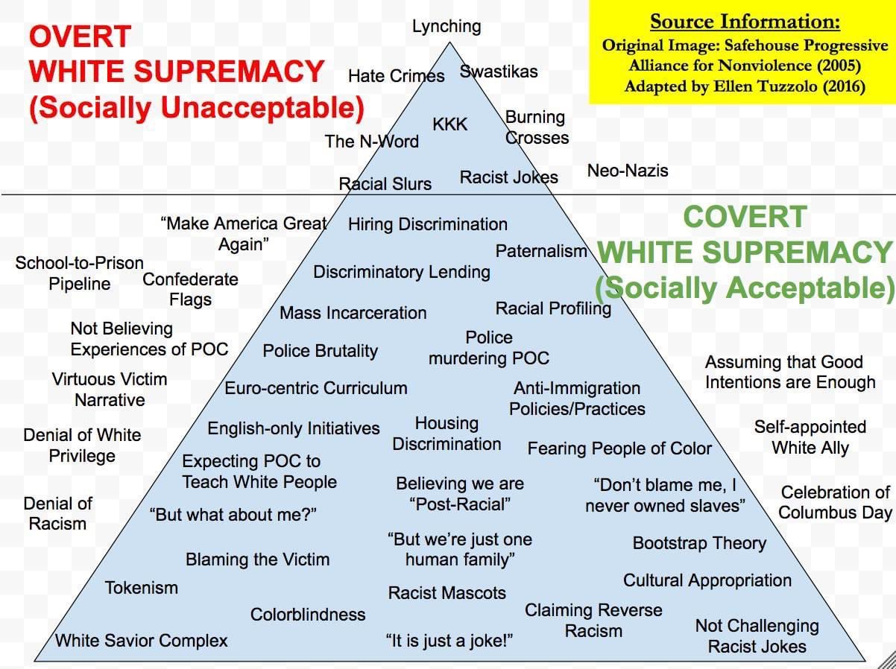
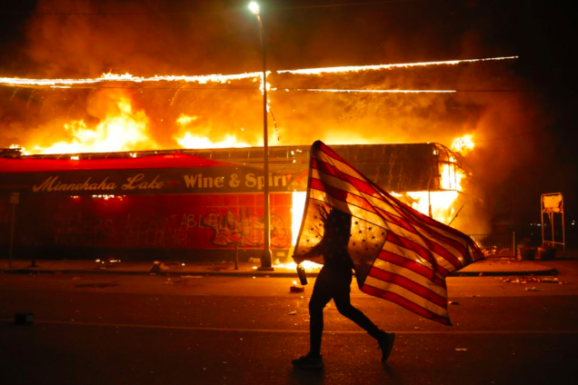

I stand in solidarity with everyone protesting and rioting in Brooklyn, Minneapolis, and around the country. Remember: rioting is [fundamentally American](https://www.theatlantic.com/culture/archive/2020/06/riots-are-american-way-george-floyd-protests/612466/). Please don't post identifying photos of protestors on social media.

++

**Resources for Black Texts:** There's been some amazing Google Drives stuffed with PDFs of Black Revolutionary Texts. One was passed around on Twitter, but was subsequently deleted. I have the link saved but don't think I should share it, as the curator, Alijah Webb, didn't want to spread copyrighted texts. Instead, she has a fantastic thread of resources here:

https://twitter.com/webbjalijah/status/1268012992312025092

[This Google Drive](https://drive.google.com/drive/u/0/folders/0Bz011IF2Pu9TUWIxVWxybGJ1Ync), compiled by Charles Preston, is a comprehensive library of texts for Black History Month—and an unbelievable resource. It contains PDFs, videos, and more.

If you want to read and buy a copy of some books (which you should!), I recommend buying from a black-owned bookstore, such as [Uncle Bobbie's](https://bookshop.org/shop/unclebobbies), [Mahogany Books](https://www.mahoganybooks.com/), [Cafe Con Libros](https://www.cafeconlibrosbk.com/), [The Lit. Bar](https://bookshop.org/shop/thelitbar), or your local establishment.  

**Recommended Reading:** I've seen lots of good [anti-racist](https://www.nytimes.com/2019/05/29/books/review/antiracist-reading-list-ibram-x-kendi.html) and black liberation reading lists going around. I'll highlight this one from my friend [Mikaela Berry](https://www.instagram.com/mikaela.mp3/), who you should definitely follow on Instagram:

[mikaela.mp3](https://instagram.com/mikaela.mp3)

this black screen thing doesn’t sit right with me - it feels performative and misguided in a time where social media is one of our most powerful tools. i understand the necessity of rest. but don’t just hide behind a black screen and consider your activism done for the day. if that’s what you’re on today i hope you’re busying yourself with advocacy and other education. [@sistersuptown](https://instagram.com/sistersuptown) has a wonderful resource guide of books to start your liberation and abolishment education. here are some of the books that have guided me. keep going. [#blacklivesmatter](https://instagram.com/explore/tags/blacklivesmatter/) [#blackout](https://instagram.com/explore/tags/blackout/) [#readingtime](https://instagram.com/explore/tags/readingtime/) [#blackvoices](https://instagram.com/explore/tags/blackvoices/)

June 2, 2020

Again, I won't link to Amazon for books. Instead, support black-owned businesses. Here are the articles mentioned: [The Case for Reparations](https://www.theatlantic.com/magazine/archive/2014/06/the-case-for-reparations/361631/) ([my notes](https://www.evernote.com/l/AQNEHyVS-gtL77jsfhEQwbnLQx5s6A-WgFA)), [White Women Drive Me Crazy](https://www.buzzfeednews.com/article/aishamirza/until-white-women-ruined-it), and [Is Prison Necessary?](https://www.nytimes.com/2019/04/17/magazine/prison-abolition-ruth-wilson-gilmore.html).  I also have [notes](https://www.evernote.com/l/AQNu9w9e1sJFTIksnHsQ8CgjOFQMdmePJq4) for _The Fire Next Time,_ which is one of my very favorite books. (Of course, everything by Baldwin is a must. His [1966 essay in The Nation](https://www.thenation.com/article/archive/report-occupied-territory/) on police brutality in Harlem is available online for free; disturbingly, not much has changed.) I recommend reading them all in their entirety.

I have a lot of self-education, listening and work to do. Thank you, Mikaela.

**[Black Directors](https://letterboxd.com/thelobster/list/black-directors/):** I compiled [a list on Letterboxd](https://letterboxd.com/thelobster/list/black-directors/) of movies made by black filmmakers. I want to invest more time into watching stories created by black directors. The list isn't exhaustive at all, of course. But it's a comprehensive sampling of 170+ films, and it's a start.

**Defund the Police:** Police uniforms are [a byproduct of the civil war](http://www.citylab.com/crime/2014/08/a-history-of-police-uniformsand-why-they-matter/378660/); the police have always been [militarized against citizens](https://www.nytimes.com/2020/05/31/opinion/george-floyd-new-york-protests.html), and exponentially more so against black citizens. But the militarization, in terms of weaponry and gear, has reached a legalized war-like fever pitch in the 21st century (see [this report](https://www.aclu.org/sites/default/files/assets/jus14-warcomeshome-report-web-rel1.pdf) from the ACLU). [Research shows](https://twitter.com/samswey/status/1180655701271732224) that police reform does not work—[the next option is to defund](https://www.theguardian.com/commentisfree/2020/may/31/the-answer-to-police-violence-is-not-reform-its-defunding-heres-why). Those resources can be shifted to so many different areas, like [emergency response programs that don't kill black people](https://www.nytimes.com/2020/05/30/opinion/george-floyd-police-funding.html).

And in New York, we need to repeal 50-a, a harmful statute that shields police misconduct. You can [sign up here](https://tinyurl.com/repeal50a-calls) to receive a call script + phone numbers.

**Where to Donate:** [Bail funds](https://blacklivesmatters.carrd.co/#state) are great, though consider [Mutual Aid](https://mutualaid.carrd.co/#networks) as well. Donate to [Reclaim the Block](https://secure.everyaction.com/zae4prEeKESHBy0MKXTIcQ2) and [Black Visions Collective](https://secure.everyaction.com/4omQDAR0oUiUagTu0EG-Ig2) ([website here](https://www.blackvisionsmn.org/)). And consider donating to the Black Trans Protestors Emergency Fund:

[blacktranstravelfund](https://instagram.com/blacktranstravelfund)

In preparation for tonight’s protest, [@btfacollective](https://instagram.com/btfacollective) is joining forces with [@blacktranstravelfund](https://instagram.com/blacktranstravelfund) , [@forthegworls](https://instagram.com/forthegworls) and [@TheOkraProject](https://instagram.com/TheOkraProject) to raise money for emergency resources for Black trans folks protesting. Please consider donating to keep Black trans folks on the frontlines safe.  
[#blacktranslivesmatter](https://instagram.com/explore/tags/blacktranslivesmatter/) [#allblacklivesmatter](https://instagram.com/explore/tags/allblacklivesmatter/)

June 2, 2020

You can also "donate" for free by watching [this monetized Youtube video](https://www.youtube.com/watch?v=bCgLa25fDHM&feature=youtu.be) project. (And, if it needs to be said: [don't donate to Shaun King](https://www.thedailybeast.com/shaun-king-keeps-raising-money-and-questions-about-where-it-goes-3).)

**Staring at your whiteness:** For white folks, I highly recommend [this thread](https://twitter.com/willarbery/status/1267907015130722304) from Will Arbery. Posting a black square on Instagram as your sole act of activism is a way of weaseling out of discomfort, of loudly "silencing" yourself as an act of signaling.

https://twitter.com/willarbery/status/1267907015130722304

**Overt vs Covert White Supremacy:**

 

**"Racist violence and police murder are inherent to capitalism.":** A thread from Boots Riley, well worth your time:

https://twitter.com/bootsriley/status/1266851333438500865

And:

https://twitter.com/BootsRiley/status/1266853465512308736

**Responses from theaters:** I'm singling out theaters here, though almost every company I seem to follow has issued some sort of statement, some more performative, some less. _Wicked_ obviously had the worst response that it's not even worth mentioning. I was also thrown when some theaters, such as the Vineyard Theatre, left seemingly pre-scheduled emails on trying to sell tickets to virtual events that felt shockingly tone-deaf. But many theaters did right eloquent emails (after being called out); more importantly, New York Theatre Workshop started a positive trend for what theaters can do during this situation: open their lobbies. Theaters around the country are empty, and many have large lobbies. These spaces can be used for rest, supplies, bathrooms, and protection. All major theaters in New York City—such as the ironically titled The Public—need to do the same.

---

**END NOTE**

 

###### photo by [Julio Cortez](https://twitter.com/JulioCortez_AP/status/1266420693954105346).  

++

George Floyd. Ahmaud Arbery. Breonna Taylor. Tony McDade. And so many more.

++

See you next week,

\-Gus