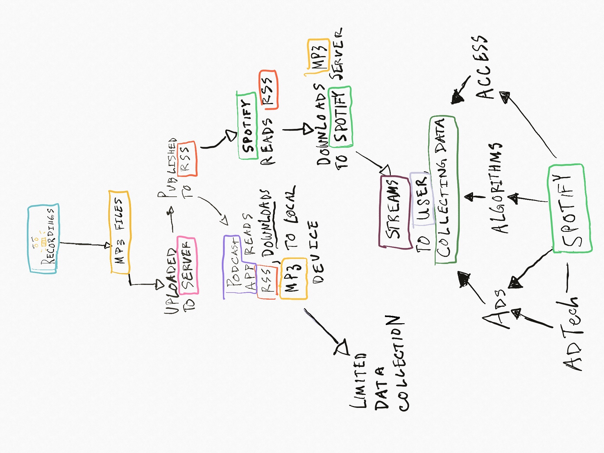
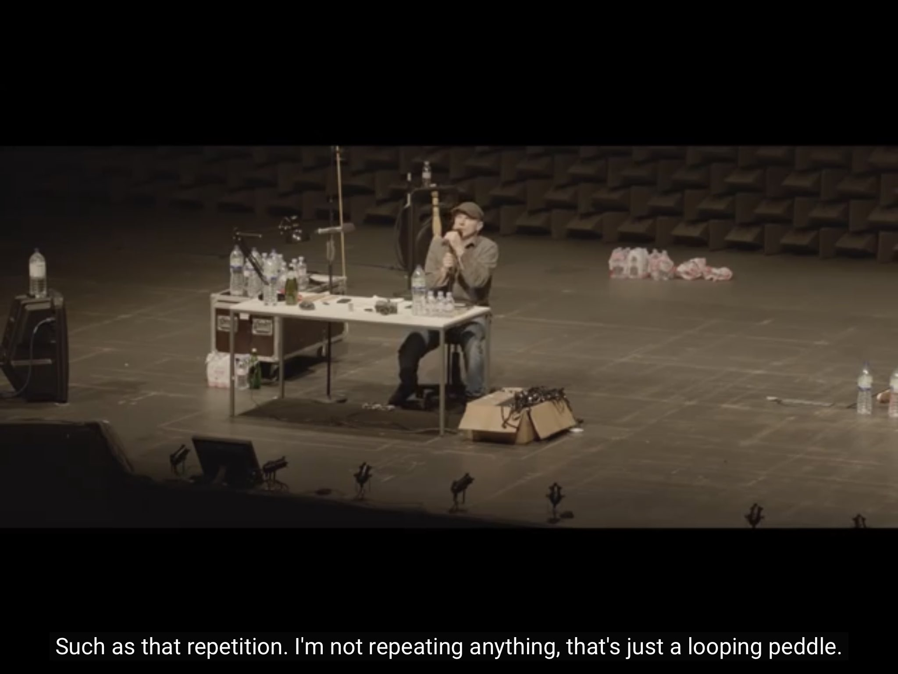
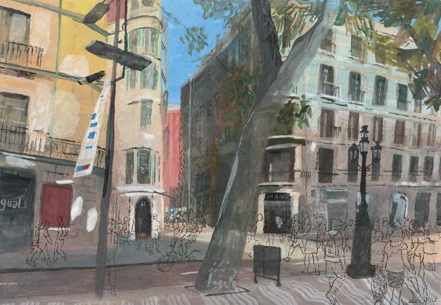

_Welcome to [The Curtain](http://guscuddy.substack.com/), a weekly newsletter exploring culture, arts, and media in the digital age. It’s written by me, [Gus Cuddy](https://twitter.com/guscuddy)._

_New reader? [Subscribe](https://guscuddy.substack.com/subscribe) for free:_

[Subscribe now](https://guscuddy.substack.com/subscribe?)

_You can also support The Curtain directly [here](https://givebutter.com/thecurtain)._

---

Hi friends,

Hope you're staying well. There's a heat wave in northern California right now that's brutal. It's making me miss being able to spend a day at the beach with friends and without fear.

++

### Why Open Podcasting Matters, and the Best Way to Listen

[Last week](https://guscuddy.substack.com/p/the-curtain-58-could-film-and-theatre), I wrote briefly about Spotify's acquisition of the exclusive rights to the Joe Rogan Podcast, and why their monopolization of the podcast space is very bad for "open" podcasting:

> But Spotify is not built on RSS—in fact, Spotify is not open at all. They are a closed platform, a gatekeeper that effectively owns any content it serves. Content can be monetized in any way they see fit, or taken down whenever they want. This makes them dominating the podcasting industry not really a good thing—we shouldn't want to give massive companies more of our data, to be sold to advertisers. By closing off podcasting to be overseen by a gatekeeper, they close off the lifeblood of a free, open, and completely independent platform.

It might not be immediately evident as to why having to go to Spotify for all your audio needs is maybe not a good thing. After all, for a lot of people, it will be certainly more convenient. There's even an argument to be made that Spotify's in-house advertising platform will eventually benefit creators that choose (or are forced to choose) Spotify as the platform for their podcast, making them more money than they could have made by themselves.

So why do I care so much about the nature of independent podcasting? For one, I've listened to podcasts for around ten years, ever since I used to laugh-listen to *Comedy Bang-Bang* on the bus to high school. But I also think, in many ways, the open and independent nature of podcasting---not being ruled by any one company---is unique in the internet age, and fertile ground for innovation in form. For theaters, podcasts are an interesting distribution platform that have not yet been fully---or even half---explored. And for everyone involved in creating things, there are a lot of interesting things to learn from our obsession with audio.

In many ways, audio is like the early internet of the 1990s. It relies on the open standard of RSS, and as I mentioned last week, is largely decentralized: Apple Podcasts simply provides a directory of RSS feeds from all over the internet. A podcast is "open", then, when it publishes an RSS feed of MP3 files, and an "open" podcast app (of which there are many) reads those RSS feeds.

Before Facebook and Google dominated the web, the internet was like this: open and independent, not controllable by any one large corporation. Advertisers couldn't track your data, and tech companies couldn't sway democracies. There weren't any algorithms, really---not like there are today, that serve up tailored content for us to endlessly stream. Today, podcasts aren't owned by any one entity, can't track your data, and aren't controlled by algorithms.

But Spotify wants to change that. Spotify calls what they deliver "podcasts", but they aren't really: the company hosts all the files on their own server, requiring podcasters to agree to their terms of service (which can be changed at any time), and streams them through their proprietary, closed software. Spotify isn't open at all, which goes against what podcasting is. By controlling and centralizing the means to distribution, they can effectively eliminate the open standard of RSS and have full control over what I call the "Three A's" of the internet: advertising, algorithms, and access. In effect, they would become the Facebook/Google of audio.

###### _my attempt at a very technical walk-thru_

It's important to note, too, that Spotify has a pretty big money interest in owning more of the podcast listening share: music is expensive to license; podcasts, in contrast, are not. Spotify, like many large tech companies, is not making money: they [expected to lose](https://www.bloomberg.com/news/articles/2020-02-05/spotify-signs-64-million-subscribers-in-year-of-record-growth) somewhere around $100 million in the first quarter of 2020. Their strategy, like Netflix and others, is to drive as much user growth as possible---if they can get everyone using their service, then they can figure out how to make a lot of money, such as by tailoring ads through immense data collection. Spotify has access to the entire emotional landscape of millions, as Liz Pelly noted [in an essay](https://thebaffler.com/downstream/big-mood-machine-pelly) for The Baffler last year:

> But a more careful look into Spotify’s history shows that the decision to define audiences by their moods was part of a strategic push to grow Spotify’s advertising business in the years leading up to its IPO—and today, **Spotify’s enormous access to mood-based data is a pillar of its value to brands and advertisers**, allowing them to target ads on Spotify by moods and emotions. Further, since 2016, Spotify has shared this mood data directly with the world’s biggest marketing and advertising firms.

But all is not lost. Spotify claims to have a huge growth in podcast consumption on their service, though much of that growth does seem to be additive, not people switching over from other clients. This, in a vacuum, is not bad---they are contributing to the health of podcasts by turning more people into listeners. But their current play is clearly now to "flip the switch" and monopolize where people can listen to podcasts, by forcing listeners to use their service.

If you care about the future of the open ecosystem of podcasting, I encourage you to use something other than Spotify for podcasts. The best way to listen to podcasts, in my opinion, is with a great app like [Marco Arment's](https://twitter.com/marcoarment/status/1262824593494073345) [Overcast](https://overcast.fm/podcasterinfo), which supports all the open standards of podcasting. Many of these features are not actually supported by other apps (Spotify included): things like chapters, payment buttons, links, and image support, which in my experience make a big difference. (There is a lot of [room for innovation](http://mortenjust.com/2020/05/20/another-way-to-listen/) in this space, though!) It also supports private feeds, which is something you might get if you pay for a subscription, members-only podcast. I support these creators, in certain cases, monetizing podcasts through subscriptions instead of advertising: "open" and "free" don't need to necessarily be equated. Indeed, as is the case with Facebook, Google and now potentially Spotify, "free" ends up coming with an entirely different kind of price.

---

## Notes from the Week

#### "It's easier to modify our subjective experience of the environment than to modify the environment itself."

There are some interesting interactive experiences happening on Zoom that push the platform to its edge. Loved [this thread](https://mobile.twitter.com/aaronzlewis/status/1264646083982090245) from Aaron Z. Lewis, which details an Alice in Wonderland-themed interactive party:

https://twitter.com/aaronzlewis/status/1264646074792280064

https://twitter.com/aaronzlewis/status/1264646083982090245

By the way, Aaron is a great follow on Twitter. I also enjoyed his thread of ["alt calendars"](http://twitter.com/aaronzlewis/status/1264013135679303680).

---

#### How to Stream Theatre

I watched [Simon McBurney's](http://www.complicite.org/productions/theencounter) *[The Encounter](http://www.complicite.org/productions/theencounter)* yesterday, and thought it was an excellent streaming production. [Complicité](http://www.complicite.org/) has always been a thoughtful and adventurous theatre exploring new distribution pathways. I enjoyed [this case study](https://www.thespace.org/resource/encounter-case-study-live-streaming-theatre) on *The Encounter* on the website for [The Space](https://www.thespace.org/), the company that helped with the live stream. Their top tips:

> 1.  Put the performance first and make sure you choose the right platform and technology for the production.
>
> 2.  Find a production team that’s right for your organisation, will be sympathetic to your production and share your vision. You don’t have to become an expert in broadcast but if you have the right team they’ll ask the right questions to make sure you get what you want. We were so pleased with the Producer and Director we hired- they went above and beyond and of course it’s crucial the live director feels comfortable with the streaming director.
>
> 3.  Set aside lots of resources for marketing- both in terms of energy and finance. There’s no point in capturing and streaming a great show if you don’t create ways to engage a large audience.
>
> 4.  It really helps with awareness raising if your live show is a sell out and attracting great reviews. We had great press around the show - going back to August 2015 when it premiered at the Edinburgh International Festival.
>
> 5.  Don’t worry about live streaming affecting ticket sales of live events. We have no evidence that was the case. Our experience is that the live stream generated a huge audience to engage with so we can help publicise future productions to a captive audience.

I think these sort of companies that help theaters digitize their work are going to become more widespread and essential as we move forward. If unions and producers can work it out, it seems like a no-brainer to want to be able to have more great-looking recordings of theatre. A side note: I also really appreciated that this stream of *The Encounter* had excellent subtitles---it's a small thing but it makes a big difference to how "polished" it feels.

---

#### Actor's Equity Theater Re-Opening Guidelines

Actor's Equity, the union for theatre actors and stage managers, [presented its core principles](https://www.americantheatre.org/2020/05/26/actors-equity-announces-4-guiding-principles-for-reopening-theatres/) for re-opening theaters:

1.  The epidemic must be under control in the area of the theater

2.  Individuals who may be infected should be able to be identified and isolated

3.  Both venues AND productions will have to be modified to minimize exposure

4.  Efforts must be collaborative and constantly reevaluated and improved

My hope is also that Actor's Equity rethinks how digital theatre is perceived. Right now, the union is slow to adopt to changes and (rightfully) protective of actors' work. But hardheadedness about theatre and the internet will severely limit the future of theaters and the employment of actors, and new potential revenue streams for both.

---

#### [Jeremy O. Harris' Pet Project Grants](https://www.americantheatre.org/2020/05/26/jeremy-o-harris-and-the-bushwick-starr-announce-pet-project-grant/)

Jeremy O. Harris and Bushwick Starr are partnering to distribute [152 emergency $500 grants](https://www.thebushwickstarr.org/pet-project-grant-faq) to playwrights facing dire financial circumstances. [The application](https://www.thebushwickstarr.org/pet-project-grant-faq) opens on May 29th and is capped at 1500 recipients. The grants are not merit based; winners will be drawn randomly out of the pool of applicants. They ask for only those who actually need this money to apply.

I'm incredibly heartened to see this sort of direct-to-artist funding happen quickly and efficiently in theatre. I hope more people with the means---and there are plenty--are able to do something like this.

---

#### "Theatre stands on the brink of ruin" - Sonia Friedman

Sonia Friedman, one of the most successful international theatre producers, wrote [a grim op-ed](https://www.telegraph.co.uk/theatre/what-to-see/theatre-stands-brink-ruin/) for The Telegraph:

> British theatre is on the brink of total collapse. ... Without an urgent government rescue package, 70 per cent of our performing arts companies will be out of business before the end of this year. More than 1,000 theatres around the country will be insolvent and might shut down for good. The loss is inconceivable. What we take for granted has taken generations to create. It would be irrecoverable. We need our government to step up and step in – sharpish. There is no time to waste.

And this is in Britain, a country with **subsidized theatre**. What will the consequences be in the United States without any bailout or intervention?

*The Telegraph* has an unforgiving paywall. You can see the whole thing here:

---

#### The Public got zero percent of _Hamilton_'s $75 million deal with Disney

The Public, New York's most famous off-Broadway theater, has had a huge success recently with launching projects to Broadway. They receive royalties from the productions of *Hamilton* around the world, but those fees have obviously halted. But I was surprised to hear that The Public didn't earn anything from Disney acquiring the rights to the digital stream of *Hamilton* for $75 million, [as reported in Broadway Journal](http://broadwayjournal.com/hamilton-endowed-public-theater-delays-furloughs-with-4-million-of-u-s-aid/).

---

#### Lynn Shelton + Claire Denis

The late Lynn Shelton, [in an interview](https://news.letterboxd.com/post/186488848958/trustworthy-lynn-shelton) on how she got started:

> Then later in life I heard Claire Denis speak when her film Friday Night was coming out. I remember finding out that she was 40 when she made her first feature and Friday Night was her sixth or seventh film. I had an epiphany that I could start making movies and it wasn’t too late for me because I didn’t make movies in my 20s and 30s. I didn’t make my first feature \[We Go Way Back\] until my late 30s. That was the film and filmmaker that really made me feel like ‘I can do this too’. Those would be my two bookends about being inspired to be a filmmaker.

---

#### Ranking Movies

Food for thought that I'm not sure I agree with:

https://twitter.com/joshuatrank/status/1264946446769328129

---

## End Note

###### _[art by Marc Desgrandchamps](https://dailyartfair.com/artist/marc-desgrandchamps)_

++

_That’s all for this week! Thanks so much for reading._

_If you haven’t yet, please [subscribe](https://guscuddy.substack.com/subscribe)._

_The best way to support my work is is to forward this email to someone else you think would enjoy it, and tell them to subscribe. It means a lot to me._

[Share](https://guscuddy.substack.com/p/the-curtain-59-why-open-podcasting?utm_source=substack&utm_medium=email&utm_content=share&action=share)

_[You can also support me directly by donating.](https://givebutter.com/thecurtain)_

_As always, you can access the entire archive [here](http://guscuddy.substack.com/archive)._

_You can reply directly to this email and I’ll receive it. So feel free to do that about anything. I love to hear back from people._

_And [follow me on Twitter](https://twitter.com/guscuddy), if you don’t already._

_See you next week!_

\-Gus
