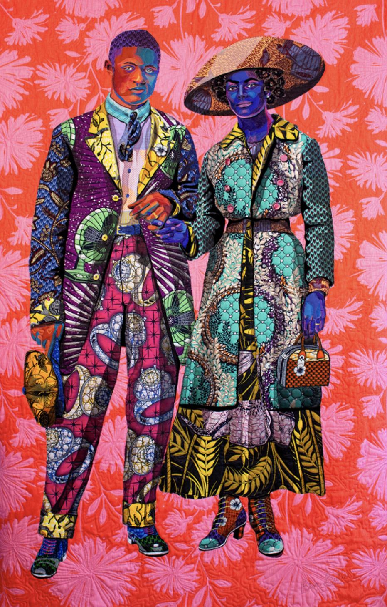

Hi friends,

This week’s issue is entirely focused on one thing: theatre, whiteness, and this political moment.

## Confronting White Supremacy in Theatre

Obviously, this has been a very difficult time in America. As a cis white-passing male, I want to be sure I don't take up space that could be better spent amplifying black voices. At the same time, I also don't want to shy away from looking inwards, exposing [the entanglement](https://www.guscuddy.com/entanglement) of being American, of being an American in the _arts_, and of being a _white_ American in the arts. Theatre is an art form that has a legacy of simultaneously marginalizing black and brown voices while pretending to be more progressive than its actions show. I want to hold myself and others accountable for perpetuating whiteness in our culture.

Because theatre's history is intertwined with democracy and politics—from the Ancient Greeks to Joe Papp—there is a sense that theatre spaces are inherently political, community gathering spaces to hear voices and stories. But in 2020, at least in America, this has become an idealized notion rather than a reality. Theatre institutions, by and large, are white spaces: they are led by white leaders, they are supported by white corporations and donors, and they are seen by [white audiences](https://www.guscuddy.com/audience). For many theaters, if they feature work by artists of color, it's often as a "diversity play", or meant to [check off a quota](https://www.guscuddy.com/2dracism); the affair is transactional, based on optics or white guilt. Worse, theatre often asks black bodies to reenact black pain and black tragedy, because that's what white audiences expect; as Jeremy O. Harris [put it with E. Alex Jung](https://www.vulture.com/2019/03/jeremy-o-harris-slave-play-daddy-profile.html), "\[white audiences\] go to black and brown work for empathy and not for arguments."

But this whiteness seems to be coming to a head in 2020. The COVID-19 crisis and this radical political moment are combining to truly hold theaters under the microscope, to watch their whiteness squirm this way and that. When we look deeper, the picture is ugly: white board members [holding information from their diverse set of resident playwrights](https://www.chicagotribune.com/entertainment/theater/chris-jones/ct-ent-victory-gardens-playwrights-resign-20200522-axme6sddejhudjw2b7lpx4qsaq-story.html), [Broadway producers donating to Trump](https://www.onstageblog.com/editorials/is-it-time-to-boycott-nederlander-theatres), and [a complete lack of diversity](http://www.aapacnyc.org/uploads/1/1/9/4/11949532/aapac_2016-2017_report.pdf), [by any metric](https://www.dramatistsguild.com/advocacy/the-count). In return, we get empty letters of intent and tired clichés.

Which is why it's somewhat of a relief to see the [#OpenYourLobby](https://www.instagram.com/openyourlobby/) trend for theaters around the country, which has gained traction via social media. Physical space, especially in New York City, is one of the most precious American commodities there is. It's something that theaters actually possess (for better or worse), and almost all of it around the country has been sitting unused during this pandemic. Opening lobbies to protestors who might need water, first aid, a bathroom, or a place to rest is a direct action that theaters can take that actually aligns with political goals—it's not merely posturing or performative. Theaters can become public gathering spaces for democratic purposes in more than just name but, at least as a small first step, in reality. (You can find a spreadsheet of participating theaters [here](https://docs.google.com/spreadsheets/d/1pyPum3A9sCbVkHvpH)). We have to hold spaces accountable to see where their true aims lie: in the money—like with theaters that put out Black Lives Matter statements to fit in and sell tickets, or with all Broadway theaters that have refused to open their lobbies or get involved politically—or in actually opening doors and beginning to create a space for community.

Of course one simple direct action does not begin to undo the harms and myths that art institutions help perpetuate. Whiteness needs to be addressed at all levels: what's getting produced, who's doing the producing, who's in charge, who's performing, and who's attending. As long as whiteness is the default for arts institutions, they will continue to allow white supremacy to fester like a disease. One thing that white folks in theatre can do is to stare more deeply into their own whiteness: what that history, privilege, and violence means, how it impacts how you walk through the world and through arts, and how it's seen by others. Art made by white artists could actually reflect this interrogation—the type of work that BIPOC (Black, Indigenous, People of Color) have been doing for ages—instead of just defaulting to boring, milquetoast kitchen-sink drama. By not addressing whiteness you let its violence continue.

---

## Notes from the Week

### We See You White American Theater

Big waves were made this week when [an open letter to White American Theater](https://www.weseeyouwat.com/) was released from 300 BIPOC artists. As of writing, the [Change.org petition](https://www.change.org/p/white-american-theater-demand-change-for-bipoc-theater-makers) already has almost 60,000 signatures, which is a staggering number for anything theatre-related.

I fully support the mission of this letter—as I've written about above, it's about time white theatre was held accountable. With the amount of social media (and [regular media](https://www.nytimes.com/2020/06/09/theater/theater-artists-decry-racism.html)) attention it's gotten, it surely will force some sort of response from many theaters, if not a greater collective response from theatre in general. I do think it's interesting that the letter is centering IPOC artists in addition to Black Artists at this exact instance; all BIPOC artists are affected and traumatized by White Theatre, but we're also in a moment where we're coming face-to-face with this country's specific history of [anti-blackness](https://www.nytimes.com/2020/06/04/opinion/george-floyd-anti-blackness.html).

---

### The Day Theatre Twitter Blew Up

I'm not going to comment much on this because it's way out of my right to comment, but I would be remiss not to cover it.

First, people started rightfully turning against the New York Times theatre section:

https://twitter.com/leahnanako/status/1270405994921824260

Then, spurred on by We See You, playwright [Young Jean Lee](https://youngjeanlee.org/) tweeted about a thread about a horrible short play that was written about her many years ago:

https://twitter.com/YoungJean_Lee/status/1270307643857362944

But this wasn't the end. Angered that Lee was centering her narrative in a time of Black Trauma, playwright Jeremy O. Harris tweeted out a thread that shook Twitter, calling out Young Jean Lee for abusive behavior at Yale several years ago:

https://twitter.com/jeremyoharris/status/1270447515570233350

Harris' tweet storm does not hold back at all, and comes fully equipped with receipts. It's an unprecedented time in American theatre, and this kind of call-out is frankly unprecedented as well; but again, maybe now that we're both in this politically charged moment and in a pandemic that has jeopardized the future of theatre, all the shit that everyone's been sitting on is going to come bubbling up to the surface. It certainly has in many ways on social media already—I've seen several posts calling out theaters and prominent white folks already.

---

### Pop Culture and Police Shows

“Of the 26 series from the 2017-18 season examined in the study, 21 had showrunners who were white men. At least 81% of these shows’ writers were white, compared to the 9% who were black. A whopping 20 of 26 series had either no black writers or just one black writer.”

[Source](https://www.latimes.com/entertainment-arts/tv/story/2020-06-05/crime-shows-police-race-justice-color-of-change-statistics)

---

### Kasi Lemmons on White Americans' lack of imagination

> As a filmmaker, I help people imagine what’s it’s like to be someone else, to experience things from a character’s point of view — things they never will experience outside the theater. But when it comes to black life in America, there’s only one conclusion I can reach about some white people: You don’t care to put yourself in our shoes. The consequences of this lack of imagination for black Americans are deadly.

She continues:

> It’s no secret that you like our music, our style, our swagger. You admire our athleticism, our beauty. Things you can sample without diving too deep, without knowing too much. Without fear of being scarred. You would rather be a tourist; you prefer to dip your toes in our culture without really understanding it.

> That, or you’re addicted to the pornography of our pain. When I made my first movie, “Eve’s Bayou,” I got questions about why I didn’t include incidents of white racism in a movie about a Creole family. The answer: The movie isn’t about white people, or racism. It’s about a black family, which could be any family. Twenty-two years later, some critics said that the racist violence in “Harriet,” my film about Harriet Tubman, wasn’t vicious enough. Apparently, they couldn’t understand that I wanted to tell a story about a black woman’s triumph, rather than make a movie that reveled in pain and degradation. I wondered why they craved seeing black bodies get beaten.

[Very powerful throughout.](https://www.washingtonpost.com/opinions/2020/06/01/white-americans-your-lack-imagination-is-killing-us/)

---

## End Note

 

###### [Art by Bisa Butler](https://www.vulture.com/2019/03/jeremy-o-harris-slave-play-daddy-profile.html)

++

_That’s all for this week. Thanks so much for reading._

_The best way to support my work is is to forward this email to someone else you think would enjoy it, and tell them to subscribe. Also, please please donate to Mutual Aid and support black-owned businesses. [Black Trans Lives Matter](https://www.glitsinc.org/)._

_You can reply directly to this email and I’ll receive it. I’d love to continue a discourse._

_See you next week._

\-Gus