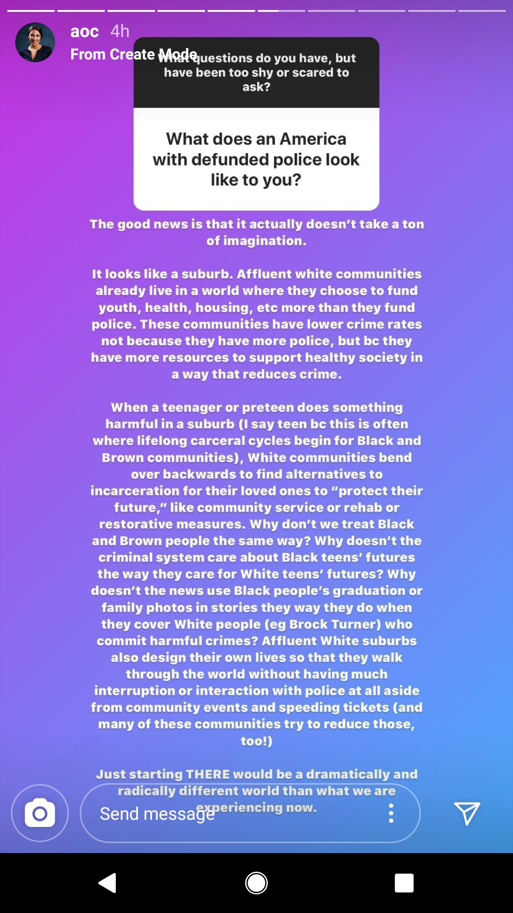
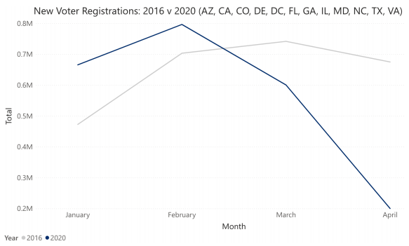
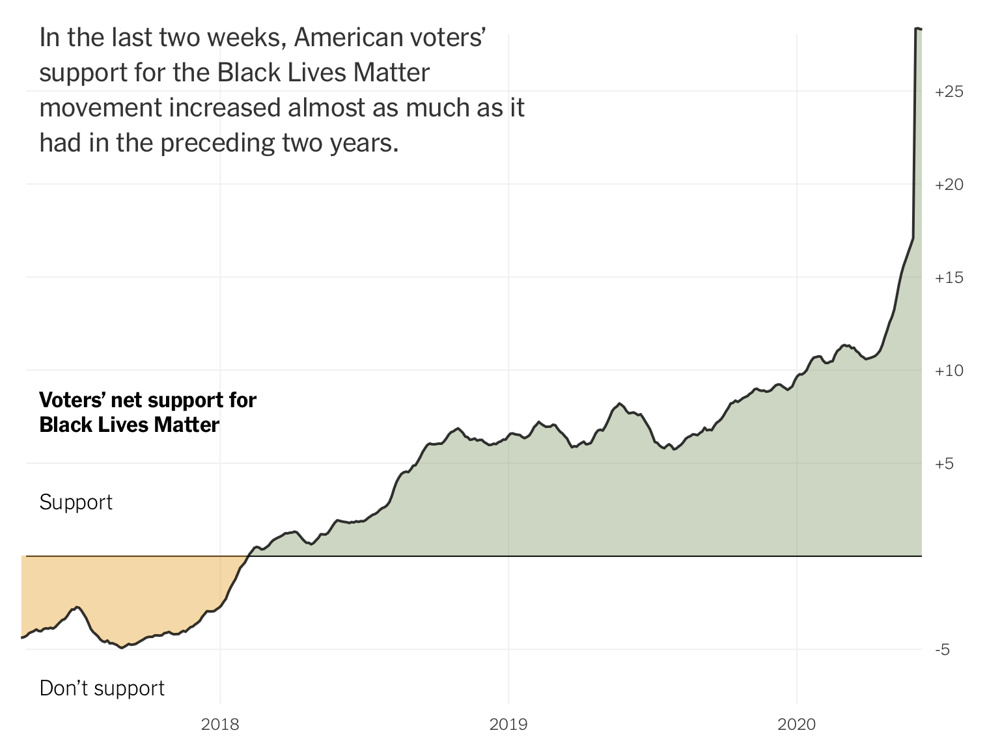

Hi friends,

I've been struggling recently to define what exactly my voice is doing here. [Last week](https://guscuddy.substack.com/p/the-curtain-60-whiteness-and-anti), I wrote a bit about addressing whiteness at its core in the American theatre. I feel strongly about this; all of us non-black folks need to do our own work to interrogate our implicit anti-black biases, and to dismantle white supremacist systems.

But it's been hard to write about the role of theatre in the midst of a pandemic where theatre has been pretty much completely sidelined; it's even harder to write about its role now, where thinking about (mostly white) theatre seems somewhat banal.

I'll continue to write about arts, culture, technology, and what's happening in the world the best I can, by mainly covering what I'm learning each week.

Here's this week's notes.

---

## 🗒 Notes from the Week

First, **some words on abolishing the police:**

Mariame Kaba [dropped the op-ed](https://www.nytimes.com/2020/06/12/opinion/sunday/floyd-abolish-defund-police.html) this past week that's been passed around a lot, addressing a common question: "Yes, we mean literally abolish the police."

> There is **not a single era in United States history in which the police were not a force of violence against black people**. Policing in the South emerged from the [slave patrols](https://www.ncjrs.gov/App/Publications/abstract.aspx?ID=116023) in the 1700 and 1800s that caught and returned runaway slaves. In the North, the first municipal police departments in the mid-1800s helped quash [labor strikes](https://www.npr.org/2020/06/05/871083599/the-history-of-police-in-creating-social-order-in-the-u-s) and riots against the rich. Everywhere, they have suppressed marginalized populations to protect the status quo.

Reforms don't work:

> The philosophy undergirding these reforms is that more rules will mean less violence. But police officers [break rules](https://www.washingtonpost.com/national/protests-police-brutality-video/2020/06/05/a9e66568-a768-11ea-b473-04905b1af82b_story.html) all the time. Look what has happened over the past few weeks — police officers [slashing tires](https://www.npr.org/sections/live-updates-protests-for-racial-justice/2020/06/09/873110812/police-officers-slashed-car-tires-during-minneapolis-protests-police-agencies-sa), [shoving old men](https://www.nytimes.com/2020/06/05/us/buffalo-police-shove-protester-unrest.html) on camera, and [arresting and injuring journalists](https://www.nytimes.com/2020/06/01/business/media/reporters-protests-george-floyd.html) and protesters. These officers are not worried about repercussions any more than Daniel Pantaleo, the former New York City police officer whose chokehold led to Eric Garner’s death; he [waved](https://www.nydailynews.com/new-york/woman-stunned-video-didn-indict-chokehold-article-1.2037301) to a camera filming the incident. He knew that the police union would back him up and he was right. He stayed on the job for five more years.

++

On Instagram, Alexandria Ocasio-Cortez had a popular answer to what defunding the police looks like: white suburbs.

 

But while I see AOC's point (primarily around where we allocate resources), I don't know if centering whiteness [is the right move here](https://twitter.com/halehroshan/status/1272305235332149252). White suburbs are not exactly a model I would want to replicate.

++

If you need more items for your reading list on the history of race in America, The Atlantic has published [an incredible resource](https://www.theatlantic.com/education/archive/2020/06/atlantic-reader-race-and-racism-us/613057/) covering 163 years of their writing on race and racism in America. I recommend checking it out.

++

Mari and I sent in our absentee ballots for New York this week, in a process that was way more complicated than it should have been. A reminder that **how we vote** in this country is **fundamentally broken**. Case in point: voter registration (presumably due to COVID-19?) has plummeted in recent months, [data from The Center for Election Innovation and Research](https://electioninnovation.org/wp-content/uploads/2020/06/New_Voter_Registrations.pdf) shows:

 

++

Meanwhile, **support for the Black Lives Matter movement has increased exponentially** in the past few weeks, as reported by The New York Times:

 

++

Due to this support, the [Minnesota Freedom Fund](https://minnesotafreedomfund.org/) received **$30+ million in donations**. Initially, there was some murmurings on Twitter of dishonesty when it was announced that they had only put $200,000 of that to use. But since then, I've seen some counter responses: it's pretty hard for a small organization like that to figure out how to use $35 million in two weeks. Of course, we need receipts and transparency. But they also just donated 2x last year’s total revenue in the last 10 days—all directly to bail funds.

https://twitter.com/noname/status/1272904291158822914

Part of the real problem here? People parroting on where to donate on social media, instead of actually doing their own research and donating to funds more in need. That's how we ended up with the Minnesota Freedom Fund getting $30 Million.

https://twitter.com/isaiah_kb/status/1272859510567129089

++

Meanwhile, [tech companies donated](https://www.buzzfeednews.com/article/ryanmac/black-lives-matter-foundation-unrelated-blm-donations) to an organization called the Black Lives Matter Foundation, which is actually pro-police. That's not exactly a surprise. **Technology**—which has become, in many ways, so crucial to this moment and the quick organizing that was able to take place—has always perpetuated racism, [because it was designed that way](https://www.technologyreview.com/2020/06/03/1002589/technology-perpetuates-racism-by-design-simulmatics-charlton-mcilwain). This shit runs deep.

What should we do about that? One option: [abolish Silicon Valley](https://www.amazon.com/dp/B07V9B4MC9/ref=dp-kindle-redirect?_encoding=UTF8&btkr=1), which is the title of a new book by Wendy Liu. I enjoyed [her recent appearance](https://www.listennotes.com/podcasts/science-disrupt/abolishing-silicon-valley-uBOkJi1nVMo/) on the podcast _Science Disrupt_, where she talked about her switch from working in Silicon Valley to now writing about its horrors, and about tech workers organizing.

The idea of a "meritocracy" is prevalent in the tech world, but it's something that elites made up to make them feel better about themselves—originally, meritocracies were not actually a "good" thing. Indeed, **meritocracies cannot somehow band-aid over the systemic and structural problems** that are present in America, and every industry inside of it, especially tech. It's important to note that, right now, the "system" of Silicon Valley works like it's supposed to—it's efficient and optimal. The problem is what we're [measuring success by](https://www.guscuddy.com/unprofitability): money, individual achievement, and disruptive progress at all costs.

Liu asks: **how could we re-think entrepreneurship as a** _**public service**_**,** interested in mutual aid and collective good, rather than as a disruptive, egotistical affair? And how can tech workers organize? (She points to the publication [Logic Magazine](https://logicmag.io/) as a great resource.)

I also liked that she ended the interview by speaking to the radical power of fiction—how movies like _Parasite_ can actually make people think critically about the world that they operate in. You can read more about Liu's work [here](https://dellsystem.me/about).

++

**Every industry seems to be having its own reckoning of sorts right now**.

Film and TV streaming sites have removed shows like _Cops_, comedies that featured Blackface, or movies like _Gone With the Wind_. Like technology, **Hollywood and TV have always perpetuated racism** because it's built into their DNA. Culture informs thinking, identity, consciousness, and politics; actions have consequences. Pop culture has a responsibility to undo its whiteness-as-default modality. Like [a recent piece](https://www.theguardian.com/film/2020/jun/13/gone-with-the-wind-hollywood-racism) in _The Guardian_ explored regarding _Gone With the Wind_, Hollywood is built on the idea of white supremacy. _The Birth of a Nation_, the foundational film of American cinema, is a love letter to the Ku Klux Klan, filled with white actors doing blackface and centering around "the national terror of black sexuality", as Wesley Morris wrote in his canonical 2016 essay, [The Last Taboo](https://www.nytimes.com/interactive/2016/10/30/magazine/black-male-sexuality-last-taboo.html). Morris writes: "Griffith established a permanent template with this movie, not just for filmed action but for American popular and political culture — **a fantasia of white supremacy, black inhumanity and the tremendous racial anger that’s still with us today."**

++

In **theatre**, we have seen call-outs of both individuals and institutions perpetuating white supremacy, some of which I've covered last week but which you can't look past if you work in theatre. I know I'm not alone right now in deeply considering what exactly my relationship is right now with American theatre as we know it. There's a palpable sense that, perhaps, **we're on the verge of something new**; that the old, white, institutional gatekeepers aren't actually working for us, aren't supporting the black and brown voices that they need to be supporting, that they are tied to a conservative tradition that will resist anything radical.

That perhaps, like the grassroots uprisings we are seeing around the country and around the world, we need to re-think things from the bottom-up. The future doesn't lie in top-down white gatekeepers. It lies in emergent collectives, messy revolution, and clear-eyed radicalism, all of which seem more and more difficult to imagine coexisting within the rigid structures of Theatre as we know it. I'm excited to see what sorts of artist collectives and bottom-up companies emerge; hopefully, when theatre becomes a thing again in 2021, there will be a newfound sense of momentum and purpose.

Again: we need to **think collectively**, not individualistically. We need to think about centering the voices that need to be centered. For instance: now isn't the time to be pitching your play as a non-black playwright, [as Haleh Roshan put it on Twitter](https://twitter.com/halehroshan/status/1272554196903100417).

---

### End Note

 

++

_Defund the police. Black lives matter. Black trans lives matter._

_That’s all for this week. Thanks so much for reading._

_The best way to support my work is is to forward this email to someone else you think would enjoy it. Please please donate to small funds, Mutual Aid and black-owned businesses._ 

_You can subscribe for free here, if you haven’t already:_

[Subscribe now](https://guscuddy.substack.com/subscribe?)

_And you can reply directly to this email and I’ll receive it. I’d love to talk more!_

_See you next week!_

\-Gus