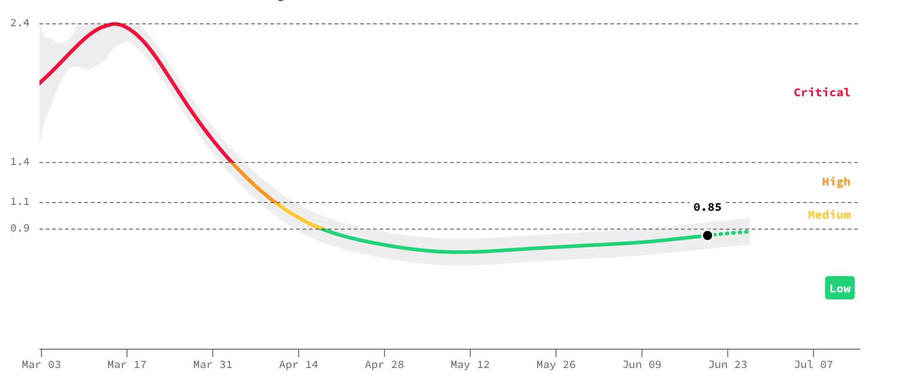
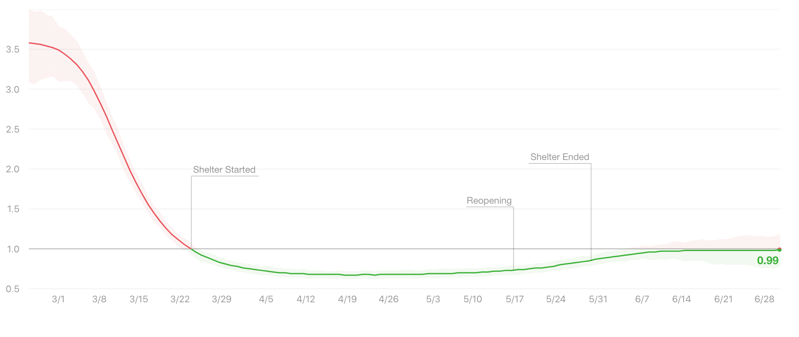
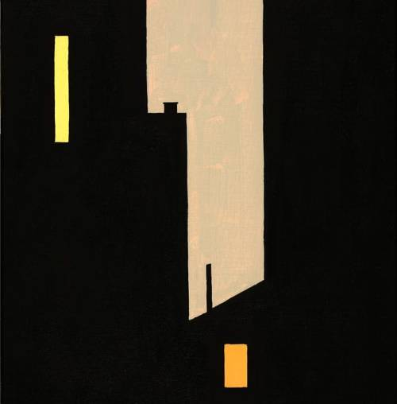

_Welcome to [The Curtain](http://guscuddy.substack.com/), a weekly newsletter exploring arts, culture, and the future. It’s written by me, [Gus Cuddy](https://guscuddy.com)._

_New reader? [Subscribe](https://guscuddy.substack.com/subscribe) for free:_

[Subscribe now](https://guscuddy.substack.com/subscribe?)

---

Hi friends,

I hope you’re staying well and healthy.

No new original writing from me this week, but as usual a smattering of collected notes and links.

Happy July! Looking forward to a second half of 2020 that goes exactly according to plan, just like the first half.

Let’s get into it.

---

### 🗒 Notes from the Week

_**The Reckoning at The Flea and nonprofit theatre around the country**_

Last week in theatre: NYC company [The Flea decided to maybe start paying its young artists company](https://www.nytimes.com/2020/06/19/theater/the-flea-volunteer-payment.html), The Bats. [Helen Shaw considers the many](https://www.vulture.com/2020/06/racial-and-labor-reckoning-at-nycs-flea-theater.html?utm_campaign=vulture&utm_source=tw&utm_medium=s1) angles of which the Flea has been an exploitative—yet important—New York City theatrical institution over the last 20 years. And the ways in which artists not being compensated for their work—creating simultaneous cultures of wealth privilege (for those that have families that can bankroll them), monetary desperation (for everyone else) and radical unworthiness (for everyone)—is so endemic and institutionalized in the way nonprofit theatre has largely evolved. [Worth a read.](https://www.vulture.com/2020/06/racial-and-labor-reckoning-at-nycs-flea-theater.html?utm_campaign=vulture&utm_source=tw&utm_medium=s1)

🔉 _**Online Spatial Audio Conversations**_

[Cozyroom](https://cozyroom.xyz/) is a new website that allows for "free peer-to-peer spatial audio environments". It's a strangely specific and inviting idea—perfectly suited for the age of the quarantine—that is coupled with a truly "cozy" aesthetic. Along with the new email service [HEY](https://hey.com/), It's a type of technology design that adopts a human-first approach—taking ideas from how we interact as humans, rather than how we interact as computers.

🦠 _**Tracking the Rate of COVID Spread**_

Despite much of the country deciding that the virus is over, we're not out of the woods yet. Two websites I've been looking at for graphical representations of the rate of spread are [Rt.Live](https://rt.live/) and [Covid Act Now](https://covidactnow.org/?s=58173). Both track—with slightly different models—the infection rate, or the number of people who become infected by an infectious person. In essence, if that number is below 1.0, the spread will go down. But if it's above 1.0, then the spread increases exponentially.

Here are two varying models on New York's infection rate, both showing _very_ little room for error at this point:

 

🤯 _**Movie Screenings are Happening in Fortnite**_

Ahead of Christopher Nolan's upcoming _Tenet_, which seems determined to be the movie that re-opens movie theaters, Fortnite [hosted a screening](https://kotaku.com/watching-inception-in-fortnite-is-weird-but-doesnt-mak-1844175790) of _Inception_. Major "event" companies are experimenting more and more with marketing to the Gen Z popularity of Fortnite—there have been several big concerts—but a movie screening seems particularly challenging. But with a generation raised on virtual worlds and now experiencing a global pandemic, perhaps experimental spaces like [Fortnite's Party Royale](https://www.epicgames.com/fortnite/en-US/partyroyale)—which is streaming more Nolan movies (lol)—are...some kind of future? (To be clear, [I have literally no clue what is going on in this video](https://www.epicgames.com/fortnite/en-US/partyroyale).)

_**What “Polarization” Misses**_

"Polarization" is a trendy word to describe what's happening in our country because on one level, it's totally true: people are divided. But the pop psychology idea [that Ezra Klein posits in his new book](https://newrepublic.com/article/157599/were-not-polarized-enough-ezra-klein-book-review)—that polarization is because of our brains, that conservatism and liberalism are related to psychological tendencies—is a simplistic view of a complex problem. For one, polarization implies that there are two poles that are equally "out there", but this is a false equivalency: one side are racists and white supremacists. Political talk about "polarization" has become a way to talk _around_ issues—critiquing the discourse, instead of the thing itself. In reality, the "thing" is quite simple: it's the foundational, systemic racism of our country. Attempts to tip-toe around this because "we're polarized" amounts to meek centrism. ([Adapted from a great](https://overcast.fm/+KyxZyOY9c) _[Citations Needed](https://overcast.fm/+KyxZyOY9c)_ [podcast with Osita Nwanevu](https://overcast.fm/+KyxZyOY9c).)

++

_**!!! Links !!!**_

—[Theatre is racist, stupid and expensive](https://medium.com/@jgrissomnyc/the-theatre-at-the-end-of-the-world-32a966e55c5c). A fiery piece from James Grissom that I enjoyed (though had some qualms with).

—Algorithms used by [hospitals](https://www.washingtonpost.com/health/2019/10/24/racial-bias-medical-algorithm-favors-white-patients-over-sicker-black-patients) and [police](https://www.nytimes.com/2020/06/24/technology/facial-recognition-arrest.html) have built-in systemic racism, too!

—[Confederate monuments: tear them all down.](https://www.nytimes.com/2020/06/26/opinion/confederate-monuments-racism.html)

—While we're at it, [let's reconsider the entire western canon](https://theamericanscholar.org/the-bloom-has-faded/#.XvPKu5kief3).

—[Dustin Hoffman + Scott Rudin + Bart Sherr + Broadway](https://t.co/uIndfA2vzO?amp=1): so not much has really changed.

https://twitter.com/Casey_Mink/status/1278087504852287489?s=20

[—What "Da 5 Bloods" gets wrong: Vietnamese lives and American imperialism](https://www.nytimes.com/2020/06/24/movies/da-5-bloods-vietnam.html)

—Artistic Director Eric Schaeffer [steps down from Virginia's Signature Theater after sexual harassment allegations](https://www.nytimes.com/2020/06/24/theater/eric-schaeffer-signature-theater.html)

—[I guess people are finally realizing that having white actors voice characters of color is not good](https://www.indiewire.com/2020/06/jenny-slate-exits-big-mouth-voicing-black-character-1234569362)

—The [100 Most Iconic Albums by African-American Women](https://zora.medium.com/the-zora-music-canon-5a29296c6112)

---

### Recommendation of the Week

_**I May Destroy You**_

 

We're really enjoying the new HBO series from writer, director, and actor Michaela Cole, _I May Destroy You_. It's incisive, smart, sad, funny, and terrifically acted. Its writing is incredibly attuned to the myriad of power structures that oppress its characters. I liked and agree with [this piece](https://newrepublic.com/article/158318/may-destroy-much-rape) in The New Republic.

---

### End Note

 

_art by [François Avril](https://www.instagram.com/francois_avril/)_

++

_That’s all for this week. Thanks so much for reading._

_The best way to support my work is to forward this email to someone else you think would enjoy it._

_You can subscribe for free, if you haven’t already:_

[Subscribe now](https://guscuddy.substack.com/subscribe?)

_And you can reply directly to this email and I’ll receive it. I’d love to talk more!_

_See you next week!_

\-Gus