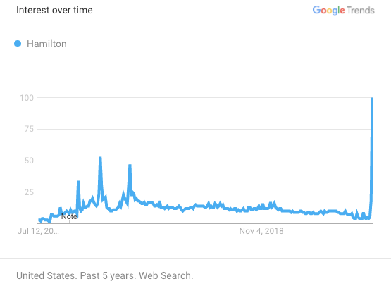
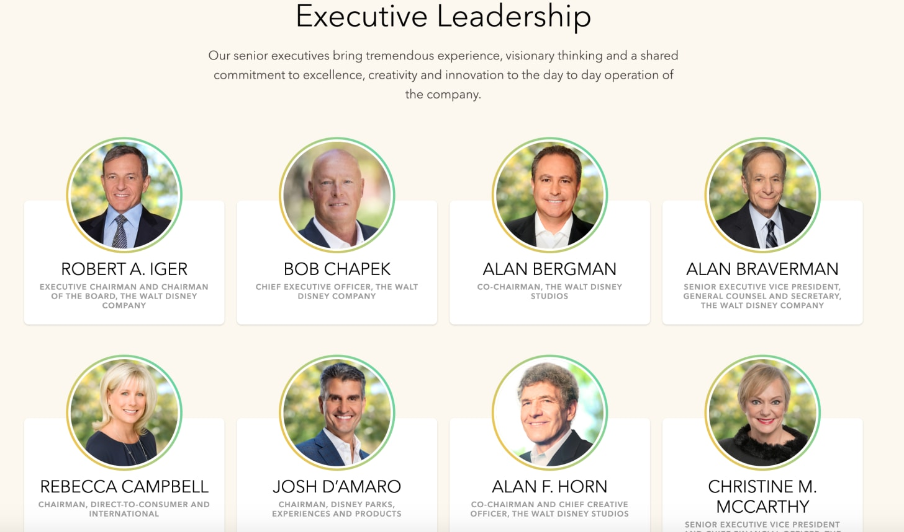
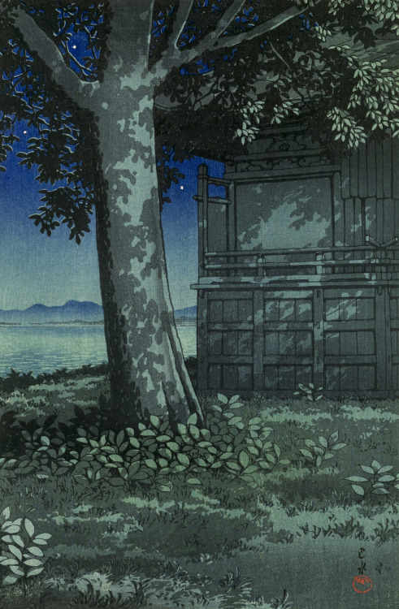

_Welcome to [The Curtain](http://guscuddy.substack.com/), a weekly newsletter exploring arts, culture, and the future. It’s written by me, [Gus Cuddy](https://guscuddy.com/)._

_New reader? [Subscribe](https://guscuddy.substack.com/subscribe) for free:_

[Subscribe now](https://guscuddy.substack.com/subscribe?)

---

Hi friends!

Hope you’re having a good week amidst these strange, strange times.

++

### The Disneyfication of Hamilton

 

This past week, _Hamilton_ finally launched on Disney+, over a year earlier than originally slated. It's been interesting to go through the release of Hamilton essentially all over again, five years after it premiered. 2015—and the subsequent 2016 mania—seems like a world away. A show that was largely universally esteemed back then—[there were](https://www.currentaffairs.org/2016/07/you-should-be-terrified-that-people-who-like-hamilton-run-our-country) [dissenters](https://www.currentaffairs.org/2019/02/ishmael-reed-doesnt-like-hamilton)! but they seemed to be drowned out by Michelle Obama calling it [the greatest work of art she'd ever experienced](https://mashable.com/2016/03/14/michelle-obama-hamilton/)—has had its fair share of [reconsiderations and critical thought](https://news.harvard.edu/gazette/story/2016/10/correcting-hamilton/?fbclid=IwAR31b1xKkGZ2nvp2xGl_cRUngrmG5TLBigknNhKxV_E9_DrJKsh9FfMnPPk) over the years. The world—and culture, whatever that exactly means—is in a much different place than it was.

But all of a sudden, _Hamilton_ is back and it's a huge success, no surprise. [It's driving downloads of Disney+](https://variety.com/2020/digital/news/hamilton-disney-plus-premiere-app-downloads-72-percent-1234698795/), and interest is at an all-time high:

 

###### uh, i think disney has a hit on its hands

But times have changed. I won't re-iterate [what others have written about before](https://www.currentaffairs.org/2016/07/you-should-be-terrified-that-people-who-like-hamilton-run-our-country), but what felt like a radical reclaiming of history in 2016 now feels a bit, well, simplistic. For one, there's a type of Obama-era naïveté present when we look at _Hamilton_ now. By heroizing the founding fathers and largely erasing their sins of slavery—even with (or, even more sadly, especially with) BIPOC playing these roles—you get a piece of pop culture perfectly aligned for white neoliberal elites. The idea that this was an artistic piece that "unified" us under its scrappy patriotism was a centrist, shortsighted myth. Fundamentally, _Hamilton_ is a show that celebrates our founding fathers, that gives them a mostly free pass for their evils. Hell, how radical can you be [when Dick Cheney loves your show](https://thehill.com/blogs/in-the-know/in-the-know/272964-obama-hamilton-is-the-only-thing-dick-cheney-and-i-agree-on)?

Which isn't to erase the achievements of _Hamilton_, which I was obsessed with for all of 2015/2016. Lin-Manuel Miranda created a work of furiously American pop culture that is riddled with some of the same contradictions of the country itself. He himself has acknowledged that he couldn't cover it all, and that the criticisms are valid:

https://twitter.com/Lin_Manuel/status/1280120414279290881

Perhaps it would be easier to forgive the show for some of its flaws, however, if it weren't for its post-fame production path, which has turned a work of theatre not only into a hyper-capitalist status symbol of a ticket, but now also a Disney-presented movie. Disney, which bought the movie rights to the _recording of a stage play_ [for a cool $75 million](https://deadline.com/2020/02/disney-paid-75-million-hamilton-movie-deal-lin-manuel-miranda-largest-film-acquisition-ever-1202849929/) (!!), is a company that wants to convince us that it's on the "good side" of the conversation around representation and diversity (don't worry, [they secured the Kaepernick deal](https://variety.com/2020/tv/news/colin-kaepernick-walt-disney-first-look-deal-espn-1234698911/)). So while there's something perverse about seeing the Disney Logo bookend the _Hamilton_ movie, there's something also infuriatingly on-brand about it. The _Hamilton_ producers have been ruthless with how they've monopolized and monetized their "product" (sadly, there will be no other director's version of _Hamilton_ for a long, long time); [Disney does the same thing](https://www.vulture.com/2019/10/disney-is-quietly-placing-classic-fox-movies-into-its-vault.html) with its fabled "vault".

_Of course_ Disney would be able to market _Hamilton_ to its customers well. It's the perfect addition to their lineup, to sell a vision of America that has the veneer of the fresh and radical without ruffling too many feathers. They're desperate for exactly this venn diagram of material. Because when you look inside the castle, [what you see is not pretty](https://theankler.com/p/class-photos):

 

###### yikes!! [it truly goes on](https://theankler.com/p/class-photos), but I've trimmed it here for all of our sake

I want to be clear: I _do_ think it's great that there is a very well-produced video of a Broadway show that enables millions more to be able to "experience" it at home. Theatre has a long, long way when it comes to this sort of digital accessibility. _Of course_ every successful Broadway show _should_ have this kind of (very expensive) recording done. And there absolutely needs to be a platform to easily distribute video to those who want to see! But what I find more distressing about this whole situation is that [this](https://www.nytimes.com/2020/06/25/movies/hamilton-movie-disney-streaming.html) _[Hamilton](https://www.nytimes.com/2020/06/25/movies/hamilton-movie-disney-streaming.html)_ [recording was from](https://www.nytimes.com/2020/06/25/movies/hamilton-movie-disney-streaming.html) **[four years ago](https://www.nytimes.com/2020/06/25/movies/hamilton-movie-disney-streaming.html)**. It took this long to get out to people because the producers needed to squeeze every last drop of money out of this as possible, and eventually submit to the Disney Machine. This isn't necessarily a triumph for theatre and digital media; rather, it's the unfortunate reality that only shows like _Hamilton_ get this sort of platform, and only when they participate in [a racist, capitalist system](https://www.nytimes.com/interactive/2019/08/14/magazine/slavery-capitalism.html) that isn't equipped to serve the needs of theatre, or the needs of the young and scrappy immigrants that the show claims to be about.

That's not the type of future I want for theatre or [believe that art needs](https://www.guscuddy.com/unprofitability). We can do better.

---

### 🗒 Notes from the Week

_**[Michaela the Destroyer](https://www.vulture.com/article/michaela-coel-i-may-destroy-you.html)**_

— An E. Alex Jung profile of Michaela Coel is an insta-read for me. I think _I May Destroy You_ is terrific, and my admiration for Coel grew even more after reading Jung's piece. It's a great read and a damning expose of Michaela Coel's experiences as an actor and as a creator of the show _Chewing Gum_, from which she was disempowered. It also exposed me to [this amazing lecture](https://www.youtube.com/watch?v=odusP8gmqsg) that Coel gave at the elite-old-white-men gathering Edinburgh International Television Festival:

> By turns autobiographical, professional, poetic, and damning, she discussed her sexual assault publicly for the first time and described the dynamic on _Chewing Gum_ as one in which she was disempowered professionally even as she poured all of her creative energy into the show. She chose her words precisely, like silver arrows sailing to hit their targets. Instead of referring to something as “racist,” she called it “thoughtlessness”; she referred to underrepresented groups as “misfits.” She is aware of the ways words like _racism_ and _microaggression_ have lost their power, so she searched for new ones that might make people listen.

At every turn, Coel is hellbent on not allowing a system that has been designed to disenfranchise her to take her down: she turned down $1 million from Netflix when she learned it wouldn't allow her ownership of the copyright, and she fired her agents at CAA when they pushed her to take it.

++

_**[Is Anyone Watching Quibi?](https://www.vulture.com/2020/07/is-anyone-watching-quibi.html)**_

— The thing I find amazing about this whole [Quibi](https://quibi.com/)\-is-a-disaster thing is how many A-Listers founder Jeffrey Katzenberg convinced that he had invented the future of media. The streaming service has an astonishing amount of content from a list of creators that include Sam Raimi, Lena Waithe, Jason Blum, Anna Kendrick, the Kardashians—hell, even Guillermo del Toro, who hilariously said that he had come up with an exciting project to "use" Quibi's weird format of "quick bites" on your phone.

The thing is, Katzenberg's revelation that people like to consume in small chunks—like _The Da Vinci Code_, the article states!—is (I guess?) true. But to structure a huge company and new format around this idea—to bet everything on it—is just insanity. It's the perfect example of something drawn up in a boardroom by rich people, then those rich people somehow convincing themselves they were really onto something, and never actually bothering to ask any real person what they want. Case in point: even though they were aiming for an audience of the buzzy term "digital natives", it's a service that doesn't even allow you to take a screenshot of what you're watching. Anyway, [the Vulture piece](https://www.vulture.com/2020/07/is-anyone-watching-quibi.html) is a good schadenfreude read, if you're into that sort of thing. (Oh yeah, and if you’re in the mood for more disgust over the demographics of people running these sorts of companies, [just check out their leadership](https://quibi.com/our-story).)

++

_**Assorted Links**_

—[How Netflix Beat Hollywood to a Generation of Black Content](https://www.nytimes.com/2020/07/05/business/media/netflix-hollywood-black-culture.html)

—[Anti-Algorithmic Music: How Bandcamp Is Helping Artists Beat The Odds](https://www.residentadvisor.net/features/3703?curator=MusicREDEF)

—RIP [Ennio Morricone](https://www.nytimes.com/2020/07/06/movies/ennio-morricone-dead.html) 

—[Podcasting can realize its promise — if it meets the challenge for creators of color](https://hotpodnews.com/podcasting-can-realize-its-promise-if-it-meets-the-challenge-for-creators-of-color/)

—[What If Digital Fashion Week Is the Best Fashion Week Ever?](https://www.gq.com/story/hermes-jw-anderson-digital-fashion-week)

—In the UK, [the government has started a cultural rescue package](http://bway.ly/4c5c7e#https://www.standard.co.uk/comment/comment/sonia-friedman-arts-theatre-government-rescue-package-a4489686.html)

—[Corporations boycotting Facebook is pure show, and, yes, it actually helps Facebook](https://www.politico.com/news/magazine/2020/07/01/facebook-boycott-facebook-stronger-347073)

—The internet is weird link of the week: [The US Army is losing the war in Discord as users speedrun bans](https://www.polygon.com/2020/7/1/21310282/us-army-discord-esports-uwu-ban-speedrun-trolling) 

---

### End Note

 

###### [art by Hasui Kawase](https://www.instagram.com/p/CB0TJKwKNSl)

###### ++

_That’s all for this week! Thanks so much for reading._

_The best way to support my work is to forward this email to someone else you think would enjoy it._

_You can reply directly to this email and I’ll receive it. I’d love to talk more!_

_Until next week,_

\-Gus.