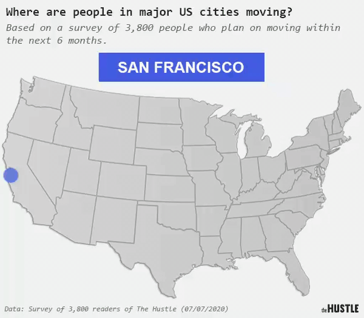

_Welcome to [The Curtain](https://guscuddy.substack.com/), a weekly newsletter exploring arts, theatre, culture, and the future. It’s written by me, [Gus Cuddy](https://guscuddy.com). New reader? [Subscribe for free](https://guscuddy.substack.com/subscribe)._

---

Hi all-

Hope you’re having a great week! Lots of notes and links to cover today.

 

###### _this week’s mood courtesy [Eliot Greenwald](https://www.juxtapoz.com/news/painting/night-car-eliot-greenwald-s-mythological-loop-in-new-book-release-and-solo-show/)_

---

## 🗒 Notes from the Week

#### Obie Awards

Tuesday night was the annual [Obie Awards](https://www.obieawards.com/2020/07/the-american-theatre-wing-and-the-village-voice-announce-the-2020-obie-award-winners/), delivered this year online. I’ve never been to an Obie awards ceremony, but I enjoyed being able to watch what was happening this year. [You can rewatch the event here](https://youtu.be/Hggq7SDHdTk), and I thought all the winners were well-deserving. [Notable winners](https://www.obieawards.com/2020/07/the-american-theatre-wing-and-the-village-voice-announce-the-2020-obie-award-winners/) include Haruna Lee, Michael R. Jackson, and Will Arbery for playwriting; institutional recognition for the National Black Theatre, Page 73, and The Tank; Whitney White (Our Dear Dead Drug Lord) and Les Waters (sustained excellence) for direction, and many more. A list of winners is [available here](https://www.obieawards.com/2020/07/the-american-theatre-wing-and-the-village-voice-announce-the-2020-obie-award-winners/).

---

#### [WE SEE YOU WHITE AMERICAN THEATRE demands](https://static1.squarespace.com/static/5ede42fd6cb927448d9d0525/t/5f064e63f21dd43ad6ab3162/1594248809279/Tier2.pdf)

WE SEE YOU released a massive PDF entitled “**[BIPOC Demands for White American Theatre](https://static1.squarespace.com/static/5ede42fd6cb927448d9d0525/t/5f064e63f21dd43ad6ab3162/1594248809279/Tier2.pdf)**”. It is packed to the brim with demands for every facet of theatre, from leadership to unions to marketing to practices to press and more. I recommend [checking it out](https://static1.squarespace.com/static/5ede42fd6cb927448d9d0525/t/5f064e63f21dd43ad6ab3162/1594248809279/Tier2.pdf). There’s a lot to discuss and process here—one of the things I appreciate about this document is its thoroughness—and I’m going to read and think over it over the coming week, before writing much further about my thoughts.

---

#### [Tonya Pinkins on Performative Theatre Responses](https://medium.com/@tonyapinkins/why-i-am-fed-up-with-performative-activism-from-white-and-black-theater-makers-d46564ec94fe)

Speaking of thoughts, though, [Tonya Pinkins](https://en.wikipedia.org/wiki/Tonya_Pinkins) [delivered a fiery piece](https://medium.com/@tonyapinkins/why-i-am-fed-up-with-performative-activism-from-white-and-black-theater-makers-d46564ec94fe) on why both white theaters “responses” and committees like “We See You” are, for her, performative and insufficient. Whether you agree with it or not—and I found points of disagreement—it’s worth a read for the perspective of an artist who has stuck their neck out on the line on multiple occasions, from [“Mother Courage” at Classic Stage Company](https://www.huffpost.com/entry/who-lose-who-thrives-when_b_8912562) to her tenure as an Actor’s Equity principle counselor.

> Change DOES NOT happen by committee, laws, or rules first. Change is the result of individuals making a choice to stand up against the crowd and the rules and the laws in the moment that an intrinsic wrong occurs.

She goes on:

> There is no reward without risk. Not one organization, Black or White, risked anything by writing these emails or creating these committees. I can tell you from experience what the costs are of true individualized action. I am still paying for my scolding of Classic Stage Company and I probably will be for many years to come.

And a kicker of a line (emphasis mine):

> I advise anyone who asks me “What should I do?” I say, **do what you can live with at 3:00 am when you are wide awake wondering if you did the right thing**. Because we are all alone in the decision to act against injustice.

---

#### Cultural Bailouts in the US vs the UK

It’s bad when Boris Johnson—_Boris Johnson!_—[has pledged 1.5 billion pounds to keep arts in the UK alive](https://www.theguardian.com/world/2020/jul/05/boris-johnson-uk-lifeline-arts-heritage-sector-afloat), and the United States has done zilch. [Jesse Green makes the convincing case](https://www.nytimes.com/2020/07/07/theater/theater-bailout-britain.html) that the rich and prominent artists and groups in the US need to get their shit together and organize for action. The arts in America are floundering, and our country’s faux “free market” approach to saving the arts may end up being damaging for a long, long time to come.

---

#### Jia Tolentino on Decentering Yourself

Lots of folks linking to [this great Jia Tolentino interview](https://www.interviewmagazine.com/culture/ask-a-sane-person-jia-tolentino-book-2020-hope) which has some amazing quotes like this one:

> I’m also suspicious of the way that Not Being Racist is a project that people seem to be approaching like boot camp. To deepen your understanding of race, of this country, should make you feel like the world is opening up, like you’re dissolving into the immensity of history and the present rather than being more uncomfortably visible to yourself. Reading more Black writers isn’t like taking medicine. **People ought to seek out the genuine pleasure of decentering themselves, and read fiction and history alongside these popular anti-racist manuals, and not feel like they need to calibrate their precise degree of guilt and goodness all the time**. 

[Link here.](https://www.interviewmagazine.com/culture/ask-a-sane-person-jia-tolentino-book-2020-hope)

---

#### Pop Culture’s Responsibility, continued

From a [Vulture article entitled “How Does It Feel to Make Police Shows in 2020?”](https://www.vulture.com/article/police-shows-in-2020-anonymous-in-hollywood.html):

> On our show, **we reinforce the idea that police are good so that the world is exactly the way the people in our audience want to believe it is**. We all know who our audience is, so we rationalize it because this is our job. Even if we know it’s wrong.

---

#### [Time and the Garden of Forking Memes](https://aaronzlewis.com/blog/2020/07/07/the-garden-of-forking-memes/)

My favorite essay I’ve read recently is Aaron Z. Lewis’ [personal and anthropological examination of the Internet, time, remembering, and memes](https://aaronzlewis.com/blog/2020/07/07/the-garden-of-forking-memes/). For anyone interested in digital media, weird visualizations of the internet and consciousness, it’s a fascinating read. Lewis spends time with a strange experiment called [“Critical Atlas of Internet”](https://louisedrulhe.fr/internet-atlas/):

> In the early days of the internet, the Web’s surface was relatively smooth and its “gravitational force” was weak. You could random walk without getting sucked into any black holes. During the 2010s, social media platforms “dug into the Web surface, dragging activities down their slopes … As a result of this magnetic-like attraction, caused by the web slope, Internet users slowly slide down the slope in a digital drift,” writes Louise Druhle. The virus has likely accelerated this process because it’s pushed so much cultural activity online.

 

And his examination of how our sense of time has evolved offers an idea about the gradual synchronization and sudden de-synchronization of time that I’ve never considered before. The 20th century saw us all getting on linear, Industrial, 9–5 time, while the internet has made linearity and synchronized time almost obsolete:

> In the 19th and 20th centuries, innovations like the telegraph, time zones, radio, and television led to new patterns of mass connectivity and synchronization. Time was made visual and divided into smaller and smaller units that allowed us to achieve unprecedented levels of coordination. But in our own century, **digital media is fracturing our collective experience of clock time**.

[Recommended reading](https://aaronzlewis.com/blog/2020/07/07/the-garden-of-forking-memes/) for the adventurous.

---

#### 🌐🌲 Atmospheric User Interfaces

Intrigued by these strange designs of technology intermingling with atmosphere and environment:

 

[by](http://fynng.com/) | [via](https://twitter.com/aaronzlewis/status/1282053592803766272)

---

#### Podcast Ad Revenue is down, but podcasts aren’t going away

From [the annual IAB study](https://www.iab.com/insights/iab-u-s-podcast-advertising-revenue-study-fy-2019-2020-covid-19-impact/):

 

This study looks at advertising, as opposed to listenership, which previous studies have looked at. The fastest growing and most reliable genre? News. 🤢 It seems [people listen to podcasts to stay informed about the pandemic](https://www.cnn.com/2020/06/15/media/spotify-podcasts-risk-takers/index.html).

In related news, Omnicom Media Group—one of the largest ad firms in the world—[is dedicating $20 million to Spotify podcast advertising](https://www.wsj.com/articles/omnicom-plans-20-million-in-podcast-ads-on-spotify-11594204200), [a future that I don’t think is good](https://guscuddy.substack.com/p/the-curtain-59-why-open-podcasting).

And, yes, people are starting a lot of podcasts:

 

---

#### Who was it???

https://twitter.com/pmcottrell/status/1280852299582181376?s=21

Re the embarrassing [harper’s letter](https://harpers.org/a-letter-on-justice-and-open-debate/).

---

#### Everyone is moving to Austin

 

([via](https://twitter.com/thesamparr/status/1280965478878330880), with [a google doc here](https://docs.google.com/spreadsheets/d/1G-O6cu1dbXWvIS1hF92qBjWPzG3c51jQoUkubi7plR4/edit#gid=757621741))

---

#### Links

*   This year’s [Kilroys list](https://thekilroys.org/timeline-2020/)—typically a list of great underproduced plays by women, trans and nonbinary writers—is devoted to being a living document covering plays by women, trans and nonbinary writers that have been postponed or cancelled.
    
*   [Ziwe has been killing it lately](https://variety.com/2020/digital/news/ziwe-instagram-live-show-baited-interview-1234706236/) with her Instagram Live interviews about race that are excruciating and hilarious. Her interview with Jeremy O. Harris was a must-watch.
    
*   Happy for Sean Daniels and the team at [Arizona Theatre Company collaborating with Mark Armstrong and The 24 Hour Plays](https://arizonatheatre.org/the-24-hour-plays-viral-monologues-arizona/).
    
*   [Sirius XM is buying Sticher](https://twitter.us12.list-manage.com/track/click?u=e7175619f87bd6b29429572aa&id=aa009bcd16&e=06f54c0266), as the podcast wars continue to escalate
    
*   The head of Original Programming at Audible [is out after one month on the job](https://www.bloomberg.com/news/articles/2020-07-12/audible-s-new-head-of-original-programming-is-out-after-just-a-month)
    
*   [Instagram influencers are unionizing](https://www.voguebusiness.com/companies/why-instagram-influencers-are-unionising)
    
*   Facebook’s decisions to leave up violent Trump comments are a “**significant setback for civil rights**”, [an audit from a group of civil rights attorneys say](https://www.nytimes.com/2020/07/08/technology/facebook-civil-rights-audit.html).
    
*   Tik Tok made the news this week, [with the US considering banning](https://www.reuters.com/article/us-usa-tiktok-china-pompeo-idUSKBN2480DF) ****[it](https://www.reuters.com/article/us-usa-tiktok-china-pompeo-idUSKBN2480DF) (supposedly because it’s stealing data and providing it to China) and Amazon [going through with banning (and then un-banning) the app](https://www.theverge.com/2020/7/10/21320196/amazon-employees-tiktok-uninstall-email-trump-administration-pompeo-ban). What a mess.
    

---

## 🍂 End Note

 

###### art by [Jules de Balincourt](https://julesdebalincourt.com/)

---

_That’s all for this week! Thanks so much for reading._

_The best way to support my work is is to forward this email to someone else you think would enjoy it, and tell them to subscribe. It means a lot to me._

[Share](https://guscuddy.substack.com/p/the-curtain-57-the-long-and-the-short?token=eyJ1c2VyX2lkIjo4NzM1NjEsInBvc3RfaWQiOjQ1MzgzNSwiaWF0IjoxNTg5OTUyMDAyLCJpc3MiOiJwdWItMjc1MSIsInN1YiI6InBvc3QtcmVhY3Rpb24ifQ.MnUeDZFKbyv0nauW4sH0MD1UhrQq45QgLFdS_Ikzi-A&utm_source=substack&utm_medium=email&utm_content=share&action=share)

_[You can also support me directly by donating.](https://givebutter.com/thecurtain)_

_As always, you can access the entire archive [here](http://guscuddy.substack.com/archive)._

_You can reply directly to this email and I’ll receive it. So feel free to do that about anything. I love to hear back from people._

_See you next week!_

\-Gus