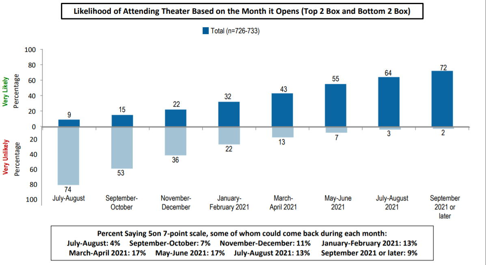
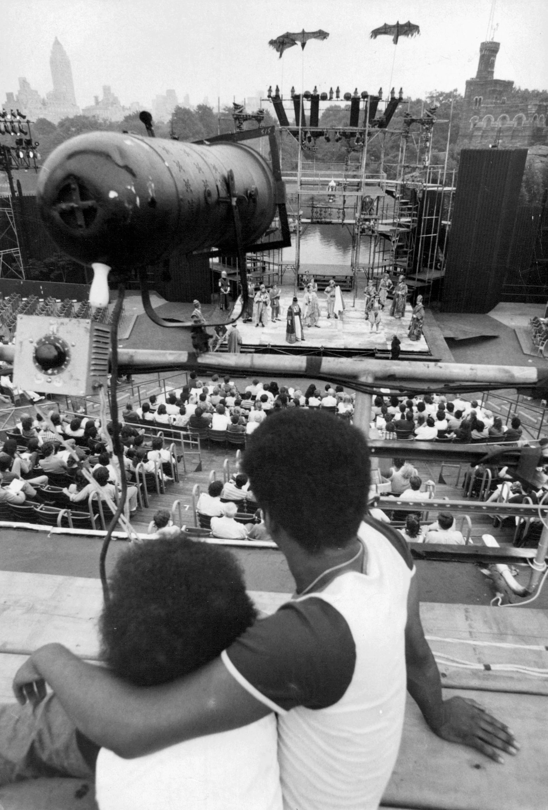

_Welcome to [The Curtain](http://guscuddy.substack.com), a weekly newsletter exploring arts, theatre, culture, and the future. It’s written by me, [Gus Cuddy](https://guscuddy.com). New reader? [Subscribe for free](https://guscuddy.substack.com/subscribe)._

---

Hi friends,

Hope you’re staying well!

++

Lately, as prompted by this great piece by [this great piece](https://www.americantheatre.org/2020/07/15/artists-of-the-world-unite/) by Aeneas Sagar Hemphill, I’ve been thinking more and more about artists’ need to _organize_. Hemphill uses the historical precedent of the New Deal and the [Federal Theatre Project](https://en.wikipedia.org/wiki/Federal_Theatre_Project) (sponsored by the Works Progress Administration)—spearheaded by the work of [Hallie Flanagan](https://en.wikipedia.org/wiki/Hallie_Flanagan)—as a jumping off point. Indeed, the Works Progress Administration is the closest our country has gotten to mirroring European arts subsidies; since then, we have only drifted further away from this possibility. To be clear, [the New Deal did not fully challenge Jim Crow](https://www.artsjournal.com/uq/2020/07/the-new-deal-the-arts-and-race-and-today.html), but it does offer us possibilities of what theatre could look like: expansive, rooted in political action and organizing, and able to reach new audiences and communities that hadn’t been served in the past.

Flanagan was a radical re-thinker of theatre, eschewing [nostalgia](https://guscuddy.com/nostalgia) for a chance to imagine new possibilities for what theatre could be:

> Our whole emphasis in the theatre enterprises which we are about to undertake should be on **rethinking rather than on remembering**. 

As Hemphill notes:

> Flanagan saw the \[Federal Theatre Project\] not only as an economic relief program for artists but also as an opportunity to **expand the art form, increase access, and introduce live performance to communities who might not have previously had the chance to access it.**

Arts needs funding to survive, [not the other way around](https://www.guscuddy.com/unprofitability). And right now, in the United States, theatre—and the arts—are not getting any funding. For the future of arts in this country, this is a disaster. But it’s not enough to merely demand money to survive. Artists need to organize to demand not only a stimulus package for artists and organizations, but a future that is radical, innovative, and just. As Hemphill writes in his article:

> The Great Depression saw such major reforms not because of a natural, inevitable change but **because an organized, militant movement of people put pressure on the system**. The relationship between **theatre and the labor movement**, so integral to these changes, reached a peak during this time.

Theatre cannot sit in a bubble beyond the reach of everyday, on the ground politics. Artists need to be connected with labor movements, because our future depends on it. Our duty is to be organizing for a better future, one that is inclusive, fair, and democratic. Arts and politics, in this way, have an interwoven future: in order to have a future at all, the arts need to be politically active. We sit on a precipitous cliff, but we have a chance to remake our future anew.

---

## Notes from the Week

#### Likelihood Of Theatre Attendance Going Down

A chart from Shugoll Research doesn’t paint a promising picture, [via American Theatre](https://www.americantheatre.org/2020/07/14/theatregoers-willingness-to-return-is-trending-down-data-show/):

 

People being less and less willing to return to going to the theatre makes sense, but I expect numbers like this to fluctuate a lot over the course of the next six months.

---

#### [Missing Theatre Under the Stars](https://www.nytimes.com/2020/07/16/theater/outdoor-theater-plays.html)

 

Speaking of remembering rather than rethinking, [this article](https://www.nytimes.com/2020/07/16/theater/outdoor-theater-plays.html) leans on the former. But it’s a lovely collection of quotes and tidbits on the wonder of outdoor theatre. Nostalgia and the future can intermingle, and there’s a longing for the collective aliveness that can animate live outdoor theatre: the audience, the performers, and the world, coexisting for a short, momentous period.

Carrie Coon:

> I was always getting in trouble for laying down in my costume, because I would lay down and look up at the sky

---

#### [Soraya McDonald on Being a Jew of Color, Anti-Semitism](https://theundefeated.com/features/im-a-jew-of-color-i-wont-be-quiet-about-anti-semitism/)

I loved [this piece](https://theundefeated.com/features/im-a-jew-of-color-i-wont-be-quiet-about-anti-semitism/) from the great Soraya McDonald on her personal experience of being a Jew of Color, and her relationship to Anti-Semitism. It’s worth a read; we can’t be silent about hate crimes—and need to be aware of those that are subtly (or not subtly) perpetuated by our own communities.

> Jews of color often face a burden to publicly prove their Jewishness while white counterparts can take that part of themselves for granted.

---

#### [Experiences Inside a French Theatre](https://www.nytimes.com/2020/07/16/theater/entering-a-paris-theater-warily-and-finding-a-weight-lifted.html)

Over in France, theatre is beginning to restart, with theaters starting to re-open slowly at the end of June. There are still guidelines around leaving empty chairs, but because theaters are subsidized over there (can you imagine?), it’s not a disastrous proposition. 

[This is a great review](https://www.nytimes.com/2020/07/16/theater/entering-a-paris-theater-warily-and-finding-a-weight-lifted.html) of a festival from the Théâtre de Belleville by Laura Cappelle, though what it truly does is make me sad about the current state of American theatre.

> Yet about midway through “Ionesco Suite,” a medley of absurdist scenes by the French playwright Eugène Ionesco, something gave. Emmanuel Demarcy-Mota’s production, first seen in 2005 and much revived since, piles on a series of eerily over-the-top characters, and on this occasion, the seven actors contorted their faces as if their lives depended on it. **From feet away, their physical freedom was so tangible that I found myself laughing and wanting to cry; a weight was lifted that no amount of at-home live streams could have made lighter.**

---

#### Paula Vogel on Following Your Joy

[Paula Vogel being interviewed by Token Theatre Friends is a treat](https://tokentheatrefriends.com/2020/07/13/paula-vogel-advice-to-all-of-us-right-now-follow-your-joy/). She has been [producing a series of play readings](http://paulavogelplaywright.com/bardatthegate), focusing on works that are underproduced or overlooked. 

> I think the blessing of COVID is that we can take this moment, that everybody takes this moment and say, “It’s not about returning to the status quo. **It’s about redefining what brings us joy**.”

And I liked her advice on having the right readers to show a new play, which is advice that applies across many fields:

> The other thing that helps is really being very careful to accumulate your fellow travelers. To **accumulate the first readers around you, to accumulate people who will do you no harm, but actually believe in you more than you do**. I think it’s very, very hard for us to believe in ourselves. We are our first worst critics. And so I asked my friends, “Will you hold me to a deadline where I have to send you 20 pages?”
> 
> And all they have to say back is, “I read it, keep going.” I don’t need them to critique, I don’t want a critique. **I just want someone saying, “Come on. Keep it going. Keep it up.**”

---

#### About the whole “theatre is a church” thing…

https://twitter.com/literasyme/status/1285673418067714050

I agree with this tweet from Holger Syme. I think the church is a poor model but maybe an accurate comparison for theaters—just not in the way they think: many people’s experience of church is that of going to be politely bored for a while, which is what so much of theatre is as well. [I wrote about this in 2018](https://www.guscuddy.com/2018/11/23/theatre-church-fallacy.html):

> But the bigger problem? Well, the comparison is actually a little too accurate, and that’s not a good thing. People forget that for many of us, church is really boring! Many people go out of a sense of obligation, not for the thing itself. They go to feel worthy, to say they have gone to church. And then, for the next hour or so, they are politely bored.
> 
> This is the same idea with theatre: people go to feel “worthy” for having experienced “culture”. They go to theatre out of a sense of obligation, and they expect to be politely bored for two hours. This is deadly.

---

#### GPT-3 is the Future of AI, and it’s wild

There’s a new machine learning tool released by OpenAI called GPT-3 that is…scary. It generates text based on text that you give it, and the results are incredible. Much of the technical-geek Twitter I follow has been falling all over this, and [there’s a good thread here](https://twitter.com/xuenay/status/1283312640199196673?utm_source=Benedict%27s+Newsletter&utm_campaign=22efbc14d3-Benedict%27s+newsletter+issue+345&utm_medium=email&utm_term=0_4999ca107f-22efbc14d3-71147334) collecting examples of the AI in action. If you want something to dive into, I recommend checking out [GPT-3 trying to write Creative Fiction](https://www.gwern.net/GPT-3#dialogue).

Ah, the future! 💀

---

#### John Lewis was an icon.

 

[His work continues.](https://newrepublic.com/article/158571/john-lewiss-good-trouble-happening-streets-right-now)

---

#### Assorted Links:

*   [Film and TV Production to return in NYC](https://variety.com/2020/film/news/new-york-city-film-tv-production-resume-1234709436/), as part of Phase 4 of New York’s re-opening plan
    
*   [The release of Christopher Nolan’s Tenet Has Been Delayed Indefinitely](https://variety.com/2020/film/news/tenet-delayed-again-christopher-nolan-1234699068/)
    
*   [Artistic Director of PlayPenn theatre is resigning because of racism and sexual harassment](https://whyy.org/articles/founding-director-of-philly-theater-group-resigns-after-racism-harassment-allegations/)
    

---

## 🍂 End Note

 

---

_That’s all for this week! Thanks so much for reading. If you haven’t yet, please [subscribe](https://guscuddy.substack.com/subscribe)._

_The best way to support my work is is to forward this email to someone else you think would enjoy it. It means a lot to me._

[Share](https://guscuddy.substack.com/p/the-curtain-66-the-arts-desperate?utm_source=substack&utm_medium=email&utm_content=share&action=share)

_[You can also support me directly by donating.](https://givebutter.com/thecurtain)_

_As always, you can access the entire archive [here](http://guscuddy.substack.com/archive)._

_You can reply directly to this email and I’ll receive it. So feel free to do that about anything. I love to hear back from people._

_See you next week!_

\-Gus