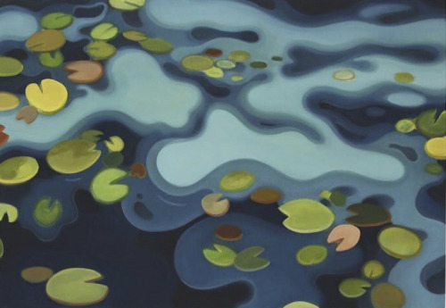

_Welcome to [The Curtain](http://guscuddy.substack.com/), a weekly newsletter exploring arts, theatre, culture, and the future. It’s written by me, [Gus Cuddy](https://guscuddy.com/). New reader? [Subscribe for free](https://guscuddy.substack.com/subscribe)._

---

Hi friends,

Welcome to a special Wednesday night edition of The Curtain. I apologize for the late email this week—I was out of town for several days without internet access! (Which was nice.)

I hope you’re having a wonderful week.

++

### Types of intimacy

 

My partner Mari and I spent the last few days off the grid, camping in northern California. We had a great time, though the number of people out and about not wearing masks—and seemingly without a care in the world—was alarming. Still, I feel so privileged and grateful to be experiencing any sort of nature right now. Breathing in 1200-year-old Redwoods can be healing from a cosmic perspective.

But I always have fears and lurking suspicions about “Nature”—or rather, the way it’s been commoditized by the United States. The “Outdoors World” is a bit of a strange bubble, but not one that is immune to racism. The very idea of “Outdoors”—as it fits into the evolution of White America—has been crafted under the purposes of exclusion and white supremacy. For instance, the [Sierra Club](https://www.sierraclub.org/)—one of the most influential environmental organizations in the country—recently put out a post entitled [“Pulling Down Our Monuments”](https://www.sierraclub.org/michael-brune/2020/07/john-muir-early-history-sierra-club) about the “immeasurable harm” that the organization and its iconic founder [John Muir](https://en.wikipedia.org/wiki/John_Muir) enacted against indigenous and Black communities. Early conservationists in America were diseased with the same white supremacist ideals that inflicted so much of our country, which is why they designed the “Outdoors” only to be enjoyed by white folks. (“In the now hundreds of days I’ve spent casting over the years, I’ve never met a person of color on or associated with the river,” [Ellen McGirt writes](https://fortune.com/2018/07/25/where-are-the-black-park-rangers/?utm_source=email&utm_medium=newsletter&utm_campaign=raceahead&utm_content=2020072820pm) about her experiences with flyfishing as a black woman; [Rahawa Haile writes about her experiences of disgusting racism as she solo-hiked the Appalachian Trail from Georgia to Maine](https://www.outsideonline.com/2170266/solo-hiking-appalachian-trail-queer-black-woman).\_

With that in mind, it felt damn good to disconnect for a couple of days. Since we’ve largely not left the house much for the past 4.5 months, I’ve spent far too much free time plugged into the world via the internet. And while I think being plugged in is an OK thing for the most part—I resist against the pretentious Thoreau-inspired idea of what Venkatesh Rao calls [“waldenponding”](https://breakingsmart.substack.com/p/against-waldenponding)—it’s also immensely lovely to take a few moments to breathe and collect my thoughts. It’s nice to leave room for wonder and mystery and the unknown and, hell, even boredom—rather than my cramming every moment with some sort of optimized information input.

But here is what I miss right now: gathering in a room with folks, making art, seeing theatre, running into old friends while out and about, the swell of energy at an exciting new play in the summer, its tangible excitement spilling out onto the streets and mingling with the muggy hot, humid blue-gray New York summer air, sounds and colors swirling around us, the feeling of bodies against each other and also oh of ice cream.

As I watched dragonflies fornicate over the Eel River, I also thought about that craving for artistic intimacy again. The feeling of meeting new people, experiencing things together, and creating weird art together in a hot room somewhere in deep Brooklyn: a type of intimacy—what I’ll call **“collective intimacy”**—that we will not quite experience in the same way for a while. Even as COVID-19 restrictions begin to relax, it will be hard to shake some of the territorial nature that comes out in a pandemic. (For instance, while camping, it’s easy to get defensive when we see people without masks, or getting too close.) It will be hard to retain once again the sense of nakedness and vulnerability required for collective intimacy to emerge.

There is another type of intimacy, though, that we have also re-discovered in these times. While much of theatre contains this collective intimacy, much of film, video, and digital content can have a different kind of intimacy: one that primarily centers around the **individual**. For many of us quarantined alone or with just a few people, we watch movies and TV and develop a type of intimacy with them—but it’s distinctly different than the kind of intimacy in theatre. Instead, we feel some personal ownership over the content. Because of how the technology works, we can discover a type of emotional intimacy by being able to pause, stop, rewind, and speed up the video. Indeed, the immediacy of streaming video leads to a kind of familiarity with the content, since it’s always available for us, not more than a few clicks away.

Individual intimacy can become a **networked intimacy**. A networked intimacy begins when an individual intimacy extends to a collective, generally through the internet (which is itself a “[global village](https://www.livinginternet.com/i/ii_mcluhan.htm)”). Memes, Twitter corners, and Discord groups are created to expand one’s obsessions to a group setting—and, in the process, feel less alone. In the past, these could have taken the form of magazines, clubs, in-person groups, or comic book shops.

It’s the last form of intimacy that is perhaps the most relevant to us right now, and the most exciting, in some ways. Venkatesh Rao calls this “[CozyWeb](https://breakingsmart.substack.com/p/the-extended-internet-universe)”:

> Unlike the main public internet, which runs on the (human) protocol of “users” clicking on links on public pages/apps maintained by “publishers”, the cozyweb works on the (human) protocol of everybody cutting-and-pasting bits of text, images, URLs, and screenshots across live streams. Much of this content is poorly addressable, poorly searchable, and very vulnerable to bitrot. It lives in a high-gatekeeping slum-like space comprising slacks, messaging apps, private groups, storage services like dropbox, and of course, email.

I’ve become increasingly interested in how collective and networked intimacies can collide, or if they can at all. Despite my love of weird internet corners, they will never be able to replace the real-life breath and sweat and buzz of being amidst a collective experience. It’s why events like Coachella and Burning Man have become as insanely popular as they have: we have a craving, even more so with the Internet Age, to be a part of something outside ourselves, to gather and to glimpse transcendence. How can we work to bring back collective intimacy? And how will coming out of our cocoons of individual and networked intimacy play into this? 

---

## notes from the week

#### Arts Funding: Are we ever going to get anywhere?

[As I’ve discussed recently](https://guscuddy.substack.com/p/the-curtain-66-the-arts-desperate), an arts bailout from the government needs to happen. And soon. This has to be the focus right now, and there are many pushing for it: [Nick Westrate in The Daily Beast](https://www.thedailybeast.com/american-theater-workers-need-a-massive-government-bailout-now) who seizes on the economic impact of Broadway as a selling point for the government (not my favorite argument, but if it works…); [an Open Letter to Congress by Matthew-Lee Erlbach](https://beanartshero.com/dear-senators), an organizer for [Be An Arts Hero](https://beanartshero.com/dear-senators), that thousands of artists and leaders have signed; Actor’s Equity is [pushing for extended $600/week unemployment benefits](https://www.broadwayworld.com/article/Actors-Equity-Releases-Statement-in-Response-to-Pandemic-Unemployment-Enrollment-Ending-This-Weekend-20200724); [Helen Shaw makes the very convincing case](https://www.vulture.com/2020/07/does-arts-funding-advocacy-need-a-famous-face.html) that, while work **is** being done by unions and organizations, there is no “famous” figurehead to save the arts like there was in the U.K. with Sam Mendes and Sonia Friedman—an excruciatingly frustrating reality.

---

#### One Kind of Theater is Getting Popular

[Derek Thompson defines the rising problem of “Hygiene Theater”](https://www.theatlantic.com/ideas/archive/2020/07/scourge-hygiene-theater/614599/), akin to post-9/11 “security theater”: “COVID-19 has reawakened America’s spirit of misdirected anxiety, inspiring businesses and families to obsess over risk-reduction rituals that make us _feel_ safer but don’t actually do much to reduce risk—even as more dangerous activities are still allowed. This is hygiene theater.” Despite everyone boasting about doing deep cleans, COVID-19 is not transmitted through surfaces, but through “airborne person-to-person transmissions.”

---

#### Hollywood is Moving On

[Hollywood has finally decided to release huge movies—like Christopher Nolan’s upcoming, long-fabled](https://www.theatlantic.com/culture/archive/2020/07/hollywood-finally-admitting-us-lost-cause-tenet/614677/) _[Tenet](https://www.theatlantic.com/culture/archive/2020/07/hollywood-finally-admitting-us-lost-cause-tenet/614677/)_[—abroad before being released in the U.S](https://www.theatlantic.com/culture/archive/2020/07/hollywood-finally-admitting-us-lost-cause-tenet/614677/). This country’s response to the pandemic has been so pathetic that it’s upending how entertainment businesses are operating entirely. Forcing blockbusters to open overseas first and in America second is some kind of karmic whiplash. 

---

#### Signs of the Disney-streaming-theatre apocalypse

Following _Hamilton_, Disney’s live taping of their _Aladdin_ musical [seems to be coming to Disney+](http://filmedonstage.com/news/271-disney). And you can now watch Disney Cruise Lines’s _Tangled: The Musical_ [online for free](https://www.theatermania.com/new-york-city-theater/news/disney-releases-full-proshot-version-of-tangled_91233.html), which was professionally filmed in 2015. Folks, we’ve got to get it together and start professionally filming more theatre; we can’t let Disney over-populate the internet with their productions and turn off a generation of kids from theatre forever!

---

#### Hamilton, Ziwe, and I May Destroy You

Loved [this fantastic episode of the great Still Processing](https://www.nytimes.com/2020/07/23/podcasts/hamilton-ziwe-discomfort.html) where Wesley Morris and Jenna Wortham dive into _Hamilton_ in 2020 vs. 2015, the incredible performance of Ziwe, the complicated brilliance of _I May Destroy You_, some of the bullshittery of White Fragility, and the nature of sitting with discomfort.

---

### link roundup

*   I’m loving efforts from grassroots organizations and folks to actively build new canons, looking beyond the art that’s been passed down to us. [Beyond the Canon](http://www.beyondthecanon.com/) is one such organization, but there are many others.
    
*   The commissioner of the Mayor’s Office of Media and Entertainment [expects TV productions to return in September](https://variety.com/2020/tv/news/new-york-coronavirus-mome-commissioner-anne-del-castillo-1234715769/).
    
*   Arifa Akbar: [On-screen theatre is democratizing](https://www.theguardian.com/commentisfree/2020/jul/23/on-screen-theatre-let-me-see-plays-i-could-never-afford-im-thrilled-its-back?mc_cid=8601193f1f). (This can be true in the UK, where filming theatre is regular. Less so in the US where we don’t film theatre!)
    
*   [The newly formed Black Theatre Coalition aims to increase black employment in theatre](https://www.washingtonpost.com/entertainment/theater_dance/this-actor-and-choreographer-are-on-a-mission-more-black-people-running-broadway/2020/07/23/258318b2-cc4c-11ea-bc6a-6841b28d9093_story.html?mc_cid=8601193f1f)—offstage. An awful, awful statistic: “Out of 3,002 musicals and 8,326 plays since Broadway’s 1866 inception, a mere 10 directors of musicals, 11 play directors and 17 choreographers have been black.”
    
*   While we celebrate the UK giving money to the arts, we have to [realize that most of that money is going to institutions, not individuals](https://www.theguardian.com/stage/2020/jul/22/the-real-crown-jewels-of-the-arts-an-unprotected-freelance-workforce). But individuals form the backbone of the arts and culture sector in every country, and it’s individuals who are routinely tossed aside as unimportant.
    
*   [How did the influential new-play conference PlayPenn in Philadelphia go so wrong?](https://www.americantheatre.org/2020/07/27/what-went-wrong-at-phillys-playpenn/) I’ve heard first-hand experiences from numerous people about the problematic ways that PlayPenn treated their new play development process—but I know that these problems don’t start and stop there, but are endemic to the way the American Theatre works at large.
    
*   [TodayTix is acquiring Show-Score](https://broadwaynews.com/2020/07/28/todaytix-acquires-review-aggregator-show-score/), which is an acquisition that will change the future of theatre forever!! (I’m joking.) This is the most notable thing to happen to internet theatre-aggregator companies in…ever?
    
*   [Welcome to Ma-Yi Studios](https://www.americantheatre.org/2020/07/29/ma-yi-theater-launches-digital-streaming-live-capture-studio/): the great Ma-Yi Theater Company in New York has announced a place to create high-quality digital theatre for artists in New York.
    
*   **The final word:**[No more buildings, ONLY CIRCUS TENTS FROM NOW ON](https://www.thestage.co.uk/opinion/forget-buildings--circus-tents-are-ideal-for-covid-safe-shows)
    

---

## End Note

 

_art by Max Berry_

++

_That’s all for this week! Thanks so much for reading. If you haven’t yet, please [subscribe](https://guscuddy.substack.com/subscribe)._

_The best way to support my work is to forward this email to someone else you think would enjoy it. It means a lot to me. [You can also support me directly by donating.](https://givebutter.com/thecurtain)_

_As always, you can access the entire archive [here](http://guscuddy.substack.com/archive)._

_You can reply directly to this email and I’ll receive it. So feel free to do that about anything. I love to hear back from people._

_Have a great week, and see you next time!_

\-Gus