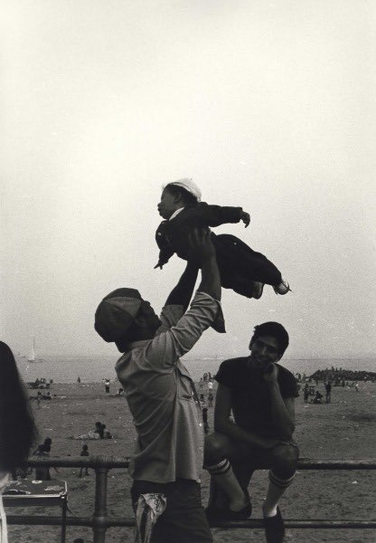
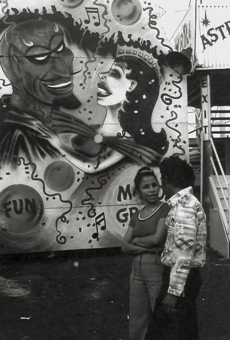
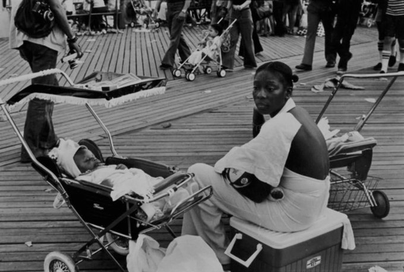
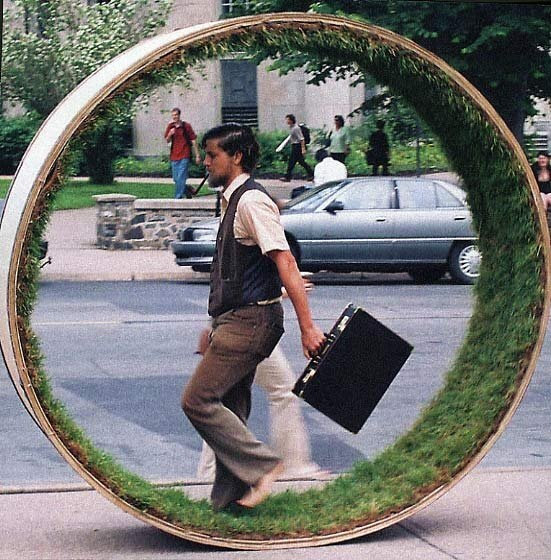

_Welcome to [The Curtain](http://guscuddy.substack.com/), a weekly newsletter exploring arts, theatre, culture, and the future. It’s written by me, [Gus Cuddy](https://guscuddy.com/). New reader? [Subscribe for free](https://guscuddy.substack.com/subscribe)._

---

Hey all—

As I say with every passing month: I can’t believe it’s xxx month already!!

This year has been bizarre and scary in every possible way. Tuesday’s explosions in Beirut, Lebanon, were another awful, tragic event in a year full of them. The explosions themselves, [caught on video](https://www.bbc.com/news/world-middle-east-53659282), were terrifying, seemingly random, and with a cause that seemed unknown—a microcosm of the year itself. My heart goes out to everyone affected by this.

Good things are happening in the world, too—great art being made, uprisings around the country and world, new futures being imagined. But it’s difficult to hold that all in our heads at the same time.

Part of why is because this pause—this [collective breath](https://guscuddy.substack.com/p/the-curtain-55-a-collective-breath)—has been extended so long, to the point that it’s become difficult to imagine anything beyond this moment. And yet, “pause” and “resume”—these words of video manipulation, like we’re somehow trying to control the narrative—mean different things to different parts of the population. As I’ve been watching the NBA resume—despite my ethical and political qualms with its resumption—I can’t help but feel that the entire idea of “resuming” has become a loaded class thing. On the one hand, you have “essential” workers who are being forced to return to work early at the expense of their safety and well-being. But you also have organizations like the NBA, Disney, and people like [Beyonce](https://disneyplusoriginals.disney.com/movie/black-is-king) getting going with their own kind of resumption. With near-infinite resources, they can produce work/events while taking the necessary—in the case of [the bubble](https://en.wikipedia.org/wiki/2020_NBA_Bubble), absurd—precautions required to maintain a safe-ish work environment. I fear this can create a future where the “creators” of the world are the wealthy, because they are the ones with the resources to actually create. Sure, we can all create videos and podcasts at home to the best of our ability—but that only gets you so far.

---

## 🗒 notes from the week

#### [keenan scott ii on the “emotional incarceration” of black trauma in art](https://www.americantheatre.org/2020/07/30/black-storytelling-the-blessing-and-the-curse/)

[This](https://www.americantheatre.org/2020/07/30/black-storytelling-the-blessing-and-the-curse/) is a terrific piece from Keenan Scott II ([who is poised to blow up](https://deadline.com/2020/08/keenan-scott-ii-broadway-playwright-a3-artists-agency-1203002298/), according to Deadline), on the idea that Black Pain is commodified by the White American gaze in theatre and the arts.

> "Like so many Black artists who came before me, writing has become a safe and productive outlet for the feelings I was taught to suppress. But as much as the potent brew of suppression and oppression serves as the Black author’s loyal and faithful muse, it also confines the scope of our creativity. If our work isn’t fundamentally rooted in the notion of Blackness as a (tragic) deviation from the mainstream, it rarely reaches a white audience. **Thus, we tend to be rewarded for depicting the harshest realities of the Black experience while ignoring its beauty. In art, our trauma is fetishized and romanticized while our joy is dismissed**. The end result is a society that views the Black experience as a dreary monotone, while consistently penalizing Black people for expressing the totality of their emotional lives.

As White American arts leaders continue to examine their role in a system that has disenfranchised BIPOC folks in so many ways, we have to remember that it’s not just some “[two-dimensional quota](https://www.guscuddy.com/2dracism)” that needs to be checked off. Instead, immense care needs should be taken as to what **kind** of work is lifted up, and the context in which mostly white audiences see that work.

---

#### what the hell is going on with tiktok?

The TikTok situation is fascinating, and I tend to think it’s more complicated than many are painting it. To recap: the wildly popular video-sharing service TikTok comes from China, and takes a lot of user data; Trump said they would ban TikTok, but now Microsoft (yes, Microsoft) is in talks to buy the company, which would allow it to theoretically continue in the United States. I do fear a future of [techno-nationalism](https://newrepublic.com/article/158783/tiktok-americas-bleak-techno-nationalism), but I also think there’s no question that the company is harvesting data pretty aggressively. Because it’s located in China, there’s also no question that the Chinese government could get that data if they so desired—which, given their actions, they probably would. China, of course, has [blocked many American websites and social networks](https://en.wikipedia.org/wiki/List_of_websites_blocked_in_mainland_China) (Google, Facebook, Youtube, and more) as well.

It’s worth noting that TikTok is not really a social network—[it’s an endless algorithmic feed](https://stratechery.com/2020/the-tiktok-war/). That algorithm is successful because it mines your data every second you use it and every action you take with it. To be clear: I think TikTok is endlessly fun and has been an excellent platform for creators. But it’s also clear that the endgame here is gross Advertising Tech, feeding off a company that has successfully captured a continuous stream of content and consciousness.

While I appreciate some of what TikTok has become, I fear an algorithmic future that’s free of deeper thinking, questioning, or slowness, all critical qualities of art as we know it.

---

#### there’s going to be some changes

Ensemble Studio Theatre Artistic Director William Carden [stepped down](https://www.americantheatre.org/2020/07/29/william-carden-to-step-down-from-ensemble-studio-theatre-helm/), as the organization attempts to restructure its leadership around the inclusion of BIPOC staff. There’s going to be a lot of this sort of thing coming, and I think [Carden’s statement](https://www.americantheatre.org/2020/07/29/william-carden-to-step-down-from-ensemble-studio-theatre-helm/) is worth reading because it’s at the very least an acknowledgment of the problems in theatre right now:

> “Over the last five years our largely white community has been learning about the systemic nature of racism and how—to one degree or another—it exists in each one of us and is embedded in the structure of our institutions. We’re also learning that our denial of that fact hinders our ability to fully acknowledge the legacy of oppression we, often implicitly, are perpetuating and to take the actions we need to change it.
> 
> “The Black artists in our community have been generous in collaborating with us as we have worked to become a more inclusive institution,“ he continued. ”We need to recognize that while we have produced their plays and given them space on the stage, the structure of our organization remains almost completely white. We may be empowering our Black artists artistically, but not institutionally. If we are going to become the just and equal community we aspire to be, we have to address and change the implicit racism in the structure of our theatre, and we will be doing that as part of this process."

That this learning should have been done by now is, of course, besides the point. White folks need to make space, not just step down and listen.

---

#### the great global quieting

All this talk of “pausing” and “resuming” can now be met with another remote control button: “volume down”.

Via [a new paper](https://science.sciencemag.org/content/early/2020/07/22/science.abd2438):

> Human activity causes vibrations that propagate into the ground as high-frequency seismic waves. Measures to mitigate the COVID-19 pandemic caused widespread changes in human activity, leading to a months-long reduction in seismic noise of up to 50%. **The 2020 seismic noise quiet period is the longest and most prominent global anthropogenic seismic noise reduction on record**. While the reduction is strongest at surface seismometers in populated areas, this seismic quiescence extends for many kilometers radially and hundreds of meters in depth. This provides an opportunity to detect subtle signals from subsurface seismic sources that would have been concealed in noisier times and to benchmark sources of anthropogenic noise. A strong correlation between seismic noise and independent measurements of human mobility suggests that seismology provides an absolute, real-time estimate of population dynamics.

---

#### the weekly disney-is-ruining-theatre take

I’m starting to feel slightly vindicated in the worst way. After bemoaning [Disney taking over](https://guscuddy.substack.com/p/the-curtain-64-the-disneyfication) **[Hamilton](https://guscuddy.substack.com/p/the-curtain-64-the-disneyfication)**and [other properties](https://guscuddy.substack.com/p/the-curtain-58-could-film-and-theatre), here we are learning that [Disney+ is going to produce an adaptation of](https://www.hollywoodreporter.com/heat-vision/disney-tackling-adaptation-broadway-musical-once-island-1305121) **[Once On This Island](https://www.hollywoodreporter.com/heat-vision/disney-tackling-adaptation-broadway-musical-once-island-1305121)**, because of course they are. Jocelyn Bioh is going to adapt, and Wanuri Kahiu will direct (which is terrific!). Is this the future of theatre?

---

#### [some good nyc theatre funding news](https://www.nycommunitytrust.org/newsroom/nyc-covid-19-response-and-impact-fund-grantees)

Many non-profit theaters in New York City—like Playwrights Horizons, Classic Stage, Second Stage, The Tank, and more—were recipients of the [NYC Covid-19 Response and Impact Fund](https://www.nycommunitytrust.org/newsroom/nyc-covid-19-response-and-impact-fund-grantees/), which gave out $73 million to 754 organizations. It’s just a start—but at least it’s something.

---

#### the future of ticketing

Lyn Gardner: [It’s time to rethink theatre ticketing practices](https://www.thestage.co.uk/opinion/covid-19-has-exposed-flaws-in-ticketing-practices--its-time-for-a-rethink). I completely agree: it’s absurd that we don’t offer easy ticket changes or easy refunds, to name some low-hanging fruit, for tickets that are often not a small investment at all. It’s just yet another barrier of entry for folks who aren’t wealthy to see theatre

Elsewhere, [The Museum of Natural History is reversing its pay-what-you-wish admission policy for those not in the Tri-State area](https://hyperallergic.com/580005/amnh-pay-what-you-wish-reopening/).

---

#### the nba and labor

[Here’s a take](https://newrepublic.com/article/158723/dismal-politics-sports-worlds-wokest-league) on why the NBA’s performative “wokeness” can’t mask its bad politics around labor. 

> For this group of players, economic material concerns and social justice weren’t separate agendas or at odds with each other. Rather, they were inextricably bound together. In the words of one Black player, who spoke anonymously to [Yahoo Sports](https://sports.yahoo.com/sources-significant-number-of-players-disappointed-about-not-having-a-vote-regarding-nb-as-return-143937552.html): “We’re out here marching and protesting, and yet we all leave our families in these scary times and gather to perform at a place where the owners won’t be at?” **There was a growing recognition that, not unlike “essential workers” across the country, the predominantly Black NBA workforce was being asked to risk their lives to entertain the public, while the people that owned the league got to sit back and profit from a safe, social distance**.

---

#### photos of coney island in the 1970s as photographed by ming smith

 

[source](https://twitter.com/DrinkSolaPop/status/1290010612974510080)

---

#### a great new theatre newsletter that i recommend

Despite not being a totally theatre-focused newsletter, I have felt a bit lonely talking about theatre on [Substack](http://substack.com/). I’m happy to see a fabulous new theatre newsletter jump into the space from Lauren Halvorsen called [“Nothing for the group”](https://nothingforthegroup.substack.com/), which I recommend if you want to keep up with nation-wide industry happenings in theatre!

---

### recommendation of the week

**[Never Rarely Sometimes Always](https://www.imdb.com/title/tt7772582/)** (Eliza Hittman, 2020)

We finally watched Eliza Hittman’s new movie **Never Rarely Sometimes Always** this week, which is a terrific and intimate portrayal of a young woman’s journey to get an abortion. It’s my favorite of Hittman’s films thus far (**It Felt Like Love** and **Beach Rats** are also great as well), and features some stunningly subtle performances from its lead actors.

---

## 🍂 end note

 

++

_That’s all for this week! Thanks so much for reading. If you haven’t yet, please [subscribe](https://guscuddy.substack.com/subscribe)._

_The best way to support my work is to forward this email to someone else you think would enjoy it. It means a lot to me. [You can also support me directly by donating.](https://givebutter.com/thecurtain)_

_As always, you can access the entire archive [here](http://guscuddy.substack.com/archive)._

_You can reply directly to this email and I’ll receive it. So feel free to do that about anything. I love to hear back from people._

_Have a great week, and see you next time!_

\-Gus