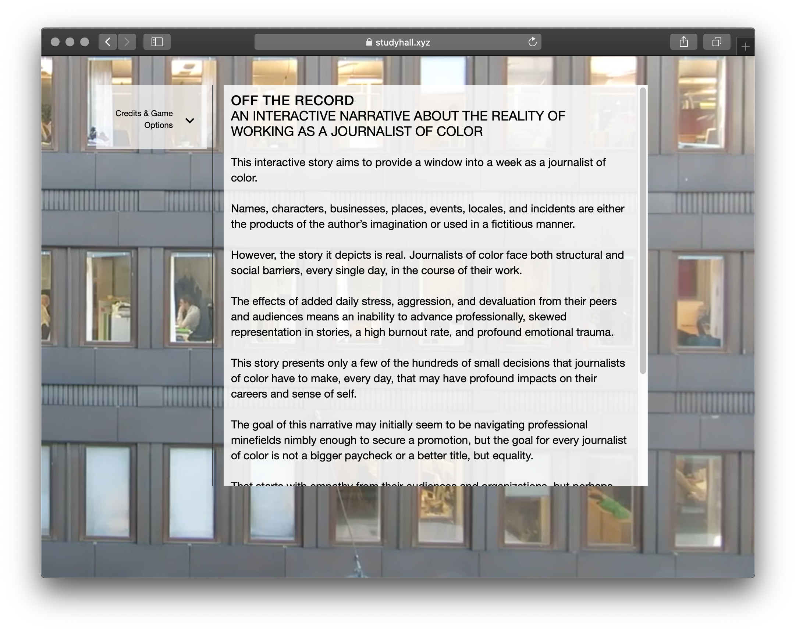

_Welcome to [The Curtain](http://guscuddy.substack.com/), a weekly newsletter exploring arts, culture, theatre, media, and the future. It’s written by me, [Gus Cuddy](https://guscuddy.com/). New reader? [Subscribe for free](https://guscuddy.substack.com/subscribe)._

[Subscribe now](https://guscuddy.substack.com/subscribe?)

---

Hi friends!

Another eternity has passed over the course of the week. 

These days time moves differently. Not just because of the pandemic, either. Our relationship to the internet and [the internet’s relation to time](https://aaronzlewis.com/blog/2020/07/07/the-garden-of-forking-memes/) make us perceive time differently.

We’ve all begun to develop a slightly new intimacy with technology itself over these past several months. What was once an escape has now become a lifeline, a portal into some sense of “reality”, while real reality sometimes takes the back seat. This internet “reality”, of course, is distorted in many ways: while the internet offers us many opportunities for connection, it’s also a place where gatekeepers and algorithms still control culture, to an extent. 

This week’s notes focus almost entirely on the ways in which we are using the internet for good, and the internet is using us for evil, in the context of arts and culture. 

---

## 🗒 Notes from the Week

#### [Corkscrew 4.0](https://corkscrew4pt0.com)

 

I _loved_ what the team over at [Corkscrew Theater Festival](https://corkscrewfestival.org/) did this year for the plays that they selected to produce (which will now happen next summer). 

Instead of throwing up their hands or creating a watered-down Zoom Theatre version, [they created weird and exciting interactive digital experiences based on the plays](https://corkscrew4pt0.com). It’s not only the 90s internet aesthetic that I appreciate here—plus the visual delight of discovering the website—but that it’s an imagining of a way we can use the internet and theatre _together_, as opposed to one replacing the other. It’s something very few theaters and producers have figured out, because it’s a hard problem, particularly with non-musical plays: without even a soundtrack that could be released digitally, what do plays have? Traditionally not much beyond pictures and maybe some boring behind-the-scenes type video. Instead, Corkscrew 4.0 created experiences that, if they don’t “mirror” the experience of live theatre, at least serve as a fascinating technological complement to the real thing. And, by definition of being online, they are also immediately more accessible. 

It’s challenging to create an experience through a website that is unpredictable in an exhilarating way. But that’s what I found when I started perusing through [their website](https://corkscrew4pt0.com). If you’re interested in strange online theatre experiences, I recommend you do the same.

---

#### “[Off the Record](https://studyhall.xyz/off-the-record/),” another fascinating interactive digital media project

 

[Here’s](https://studyhall.xyz/off-the-record/) another interesting digital project, though this time not from a theatre company at all. [“Off the Record”](https://studyhall.xyz/off-the-record/) is a choose-your-own-adventure type interactive narrative released by [Study Hall](https://studyhall.xyz/) (a fabulous media newsletter) focusing on roleplaying as a journalist of color trying to navigate the myriad complexities of existing amongst white colleagues. It’s smart and not “game-y” or overwrought; instead, it’s a provocative and bleak trip that’s worth a play-thru. Again, these types of interactive digital experiments are _very much_ up my alley—props to Study Hall, the writer Farah Mohammed, and the designer Mary Truong. I love the way in which video is also subtly incorporated.

---

#### [TikTok and the Evolution of Digital Blackface](https://www.wired.com/story/tiktok-evolution-digital-blackface/)

TikTok has had quite the year. It evolved beyond a “fun place for Gen Z” into an intensely debated piece in global geopolitics and a platform that has developed a reputation for silencing black creators and encouraging racist memes.

[Jason Parham’s piece](https://www.wired.com/story/tiktok-evolution-digital-blackface) for Wired on the “digital blackface” that has developed on TikTok is an excellent and damning look at the violence being perpetrated on a platform predicated on memes and algorithms. TikTok’s algorithm is famously great, making the platform into a neverending stream of random content you’ll find interesting—but, like, all algorithms, it eventually corrodes into something darker.

Parham writes of the 29 Black creators he spoke to:

> Together, their experiences belie the perception of TikTok as an app of joy and creativity, revealing instead a place **tangled up in an ancient pain**—a site of blurred visions and youthful ignorances, where **flattery quickly turns into mockery, mockery into theft, and theft into something altogether more disturbing**.

He goes on to describe how much of TikTok has become a type of minstrel show:

> Unlike Facebook and Twitter, where instances of digital blackface are either text-based (abusing Black vernacular) or image-based (trotting out memes or GIFs of Black celebrities), TikTok is a video-first platform, and on it, **creators embody Blackness with an auteur-driven virtuosity—taking on Black rhythms, gestures, affect, slang**.

I recommend [Parham’s essay](https://www.wired.com/story/tiktok-evolution-digital-blackface/) to get a better grasp on how the internet, culture, and “art” are merging in strange, predictable ways.

Parham’s further reading list provides more great texts to jump into:

https://twitter.com/nonlinearnotes/status/1291452236690870272?s=20

---

#### Should information be free? Yes.

The New York Times, the New Yorker, the New York Review of Books, the Washington Post: paywalled. Breitbart, Fox News, Infowars: free. The price of bullshit in this country is free, and that’s a problem, as Nathan J. Robinson [writes in his essay in](https://www.currentaffairs.org/2020/08/the-truth-is-paywalled-but-the-lies-are-free) _[Current Affairs](https://www.currentaffairs.org/2020/08/the-truth-is-paywalled-but-the-lies-are-free)_.

As Robinson notes, paywalls are, in a sense, justified—good writing costs money. But it’s a significant problem: the more “legitimate” a piece of information—going all the way up to academic journals—the more expensive it is. Surely there is a way to compensate creators and make the truth universal and free? Because what the Right has going for it is free, spreadable, bullshit. On the Left, so much costs money. We have all the technology to deliver to everyone free information, but the bottleneck is entirely economic. (The thing that drives me up the wall? When there’s only a “limited number” of copies of an eBook at a library available to check out online. This is an invented capitalist scarcity mindset.) The alternative to paywalls, of course, are usually ads—which aren’t the right solution either. I recommend reading [Robinson’s piece](https://www.currentaffairs.org/2020/08/the-truth-is-paywalled-but-the-lies-are-free) as a provocative question as to how we can structure a better society of both free information and free art.

---

#### Millennials vs. Gen Z: [Why Gen Z Turned on Lin-Manuel Miranda](https://www.rollingstone.com/culture/culture-features/lin-manuel-miranda-hamilton-tiktok-meme-1036975/)

[In](https://www.rollingstone.com/culture/culture-features/lin-manuel-miranda-hamilton-tiktok-meme-1036975/) _[Rolling Stone](https://www.rollingstone.com/culture/culture-features/lin-manuel-miranda-hamilton-tiktok-meme-1036975/)_, EJ Dickson writes a concise account of the divide between Millennials and Gen Z:

> Few people who don’t spend too much time on the internet actually care, but there’s long been a war raging between millennials and Gen Z. **The latter views the former as overly earnest and only superficially progressive**, deeming them the generation of #GirlBoss feminism and self-care memes and pink pussy hats; by contrast, millennials view Gen Z-ers as an almost otherworldly species, expressing bemusement at their obsession with upper body-heavy dance movements and the eye makeup in Euphoria.

Lin-Manuel Miranda is the jumping-off point, because of the _Hamilton_ backlash that has been accentuated by its Disney+ release:

> To teens and early-twentysomethings, Miranda is “sort of like **the ultimate millennial**,” says Joseph Longo, who covers Gen Z culture and wrote about the lip-biting meme for MEL Magazine. That’s not just due to his overly earnest, goofy, high school-teacher demeanor, but also to the praise Hamilton garnered during the Obama era for its diverse cast and hip-hop influences, both of which were, at the time, unprecedented in lily-white Broadway. “He created a musical that is valued for its representational politics,” says Longo. “And that feels very millennial in the same way Girls was valued as transgressive for that same reason.”

I find this “Millennial vs. Gen Z” lens in which to view cultural events a helpful one. (It obviously doesn’t tell the full story here, but it’s another angle.) The world is rapidly shifting beneath our feet in so many ways—and many people don’t realize half of the ways in which that is, namely with younger generational divides and the internet.

---

#### ✂️ Snippets from the Week

*   Waterwell’s THE ACCIDENTAL WOLF was picked up by Topic Stories:
    

https://twitter.com/arianmoayed/status/1293238267903713281?s=21

*   More Gen Z Corner: I’ve been fascinated with TikTok lately. The latest bizarre trend are these Youtube/TikTok creators forming “creator collectives” (not the good kind of collective), [signing mega entertainment deals](https://deadline.com/2020/08/wheelhouse-hype-house-docuseries-tiktok-1203002045/), and [buying mansions together](https://www.dailymail.co.uk/news/article-8605659/YouTube-collective-4-creators-10-bed-15-bathroom-mansion-LAs-Holmby-Hills.html). There’s a strong case to be made that this is some version of the future of pop culture: it’s reality TV, advertising, drama all bundled into one disturbing package.
    
*   [Disney+ has over 60.5M subscribers](https://deadline.com/2020/08/disney-nears-5-year-streaming-goal-in-first-eight-months-with-57-5m-subscribers-1203003841/), reaching its 5-Year streaming goal in the first eight months of its launch. This is still less than a third of Netflix’s user base, but it goes to show the (scary) power of Disney.
    
*   Apparently, Scott Rudin is [getting sued by SpotCo for $6.3 million in invoices](https://broadwaynews.com/2020/08/07/spotco-sues-producer-scott-rudin-for-6-3-million-in-invoices/). Spotco is an entertainment advertising/marketing/branding company. It claims that Rudin owes them… over $6 million in unpaid labor. This is the type of hot gossip that keeps us entertained during these dark times!
    

---

## **🍂 end note**

 

++

_That’s all for this week! Thanks so much for reading. If you haven’t yet, [subscribe](https://guscuddy.substack.com/subscribe)._

_This week: [Please donate to Lebanon.](https://www.seal-usa.org/BeirutEmergencyFund)_

_The best way to support my work is to forward this email to someone else you think would enjoy it. It means a lot to me. [You can also support me directly by donating.](https://givebutter.com/thecurtain)_

[Share](https://guscuddy.substack.com/p/the-curtain-69-interactive-digital?utm_source=substack&utm_medium=email&utm_content=share&action=share)

_As always, you can access the entire archive [here](http://guscuddy.substack.com/archive)._

_You can reply directly to this email and I’ll receive it. So feel free to do that about anything. I love to hear back from people._

_Have a great week, and see you next time!_

\-Gus