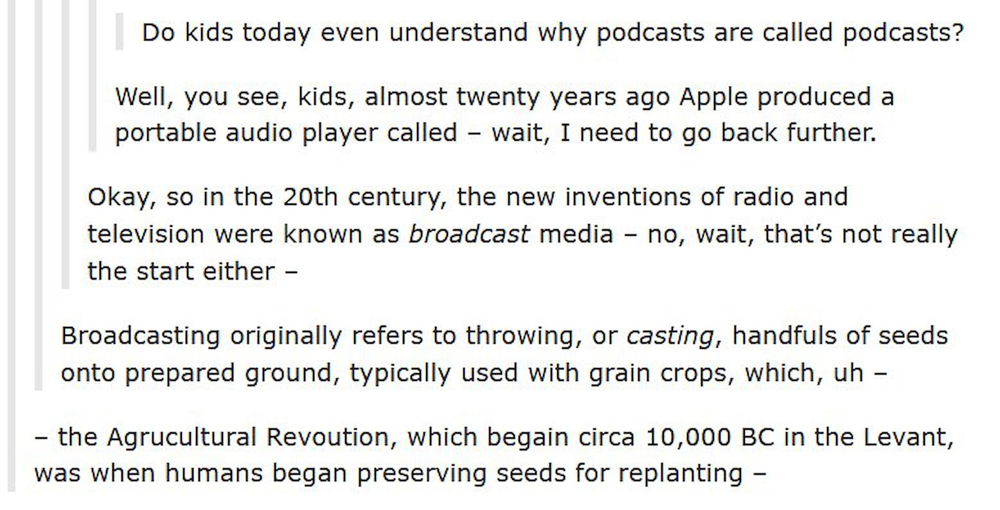

_Welcome to [The Curtain](http://guscuddy.substack.com/), a weekly newsletter exploring culture, theatre, film, arts, and the internet. It’s written by me, [Gus Cuddy](https://guscuddy.com/). New reader? [Subscribe for free](https://guscuddy.substack.com/subscribe)._

[Subscribe now](https://guscuddy.substack.com/subscribe?)

---

++

#### The USPS, Algorithms, Profit, and the Arts

 

_art by [Kyutae Lee](https://www.behance.net/kokooma)_

++

We knew it might come to this. Republicans and libertarians have long fantasized about privatizing the Postal Service. We're beginning to see that dream kick into action, as sweeping organizational changes are enacted that threaten the future of the Postal Service. Service is slowing down to a crawl; this will almost certainly affect the upcoming election, [as the USPS warned 46 states](https://www.washingtonpost.com/local/md-politics/usps-states-delayed-mail-in-ballots/2020/08/14/64bf3c3c-dcc7-11ea-8051-d5f887d73381_story.html).

The Post Office, of course, [is fundamentally pretty socialist in the best way](https://www.jacobinmag.com/2020/05/post-office-usps-coronavirus-universal-public-service)—it's the sort of thing that's not supposed to exist in America. It stands out in the year 2020 as being anti-profitable, which is one of the things that makes it so wonderful: a service provided to everyone in the country for the good of the people and nothing else. The Postal Service, too, feels strikingly anti-technology in a refreshing way: it's quite inefficient to have people pick up letters and send them to other parts of the country, but god damn it that's what it's going to be. In a society that worships at the altar of efficiency and technological progress, it feels important to have something like the Postal Service. As I’ve written about before, [the unprofitability is part of the point](https://www.guscuddy.com/unprofitability) when it comes to theatre: the same is true for the USPS.

In the UK, the kind of incredible chant of "FUCK THE ALGORITHM" [was heard at a protest the other day](https://twitter.com/carolecadwalla/status/1295277889412304897) against the results of students' A-Level exams, which were outputted by a new algorithm that downgraded many students' scores. (I don't pretend to understand how the UK school system works entirely, but these scores get you into universities—in other words, the whole thing is messed up.) This is a chant for the future if there ever was one. (It's not [the](https://algopop.tumblr.com/post/150353158103/new-aesthetic-when-your-boss-is-an-algorithm) [first](https://algopop.tumblr.com/post/88471225798/london-black-taxi-protest-against-uber-central) protest against an algorithm, however.) As I've written about before, algorithms control so much of how we interact with technology; the rise of TikTok—and its "value"—is in its incredibly innovative algorithm. (Add to innovative disturbing and data-harvesting, as demonstrated in the meme below.) They are also inherently political, often having [troubling racial biases](https://themarkup.org/google-the-giant/2020/07/23/google-advertising-keywords-black-girls) programmed into them—programmed by people, that is, who are reflecting entrenched systemic racism.

 

###### _algorithms are relentlessly powerful_

It would be hard to find something more fit for the term "anti-algorithmic" than a service like the United States Postal Service. Here's a slow, inefficient, analog organization: all things the algorithm despises. It does not harvest data; all you have to do is drop a piece of paper in a big box, and it will—by people—get picked up, sorted, and eventually—if all goes right—get delivered to its destination scrawled on the front. In other words, the USPS resists the lure of technology to maximize profits.

In this way, the Post Office is a lot like all great art, and particularly reminiscent of live theatre. As we move forward into technology playing a greater and greater role in our lives, there are some things that just don't play nice with automation—and that's OK. There are some things that require humans, hands, brains, movement, bodies, breath—and others that don't. Some things speed up culture to the point of subsuming us—and others slow us down. I'm not anti-technology, I think that some algorithms can be used for good; but right now, they also represent a type of American maximalism that ignores the capacity for slowness, stillness, and compassion. The Post Office needs to be saved—along with the unprofitable, anti-algorithmic Arts—because it's essential, both for our lives and for our souls.

---

## 🗒 notes from the week

#### [Soraya McDonald on what it will take to put more writers of color on Broadway](https://theundefeated.com/features/how-to-get-more-black-on-broadway/)

Enjoyed Soraya Mcdonald's [big piece](https://theundefeated.com/features/how-to-get-more-black-on-broadway/) on getting more plays made by BIPOC artists on Broadway, and it's worth a read. Ultimately, she breaks down where change needs to happen into four categories: the actual plays, the leadership picking those plays, the new play development process for those plays, and the audience seeing those plays. Change needs to be addressed in all those areas—but it won't be easy: in the 2019-20 season, only 3 plays by Black artists premiered across Broadway’s 41 stages.

McDonald speaks with many great artists and leaders on what it's going to take. One of my favorite examples is re-examining the canon:

> “The fact that Glass Menagerie is done everywhere, and Amen Corner \[by James Baldwin\] is not, is a testimony to white supremacy and the suppression of Black voices,” said Whitney White, who recently won an Obie award for her direction of Our Dear Dead Drug Lord and directed Baldwin’s The Amen Corner for the Shakespeare Theatre Company.

As McDonald notes, race is tied to risk on Broadway—a disturbing idea that is a symptom of each of the categories she points out. Change will require a systemic overhaul, though I'm not holding my breath for Broadway, where money is the primary driver for every producing decision. Theater's entire relationship to capital needs to be rethought—along with the audience, organization, and development restructuring that needs to happen—before we're going to make any progress in an industry that can't stop tripping over itself.

---

#### Do You Support Federal Aid?

 

47% of people support giving federal aid to live theater, versus, say, 57% that support it for airlines. (Nonprofit arts orgs also comes in at 57%, though I'm not sure how they are defining that versus live theater.)

[(Source)](https://variety.com/2020/film/news/federal-aid-theaters-concert-venues-performance-review-survey-1234736825/)

---

#### So you wanna know about the word "Podcast"? Oh boy...

 

the way the internet intermingles with language and history is amazing!

---

#### And the rest...

*   [How Social Justice powerpoints took over Instagram](https://www.vox.com/the-goods/21359098/social-justice-slideshows-instagram-activism) by co-opting design aesthetics from brands
    
*   [Museums and...bowling alleys can open](https://www.nydailynews.com/coronavirus/ny-coronavirus-cuomo-museums-gyms-bowling-alleys-20200814-iy4vt75ezje2da4vgailzgiyzq-story.html). But theaters? Hell no!
    
*   At Berkeley Rep, [actors are still having to advocate for their full contractual pay from plays shut down in March](https://www.kqed.org/arts/13884427/actors-advocate-for-full-contractural-pay-after-pandemic-forces-play-to-close). The disempowerment of working-class actors in this industry is astonishing.
    
*   [Live performance returns in New York, as HERE and the TEAM announce intimate outdoor shows](https://www.americantheatre.org/2020/08/14/live-theatre-returns-to-new-york-bushwick-to-be-precise/)
    
*   [Helen Shaw and Maya Phillips talk the evolution of theatre during COVID on WNYC](https://www.wnycstudios.org/podcasts/takeaway/segments/evolution-live-theater-during-pandemic?utm_source=tw&utm_medium=spredfast&utm_content=sf126938159&utm_term=TheTakeaway&sf126938159=1)
    
*   [TheaterWorks in Hartford has switched to the Netflix model: only monthly subscriptions from now on, based on new "theatrical experiences" each month](https://www.courant.com/ctnow/arts-theater/hc-ctnow-theaterworks-switches-to-new-membership-model-20200815-oxwtritgkjewfcxe5e37vdqvse-story.html). At least this is kind of interesting!
    
*   [Epic and Apple, two evil companies, engage in a battle royale](https://www.vox.com/recode/2020/8/13/21366340/fortnite-epic-apple-app-store-ios-antitrust) (for those interested, [Fortnite’s video accusing Apple was pretty hilarious](https://twitter.com/JordanOloman/status/1294001944047095812?s=20))
    
*   Ah, yes: [Instagram faces lawsuit over illegal harvesting of biometric data](https://fortune.com/2020/08/12/instagram-lawsuit-biometric-data/?utm_source=Baffler+Readers&utm_campaign=26291a0ce5-02152020_FH_COPY_01&utm_medium=email&utm_term=0_3541d01f8a-26291a0ce5-46805096)
    

---

## 🍂 end note

 

_art by katayama bokuyo_

++

_That’s all for this week! Thanks so much for reading. If you haven’t yet, [subscribe](https://guscuddy.substack.com/subscribe)._

_The best way to support my work is to forward this email to someone else you think would enjoy it. It means a lot to me. [You can also support me directly by donating](https://givebutter.com/thecurtain)._

[Share](https://guscuddy.substack.com/p/the-curtain-69-interactive-digital?token=eyJ1c2VyX2lkIjo4NzM1NjEsInBvc3RfaWQiOjg0MDY4NCwiaWF0IjoxNTk3ODI1ODg4LCJpc3MiOiJwdWItMjc1MSIsInN1YiI6InBvc3QtcmVhY3Rpb24ifQ.m6PNBBKvDMZxW9iyIg7_B7Ze-_rnloZBjOR5reJDWx8&utm_source=substack&utm_medium=email&utm_content=share&action=share)

_As always, you can access the entire archive [here](http://guscuddy.substack.com/archive)._

_You can reply directly to this email and I’ll receive it. So feel free to do that about anything. I love to hear back from people._

_Have a great week, and see you next time!_

\-Gus