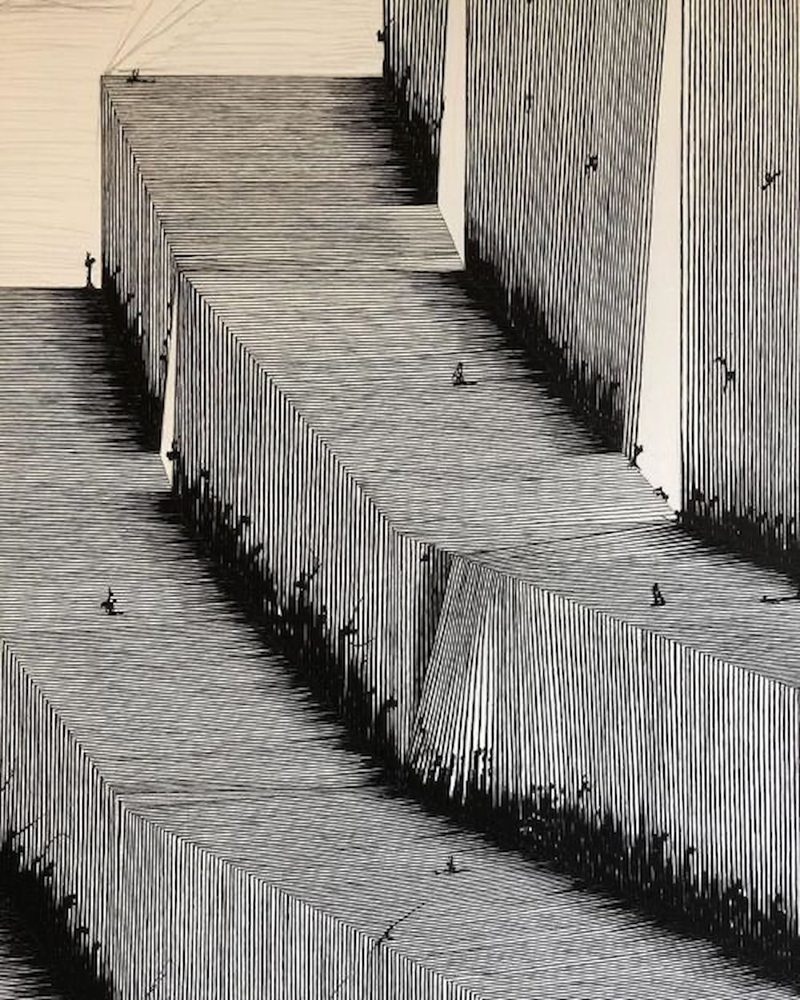
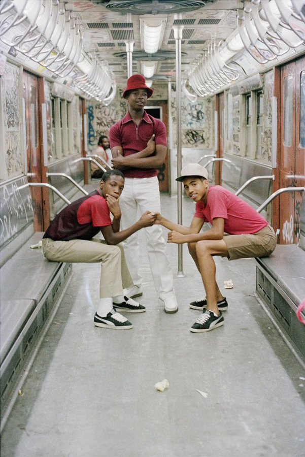
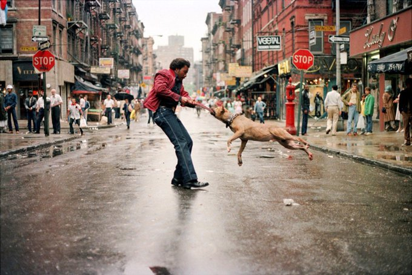
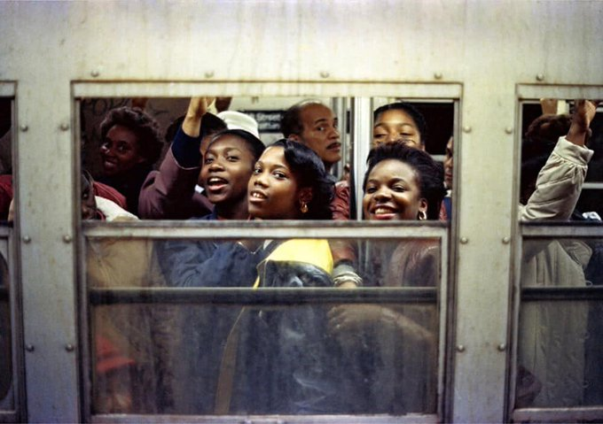
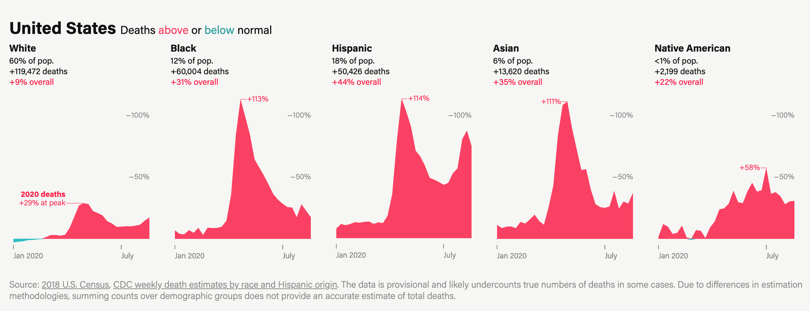
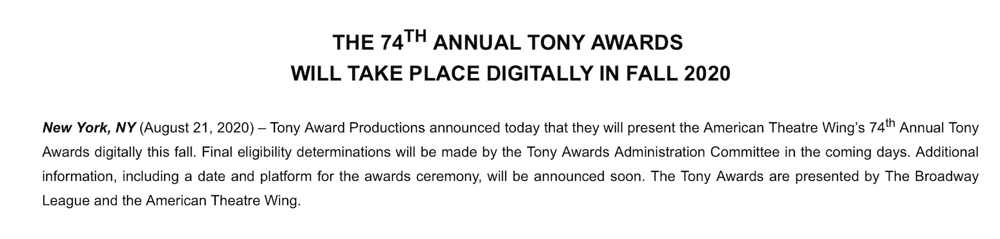
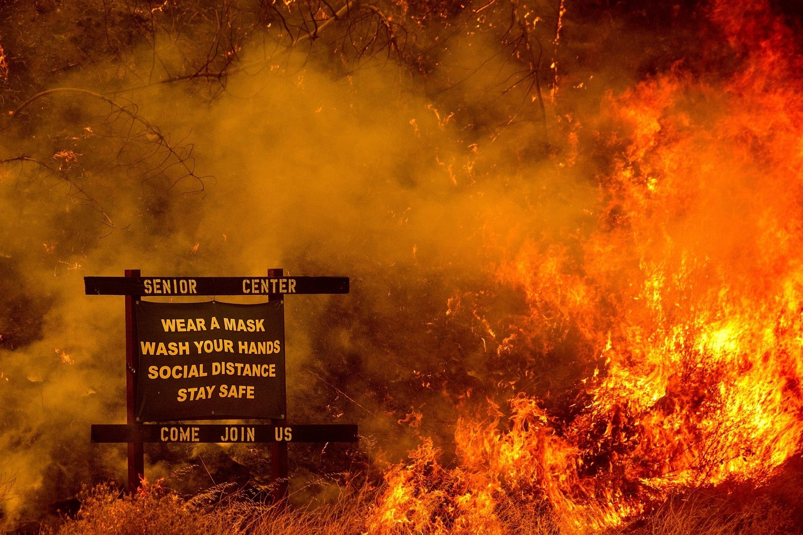

_Welcome to [The Curtain](http://guscuddy.substack.com/), a weekly newsletter exploring the intersection of arts, culture, the internet, and the future. It’s written by me, [Gus Cuddy](https://guscuddy.com/). New reader? [Subscribe for free](https://guscuddy.substack.com/subscribe)._

---

Hi friends,

A quick but important note to kick things off: [I've turned on optional payments for](https://guscuddy.substack.com/subscribe) _[The Curtain](https://guscuddy.substack.com/subscribe)_.

Like so many people, I've been relying on unemployment benefits and remote side gigs to carry me through this year. If you enjoy reading my work and can afford it, it would mean a lot to me if you considered becoming a paying Subscriber. Down the road there will be additional benefits to those who subscribe, but as of now it's just a quiet way to show support. If you can't afford it or don't have any interest, no sweat. Nothing will change with these newsletters. The suggested price is currently $4/month—but you can give more than that if you really want to!

[Subscribe now](https://guscuddy.substack.com/subscribe?)

Again: this weekly newsletter will always be free.

Ok, onto this week's issue!

---

#### Is this the end of cities?

 

###### _art by tim maxwell_

My social media feeds have been ablaze recently with a debate over the future of New York. Viral articles and tweets have taken sides over whether New York is "dead" or whether it’s merely hibernating. Many New Yorkers take special pride in the "resilience" of the city: it's taken many punches, they say, and comes back stronger each time. So: Is it dead? Is it going to be back better than ever? Is it going to return to the 70s and 80s? Is it going to become even more unlivable? Jerry Seinfeld, from one of his many mansions, [penned an op-ed in the New York Times](https://www.nytimes.com/2020/08/24/opinion/jerry-seinfeld-new-york-coronavirus.html) affirming that old "New York can pull through anything" energy. But Jerry Seinfeld is a near-billionaire—it's easy for him to write nostalgic mythologizing about New York's greatness. Meanwhile, beyond the gossip of rich people leaving New York for Florida, many working-class folks have been forced out of a job and even been forced to leave the city, if they're able.

To be clear, in many ways, New York is, in fact, great. There's a vitality to the city that makes it so attractive to so many people. But it's also a city that pushes [tens of thousands onto the streets, houseless](https://www.coalitionforthehomeless.org/basic-facts-about-homelessness-new-york-city-data-and-charts/). It's a city where, if you're not wealthy, have a high-paying job, or are bankrolled by your parents, the dominant struggle and stress in your life are to scrounge enough money up to pay rent. Wealthy folks have no right to declare New York "dead"—[wealthy Upper West Side families leaving New York](https://nypost.com/2020/08/08/nyc-moms-fleeing-upper-west-side-amid-crime-and-chaos/) because they can't be served by low-wage laborers [doesn't make a city dead](https://twitter.com/thesarahyork/status/1295387655639769089). But wealthy folks like Jerry Seinfeld or [Mark Cuban](https://twitter.com/mcuban/status/1295025149561966616) also can't declare a city "alive" that is designed to only serve people like them and to disenfranchise the poor. What they call "revitalize" others call "gentrify"; New York has been unlivable for many people for many years now—we don't need rich people to assure us that it's going to all be OK because they own property there.

For artists, I'd love to say that New York will return to some of what it was in the 70s and 80s, a place where people could actually start a theater, start a company, and/or be an artist. But that's a delusion. The city isn't returning there partly because capital operates in much more sinister ways; for one, billionaires now roam the planet, and there's much more money tied up in New York as an international hub. COVID-19 has taken lives, and entire industries—theaters and restaurants are folding left and right. And without a government bailout, there's not much of a reason to think that that will change. But the other significant difference between 2020 and the 70s/80s in NYC is the massive technological infrastructure now in place to render geography less and less relevant. Remote work and the internet makes it feasible for folks to move out of the city now and not be tied down geographically.

Which begs the question: what even is a city anymore? It's not the first time we've asked this question. After World War 2, deindustrialization saw the city being brought into question; no longer industrial manufacturing centers, they had to transform into something else. The proliferation of cars and subsidized housing in the postwar era led to masses of people moving out of cities and into the suburbs. As writer Drew Austin points out in his [excellent urbanism newsletter](https://kneelingbus.substack.com/), this reflects what's happening today: the technology for remote work, which has existed for a while, is finally being pushed into widespread use by a crisis. For those who can afford to do so, leaving the city is pretty straightforward. No longer are we constrained by geography—logging onto Zoom is the new version of commuting via the New Jersey Turnpike. ([As Venkatesh Rao wrote in 2012](https://www.ribbonfarm.com/2012/09/27/cloud-mouse-metro-mouse/), "the cloud is the new countryside.")

But while the internet enables new avenues of connection, new ways of working, and begins to level the playing field of geography, there's still so much left unanswered. For artists, there are ways of using the internet that are exciting—but they don't replace the live experience. Personally, I have faith that cities will grow and adapt—as they always have—but what and _who_ that future includes is still up in the air. New York theatre could become even more expensive and exclusive, as Broadway theaters are the only ones that can survive such a severe economic downturn. Mid-sized cities could become more popular, where it's possible (in some places) to reasonably survive and be an artist on the side. Or, the reverse could be true: despite Jerry Seinfeld's best wishes, the rich might clear out of New York, rents might drop, and the people that stuck around (despite spending New York prices to log onto Zoom meetings) might be rewarded. As the city learns to become a city again, they might be able to put their mark on a blank(ish) slate—prioritizing live, enmeshed human interaction over remote living. The future of live arts in big cities, in this way, is entirely up in the air; it will persist—that I'm sure of—but in what form and in what way remains to be seen.

---

## 🗒 notes from the week

#### [Incredible Photos of late 70s/80s New York](https://twitter.com/DrinkSolaPop/status/1297975882162864128)

 

[These](https://twitter.com/DrinkSolaPop/status/1297975882162864128) are from the great Sola Olosunde, who I've featured on The Curtain before. [His Twitter](https://twitter.com/DrinkSolaPop) is essential if you're interested in the history of New York. The New York Times recently did [a small feature](https://www.nytimes.com/2020/08/12/nyregion/olosunde-black-new-york-history.html) on him that was lovely, as well.

---

#### COVID-19's effects on communities of color

Deaths in the U.S. have gone up 9% for white folks this year. [The story is different for communities of color](https://www.themarshallproject.org/2020/08/21/covid-19-s-toll-on-people-of-color-is-worse-than-we-knew):

 

---

#### The Public Theater Appointments

[News this week at The Public Theater](https://twitter.com/PublicTheaterNY/status/1296132102186991616): Saheem Ali is now an Associate Artistic Director/Resident Director and Shanta Thake is also an Associate Artistic Director/Director of Artistic Programs, as the table is set for deeper organizational changes.

---

#### [Has Self-Awareness Gone Too Far in Fiction?](https://www.newyorker.com/books/under-review/has-self-awareness-gone-too-far-in-fiction)

This is from [a perceptive book review](https://www.newyorker.com/books/under-review/has-self-awareness-gone-too-far-in-fiction) of Naoise Dolan's _Exciting Times_, by Katy Waldman, discussing Dolan in reference to the hyper-popular Sally Rooney:

> Revealingly, both \[Sally\] Rooney and Dolan propose **a hazy link between characters’ self-hatred and their class**. Ava, whose family in Ireland is barely making ends meet, craves the privileges that Julian and Edith take for granted. Frances, a poet with cash-flow problems, insinuates herself into the lives of Melissa and Nick, a well-off couple … I suspect that if some readers distrust the sincerity of Rooney’s politics, it’s for the same reason that I bridle at Ava’s self-loathing. Perhaps these readers sense that the characters’ economic disadvantages, like their psychological struggles, don’t serve a broader argument but, rather, clatter onto a kind of competitive scoreboard. **Inequality reduces to a lightly sketched handicap for people who are already perfect according to all the metrics that it is fashionable to care about.**

---

#### The Mail

Jumping off [last week's essay](https://guscuddy.substack.com/p/the-curtain-70-the-usps-algorithms) about the Post Office, I highly recommend Aaron Gordon's new pop-up newsletter, [The Mail](https://themail.substack.com/), which is devoted to covering the USPS through November. Gordon ran a remarkable newsletter about the New York City subway system for a while called [Signal Problems](https://signalproblems.substack.com/)—which is worth perusing as well.

---

#### Tidbits from the week

—**Podcasts make money**:

https://twitter.com/noahmittman/status/1296068313446055937?ref_src=twsrc%5Etfw%7Ctwcamp%5Etweetembed%7Ctwterm%5E1296068313446055937%7Ctwgr%5E&ref_url=https%3A%2F%2Fmymind.host%2Fembeds%2F0000000000B00000000tMG

—This year's **[Tony Awards](https://www.tonyawards.com/news/74th-annual-tony-awards-will-take-place-digitally-fall-2020/) will be held completely online**, it's finally been announced:

 

—[Engadget writing about](https://www.engadget.com/live-theater-streaming-gamiotics-020029084.html) **[interactive Zoom theatre](https://www.engadget.com/live-theater-streaming-gamiotics-020029084.html)** [created by the dude who did the Puffs musical in New York is... interesting.](https://www.engadget.com/live-theater-streaming-gamiotics-020029084.html)

—[Why are there](https://www.nytimes.com/interactive/2020/08/20/movies/criterion-collection-african-americans.html) **[so few black directors in the Criterion Collection](https://www.nytimes.com/interactive/2020/08/20/movies/criterion-collection-african-americans.html)**[?](https://www.nytimes.com/interactive/2020/08/20/movies/criterion-collection-african-americans.html) This is a great read and excellent reporting. I don't think it's completely fair to pretend that canon-making falls entirely at the feet of Criterion—though they certainly need to be held accountable. As film critic Glenn Kenny [wrote on Twitter](https://twitter.com/Glenn__Kenny/status/1296768532127129600), "that's on us" (meaning critics).

—**[What should a museum look like in 2020?](https://www.vanityfair.com/culture/2020/08/what-should-a-museum-look-like-in-2020)** From Kimberly Rose Drew. Meanwhile, The Whitney [canceled their upcoming show](https://www.artnews.com/art-news/news/whitney-museum-mutual-aid-show-controversy-1234569232/) that was stealing artwork from black artists...

—**[Jenna Wortham](https://www.nytimes.com/2020/08/25/magazine/black-visions-collective.html)** [NYTimes feature on the](https://www.nytimes.com/2020/08/25/magazine/black-visions-collective.html) **[new wave of black activists](https://www.nytimes.com/2020/08/25/magazine/black-visions-collective.html)**. Obviously self-recommending.

---

## end note

 

_photo taken from a [jeremy o. harris tweet](https://twitter.com/jeremyoharris/status/1296512860852453377)_

_we're still in Northern California, where the fires are scary. As of now, we're OK—we just can't go outside because of the air quality._

++

_That’s all for this week! Thanks so much for reading._

_You can [subscribe](https://guscuddy.substack.com/subscribe) to The Curtain for free. If you really like it, [consider becoming a paying supporter.](https://guscuddy.substack.com/subscribe)_

_You can also support my work by forwarding this email to a friend. It means a lot to me!_

[Share](https://guscuddy.substack.com/p/the-curtain-71-the-end-of-cities?utm_source=substack&utm_medium=email&utm_content=share&action=share)

_You can reply directly to this email and I’ll receive it. So feel free to do that about anything. I love to hear back from people._

See you next week,

\-Gus