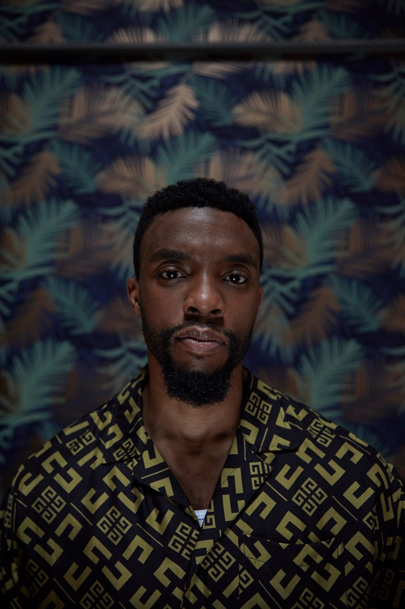
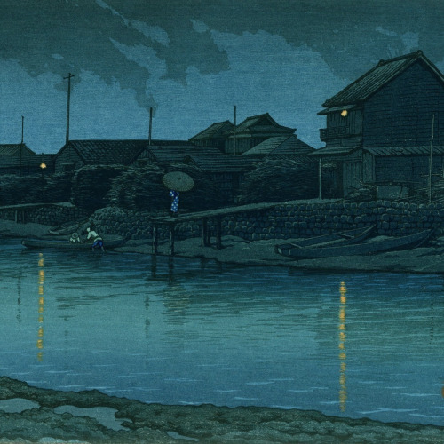

_Welcome to The Curtain, a weekly newsletter exploring the intersection of arts, culture, the internet, and the future. It’s written by me, [Gus Cuddy](https://guscuddy.com)._

---

Hey friends,

Hope you’re doing well!

Thanks so much to all those who chipped in last week and supported _The Curtain._ It means so much to me. As a reminder, if you like these emails and can afford it, [you can become a “subscriber” for as little as $4/month or $40/year](https://guscuddy.substack.com/subscribe). (A full heads-up: as of this moment, it acts mostly as a donation—the only email I send out every week is still this one, and it will remain free to consume.)

[Subscribe now](https://guscuddy.substack.com/subscribe?)

---

## 🗒 Notes from the Week

### Basketball, Strikes, Race, and Consciousness

After I sent out [last week's](https://guscuddy.substack.com/p/the-curtain-71-the-end-of-cities) newsletter, some incredible things happened: namely, [the Milwaukee Bucks decided to wildcat strike](https://www.newyorker.com/sports/sporting-scene/the-exhilarating-jolt-of-the-milwaukee-bucks-wildcat-strike), not coming out for their Game 5 vs. the Orlando Magic (a game, and series, they were expected to win easily). Strikes like this in major American sports have very little precedent—Bill Russell did it in the 60s—and it caught the owners and organization off-guard. For a few moments, it seemed like the players could issue in a nationwide general strike, as sports players across different leagues refused to play their games. Sports and radical politics were melding! But after a couple of days, and a talk with Obama, things returned to pretty much normal: the Players' Union and the NBA agreed to resume the playoffs, with a few concessions (the notable one being that NBA stadiums would be turned into voting centers for the upcoming election).

—⛹🏾‍♂️ Over in the New York Review of Books, [Jay Caspian Kang](https://twitter.com/jaycaspiankang) recently [reviewed basketball writer Robert Scoop Jackson's new book](https://www.nybooks.com/articles/2020/09/24/nba-basketball-dont-lie/) _[The Game Is Not a Game](https://www.nybooks.com/articles/2020/09/24/nba-basketball-dont-lie/)_. King wrote [a stunning essay](https://www.nybooks.com/articles/2020/09/24/nba-basketball-dont-lie/), one that touches on the ways in which white writers clumsily create myths around a predominantly black game—and the subsequent politics that have been built around the production of the sport. The divide is evident to almost anyone: there's a (mostly white) ownership and management class, and a (mostly black) players class. Add to that a (mostly white) class of writers who eat and breathe the game with stats and analytics, and a large white, liberal fanbase (amongst a very diverse set of people that watch and love basketball). For these white fans and writers, Kang argues, there exists a sort of "triple consciousness":

> They love basketball in part because it **allows them access to Blackness**. This, however, comes with **guilt and discomfort**, which gets **processed into a monolithic and easily accessible politics of what these days is called “allyship**,” which then needs to be codified and **rubberstamped by the esteemed white men** who know the players the best. Popovich and Kerr serve as models for white allies. Underlying all this is **a pressing need to understand Black people**.

—🏀 [This conversation](https://nplusonemag.com/online-only/online-only/inadvertent-general-strike/) between Andrew Liu and Elias Rodriques in n+1 is also worth reading, exploring how the Bucks almost caused an “inadvertent general strike.” Indeed, it seems the Bucks didn’t conceive of what they in terms of collective action, and many players insisted on still using the word “Boycott” instead of the correct term “strike”. But the meat of the conversation was around how we think about sports and politics, which led to this disturbing insight from Liu:

> In the NBA, impossible feats of human agility and strength are ceaselessly transformed into abstract quanta of value, accumulated and tallied like national GDP, and then pitted against one another in displays of regional pride…Unlike most commodities, labor here is not concealed behind the factory walls but publicly staged for mass consumption: a workforce of (mostly) Black employees organized into a division of labor and supervised by a (mostly) white management and ownership class.

—💻 And I enjoyed the Jason Concepcion [NBA Desktop take](https://t.co/XLfld9wnAC), which is always worth watching, this week bringing on fellow Ringer staffer Tyler Ricky Tynes (and, unfortunately, one of the few black writers that works there). [As Concepcion tweeted](https://twitter.com/netw3rk/status/1299021669328015361), “it’s notable to me this strike is about nba players essentially saying 'stop killing black people' and a lot of the response is 'how'”

---

### Chadwick Boseman

 

—I was as shocked and devastated as anyone to learn that Chadwick Boseman passed away at the age of 43 after a four year private battle with colon cancer. The thing that I, and many others, keep coming back to is how he did all this in the last four years while battling a deadly disease—while having a disability. I know I don't have the correct language to talk about this eloquently; I'm in a learning process about my language when it comes to ability and disability. But the fact that Chadwick played one of the most important, iconic superheroes of our time while privately dealing with this is heartbreaking; as many have noted, if he would have been public with this the Marvel/Disney machine may not have cast him.

https://twitter.com/BlackDisability/status/1299534563815948294

—🙅🏿‍♂️ If you haven't read them, [director Ryan Coogler's words on Boseman](https://www.marvel.com/articles/movies/marvel-studios-black-panther-director-ryan-coogler-on-the-legacy-of-chadwick-boseman) are deeply moving—they depict an irreplaceable human being.

—🎬 On the screen, Chadwick was an underrated actor. As Richard Brody wrote in [a beautiful tribute entitled “The Lived-In Grace of Chadwick Boseman”](https://www.newyorker.com/culture/the-front-row/the-lived-in-grace-of-chadwick-boseman), Boseman's style of acting set him apart from—and above—the ostentatious performances of recent Best Actor winners:

> Boseman was an extraordinarily graceful actor—perhaps the most graceful one of his generation. His ability to generate enormous power with the appearance of minimal strain is both an art and a mark of personality, of a devotion and a humility that Hollywood values even less for its authenticity, its sincerity.

Both Brody and Wesley Morris, too, write about how Boseman's approach to bio-pic acting (he played Jackie Robinson, Thurgood Marshall, and James Brown) worked not on the typical level of mere imitation but instead on deeper, subconscious identification—one that worked with "grace" and "dignity". [Here's Morris, in the New York Times](https://www.nytimes.com/2020/08/29/movies/chadwick-boseman-appraisal.html):

> I’ll confess to finding it odd that Boseman played these three roles so quickly. It seemed at first like a joke on the movies’ ongoing obsession with stories about exceptional Black Americans or like Hollywood was too lazy to imagine anyone else inhabiting the exceptions. The truth is that Boseman actually **cornered a market with his inner elasticity** and, at least for me, **exploded the parameters of what biographical moviemaking ought to be**. With him, “seems like” mattered more than “looks like.” It was daring, and he didn’t even seem aware of the risks.

He goes on to beautifully imagine a potential future role where Boseman would have played James Baldwin:

> His loose resemblance to Baldwin is secondary to what Boseman might have done with Baldwin’s erudition and elocution. For Boseman was no impersonator. He was in his way a historian — of other people’s magnetism and volition. Excellence and leadership spoke to and sparked him. They had to. **No one approximates this much greatness without a considerable reserve of greatness himself**.

---

### The end of cities? (contd.)

[Last week I wrote about the hazy future of urban centers](https://guscuddy.substack.com/p/the-curtain-71-the-end-of-cities). All throughout the week, I've seen varying reports and data on what the hell is going on with cities.

—🏡 The New York Times [published an article](https://www.nytimes.com/2020/08/30/nyregion/nyc-suburbs-housing-demand.html) saying that demand for the suburbs is skyrocketing—there was a 44% increase in home sales for NYC's surrounding suburbs compared to last year, coupled with a 56% drop in properties sold in Manhattan.

—🤔 But others have said that these numbers are misleading, that they just represent pent-up demand that already existed and was delayed by the pandemic, [as Curbed wrote](https://www.curbed.com/2020/8/31/21404333/suburbs-housing-boom-urban-exodus-coronavirus). (They do admit, though, that San Francisco and Manhattan are exceptions—rents truly are dropping there!)

This seems to align with my belief right now: the pandemic pushed out a lot of people who had always wanted to move anyways.

—📈 Similarly, Amanda Mull [wrote a piece in The Atlantic](https://www.theatlantic.com/health/archive/2020/06/pandemic-cities-moving-remote-work/613069/) that predicts that the housing market drop in Manhattan was just an anomaly, and that there's no evidence that people who love the city have had their tastes changed. She also notes the people who have fled New York:

> In The New York Times’ analysis of cellphone location data, 420,000 people fled New York City for some period of time from March 1 to May 1. Those who left were heavily concentrated in the city’s wealthiest zip codes, especially those in Manhattan.

—🌇 Further, beyond data about rich people, many have asserted that this New York summer has felt more alive than ever:

https://twitter.com/abe1x/status/1299768740796661760

Still, it remains to be seen what's going to happen to that outdoor energy come the winter, when outdoor dining becomes much less feasible. I have long-term optimism around much of urban life re-inventing and/or re-asserting itself once again, since that's what cities have always done. But I remain skeptical that it's at all going to be easy, and that there aren't darker days ahead. I sure hope I'm wrong on that part.

---

### Theatre Corner

—📑 [Ars Nova](https://arsnovanyc.com/accountability) and [Woolly Mammoth Theatre](https://www.woollymammoth.net/we-see-you-wat) released accountability statements in response to the [WE SEE YOU WHITE AMERICAN THEATRE](https://www.weseeyouwat.com/) demands, documenting what they've done and what they commit to doing to combat systemic racism against BIPOC folks. I expect more theaters to continue to release statements like this, if they haven't already. At the very least, it's interesting to see this level of transparency from institutions; we'll see if all the internal, institutional assessing and shifting has results in the type of work we see, and how it's produced.

—🧑🏾‍💼 Following last week's [leadership news at The Public](https://www.americantheatre.org/2020/08/20/the-public-names-shanta-thake-and-saheem-ali-associate-artistic-directors/), two more predominantly white theatre instituions have made some new hires. Lincoln Center Theater [has named](https://www.americantheatre.org/2020/09/01/lincoln-center-theater-names-lileana-blain-cruz-resident-director/) Lileana Blain-Cruz as resident director, where she'll direct at least one production a year (in either their Off-Broadway or Broadway house) as well as help Bart Sherr and André Bishop select their programming. Blain-Cruz is an immensely talented director (her work on last year's _Fefu and Her Friends_ at TFANA was remarkable); I'm happy for her and hope she gets to do even more (lord knows LCT needs it). At Second Stage, Khady Kamara [has been named](https://www.americantheatre.org/2020/08/31/second-stage-names-khady-kamara-executive-director/) executive director (!), coming from Arena Stage in DC.

---

### Movies and media

—🍿 Globally, [people have apparently been going to see](https://variety.com/2020/film/box-office/tenet-box-office-international-christopher-nolan-1234753966/) Christopher's Nolan massive _Tenet_. In America, too, in the theaters that have been opened, _Tenet_ is doing surprisingly OK. But this was the movie that was supposed to re-ignite the entire business of going to movie theaters. It’s not going to do quite that, and the economics of a movie like _Tenet_ seem, well, dated. From [a recent article](https://www.nytimes.com/2020/08/28/business/media/coronavirus-movie-theaters-new-mutants.html) in the New York Times:

> The economics for “Tenet” and other megamovies work only if lots of people leave their houses and buy tickets to see them in theaters. Put another way, if people don’t return to the theaters, it may change what is available to watch — studios may have to start making less expensive films.

—🎤 Spotify is developing a [live "virtual events" feature](https://social.techcrunch.com/2020/08/26/spotify-is-developing-a-virtual-events-feature/), aiming to connect fans with artists' virtual live music events (ala live concerts). It will be interesting to see how tech companies like Spotify try to incorporate live digital experiences more into their platform—and if it will be at all successful.

---

### The Democratic National Convention's sorrow

—◼️ I loved Fintan O'Toole's [brilliant analysis](https://www.nybooks.com/articles/2020/09/24/joe-biden-election-night-day/) of the Manichaean symbolism present in the Democratic National Convention; while most American presidential elections are delivered in the "grammar" of Christianity—a sinning candidate vs one that brings salvation—the language and tone that Democrats are using is much darker than even that:

> **Light and darkness are not, for \[Biden\], rhetorical constructs, but the defining energies of our present political reality**. He truly does want voters to see the election in November as an existential and even **cosmological struggle** rather than as a normal part of the electoral cycle.

O'Toole looks at the meaning of Catholic nun Sister Simone Campbell's opening blessing as a supposed prophecy of divine creation, one that emerges from chaos—and chaos is how Trump’s America is clearly depicted. (Funny enough, it’s also how the Republican National Convention painted the Democrats’ America—but that’s for another day.) O’Toole writes: “The Democrats’ battle hymn in 2020 is a De Profundis, a cry from the depths.”

Playing off Biden's experience with grief—and looking at Jill Biden's "gothic" speech—the message they deliver is full of sorrow, strangely mixing Biden's personal experiences with the idea of a broken America; as O'Toole puts it, they "campaign more in sorrow than in anger." As he points out, though, this is different than the [toxic nostalgia](https://www.guscuddy.com/nostalgia) that was Trump's 2016 campaign, the idea that something "lost" could be brought back:

> But the point of genuine mourning is that **the thing you are grieving for cannot be restored**. The grief is an acceptance that the loss is irreparable. There is and always will be the empty chair at the table, the black hole in the chest.

That's some bleak stuff. I do recommend reading [the whole thing](https://www.nybooks.com/articles/2020/09/24/joe-biden-election-night-day/).

---

## End Note

 

_art by [Hasui Kawase](https://www.instagram.com/p/CB0TJKwKNSl/)_

//

_That’s all for this week! Thanks so much for reading._

_If you really liked it, consider becoming a paying supporter:_

[Get 20% off forever](https://guscuddy.substack.com/subscribe?coupon=85e50e8f)

_The other best way to support this newsletter is to forward it to a friend. It means a lot to me!_

**New reader?** _**[Subscribe for free](https://guscuddy.substack.com/subscribe) (just select “None”).**_

_You can reply directly to this email and I’ll receive it. So feel free to do that about anything. I love to hear back from people._

_See you next week,_

_\-Gus_