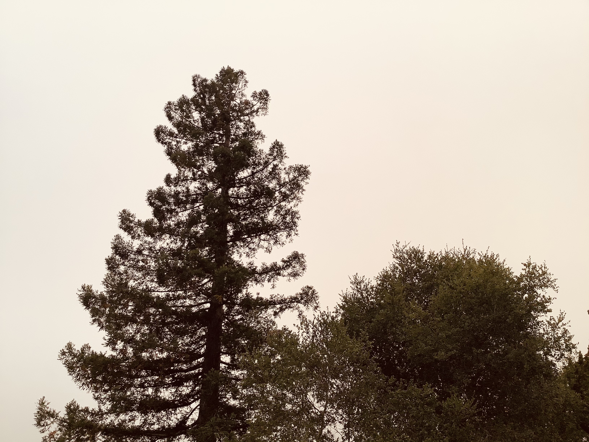

Hi friends,

_This is_ The Curtain_, a newsletter about arts, culture, theatre, and the internet. It's written by me, [Gus](https://twitter.com/guscuddy). You can read old issues [here](https://guscuddy.substack.com/archive). And if you like it, you can consider subscribing [here](https://guscuddy.substack.com/subscribe)._

++

### how do we respond? ✨

For the last six months, I’ve guiltily stayed in beautiful Marin, California as the world figuratively burned. I came out here in March, planning to stay for a week to see a show my partner Mari was in; we never left. The city that I had come from—New York—went through a deep trauma that I only experienced from afar. I missed the New York summer of outdoor relief. I wasn’t physically there for the initial protests that engulfed the city. 

Meanwhile, my hometown of Rochester, NY has been broiling with deep anger and sadness over the disgusting way in which the Rochester Police Department murdered Daniel Prude, and the inevitable ways it tried to cover it up. I’m watching from afar, again, as Rochester makes the national news over here. I surf through videos with a mix of pride and horror, as many of my friends take to the streets, only to be targeted and attacked by police. There’s a strange dissonance to seeing the places you know so well from your modest home city shown in the context of national news; it’s even worse searching through Twitter and seeing conservatives spew outright lies about the city.

In a few days, we will finally fly back to New York City and re-settle into our apartment in Brooklyn. It will be both shock and relief to return to a dense city and be part of a community. But before that can happen, in true 2020 fashion, California literalized the world’s metaphors by catching on fire and burning rapidly. 

Today, as we went outside, we were greeted by a brilliant, orange-gray sky; smoke and haze filled the hilly horizon; the cars had a layer of ash that had sprinkled down like a soft summer snowstorm. The air has been difficult to breathe because of the terrible air quality; it’s a terrible irony that, while being surrounded by nature, we had to be house-bound as if we were stuck in our New York apartment—this time not explicitly because of a disease that takes away our [breath](https://guscuddy.substack.com/p/the-curtain-55-a-collective-breath), but because of literal smoke and fire raging outdoors, not more than several miles from us.

 

\*\*

In case one hasn’t noticed, there’s a slow-motion train wreck happening with the upcoming election in less than two months: voter suppression, a struggling post office, a pandemic. Whatever happens, it’s almost certain the losing side will say the other cheated. (One side will be correct, but either way, it will be—to put it lightly—a complete mess.) No matter who wins, the political chaos will not just go away; it’s difficult to imagine things not escalating even further post-November. Perhaps most importantly, whoever is going to be president in 2021 is not going to be able to wipe 2020 under the rug and pretend 2021 will be so much “better”: the myriad forces that make up the earth, both natural and human-enabled, don’t care too much about the Gregorian calendar.

 

_all time is now, especially in the internet age._

It keeps getting thrown at us: 2020 sucks. A pandemic has affected millions, millions more are unemployed, artists can’t afford to make art anymore, the world is literally and figuratively burning, there’s an election, people are dying, systemic racism has reared its ugly head in brutal and violent ways. The list goes on.

_How do we respond_ to the overwhelming complexities of the present moment? As humans, artists, citizens, activists? As collectives, institutions, and organizations?

++

It’s important that by respond we don’t, of course, mean react. Instead, we mean to ask what, on a deeper level, are we _doing_? What does it mean to deeply, truly respond? To go beyond intellectual understanding, beyond institutional hemming and hawing, beyond mere words?

For one, on the most basic level, it means holding ourselves and our institutions to a higher standard of ethics. This goes beyond the obvious (yet neglected) zero tolerance of racism and sexism. Guess what? The future of humanity depends on each action we take. Living in the [anthropocene](https://en.wikipedia.org/wiki/Anthropocene) means that the planet—or at least our life on this planet—rests in our hands now. The world, as we conceive of it, is made up of life and complex systems that hang by strange, loose threads: these complex systems were made by people long ago, sometimes very long ago, and often rest on collective beliefs. (Sometimes called delusions.) It’s _people_ that need to enact change grounded in strong ethical foundations, from the bottom-up. Systems and institutions won’t change themselves.

Above all, _this moment_ is where we must respond from. In meditation, there’s an idea of “bare attention”: the stripping away of extraneous thought to experience a sensation in the simplest possible way, letting go of the labyrinthian complexities that the mind creates. In a certain way, this feels true for me in how we respond to these moments that make up 2020. For one, it means deeply listening: not projecting our own biases and experiences onto a moment, but seeing something clearly (i.e., racism, violence, evil) for what it is. It means cutting through B.S. institutional administrivia to respond to a moment with breath and clarity. It means demanding alertness, to be awake to the realities and vibrations of the present moment—and meeting that energy with our own actions.

Importantly, deep presence doesn’t mean ignoring complexity. By flattening out systems that operate in many dimensions, we only serve to further ignorance. Instead, responding to this moment means approaching the relentless entanglements of daily life with a fresh vision—with dignity and respect, rather than shying away. By radically opening up, we also give credence to one of the most frightening ideas for us to approach, one that undergirds all personal change: the notion that we may be wrong. The endless now, then, becomes a perpetual well for learning, engagement, and action.

---

## 🗒 notes from the week

#### [New York City, Broadway, and the catch-22 of cashflow](https://www.washingtonpost.com/entertainment/theater_dance/new-york-city-cant-rebound-without-broadway-and-broadways-road-back-is-uncertain/2020/09/07/f3933444-e939-11ea-970a-64c73a1c2392_story.html)

Peter Marks wrote [a widely shared piece in the Washington Post](https://www.washingtonpost.com/entertainment/theater_dance/new-york-city-cant-rebound-without-broadway-and-broadways-road-back-is-uncertain/2020/09/07/f3933444-e939-11ea-970a-64c73a1c2392_story.html) on what's required for Broadway to return, and its economic entanglement with New York and tourism:

> The needs, though, of musicals and symphonies and ballet companies are profoundly intertwined with other amenities, like restaurants and hotels, being back in full swing, too. As one arts leader, speaking on the condition of anonymity because of the sensitivity of the issue, observed: “The city can’t come back without Broadway. But Broadway can’t come back without the city being somewhat what it was before.”

My favorite lol moment of the whole article, though, was this gold nugget:

> And then, of course, lowering ticket prices to lure audiences back may also mean negotiating temporary salary reductions for the various unions. “Is there going to be a robust dialogue about pay rates? Of course there is,” Schumacher said. “But people want to come back to work and be safe.” However, Actors’ Equity’s Shindle said that pay cuts “have not been discussed with us.”

Thomas Schumacher is, of course, the president of Disney Theatrical Group, an absurdly powerful and rich producing group contributing to the ludicrous commodification of $200 theatre tickets. He's also chairman of the Broadway League. And he's insinuating that actors are going to need to take pay cuts. Yeah, OK.

One of the other major hurdles of restarting Broadway, logistically, is the dated layouts of some of the older theaters: small hallways, limited bathrooms, and cramped seating don't make for a welcoming post-COVID environment—not to mention the air filtration systems that they will have to invest in that apparently cost half a million dollars.

Perhaps the future of theatre really _is_ going to become more decentralized? (please)

---

#### Theatre and capital

A gross number from the [Washington Post](https://www.washingtonpost.com/entertainment/the-cost-of-hamilton-kennedy-center-paid-more-than-50-million/2020/09/04/b3ff11c2-ebb4-11ea-99a1-71343d03bc29_story.html):

> It’s no secret that the hit Broadway musical “Hamilton” has been an unprecedented boon for American theater and the performing arts centers that have hosted its popular touring companies. But for the first time since the hip-hop story of the Founding Fathers burst onto the scene, the high cost of presenting is clear. For the Kennedy Center’s 2018 run, the price topped **$50 million**.

And yet actors should be willing to take pay cuts...🤔 

---

#### Can Libraries uphold democracy?

Eric Klinenberg [makes the case in the New York Times](https://www.nytimes.com/2020/09/03/opinion/mail-voting-trump-libraries.html) for expanding early voting at libraries.

But Anne Helen Petersen, [in a piece for her great newsletter](https://annehelen.substack.com/p/vocational-awe), actually asked some librarians what they thought:

> The overwhelming sentiment: a lot of libraries already provide this service during elections. But more importantly: _libraries cannot fix fucking everything, and if we’re being asked to fix everything, pay us appropriately._ 
> 
> > “I get that libraries are becoming essentially community centers,” Alexander Dodd, an academic librarian, said. “But I don’t think they should. Librarians in the public sector are already severely under paid, over worked, and expected to essentially run as social services centers more so than libraries at this point. We shouldn’t continue just saying _hey, we need to cut out \[blank\], let’s just have the libraries handle it_. It keeps furthering this idea that libraries on their own aren’t worth the tax money and librarians aren’t really doing anything with their actual jobs. I get the sentiment, but if you’re going to ask librarians to have five jobs, pay them for five jobs!”

Not getting paid enough is becoming a theme of this week's newsletter...

---

#### RIP David Graeber

David Graber, the great anarchist writer and anthropologist, died this week. He was 59. 

Graeber's writing is indispensable, offering some of the most accessible critiques of capitalism I've read. By all reports he was a brilliant and joyful person. His loss leaves a huge hole. 

Graeber was a key player in the Occupy movements and coiner of "the 99%", as well as a writer of several mind-expanding books: _Debt_, _The Utopia of Rules_, and _Bullshit Jobs_.

_Debt_, in particular, inspired an entire sci-fi genre of [Debtpunk](https://boingboing.net/2013/07/02/strosss-neptunes-brood.html). It’s a majestic book, eviscerating myths you had in your head around money, and tracking the history of debt and why it's such a sinister and pervasive force in our society.

More words [here](https://www.nybooks.com/daily/2020/09/05/david-graeber-1961-2020/) (NYRB) and [here](https://www.theguardian.com/commentisfree/2020/sep/08/david-graeber-pushed-us-to-imagine-greater-human-possibilities) (Solnit).

---

### ✂️ snippets from the week

—Air conditioners—at least on a big building scale—are [maybe not so good](https://www.ft.com/content/839d4ccf-269f-44fe-914b-544644a4c819):

> Though the air conditioner has now become a go-to solution for keeping cool, it is an ecological disaster. Buildings use more than half of the world’s electricity, mostly for temperature maintenance and ventilation, with air cooling accounting for nearly 20 per cent, according to the International Energy Agency (IEA). Last year, it was responsible for 1 gigatonne of CO2 emissions: ironically, technology built to cool is warming the globe..

—One of the worst arts casualties of COVID in NYC is live jazz. [Smalls Jazz Club and Village Vanguard are on the brink](https://www.thecity.nyc/life/2020/9/7/21425416/jazz-clubs-new-york-pandemic-smalls-vanguard-greenwich-village).

—“[The Black Living Data Booklet](https://fjday.com/projects) (BLDB) is a manual and manifesto that exists at the intersection of art, activism, and academic work. It is meant to be used as a resource for scholars, educators, and community members to better understand and engage with Black Living Data utilizing ethical and social justice oriented practices.”

—[Shannon Matern is curating a channel on the social bookmarking site Are.na to gather instances and examples of art/theatre over videoconferencing services.](https://www.are.na/shannon-mattern/videoconferencing-art)

—Essential Diep Trans reading: [What Happens to “West Side Story” When You Remove Race?](https://tokentheatrefriends.com/2020/09/04/what-happens-to-west-side-story-when-you-remove-race/)

—[How can we pay for creativity in the digital age?](https://www.newyorker.com/magazine/2020/09/14/how-can-we-pay-for-creativity-in-the-digital-age)

---

## 🍂 end note

 

_(re [the gender reveal party with pyrotechnics that started wildfires in california](https://abcnews.go.com/US/gender-reveal-photo-shoot-pyrotechnics-caused-weekends-california/story?id=72863445))_

++

_That’s all for this week! Thanks so much for reading. If you liked this, consider forwarding it to a friend._

_You can reply directly to this email and I’ll receive it. So feel free to do that about anything. I love to hear back from people._

_See you next week,_

\-Gus