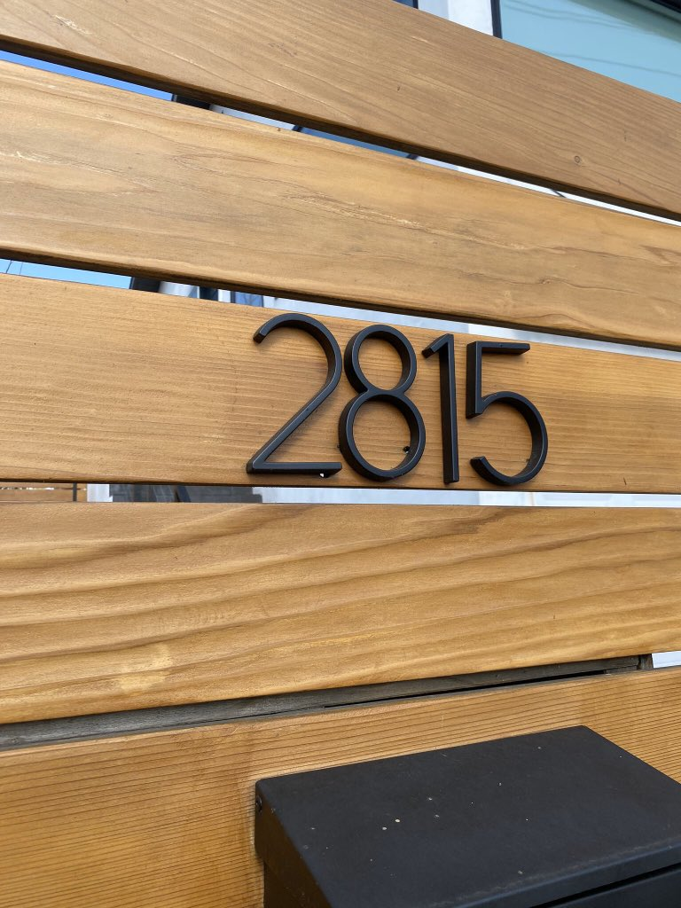

Hello all!

_It’s me, [Gus Cuddy](https://guscuddy.com/), and this is_ The Curtain, _a newsletter about things like arts and algorithms. This week I have an exploration of the effects of social media on culture, and the usual collection of notes from the week._

_You can read old issues [here](https://guscuddy.substack.com/archive). And if you like it, you can consider subscribing [here](https://guscuddy.substack.com/subscribe). If you don’t, there’s an unsubscribe button at the bottom of the email._

_Hope you’re having a lovely week!_

---

## The Experiences of the Internet: dancing with oblivion

With all the recent [drama](https://arstechnica.com/tech-policy/2020/09/everything-we-know-so-far-about-oracle-not-actually-buying-tiktok/) around the extremely popular TikTok, there’s been a lot of talk about its algorithm as its “secret sauce” that makes it so compelling. Technology writer Eugene Wei demystified what the algorithm is in an article on his blog entitled [“Seeing Like an Algorithm”](https://www.eugenewei.com/blog/2020/9/18/seeing-like-an-algorithm). Essentially, algorithms are made through machine-learning that acts on large sets of data. The bigger the dataset, the better the algorithm. TikTok is created with what Wei defines as “algorithm-friendly design”: contrary to the “endless scroll” of Twitter and Facebook, each video in TikTok takes up the entire screen—and each action you may or may not take with that video is being recorded (each second you linger, each swipe you do). They use the data they collect to create a closed-loop feedback system that gives content and collects data in an ever-growing flywheel. The reason their algorithm is so good—able to recommend content so many find immediately interesting—is because they tightly control the flow of data within their system.

This runs contrary to how other Social Networks work, because TikTok isn’t really a social network at all. That is, it doesn’t run based on suggestions from your friends and peers (i.e. your network), it runs based on their own algorithms and machine learning. In that sense, it’s a new kind of network: while networks like Facebook, Twitter, and Instagram largely rely on _people_ you _follow_ to provide content, TikTok—and other emerging internet companies—rely first on their algorithms to deliver from their global network the exact content that you will enjoy. It’s a slight paradigm shift in how we conceive of our engagement with Social Media—and our connection with the global psyche that is exposed to us online. But it only serves to deepen our total reliance on the internet for content.

~

In [Max Read’s essay in Bookforum](https://www.bookforum.com/print/2703/a-psychoanalytic-reading-of-social-media-and-the-death-drive-24171) on Richard Seymour’s _The Twittering Machine_, he asserts a fascinating idea about the “techlash” that has happened over the last decade: prevailing anti-tech ideas that social media has rewired our brains and that economic incentives commodify our attention actually don’t tell the whole story. While they may be true, they remove our own agency. Instead, we need to acknowledge that the reason we’re addicted to social media is that _it’s us_ satisfying our own psychological drives: “Perhaps the best lens to examine compulsive, unproductive, inexplicable use of social media is not technical, or sociological, or economic, but **psychoanalytic**.” In other words, we as a people are complicit in it.

Part of this complicity is less _technical_, then, and more of a psychological/spiritual/philosophical/metaphysical explosion. The move from Print to the Internet has been the restoration of what Marshall McLuhan called the “Global Village”, extending our collective consciousness to the entirety of human society and affecting “the whole psychic and social complex,” as he writes in _[Understanding Media](https://en.wikipedia.org/wiki/Understanding_Media)_. With this explosion comes an almost neurotic urge to write and express—posting tweets, photos, statuses, comments, and engaging in searches, clicks, scrolls, watching, and reading in the great global machine. Under the era of Print, there were large institutional gatekeepers that kept most people from expressing themselves in any sort of global way. But times have changed. As Read writes:

> Where the repressive systems built on print media depended on and enforced our silence, the social industry **wants us to keep writing**—and writing, and writing, and writing, rendering legible, analyzable, and profitable nearly all our basic social interaction.

~

There are many angles to approach the proliferation of the internet. One of the most popular has been what I’ll call the “Jenny Odell angle”, based on writer Jenny Odell and her popular [talk](https://medium.com/@the_jennitaur/how-to-do-nothing-57e100f59bbb)\-turned-[book](https://www.penguinrandomhouse.com/books/600671/how-to-do-nothing-by-jenny-odell/) _How to Do Nothing_, where she argues that the modern “attention economy” subsumes all notion of leisure. Unlike Read and Seymour’s lens of psychoanalysis, Odell’s focus is on the tension between the lure of the attention-grabbing internet and the slowness of mindful living and creativity. The erasure of leisure is a more Culture-oriented take on the internet; in a 1948 manifesto, German philosopher [Josef Pieper famously argued that Leisure is the basis of Culture](https://www.brainpickings.org/2015/08/10/leisure-the-basis-of-culture-josef-pieper/), that great things come from having nothing to do but contemplate and wonder. But as all of our time becomes commoditized—an economic resource that is being mined for data—we can no longer justify doing just “nothing”.

 

###### _Illustration by Maurice Sendak from Open House for Butterflies by Ruth Krauss. via Brain Pickings_

In Read’s essay, though, there’s another idea presented about Social Media that fascinatingly dovetails with Odell’s ode to Doing Nothing and Leisure-focused criticism: he asserts (through Seymour’s book) that we don’t participate in the machinery of Social Media because of pleasure maximization, but rather “the Freudian death drive—our latent instinct toward inorganic oblivion, destruction, self-obliteration, ‘the ratio’.” There’s a darkness lurking beneath our desires on the internet; “[doomscrolling](https://www.urbandictionary.com/define.php?term=doomscrolling)” isn’t just a catchy term for ceaselessly reading bad news online—it actually underlines the very act of navigating the choppy waters of Social Media. In other words, we willingly seek and crave Nothingness. And absent clicking around on the internet satisfies a particular strain of that Nothingness—a very different kind than the one Odell is presenting.

 

Part of me is both repelled and intrigued by this idea that Seymour presents. Yet the core of it rings true: there is something willfully self-destructive about repeatedly returning to Twitter and Instagram, even when we know we want to be doing other things like, say, reading a book or riding a bike. You can feel the doom as you do it—and yet you willingly move toward it. Toward _nothing_.

This kind of behavior is sometimes compared with other historically negative habits—plenty of articles online declare compulsively checking Instagram as the new smoking. In some ways, this comparison holds up: both can be destructive and addicting behaviors, for starters. But it also feels naive on multiple fronts. First, it ignores the potentials of Social Media, which despite their bullshit can be a place of opportunity, insight, and learning. But it also ignores the complex psychic wrinkles at play here, which call for greater nuance than just labeling a product as harmful for your health (as with cigarettes). Part of the problem with Social Media is not with tech companies (though blame lies there too), but with us and our collective consciousness. We _want_ to waste our time online, engage in nothingness debates online, argue about takes that will dry up in a day, endlessly click around, seek actualization from each scroll, each swipe, each tap.

But wasting time is not the same thing as Odell’s version of Doing Nothing. Wasting time in this context implies _doing_: clicking and engaging in the weird collective experiment of the world wide web, but often (especially on social media) in ways that don’t amount to anything, that return to zero. Doing Nothing, in contrast, means an acknowledgement of these psychological drives and resisting them anyways: sitting with our thoughts, letting the clouds wander by, realizing that the vast infinity of time suggested by never-ending doomscrolling is merely an illusion, that some day we will all disappear, that ecological change and global injustices don’t respond to empty Tweets but merely rumble on, that doing _something_ in our limited time on earth means not slumping towards the coffin of oblivion but instead dancing away from it.

---

## 🗒 notes from the week

#### [Live Theatre -> Digital Theatre Pipeline](https://www.americantheatre.org/2020/09/17/amazon-to-premiere-what-the-constitution-means-to-me/)

Heidi Schreck’s _What the Constitution Means to Me_ is [premiering on Amazon Prime Video on October 16th](https://www.americantheatre.org/2020/09/17/amazon-to-premiere-what-the-constitution-means-to-me/). It was captured by director Marielle Heller in the final week of its Broadway run. (Heller, in her own right, is a wonderful director: _Diary of a Teenage Girl_, _Can You Ever Forgive Me?_, and _A Beautiful Day in the Neighborhood_.)

While it’s certainly weird to see a Clubbed Thumb play eventually end up on Amazon, it’s also a joy that more people will get to experience Schreck’s work.

The theatre <-> digital pipeline continues. My question is: What’s the end goal for a piece of theatre nowadays, in producerial terms? Clubbed Thumb has now had a play work its way pretty much as far up as you can go on the theatrical foodchain, all the way to filmed version on a major streaming platform. Is this a linear path that some theaters will shoot for? (I hope not.)

---

#### 🍁 Warm Autumn Movies

It’s beginning to feel more and more like fall, a color palette best represented by [old Charlie Brown specials](https://firebasestorage.googleapis.com/v0/b/firescript-577a2.appspot.com/o/imgs%2Fapp%2Fgus%2F1vSA67AHHH.jpg?alt=media&token=ff8d7ba7-3773-49fa-aa93-51ee9e539854). Fall is probably my favorite season (except for the impending-doom thoughts of winter it brings up). I love this [Letterboxd “Autumn Sonata” list](https://letterboxd.com/showdown/autumn-sonata/), of “cozy movies”:

> the films that make you think of marshmallows roasting, leaves crunching underneath, of nostalgic moments and the romantic promise of the holiday season… of darker nights and menacing spirits…

---

#### “The Gentrification Font”

Enjoyed [this piece from Vice](https://www.vice.com/en_us/article/ep499w/gentrification-font-meme-neutrafaceRecommended):

> If there’s a definitive look to gentrification, aside from the changing faces that make up a neighborhood, it’s not just the “gentrification building” (“blocky, forgettable mid-rises”), it’s also a “gentrification fence” (horizontal wooden slats) and a “gentrification font” (sans serif house numbers). These design elements often converge into a sleek, vaguely modern aesthetic that’s ubiquitous with neighborhoods in flux, all over the country. 

 

Image

---

### ✂️ snippets from the week

—Angelica Jade Bastién: [I Am Tired of Films like Antebellum](https://www.vulture.com/2020/09/antebellum-movie-review-i-am-tired-of-films-like-this.html)

—Zendaya (!!), Watchmen, and Succession all won deserving Emmys. Zendaya gave one of my favorite screen performances last year—and she became the youngest best lead actress winner ever at 24. (Ha ha.) Also, [Ramy’s video of what happens when you lost an Emmy this year](https://twitter.com/ramy/status/1307839905599381504) is peak apocalyptic-Hollywood-chic.

—Geva Theatre, my home theater, continues to open its doors for protestors in Rochester, NY. [Diving into the Facebook comments of its recent posts](https://www.facebook.com/gevatheatrecenter/posts/10160223038816754) and seeing some of the absurd ways in which whiteness twists itself—specifically Western New York whiteness (“you won’t get a penny of my money ever again”)—is a fun time-waster.

—[User Not Found:](https://www.youtube.com/watch?v=kcCvR4y2yk8) an immersive video podcast theatre piece

—A new theatre streaming service called [Stellar](https://variety.com/2020/legit/news/goldstar-launches-live-events-streaming-service-exclusive-1234777556/).

—[“Expand the Canon” play list](https://www.hedgepigensemble.org/expand-the-canon)

---

## end note

 

##### _[art by grace lynne haynes](https://www.booooooom.com/2020/07/28/artist-spotlight-grace-lynne-haynes/)_

++

_That’s all for this week! Thanks so much for reading. If you liked this, consider forwarding it to a friend._

_You can reply directly to this email and I’ll receive it. So feel free to do that about anything. I love to hear back from people._

_See you next time,_

\-Gus
