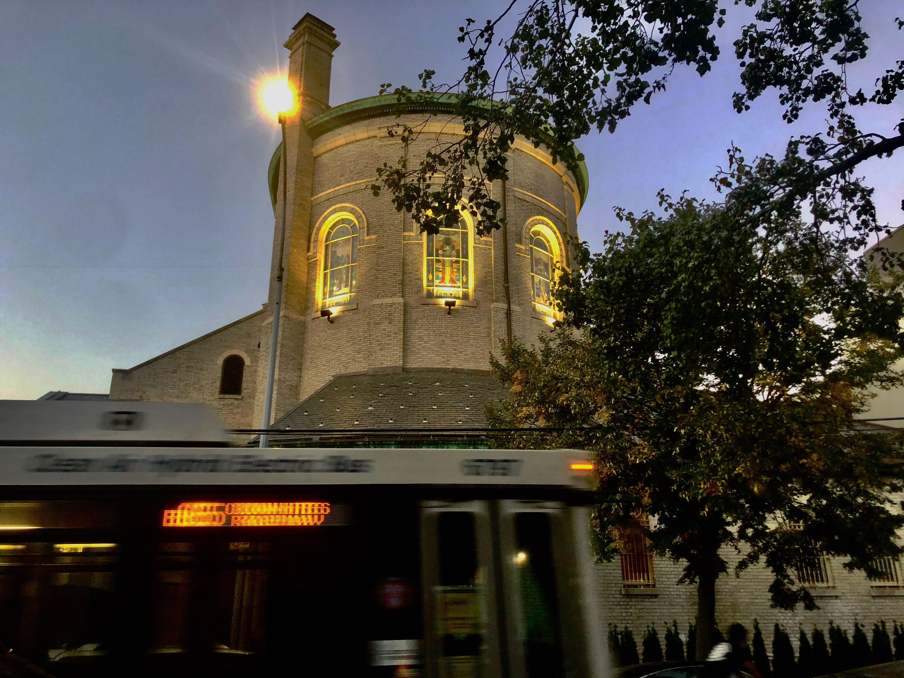

Greetings my fellow human beings—

This is _[The Curtain](https://guscuddy.substack.com/)_, and I’m [Gus](http://guscuddy.com/).

---

 

Brooklyn has been feeling spirited and alive this past week. Walking down Vanderbilt Ave and seeing the throng of people eating outside, sitting on beach chairs, blasting music – all in a pedestrianized area, all as if in synchronous vibration – can be exhiliarting. Rambling through Prospect Park in the ascending evening, I swear I see more people there – and more of a riotous party happening – than pre-pandemic times. There’s a buoyancy and lightness to the air, even as the shadow of COVID-19 still hangs over everything. And that shadow certainly lingers: it does affect a certain color of the mood, perhaps lives in the collective consciousness (though some people choose to ignore it). It’s hard not to wonder the story behind each abandoned business I see; the streets still have the lingering reality of death in their memory.

So we’re not done with this thing – not yet. Despite some of the joy making me wish otherwise, there are still serious concerns over COVID: [there’s been another spike in cases in areas of Brooklyn](https://www.nytimes.com/2020/09/28/nyregion/ny-coronavirus-cases.html). That could be a serious setback for a city and borough that feels like it just wants to be _over_ this.

That being said, I think it’s great long-term news, from an urban design perspective, that New York City has extended outdoor dining permanently – [a huge win for the reclamation of public space to people over cars](https://nyc.streetsblog.org/2020/09/25/permanent-and-year-round-mayors-restaurant-plan-is-a-long-overdue-shift-of-public-space-from-cars-to-people/). While I don’t feel comfortable sitting and doing outdoor dining at this point—and I’m not sure so many people should either, frankly—the sight of parking spaces being taken up by chairs, umbrellas and humans is undeniably uplifting, full of possibility of what this city _could_ be, like a smooth balm over rough terrain.

---

## Interactive Presentations and the Web

I loved two interactive web presentations from the New York Times this week: Jason Farago’s [“Seeing Our Own Reflection in the Birth of the Self-Portrait”](https://www.nytimes.com/interactive/2020/09/25/arts/durer-self-portrait.html) and Aisha Harris’ [“A Brief Guide to 21st-Century Blackface”](https://www.nytimes.com/interactive/2020/09/25/opinion/blackface-tv-movies-race.html). Beyond each being a great essay in their own right, they reminded me that there’s so much that we can do with how information and content is presented online. Both presentations are masterfully designed to take you on a journey as you scroll, whatever device you scroll from.

[The first](https://www.nytimes.com/interactive/2020/09/25/arts/durer-self-portrait.html), by Jason Farago, takes us through a 1500 self-portrait by Albrecht Dürer, describing how it was an important turning point in the history of art. I learned a lot from Farago’s excellent art history close read; the “feel” of the piece, though, is way better than that description – it’s akin to standing in front of a painting for a while with a warm, knowledgeable friend. There’s something deeply satisfying about taking a guided tour not of a _museum_, but of a singular _painting_. And that’s an experience that can be uniquely delivered online.

[The second](https://www.nytimes.com/interactive/2020/09/25/opinion/blackface-tv-movies-race.html) piece, from Aisha Harris, is a journey through the history of blackface in culture, in its many different forms and iterations. A cacophony of offending scenes from movies and television disturbingly appear from the darkness, along with Harris’ words. It’s a searing visual essay, well worth experiencing.

Both pieces signal to me something that I’ve become rather interested in as of late: how unique web design experiments can create different kind of “special” experiences online. These experiences can be journalistic, educational, artistic, funny, or abstract.

In [The Curtain 69](https://guscuddy.substack.com/p/the-curtain-69-interactive-digital), I briefly wrote about two excellent interactive digital media pieces that relied on different ways of using the web: [Corkscrew 4.0](https://corkscrew4pt0.com/)—a collection of online theatre experiences—and [Off the Record](https://studyhall.xyz/off-the-record/)—an “interactive narrative about the reality of working as a journalist of color”. Writing about Corkscrew’s excellent use of the internet for theatre:

> It’s not only the 90s internet aesthetic that I appreciate here—plus the visual delight of discovering the website—but that it’s an imagining of a way we can use the internet and theatre together, as opposed to one replacing the other.

Similarly, these types of interactive presentations from the New York Times—and hell, I’m sure there are many others not from the New York Times, please point them out to me—feel like fresh and original takes on how we experience things online. It’s worth noting that they bare a lot of resemblance to the New York Times’ famous 2013 feature, “[Snow Fall](https://www.nytimes.com/projects/2012/snow-fall/index.html)”, one of the most influential pieces in digital storytelling. But things have changed since 2013 – our lives have moved much more to the internet-as-frontier, and the technology has kept pace with that (both in terms of output—the tech driving design like this—and in terms of input—the ease and access of devices on which we’d consumed this kind of content). These digital experiences feel less like a novelty and more like a _necessity._

Creating innovative web presentations isn’t easy, of course – but it’s also not that hard to create a great looking web page these days, either. There are lots of little things that make presentation on the web much more pleasurable, that take it beyond just cold, dead words on a lifeless glowing rectangle. For instance, journalist Daisy Alioto just self-published an essay called “[What is Lifestyle?](https://www.whatislifestyle.com/)”, which she published on its own domain: whatislifestyle.com. (Great domain!) Despite not having any magical animations, giving a project its own entire website—complete with a “further reading” section—gives the material room to breathe. In that way, design and the internet meet to create something that feels like it has its own center of gravity. (Another much more nerdy example would be Andy Matuschak and Michael Nielsen’s [“How can we develop transformative tools for thought?”](https://numinous.productions/ttft/), which is published on its own domain as well. It also features a great example of wonderfully appealing [side/margin notes](https://www.gwern.net/Sidenotes) – a typographic convention, generally seen in physical textbooks, that moves footnotes/endnotes to the margins.)

For theaters, Zoom and audio plays seem like the major internet replacements during the pandemic. And they can be great! But I’d like to see theaters also experiment with how they present things online, like Corkscrew did. Creating unique online presentations for pieces can be as valuable and interesting as the actual “content” itself.

---

### ✂️ notes & links from the week

#### from the strange world of theatre:

*   At the Brooklyn Book Festival on October 4th — [Care and Crisis through Theatre](https://brooklynbookfestival.org/event/care-and-crisis-through-theatre-presented-with-the-whiting-foundation/): a discussion with playwrights Will Arbery, Amy Herzog, Lynn Nottage, and Michael R. Jackson, moderated by cultural critic Soriaya Nadia McDonald, “about the ways we take care of each other and ourselves during crisis, how theater can model or create those spaces for care, and the potential for care for one community to carry with it a blindness towards other communities.” This sounds cool!
    
*   [Miranda Haymon is named Resident Director at Roundabout Theatre Company](https://www.playbill.com/article/roundabout-theatre-company-names-miranda-haymon-resident-director). Another great person getting a great job!
    
*   A story of billionaires, bankers, and global capitalism: [Theater Venues could become “acquisition targets” as prompted by COVID-19](https://www.forbes.com/sites/marchershberg/2020/09/28/theaters-could-become-acquisition-targets-during-pandemic/%2378149b7b2960)
    
*   Ah, the [Volksbühne](https://www.volksbuehne.berlin/de/programm/10931/armen-avanessian-enemies-next-waves-theater-1-the-assembly/10932)! A recent Zoom theatre piece there: “political role-playing-game” – OK, yeah. “Pre-recorded _deepfakes_ of contemporary political figures—warped through the perspective of this parallel universe—are embedded into the game. The ever-evolving narratives and the incalculable outcomes will be co-created by the players and the audience” – woah.
    

---

#### some lil cultural gems:

*   [Great little piece](https://mailchi.mp/stupefy/the-rock-and-inverse-authority) on the absurdity of The Rock’s endorsement video of Biden & Harris – how it appeared as if The Rock was their boss.
    
*   [Peloton ads are self-parodies](https://mobile.twitter.com/clueheywood/status/1089699762331217920?lang=en).
    

---

#### writing advice:

> The biggest thing I’ve learned about writing is that we tend to under­estimate and marginalize the irrational, intuitive aspects of it. The difference between a so-so writer and a good one, or a good one and a great one, is in the quality of the intuitive decisions she’s able to make at speed.

— George Saunders, in _[The Paris Review](https://www.theparisreview.org/interviews/7506/the-art-of-fiction-no-245-george-saunders)_. (Oh what a lovely interview, from last winter.)

---

Till next time,

\-Gus

⪡⪢

_Thanks for reading._

_If you enjoy_ The Curtain, _consider [becoming a paying subscriber](http://guscuddy.substack.com/subscribe). It really helps me continue putting this newsletter out._

_New reader? You can browse the [archives](http://guscuddy.substack.com/archive) here._

[The Curtain](https://guscuddy.substack.com/) _is a weekly digital letter sent by Gus Cuddy._