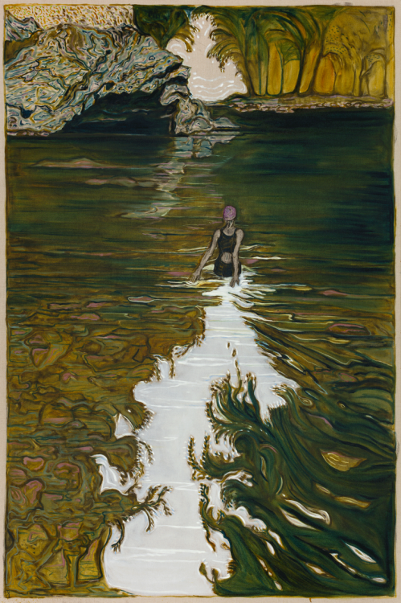

Hey all —

_This is [The Curtain](https://guscuddy.substack.com/), a newsletter about arts, theatre, and the internet. I’m [Gus Cuddy](https://guscuddy.com)._

---

### I

Another week in which nothing at all of note whatsoever happened. Everything in this country is completely normal, Satan’s scent is not stinking up the milieu, there’s nothing wrong going on whatsoever ha ha oh god

---

### II: Simple Contracts

Okay, hear me out, but I’ve been reading real, physical books more. This may sound overwhelmingly trite and obvious, but there was a period in which I actually _preferred_ digital books. Traveling, I like the ease of use and ubiquity of the Kindle, or even the Kindle app on my iPad. Hell, I have a distinct memory of finishing _Infinite Jest_ on my iPhone 5 while riding the Peter Pan Bus line from New York to Rochester. (Actually, reading the footnotes is easier with digital book hyperlinks, but I knew I was committing some deep profanity on the sanctimonious act of flipping pages that was part of the intended experience. Whatever.)

But recently, I cracked open my partner’s paperback copy of _A Little Life_ (I know, I know), and I sat in our big old puffy green chair with a little lamp next to it, and just read for two hours. Oh, man — it was kind of bliss. I’m not really saying anything revelatory here, but rediscovering the magic of paper books has been exciting for me. 

Particularly, it’s made me think about some of the things that make paper books work in 2020. There are the true cliches: the way a book smells, the texture of the page, having something — an actual analog _object_ something — in my hands, the pleasure of turning a page. (On the flip side, a point I acknowledge: digital books have been a failure, never fulfilling their potential.)

But mostly, what makes physical books so enticing is their _simplicity_. And a very particular type of simplicity: the _clarity_ of the **contract** of a physical book. I was exposed to this idea of media “contracts” from writer Craig Mod, [who points out](https://craigmod.com/essays/media_accounting/) that, when buying a physical book, we are presented with clear “edges” to the transaction: we buy it, and that’s pretty much the end of it. 

When you pick up a physical book, you have a lucid relationship with the item: it has words, and you read them. Or don’t, if you want. Or do it backwards, or upside down. Fold over the pages, scribble all over them, [tear it in half](https://www.nj.com/entertainment/2020/01/are-you-a-book-murderer-if-you-cut-them-in-half-social-media-is-on-the-pulpy-case.html). There’s no outside forces manipulating you: no digital internet tracking, no privacy problems, no wacky VPN SSH tunnels required, no invasive ads. 

In the age of surveillance capitalism, having that clarity of a contract is something of a minor miracle. Because almost everything we do on our computers and phones and devices involving the internet have implicit, uneasy contracts built into them. Sometimes these are backdoor contracts, the type of thing you might not know or think about. But they’re there, lurking. Every minute we spend on a platform like Facebook, Instagram, TikTok, or Twitter is tracked and mined for data. (In the case of TikTok, [each](https://guscuddy.substack.com/p/the-curtain-75-dancing-with-oblivion) _[second](https://guscuddy.substack.com/p/the-curtain-75-dancing-with-oblivion)_ [is fed into their algorithm](https://guscuddy.substack.com/p/the-curtain-75-dancing-with-oblivion).) Craig Mod calls these _appholes_: “any app / service / publication whose business is predicated on keeping a consumer engaged and re-engaged for the benefit of the organization (often to the detriment of the mental and physical health of the user), dozens if not hundreds of times a day.”

[As I wrote about two weeks ago](https://guscuddy.substack.com/p/the-curtain-75-dancing-with-oblivion), blaming our social media addictions on dopamine hijacking only tells part of the story; in many ways, we act in concert with social media because we have a psychological _drive_ for doom-scrolling and destruction. But it’s clear that, especially when we use any sort of “free” service like social media, or Gmail, we are actually letting our data be sold and our privacy invaded.

But with a physical book, you don’t have to worry about any of that – you’re coasting off 500 year-old technology. Digital books, on the other hand—besides often being on devices that have “appholes” on them—don’t have the same purity of relationship. Amazon could reach into my Kindle and edit a book’s contents, if they wished – [which is exactly what they did, ironically, with](https://www.nytimes.com/2009/07/18/technology/companies/18amazon.html) _[1984](https://www.nytimes.com/2009/07/18/technology/companies/18amazon.html)_.

When thinking about media, then, I’ve begun to more clearly investigate the contracts at play when I’m consuming something. Theatre, for instance, has a relatively simple contract—you come to the theater, you watch a play—but it can often get muddied by institutional messiness. Going to a movie at your local theater (do those still exist?) is a relatively simple contract; watching something on Netflix, however, is more complex. (Netflix CEO Reed Hastings, famously: [“we actually compete with sleep”](https://www.fastcompany.com/40491939/netflix-ceo-reed-hastings-sleep-is-our-competition). Netflix is _determined_ to become an engrained habit in our lives – and every decision they make is based on that drive. There are no simple contracts here.)

There’s something else to physical books that set them apart from any other sort of digital media: they operate in the strange liminal place of the imaginative. That is, when reading a physical book—especially fiction—the book operates in a place where it’s of the self, but also not quite of the self. As we read, the imagination creates and creates, forming a symbiotic relationship between the words on the page and our sense of self. The book exists entirely outside of us, but also is entirely a part of us in the act of reading. And then we put it down, by our own volition.

That’s only achievable with simple contracts, where we have a clear relationship with the media / art—only then can we can we grasp the intense, almost mystical simplicity of the imaginative.

---

### III: Arriving

I’ve been an on-and-off again meditator for a long time now. Most days I try to sit for around 15 or 20 minutes, striving to hold off apocalyptic thoughts as long as possible. Recently, though, I’ve been experimenting with extending these sits to be much longer than my brain thinks it’s comfortable with: 30 minutes, 45 minutes, even (once) an hour.

That’s because of something I’ve been thinking about more and more: the concept of _arriving_. As you sit longer, the “quality” of your sit can exponentially grow, because you might not “arrive” at the meditation till at least twenty or thirty minutes into the damn thing. I spend the first thirty minutes of a meditation flitting about, thinking every thought imaginable about what I’m going to do that day, thinking why I shouldn’t meditate for this or that length, wondering about the future of theatre or Trump or the apocalypse—oh right, not that—and then thinking meta thoughts about the mediation itself: breathe slower, feel your body, straighten your back. But after a certain while, something starts to happen, if I’m lucky: the cruft begins to wash away, and I settle into an experience that’s much deeper and more rewarding.

But it’s not really about meditation, is it? I don’t know, I find it helpful to think about this, about remembering that we can arrive at many different things, if we give them time. That sometimes our brains need to settle down from the myopic news cycles and anxiety, get to a place of existing without so much banging around. 

---

## Notes from the Week

#### theatre shenanigans

*   **[Doreen St. Felix](https://www.ssense.com/en-ca/editorial/culture/oh-jeremy)** [interviews “cultural celebrity”](https://www.ssense.com/en-ca/editorial/culture/oh-jeremy) **[Jeremy O. Harris](https://www.ssense.com/en-ca/editorial/culture/oh-jeremy)** [in SSENSE](https://www.ssense.com/en-ca/editorial/culture/oh-jeremy)
    
*   **[Playwrights Horizons](https://www.playwrightshorizons.org/about/our-new-associate-artistic-director/)** [names](https://www.playwrightshorizons.org/about/our-new-associate-artistic-director/) **[Natasha Sinha](https://www.playwrightshorizons.org/about/our-new-associate-artistic-director/)** [their new Associate Artistic Director.](https://www.playwrightshorizons.org/about/our-new-associate-artistic-director/) Another exciting hire!
    
*   The **Asian American Performers Action Coalition** [released their annual report](http://www.aapacnyc.org/) examining **representation in NYC theatre** (for the 17–18 season, I’d be interested if much changed in 18–19). It’s worth looking through the report, which includes excellent visualizations on visibility and examinations of inclusive casting. **61.5% of all roles went to** **White actors**, making them the most visible on stage, versus 23.2% to black actors, 6.8% to Asian-American actors, 6.1% to Latin actors, 2% to MENA actors, and 0.2% to Indigenous actors. Meanwhile, 79.1% of theatre produced was by White writers, while 20.8% was written by BIPOC writers. Oof.
    
*   [The new changes to the](https://www.playbill.com/article/changes-to-equity-league-health-funds-medical-coverage-require-more-weeks-of-work-for-less-coverage) **[Equity-League Health Fund](https://www.playbill.com/article/changes-to-equity-league-health-funds-medical-coverage-require-more-weeks-of-work-for-less-coverage)** make it almost impossible for unemployed Union actors to receive adequate health care – which means pretty much all of us. Equity actors now need to work at least 16 weeks to qualify for six months of “Tier 1” coverage, which is the same as the current plan “but with higher deductibles, copays, and out-of-pocket maximums”. Now, why do we tie our health care to employment in this country again?
    
*   **[Mellon Foundation](https://www.nytimes.com/2020/10/01/arts/black-theaters-funding-black-seed.html)** [to Provide $5 Million to Aid Black Theaters](https://www.nytimes.com/2020/10/01/arts/black-theaters-funding-black-seed.html)
    

#### arts & media

*   **[Disney](https://deadline.com/2020/09/disney-plans-layoffs-parks-biz-hard-hit-by-covid-19-1234588025/?mc_cid=cc289e5181&mc_eid=df7411443c)** [lays off 28,000 parks employees](https://deadline.com/2020/09/disney-plans-layoffs-parks-biz-hard-hit-by-covid-19-1234588025/?mc_cid=cc289e5181&mc_eid=df7411443c)
    
*   **SMU DataArts** released their **[Arts Vibrancy Index Report](https://culturaldata.org/arts-vibrancy-2020/executive-summary/)**, examining the top arts-vibrant communities in the United States. I love seeing the smaller communities throughout the U.S. that have been acknowledged. Like Hailey, Idaho – a small city with a population of under 25,000 people, that ranks at number four on the top small arts-vibrant communities.
    
*   [All 536](https://www.npr.org/sections/coronavirus-live-updates/2020/10/05/920367787/regal-movie-chain-will-close-all-536-u-s-theaters-on-thursday) **[Regal](https://www.npr.org/sections/coronavirus-live-updates/2020/10/05/920367787/regal-movie-chain-will-close-all-536-u-s-theaters-on-thursday)** [movie theaters will close until further notice](https://www.npr.org/sections/coronavirus-live-updates/2020/10/05/920367787/regal-movie-chain-will-close-all-536-u-s-theaters-on-thursday)
    
*   How did **S.N.L.** manage to have a live audience? Uh… [they paid them.](https://www.nytimes.com/2020/10/06/arts/television/snl-live-audience-paycheck.html#click=https://t.co/1QzFWkVG1x)
    
*   **Vox** tweeted about an episode from their podcast _**Switched on Pop**_ which covered the intertwined history of classism and **Beethoven’s Fifth Symphony**. [A shit storm followed](https://hotpodnews.com/getting-caught-in-a-shit-storm/). (yes, ben shapiro is involved.)
    
*   A wonderful **Sam Anderson** piece: [What I Learned Inside the N.B.A. Bubble](https://www.nytimes.com/2020/09/30/magazine/nba-bubble.html)
    

---

### end note

 

_art by billy childish_

⪡⪢

_Thanks for reading._ 

_If you enjoy_ The Curtain, _consider [becoming a paying subscriber](http://guscuddy.substack.com/subscribe). It really helps me continue putting this newsletter out._

_New reader? You can [subscribe for free here](https://guscuddy.substack.com/subscribe), or browse the [archives](http://guscuddy.substack.com/archive) here._

[The Curtain](https://guscuddy.substack.com/) _is a weekly digital letter sent by Gus Cuddy._

⪡⪢

See you next week,

\-Gus