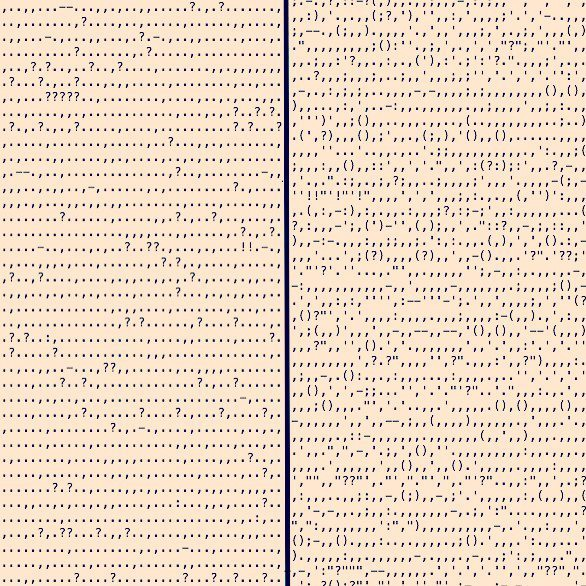

Hi friends—

_This is [The Curtain](https://guscuddy.substack.com/), a newsletter about arts, theatre, and the internet. I’m [Gus Cuddy](https://guscuddy.com/)._

Hope you’re having a good week! This week I write a bit about content, good art, and arts. Then I collect some interesting reads and links in “notes from the week”. Enjoy!

---

### Column: Prestige and Plurality

In the world of streaming video and digital content, there are two types of companies, as defined by tech writer [Ben Thompson](https://stratechery.com/2020/disneys-integration/): Aggregators (which collect content) and Integrators (which create content). These are broad strokes, but hold largely true: Netflix is an Aggregator, creating a platform that houses a huge diversity of content created by a variety of people; Disney+ is an Integrator, creating their own platform that differentiates itself from other streaming platforms by housing Disney’s own content. Both Netflix and Disney+, for obvious reasons, have been very successful this year.

But I want to focus on that ugly word that I tossed around several times in the previous paragraph: _content_. (Yuck! Just listen to it! Think about how ugly it sounds!) From a capitalistic business strategy perspective, Disney housing its own content seems good. But from, you know, a creativity and art standpoint, creating _content_ is different than creating something _good_. And boy, does Disney ever create some content! Just look at their Marvel and Star Wars franchises, which have devolved into a never-ending stream of content, spilling out in every direction. (Hell, you can even build [$200 lightsabers at Disneyland](https://www.disneyworld.eu/shops/hollywood-studios/savis-workshop-handbuilt-lightsabers/).) Critic Matt Zoller Seitz [wrote about this in 2019](https://www.rogerebert.com/mzs/avengers-mcu-and-the-content-endgame):

> “Avengers: Endgame” is not just the culmination of the 22-movie Marvel Cinematic Universe. It also represents the decisive defeat of “Cinema” by “content”.

Martin Scorsese, too, famously (and rightly) [decried the content-y-ness of Marvel](https://www.nytimes.com/2019/11/04/opinion/martin-scorsese-marvel.html): 

> Many of the elements that define cinema as I know it are there in Marvel pictures. **What’s not there is revelation, mystery or genuine emotional danger. Nothing is at risk**. The pictures are made to satisfy a specific set of demands, and they are designed as **variations on a finite number of themes**.

Funny enough, Scorsese released _The Irishman_ on Netflix – a decision that was predicated on the money and creative freedom that Netflix gave him. Say what you will about Netflix, but its Aggregator approach at least allows a diversity of artistic points of view. I have many qualms with Netflix—and they are as guilty as anyone of popularizing the idea of endless streams of innocuous “content”—but at least they are a platform in which good, original art does exist.

Take a look at something like Maïmouna Doucouré’s “controversial” new film _Cuties_, which was met with [an absurd right-wing response](https://shadowandact.com/netflix-co-ceo-says-cuties-is-misunderstood-by-audiences-uniquely-in-the-united-states) that [completely mischaracterized](https://www.newyorker.com/culture/the-front-row/cuties-mignonnes-the-extraordinary-netflix-debut-that-became-the-target-of-a-right-wing-campaign) the movie. Netflix whiffed on their marketing for the movie, but correctly defended the movie and its director from insane death threats. To use the terminology from Scorsese, the movie “risks” something; what does any recent Disney+ release risk?

Still, the overwhelming future presented by Netflix—and “Aggregators” in general, here defined as any platform that collects content (including TikTok, Twitter, etc.)—is one of generic blandness, where individual art is replaced by a vague sense of boring aesthetics. (TikTok might not be boring, but its algorithm leads to [the same dark roads we’ve been down before](https://www.wired.com/story/tiktok-evolution-digital-blackface).) On the other hand, an “Integrator” on a scale like Disney will be so focused on maintaining its brand image that the “content” it produces will be constrained by the limited conception of creativity that the business as a whole has.

But this limited conception of creativity is key for this kind of company. Disney’s integration with Disney+ works so well for them because everything in Disney+ (the service) is designed to serve Disney (the organization). By controlling the direct-to-consumer relationship, they can control every part of how their content is delivered, further entrenching their relationship with their huge audience—which means more money. Control of their own platform means control over their _margins_. [Ben Thompson points out](https://stratechery.com/2020/disneys-integration/) the many ways in which they will make money from their new Pixar movie, _Soul_:

> Disney will earn money from Disney+ subscribers, and keep 100% of the margin.
> 
> Disney will create _Soul_\-derived merchandise, much of which it will sell through its stores and at its theme parks, and keep 100% of the margin.
> 
> Disney will create _Soul_\-derived features at those theme parks, most of which it fully owns-and-operates, and keep 100% of the margin.

Controlling a platform, then, can be powerful, instead of ceding control to Aggregators. (The alternative would be Disney movies getting released on Netflix. Egads!) It’s actually a similar switch that the _New York Times_ made. “Page One” on the New York Times used to hold all the prestige, and their online model was dominated by that aging idea of “front page” news. A few years ago, however, they shifted, switching over to the 24-hour news cycle that dominates the internet and modern media. Along with that, they successfully shifted their model from print-based advertising to online-based subscriptions. They gave up some prestige—while still keeping their print publication—for more control over their relationship with their audience. With the economics of the internet, this is the correct move. The same is true with Disney—they have moved away from the **prestige** of “cinema” and movie theaters, and are releasing _Soul_ directly on Disney+, their own subscription platform. Disney won’t abandon movie theaters; I imagine in their eyes the theatrical experience will only gain in prestige as it becomes a “special” thing for certain movies.

---

Live arts like theatre are _singular_, antiquated in the internet age in a wonderful way; unlike everything that exists online, they exist in one place at one time. With that singularity comes a certain **prestige**. It’s akin to the old newspaper idea of “front page” news—but theatre hasn’t figured out how to make the shift like the _New York Times_ did. (It’s true that many regional theaters rely on subscriptions, but this is in _addition_ to corporate sponsors. And of course, unlike the _Times_, many newspapers completely collapsed in the internet age.) Where does theatre fall in an age that prioritizes “content” over everything else? Where do the arts fall? Live arts are almost completely unmarketable right now, and there’s no capital in them because there’s no _business_ or _profitability_ in them—not outside of the commercial Broadway ventures led by companies like our friends at Disney. (As I’ve written about before, [the unprofitability is the point](https://www.guscuddy.com/unprofitability).) But live arts, whenever they do come back around, still do carry with them this specialness, prestige, liveness, _thing_ness — whatever you want to call it! Indeed, because of this specialness, there’s never going to be an aggregator like Netflix for theatre, because theatre is impossible to be aggregated — it’s not “content” at all. It can’t be spread easily, can’t go viral or be replicated online. Companies like BroadwayHD give it an honest try, but they’ll never be completely successful because _that’s not what theatre is._ Theatre can call itself “open for all” or even “[free for all](https://www.worldcat.org/title/free-for-all-joe-papp-the-public-and-the-greatest-theater-story-ever-told/oclc/515405985&referer=brief_results)”, but it will never truly _reach_ all, because of the unfortunate confines of time and space. Indeed, it seems that the best “Aggregator” for live arts is probably government arts subsidy. But that doesn’t seem likely to happen in the United States because it’s antithetical to the core focuses of the country: capital, expansion, growth.

But prestige is largely dead right now. Bodies in shared physical space are still a ways away. Instead, theater companies have been forced to adapt into 21st century storytelling companies—if they chose to adapt at all. They’ve been forced to move from the _singular_ of a production to the _plural_ of putting something online. The rise of thinking of _something_ digital for theatre has not proven to be particularly successful, but it has at least forced us to think critically about what it is that defines live arts, and what we might be able to create online that offers some equivalency. Which is an exciting start! In a way, theaters are going to have to become their own mini versions of Integrators, creating their own “content” online for their built-in audiences. (Putting content online does also allow a wider audience—which definitely increases accessibility for theatre, an excellent thing!—but I’m skeptical to the idea that all but a few theaters would be able to gain bigger audiences online.)

Zoom productions and audio plays, then, are interesting first expeditions into this uncharted new world for theatre. Zoom productions are uniquely unsatisfying, but audio plays do have potential, as I’ve written about before [here](https://guscuddy.substack.com/p/the-curtain-53-acts-of-creation-) and [here](https://guscuddy.substack.com/p/the-curtain-54-how-to-build-the-future). Still, I think we’re just scratching the surface for the possibilities of innovation with arts and the internet. Despite my distaste for Zoom shows, [there have been some successes](https://www.latimes.com/entertainment-arts/story/2020-10-12/geffen-playhouse-magic-show-covid-theater-helder-guimaraes) that point to there being _something_ there. I just don’t think that Zoom the _software_ is the right feel for anything online theatre-related. It feels too tied to offices, meetings, and corporate stuff these days. There’s none of the excitement of going to the theatre. None of the feeling of an intimate rendezvous, like you’re amidst something special. Of course, that feeling will never be genuinely replicated online – but I feel the right environment hasn’t yet been invented online. There’s so much room for growth and experimentation in this space. Unfortunately, because there’s no money in theatre and we live in a country that refuses to subsidize the arts in any meaningful way, I’m not overly optimistic that this will be created.

Part of the _point_ of the internet is that it will, unfortunately, be unable to replicate some of the glamor of theatre. And part of the point of theatre is that it’s unable to be put online. Even the smallest, dingiest theatre contains within it an element of glamor—or at least the memory of it does—because the act of being in a physical space with other people at an agreed-upon time (generally in the evening), breathing the same air, and experiencing something together feels romantic, sensuous, special. We’ve learned that that feeling is not going to come back, in New York City at least, for a while longer. In the meantime, the industry needs to figure out how to counter-balance the prestige of liveness with the plurality of the internet. These are the two poles that will anchor the future of arts.

---

## notes from the week

#### theatre shenanigans

*   everyone is flabbergasted at [this ridiculous celebrity-led Zoom play reading series](https://deadline.com/2020/10/spotlight-on-plays-broadway-morgan-freeman-laurie-metcalf-ellen-burstyn-matthew-broderick-virtual-series-1234593042/), organized by Broadway producer Jeffrey Richards, which features not one but two (!) Mamet plays, and a Neil Labute adaptation. In case anyone wanted to know if Broadway is in touch or not.
    
*   [Broadway League has extended its shutdown through May 30, 2021](https://www.playbill.com/article/broadway-officially-extends-theatre-shutdown). Still can’t believe this is real. [When I wrote about the beginning of the shutdown on March 17](https://guscuddy.substack.com/p/the-curtain-48-arts-in-the-age-of), I was pretty pessimistic—but even I didn’t imagine this total disaster.
    
*   [Larissa FastHorse named MacArthur Fellow](https://www.americantheatre.org/2020/10/06/larissa-fasthorse-named-macarthur-fellow/)
    
*   [Ben Brantley Talks to Jesse Green about finally stepping down](https://www.nytimes.com/2020/10/13/theater/ben-brantley-retirement.html?action=click&module=Well&pgtype=Homepage&section=Theater)
    

---

#### assorted reads

*   [How Trump Ruined Political Comedy](https://www.nytimes.com/2020/10/07/magazine/trump-liberal-comedy-tv.html). John Oliver on what comedy is like right now: “it writes itself — the worst kind of comedy.”
    
*   [Inside the strange world of being a deepfake actor](https://www.technologyreview.com/2020/10/09/1009850/ai-deepfake-acting/)
    
*   [Vinson Cunningham on how audiences are adapting to the age of virtual theatre](https://www.newyorker.com/magazine/2020/10/12/how-are-audiences-adapting-to-the-age-of-virtual-theatre)
    
*   [Poet Louise Glück won the Nobel Prize in Literature](https://www.nytimes.com/2020/10/08/books/louise-gluck-nobel-prize-literature.html)!
    
*   [Kyle Chayka on the Real-Estate Gold Rush in Upstate New York](https://www.newyorker.com/culture/dept-of-design/the-airbnb-gold-rush-in-upstate-new-york)
    

---

**Art of Documentary**

Loved this [“Art of Documentary” interview](https://www.theparisreview.org/interviews/7210/the-art-of-documentary-no-1-frederick-wisemanRecommended) with filmmaker Frederick Wiseman in the Paris Review from last year. His process is deeply emergent and fascinating:

> It takes me six months to select and edit those sequences. It’s only when I’ve edited those so-called candidate sequences that I begin to work on structure. **I have no idea, in advance, of the film’s structure or what its point of view will be. It evolves from studying the material.** Then I try to figure out how they might fit together, to determine what meaning might be attached to the way they’re ordered. In doing that, so as to both edit an individual sequence and to create a structure, I have to think I understand—however delusional that may be—what’s going on in each sequence and, subsequently, in their selected and proposed order. 

---

#### just for fun

*   **Visualized Punctuation:**
    
     
    
    Punctuation in Blood Meridian by Cormac McCarthy (left) and in Absalom, Absalom! by William Faulkner (right). ([via](https://medium.com/@neuroecology/punctuation-in-novels-8f316d542ec4))
    
*   Jumping off this week’s column about innovation in online arts, I’ve become pretty interested in directions for interactive/game design lately. I played [Universal Paperclips](https://www.decisionproblem.com/paperclips/) by Frank Lantz for the first time. I highly recommend not playing it, because it consumed multiple days of my life, and I did not like that. (But it’s a marvel of an experience/story through simple interactions, if that’s your thing.)
    

---

#### Great Tweets!

https://twitter.com/aeneashemphill/status/1315673969194946561

Arts funding in this country is a total and complete disaster:

https://twitter.com/HESherman/status/1315725207722766336

---

## end note

 

_photo via [biodiversity heritage library](https://www.flickr.com/photos/biodivlibrary/)_

⫷⫸

_Thanks for reading._

_If you enjoy The Curtain, [consider becoming a paying subscriber](http://guscuddy.substack.com/subscribe). It really helps me continue putting this newsletter out._

[Subscribe now](https://guscuddy.substack.com/subscribe?)

_New reader? The Curtain is a weekly digital letter sent by Gus Cuddy. You can [subscribe for free here](https://guscuddy.substack.com/subscribe), or browse the [archives here](http://guscuddy.substack.com/archive)._  
  
See you next week,  
\-Gus