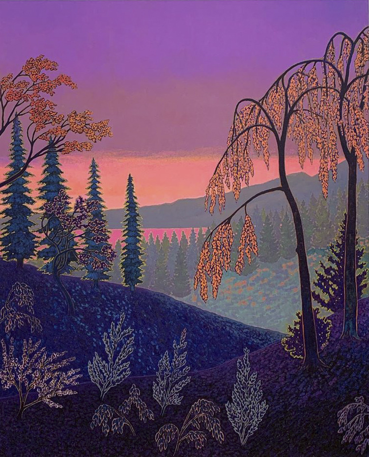

Hello all –

_This is [The Curtain](https://guscuddy.substack.com/), a newsletter about arts, theatre, culture, and the rapidly changing future. I’m your host, [Gus Cuddy](https://guscuddy.com/)._

---

In New York, it’s full-on Fall. Autumn is my favorite season, but it’s tinged with a sense of loss (of warmth + summer) and foreboding (of cold + winter). That combination creates a warm feeling embodied by October, which is objectively the best month of the year—and the strangest. This year’s version of October is extra weird, harboring strange colors swirling in disparate streams above our everyday existence, hosting glimpses of life amidst simultaneous dread.

---

On Saturday, my partner and I walked to Home Depot to pick up some materials for building some shelves in our apartment. On our way back, we noticed a simple sign that spoke to us:

 

Mari and I are both Armenian. We checked our phones – it was 4:30. We nodded and walked over a few blocks to Hancock Street. When we arrived, we were greeted with a beautiful spread of homemade food, [evil eyes](https://en.wikipedia.org/wiki/Evil_eye), a book by [William Saroyan](https://en.wikipedia.org/wiki/William_Saroyan), and a photo of [Mount Ararat](https://en.wikipedia.org/wiki/Mount_Ararat) on an Armenian flag, prepared by a gregarious middle-aged Armenian man named after the mountain. 

 

We flashed our Armenian cards (by saying we were Armenian), and he immediately busted out the samples: tabbouleh salad, spinach beoreg. He offered us some Armenian brandy, which we sipped while eating date cookies. I ended up buying some lahmajoon; he went into his apartment to retrieve it and came back with three dishes: the lahmajoon, and bonus dishes of cheese beoreg and more cookies.

 

###### yes, I’m trying to grow a beard

We talked for a few minutes, exchanged names, and then said our goodbyes. The man invited us to come back next week, where he hoped some more people might gather and share food, socially distanced, outside.

(On the topic of Armenia, I would be remiss not to mention what’s happening in Armenia now, where Azerbaijan ramps up attacks with Turkey’s support that echo the genocide and earlier massacres of Armenians. It went unmentioned by us.)

When I got home, I devoured the lahmajoon—smothered with labne we picked up from a Middle-Eastern market on Nostrand—the beoreg, the cookies. The homecooked food felt warm. I thought about what it meant to be given food by someone—I haven’t done much of that the last seven months. Instantly I felt apart of something, apart of a community stitched together by acts of kindness, like I was emerging from a long dormancy. 

That dormancy, for all of New York, might re-immerse us come winter. The outdoors is somewhat of a haven, where the threats of the virus don’t appear to be as deadly; the weather, turning colder, might threaten that mood. People-to-people interaction is something to be cherished; I long to get back into shared spaces when it’s safe, amidst people, sharing air and consciousness like we might share food on the street.

---

## Notes from the Week

**Making Sense of the Bizarre, Bleak Tony Nominations**

Theatre news was thrown a bone this week, [with the skeletal Tony nominations coming out](https://www.vulture.com/2020/10/tony-award-nominations-2020-full-list.html), and _Slave Play_collecting the most nominations ever for a Play. 

That’s pretty big, and a huge moment for Jeremy O. Harris. I’m happy for the whole team there – a big congrats to Jeremy, sound designer Lindsay Jones with two (!) nominations, and the entire creative and production team. 

This year’s nominations are bizarre, featuring a bleak breadth of plays (a single nominee for Best Actor in a Musical! not one musical with an original score!). _Slave Play_ was one of the only exciting things happening on Broadway this past year. We lost many productions due to COVID-19, but it’s nonetheless revealing that the plays and musicals we had to choose from before then were…limited. Again, this isn’t to take anything away from Harris and company. 

Then again—and it’s possible to hold both of these in our heads— I’m not sure what to even think about the Tony nominations in general. Why are they trying to pull this together amid a pandemic? It’s predictably out of touch for Broadway producers to believe that anyone cares about the Tonys right now. And it’s even more brutal that it’s happening during a time where millions of artists are unemployed due to the current circumstances. Having an award ceremony—[when and how it happens is a complete mystery](https://en.wikipedia.org/wiki/74th_Tony_Awards)!—is strange. But hey, these are strange times!

---

**[Bedlam: The Series](https://deadline.com/2020/10/bedlam-the-series-theater-company-off-broadway-mash-up-shakespeare-1234596628/)**

The theatre company Bedlam is [developing](https://deadline.com/2020/10/bedlam-the-series-theater-company-off-broadway-mash-up-shakespeare-1234596628/) _[Bedlam: The Series](https://deadline.com/2020/10/bedlam-the-series-theater-company-off-broadway-mash-up-shakespeare-1234596628/)_, “an eight-episode New Media mash-up of Shakespeare plays using the Bard’s own language.”

I’m intrigued by this idea and excited to see what Bedlam can do with it. This type of thing exemplifies what I wrote about last week, conceptualizing the modern-day small theatre company as more of a 21st-century storytelling company.

> “As a theatre company, most immediately, we **need to adapt to our current situation and find ways of staying alive**,” \[Bedlam Artistic Director\] Tucker said, “creating content that serves our mission and vision, while assuring the well-being and livelihood of our regular artists and staff.” He said the series will allow the Off Broadway company “to work in a world where theatre temporarily does not exist. It will be **the ‘new’ platform where we realize our work** and continue our pursuit to revisit and reinvigorate the Classics as well as present these texts in a way that is more representative of the world in which we live.”

Obviously, if we had government subsidies, theaters wouldn’t have to rely as thoroughly on alternative business models.

---

**The Subversive Power of Documentaries + a Good Documentary List**

Richard Brody put up a great list in the New Yorker of [“Sixty-Two Films That Shaped the Art of Documentary Filmmaking”](https://www.newyorker.com/culture/the-front-row/sixty-two-films-that-shaped-the-art-of-documentary-filmmaking).

As Brody writes about, the idea of documentaries have become even more compelling in the pandemic, as we seek out a connection to the rest of the world.

I’ve been thinking more about documentaries, too – and in particular, nonfiction filmmaking. Documentaries sometimes get a reputation of being “educational” or have a whiff of school to them; they are seen as the fact to narrative filmmaking’s fiction. But just as history is one of the most subversive academic fields, crafting a documentary inherently involves the creator making decisive narrative choices. Objectivity is a sham. 

Beyond that, the best documentaries have a clear sense of the filmmaker’s presence, have a sense of personalization. As the barrier-to-entry in filmmaking gets lower and lower, I think we will see more and more innovative examples of nonfiction filmmaking that blend styles and genres and ideas.

---

**[Wesley Morris writes about his mustache](https://www.nytimes.com/2020/10/14/magazine/quarantine-mustache.html)**

Clearly, I was going to be all over this unique piece, based on the title, author, and photo alone. Wesley gives us many things here: a deeply personal essay, a cultural survey of mustaches and Blackness, and an examination of the implicit politics wrapped up in that. It moves in unexpected ways—Morris has a way of hopping between cultural topics that is extraordinary. Highly recommended.

---

**[How Fox News molds reality into a serialized TV drama](https://www.vox.com/culture/21503196/fox-news-tv-drama-serialized-lost)**

TV and culture writer Emily VanDerWerff [writes](https://www.vox.com/culture/21503196/fox-news-tv-drama-serialized-lost) about how Fox News takes its cues from serialized television, perpetuating gross narratives that are almost-incoherent for anyone just watching for the first time:

> The network’s most popular programs function less like nightly news reports and more like serialized dramas, where you have to watch every episode to really understand the “mythology.” There are so many villains and enemies in the Fox News “universe” that if you miss anything, you might not know who’s who. It’s similar to a program like Lost, where half the intrigue stems from trying to figure out how the pieces all fit together.

It’s an interesting example of how narratives and news are intertwined and consequential.

---

**AEA vs. SAG-AFTRA: a fight over the future of theatre?**

SAG-AFTRA, the screen actor’s guild, and Actor’s Equity, the theatre actor’s union, [are in the midst of a showdown](https://www.backstage.com/magazine/article/sag-aftra-actors-equity-theater-streaming-rights-jurisdiction-71925/). This week, SAG-AFTRA launched an investigation and [filed a jurisdictional complaint](https://deadline.com/2020/10/sag-aftra-actors-equity-dispute-live-theater-taping-1234593269/) against Actors’ Equity, as they debate the taping of live shows. The central question here: _who should handle the contracts for this new age of streaming plays_? As the line between forms is eradicated by the pandemic and the internet-ization of everything, the old 20th-century lines of demarcation between types of art and media are becoming more and more fallible. Case in point: SAG-AFTRA is taking on streaming theatre contracts that Actor’s Equity thinks should be their own jurisdiction.

But there’s a lot to unpack here. SAG-AFTRA is immensely more powerful than Actor’s Equity, and they have been moving quicker with creating contracts with theaters as we move into this strange gray zone. But Actor’s Equity offers many wage and safety protections that the SAG-AFTRA contracts ignore, and also covers Stage Managers – [who are entirely left out by SAG-AFTRA](https://www.change.org/p/sag-aftra-tell-sag-aftra-stop-undercutting-contracts-for-stage-managers-and-actors). It’s also vital that we have a union for theatre, one that doesn’t let theatre get swept away into nothingness. That being said, there’s no doubt that Equity was slow-moving when it came to figuring out how to do anything digital theatre-related.

This will be an interesting story to watch develop; as a member of Actor’s Equity I’m partial to the union, but I’m not happy that the relationship with SAG-AFTRA has fractured.

---

### Links

*   Amazing: [Shia LaBeouf has a community theater, and they made a drive-in show that looks…good](https://www.complex.com/pop-culture/2020/10/5711-avalon-shia-labeuof-slauson-rec-review?utm_source=twitter.com&utm_medium=social&utm_campaign=popculturetw)
    
*   [Will Arbery’s Heroes of the Fourth Turning to Return to the (Digital) Stage](https://www.playbill.com/article/will-arberys-pulitzer-finalist-heroes-of-the-fourth-turning-to-return-to-the-digital-stage). Jeremy O. Harris produces. A chance to see one of the best new plays from 2019.
    
*   Geva Theatre literary director Jenni Werner asks the question: [Whose Land Are We On?](https://gevajournal.wordpress.com/2020/10/14/whose-land-are-we-on/) The answer is complicated.
    
*   [The New York Times has moved Nicole Herrington over to being their Theater Editor](https://twitter.com/nikkih04/status/1317204295050285057)
    
*   [40 Black theater creatives on the industry’s racism](https://www.latimes.com/entertainment-arts/story/2020-10-14/40-black-playwrights-theater-racism)
    
*   [The Bushwick Starr is accepting applications for their Managing Director position.](https://www.thebushwickstarr.org/job-posting?fbclid=IwAR1Ccm9ot8z8nsz-1cmRM2A-1QZYljkmm9GtOTn3zfUTXDfkJkYUqfFXHYc)
    
*   Interesting idea for local city podcasts: [City Cast](https://www.citycast.fm/) is a new podcast network that aims at delivering 15-minute daily local news podcasts for a bunch of cities. As the internet is a global platform, I haven’t considered the potentials of local-based podcasts.
    
*   [Anchor and Spotify are letting you use full songs from Spotify in your Anchor podcasts](https://blog.anchor.fm/updates/music). I’ve been critical of Spotify, but this is an attractive format, allowing the mixing of music and talk segments so that you can host your own music radio station. I’m honestly surprised at the legality behind this.
    
*   The podcast conversation nobody wanted: [Joe Rogan and Kanye West](https://twitter.com/kanyewest/status/1317550429895622657), and West is going to “design the set”. Whatever the hell that means.
    
*   Sonia Saraiya asks: [Has American Peak TV already peaked?](https://www.vanityfair.com/hollywood/2020/10/has-peak-tv-already-peaked) I get her point— there’s a lot more mediocre stuff these days.
    
*   Audio is hot stuff these days: [Gesso](https://www.gesso.app/) “is an immersive audio guide to the world”, offering original audio content for guided walks, guided museum tours, and more.
    

---

### Recommendation of the week: The Forty-Year Old Version

I liked Radha Blank’s lovely debut film, _[The Forty-Year Old Version](https://www.netflix.com/title/80231356)_, which is available to stream on Netflix. As a film about a playwright that can’t get anything produced, it’s a biting look into a racist theatre industry (and prompted [that LA Times piece asking 40 Black theatre-makers about their experiences with the industry](https://www.latimes.com/entertainment-arts/story/2020-10-14/40-black-playwrights-theater-racism)). As a satire, Blank doesn’t leave herself unscathed, which amounts to a nuanced vision of creating art as a Black artist in a White industry. 

There’s several fantastic performances—Radha Blank herself, _Curtain_ fav Reed Birney (playing the white Artistic Director)—but I _loved_ the debut film performance of Oswin Benjamin as beats producer D. He gives a unique performance in a very good movie.

Recommended to all.

---

## End Note

 

_art by [john mcallister](https://www.instagram.com/j.o.h.n.mcallister/)_

⫷⫸

_Thanks for reading._ 

_If you enjoy The Curtain, [consider becoming a paying subscriber](http://guscuddy.substack.com/subscribe). It really helps me continue putting this newsletter out._

[Subscribe now](https://guscuddy.substack.com/subscribe?)

_New reader? The Curtain is a weekly digital letter sent by Gus Cuddy. You can [subscribe for free here](https://guscuddy.substack.com/subscribe), or browse the [archives here](http://guscuddy.substack.com/archive)._  
  
See you next week,  
\-Gus