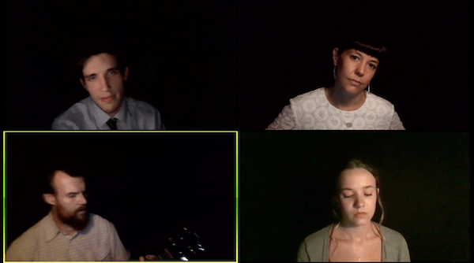
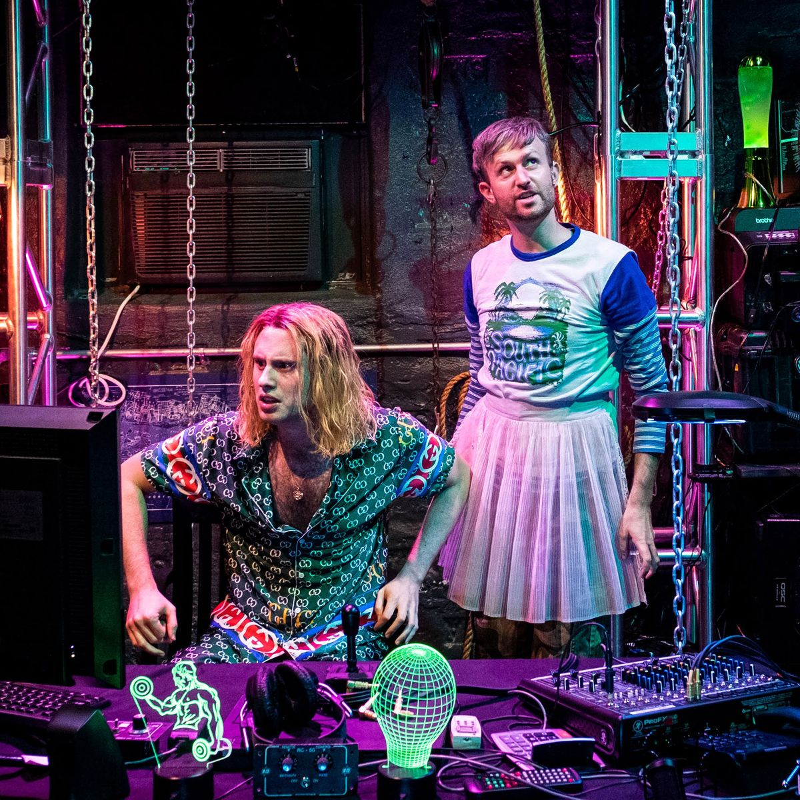

Hi all,

_This is [The Curtain](https://guscuddy.substack.com/), a newsletter about arts, theatre, media, and the rapidly changing future. I’m your host, [Gus Cuddy](https://guscuddy.com/)._

New reader? Subscribe for free (just hit “None” on the payment page):

[Subscribe now](https://guscuddy.substack.com/subscribe?)

---

### Checking in on Online Theatre

Well, friends, I admit when I’m wrong—and I was wrong about the state of online theatre.

My wrongness came from my ignorance: I had assumed—without really watching much—that online theatre was in not-great shape, a vague reproduction of the real thing. That it mostly consisted of awkward readings or recorded MET operas dug up from the archives. And while, in many cases, this is still true—most online theatre is still probably not very good, there are still awkward readings, and yes, the MET Opera is still rummaging through their archives (if that’s your thing, have at it)—there is a blossoming sign of life for the state of online theatre. Signs that it _can_ be really good. That it _can_ be something original, and not just feel like a flawed transposition onto the wrong medium. And, best of all, that it actually _can_ give some of the actual after-shock _energy_ that one gets when they emerge from a great night at the theatre, electric currents running through one’s body, buzzing through the audience and burrowing into the streets of the city.

That’s some of what I felt when I “attended” some online theatre this week, to varying states. Each of the three shows I experienced—_Heroes of the Fourth Turning_, _American Dreams_, and _Circle Jerk_—accentuated different aspects of the live experience, each implicitly staking their claim for _what theatre is_ in these absurd times, each to varying degrees of success.

 

The first was Will Arbery’s _**Heroes of the Fourth Turning**_, produced by Jeremy O. Harris, [my favorite new play of 2019](https://guscuddy.substack.com/p/the-curtain-34-the-decade-in-review), first staged at Playwrights Horizons last year. Part of the perverse pleasure of _Heroes_ is being around a type of extreme literacy we rarely see in the theatre. This play, and its characters, are often intimidatingly intelligent as they tumble over each other and the dark night sky. “One of the pleasures of theater \[is\] being around a hyperarticulate argument,” [Jeremy O. Harris said in an interview with E. Alex Jung last year](https://www.vulture.com/2019/03/jeremy-o-harris-slave-play-daddy-profile.html). This seems a mundane point until you actually think about it and realize how many plays have “arguments” that feel didactic and stage-y; the work of _Heroes_ or the second act of _Slave Play_ is another type of fierce intellectualism entirely.

This online production’s definition of liveness comes from letting us be in the presence of those hyperarticulate arguments, as delivered by five immensely talented actors. The mood of the play—or [the quality of breath, as Arbery puts it](https://guscuddy.substack.com/p/the-curtain-55-a-collective-breath)—is one of bated breath, of uncomfortable quiet under the Wyoming stars. Shadows lurk; a generator—or is it?—makes occasional sounds of immense doom. We’re left to fend with the ideas—what I find profoundly repulsive but also immensely well-articulated ideas—and that creates its own kind of fear, a fear that affects the breath, not quickening it but slowing it till it’s caught in your throat.

The Zoom production keeps it simple, hitting the same notes of the original—and keeping the same tone—by stripping away everything to let us fall into the performances. There are simple design choices—excellent lighting shrouds each actor in darkness and shadows, reminiscent of the shadows that were present on the Playwrights Horizons stage; there is the occasional sound effect—but at its heart, this play is four (and eventually five) beautifully drawn characters talking over the course of one very long scene. (A particular shoutout needs to be made to John Zdrojeski’s Kevin—he’s giving an _extreme_ performance on Zoom, one that made me bubble up with joy and sadness, and I can only imagine him screaming some of these lines in a New York apartment.) The actors look directly at the camera, and there’s almost no interruptions for stage directions, thank goodness—save for a few important ones at the beginning—so we can just focus on what matters: the superb writing and performances, both of which shine through over Zoom. There’s even a different quality to seeing these characters closer up; I was more moved this time by Julia McDermott’s Emily and more clearly felt her final monologue. I initially thought I might get distracted while watching and end up checking my phone or only half-watching; instead, I was immersed for the entire thing, and once again was deeply disturbed, head spinning, by the time the play ends.

 

_**[American Dreams](http://www.americandreamsplay.com/)**_ by Leila Buck, which I watched Sunday afternoon, defines its liveness in almost the inverse way from _Heroes_: instead of letting us disappear into the performances, _Dreams_ immediately involves the audience—to chaotic results. Conceived as an interactive game show where the audience decides which “contestant” we will let in as an American citizen, the show was adapted from a 2018 theatrical run. The entire thing runs through Zoom and makes liberal use of many of its features: audience participation, un-muting folks for applause, video from audience members, polls, and more; it also seems to be using video software beyond just Zoom for the performers, allowing an adept stage manager (?) to make use of interesting split-screens of performers’ video and audience reactions, and cut between cameras quickly and freely. The show goes all-in on creating the collective environment of a piece of theatre, which I appreciated; it’s easy for Zoom to feel boring and corporate because we all spend so much time there now, but by pushing some aspects of the technology to the edge, we’re able to re-purpose the tool for different creative uses.

 

The final show I saw of the weekend, [Fake Friends](https://fakefriends.net/)’ _**[Circle Jerk](https://circlejerk.live)**_, has been the most talked-about theatre event of the last week, and possibly (outside of _Hamilton_) of the entire pandemic. It was the most technically proficient show I saw this weekend and one of the most successful digital theatre pieces I’ve seen, in that it felt immediately suited for this form—and pushed the boundaries for what the “form” could even be. Featuring a mix of live video, pre-recorded video, Instagram Stories, TikTok videos, and more—spanning a truly impressive 13-camera setup, as designed by David Bengali and engineered by Ido Levran—the show continually redefines what a live streaming piece of theatre (or is it video performance art?) can be.

Written and performed by Michael Breslin and Patrick Foley, the play is a brutal satire about white men in the gay community—that descends quickly into being about the alt-right, white supremacists, Milo Yiannopoulos-like clones, _real_ clones, deepfakes, artificial intelligence, memes, and the cesspool of the internet. It’s total chaos, densely referential to reality TV and other media, and an absolute blast.

As produced and leveraged by Jeremy O. Harris, _Circle Jerk_ became a bit of a viral sensation on Twitter. The hashtag #circlejerklive was popping off each night, especially as more and more big names started checking in: Sarah Paulson, Roxane Gay, Hari Nef, and more. Watching it with a chaotic, swirling social media stream open simultaneously was a special kind of live internet experience. Almost everything about it felt similar—but distinct—from experiencing a piece of theatre in-person, right down to the anticipation of the show starting with the pre-show music to the exclamations of joy and laughter via Twitter.

What I admire most about Circle Jerk’s definition of live is that it asserts its liveness by its _energetic virtuosity_. That is, we know it’s live because _it says it is_, by its exorbitant amount of quick changes and wigs—the costume design is by Cole McCarty, and incredible wig design by Tommy Kurzman—and by the energy of Breslin and Foley. This is a somewhat similar energy to, say, a show like _Saturday Night Live_, only on a vastly different (and in many ways more impressive) scale. Sure, this could all just be recorded—and in fact, it was, [and you can watch it on-demand for the next two weeks](https://circlejerk.live/tickets)—but the content and form dictates that the liveness is part of the _point_, goddammit! It _insists_ that this thing is going to be pulled off live, and, by some miracle, _it is_. The Knowing that it’s live—and sometimes, through shots of costume changes, the Seeing—imbues everything with a kind of holy-shit energy that is very hard to capture online. Not every theatre piece will be able to be streamed like this—nor should they be—but wow was it fun to experience this kind of particular manic energy once again, if only for a brief instant.

---

**Shows to look out for this week**

*   **[Prelude Festival 2020](https://preludenyc2020.com/)** (October 20–30): A festival featuring an overwhelming amount of interesting, experimental new work. This year, obviously, taking place entirely online. I checked in on a couple works from Prelude this week, and I fell in love with their concept of virtual “spaces” on their website: the loft, the commons, the lab. Each “hosts” a different type of work, like the loft’s short-form artistic experiments, where I experienced a short work take place entirely in a Google Doc. The website has vintage Microsoft vibes, and is a bit confusing to navigate, but I appreciate its attempt to carve out a way for an online theatre festival to make any sense. Curated by Miranda Haymon and David Bruin. Go see something there!
    
*   **[The Seagull on The Sims 4](https://www.nytw.org/show/the-seagull-on-the-sims-4/?)** (October 27 and 28): Playwright Celine Song (of 2019’s great _Endlings_) tries desperately to recreate Chekhov’s The Seagull in the video game The Sims 4, streamed live on Twitch. If that sentence makes any part of you intrigued—or even make any semblance of sense—then you owe it to yourself to watch Part 2 on October 28th. (I watched Part I Tuesday Evening, which was bizarre and hilarious, featuring the most absurd theatre chatroom I’ve ever been a part of. [You can still watch the recording on Celine’s Twitch](https://www.twitch.tv/ellephanta)—seeing her trying to create the characters in Sims is just beautiful.)
    
*   The Civilians and Theatre Works Hartford’s **[Russian Troll Farm](https://www.russiantrollfarm.com/)** (thru Nov 9): a site-specific comedy about internet trolls’ and their role in the 2016 election.
    
*   **David Byrne’s American Utopia**, as captured by Spike Lee, is available to watch on HBO Max.
    

---

## notes from the week

### theatre shenanigans

—📺 [Michael Breslin and Patrick Foley speak to Mel Magazine about Circle Jerk’s success](https://melmagazine.com/en-us/story/circle-jerk-play-streaming-interview)

—🎧 [Alexanda Schwartz writes in The New Yorker about audio theatre](https://www.newyorker.com/magazine/2020/11/02/experiments-in-audio-theatre-radical-and-retro): “The eyes tend toward the literal, while what we only hear can bloom, the way a novel does, in the privacy of the mind”

—🤷🏽‍♀️ [Uncertainty abounds in theaters around the country, as surveyed by American Theatre](https://www.americantheatre.org/2020/10/26/to-be-or-not-to-be-theatres-brace-for-another-season-of-uncertainty/). A third of the companies surveyed would be forced to close doors in 2021 if restrictions persist with no government funding. More than half surveyed are critical of Equity’s strict performance safety guidelines.

—💸 Meanwhile…[eight small theaters in New York are suing Cuomo for not letting them re-open](https://www.nytimes.com/2020/10/26/theater/small-theaters-lawsuit-pandemic-restrictions.html).

### media, art & other goodies

—☠️ [RIP QUIBI](https://www.wsj.com/articles/quibi-weighs-shutting-down-as-problems-mount-11603301946)… the fun is over, folks. Pack it up. One last laugh: [CEO Jeffrey Katzenberg told employees to listen to a song from “Trolls” after telling them they’d be losing their jobs](https://markets.businessinsider.com/news/stocks/quibi-jeffrey-katzenberg-suggested-trolls-song-amid-layoffs-2020-10-1029711203#).

—🎨 [Kyle Chayka writes about popular wall paint colors during quarantine](https://www.artnews.com/art-news/news/wall-paint-color-quarantine-1234574643/). Demand for paints have been extremely high, with many folks moving away from grays (popular in the 2010s) and towards blues and greens.

—🎮 [It’s been 15 years since Shadow of the Colossus came out](https://text.npr.org/926634215), one of my all-time favorite games. I went down a rabbit hole of once again exploring the community of discovering this simple game’s final secret, as explained in [this wonderful Youtube video](https://www.youtube.com/watch?v=jQNeYbBiCKw).

—📄 [Some New York Times staffers share Google Docs lists](https://www.nytimes.com/interactive/2020/at-home/even-more-reporters-editors-diaries-lists-recommendations.html) of various types: recommendations, reading lists, notes. I really enjoy the re-purposing of stuffy corporate mediums like Google Docs into becoming shareable mini-websites, akin to repurposing old physical spaces for fresh new uses.

---

## end note

https://twitter.com/ferrisjabr/status/1320140155387142144?s=20

_get the hell out of here, murder hornets!! nobody wants you anyways!!!_

⫷⫸

_Thanks for reading. The next time we speak, we’ll be in the midst of an election. I’m not sure exactly when I’ll send_ The Curtain _out—but I hope the stress isn’t too bad for you._

_If you enjoy The Curtain, [consider becoming a paying subscriber](http://guscuddy.substack.com/subscribe). It really helps me continue putting this newsletter out._

[Subscribe now](https://guscuddy.substack.com/subscribe?)

_New reader? The Curtain is a weekly digital letter sent by Gus Cuddy. You can [subscribe for free here](https://guscuddy.substack.com/subscribe), or browse the [archives here](http://guscuddy.substack.com/archive)._  
  
See you next week,  
\-Gus