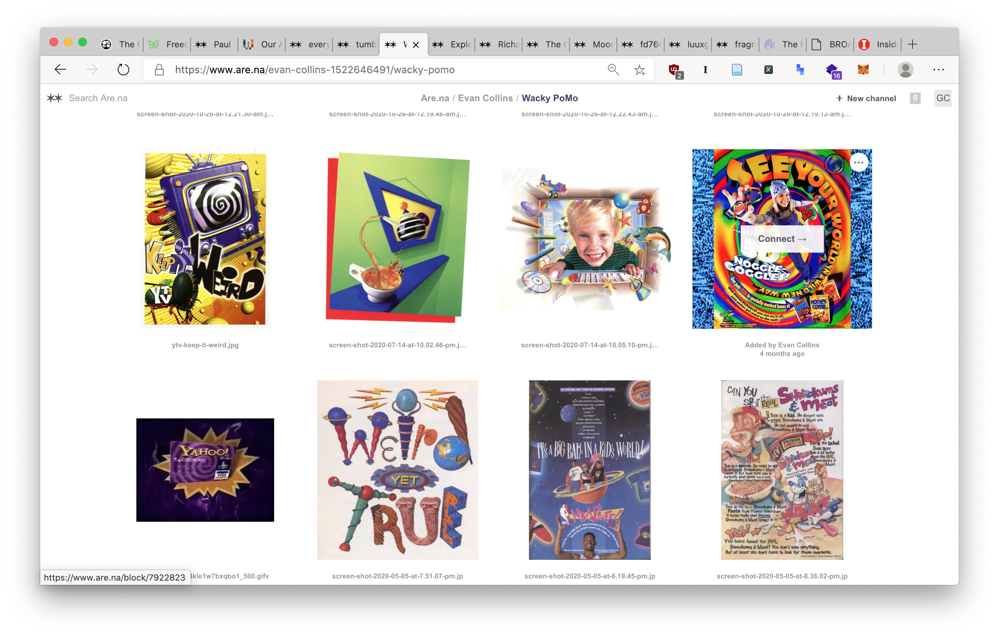
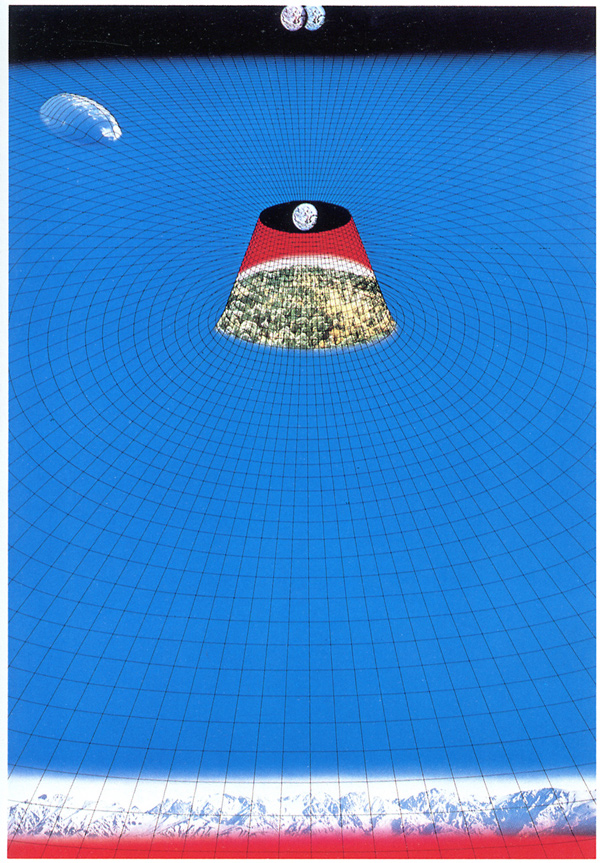

Hi friends –

_This is [The Curtain](https://guscuddy.substack.com/), a newsletter about arts, media, culture, and the weird future. I’m your host, [Gus Cuddy](https://guscuddy.com/)._

New reader? Subscribe for free:

[Subscribe now](https://guscuddy.substack.com/subscribe?)

---

The election is (sort of) over, and the world presses on, looking similar as to how it did before. On Saturday, there was a spiraling of joy and relief here in Brooklyn; cheers erupted in the late morning as Biden was announced the winner. (Or, more pointedly, as Trump was declared the loser.) Throughout the day (after stumbling out onto the street and being given champagne, mezcal, and champagne again), the exuberant sounds of honking and spontaneous cheering could be heard, as YG’s “Fuck Donald Trump” song blasted out of car stereos.

But this isn’t over, at least not yet. Trump appears to be attempting a coup, as he challenges the election results and ridiculously draws this whole thing out. Luckily, we were gifted this week with the most hilarious and perfect event of the entire Trump administration, when they booked a press conference at Four Seasons Total Landscaping in Philadelphia instead of the Four Seasons hotel. It was an incredibly bizarre moment to watch Rudy Giuliani rave madly about election conspiracy theories in the landscaping parking lot.

https://twitter.com/pattonoswalt/status/1325132671140327427?s=21https://twitter.com/dhm/status/1325125765789229057?s=20

We enter a world now where there is a multitudinous swarm of simultaneous realities, depending on what slice of the country you look at and who you ask. The country is completely fractured, even with Biden winning, fragmented less into two political parties than into a shattered-glass composition of warring visions of what it means to exist, how to interpret time, the state of America, and more.

https://twitter.com/vgr/status/1325260769169010689

---

### What to Watch This Week: Streaming theatre + other things

**Theatre:**

*   Berlin’s Schaubühne Theatre is once again [streaming a collection of archived performances online](https://www.schaubuehne.de/de/seiten/online-ersatzspielplan.html). (If only we could have these types of recordings more readily available in American theatre.) Might I recommend Ostermeier’s take on _Enemy of the People_, streaming through November 13? You can also see Katie Mitchell’s _Orlando_ form last year, and many more.
    
*   Leila Buck’s _American Dreams_ continues its virtual national tour, [this time showing “at” Marin Theatre Company through November 15](https://www.marintheatre.org/productions/american-dreams).
    
*   Daniel Alexander Jones’ incredible _Jomama Jones: Black Light_ is [available to stream indefinitely on YouTube](https://www.youtube.com/watch?v=8uGPSWXYJzc&feature=youtu.be).
    
*   Heidi Schreck’s _What the Constitution Means to Me_ is [available on Amazon Prime Video](https://www.amazon.com/What-Constitution-Means-Me-Official/dp/B08KRNSLB6/), filmed by Marielle Heller.
    

**Film:**

*   [Film at Lincoln Center’s Art of the Real festival](https://virtual.filmlinc.org/page/art-of-the-real/), featuring “the most vital and innovative voices in nonfiction and hybrid filmmaking” is streaming nationwide from November 13–26.
    
*   [DOC NYC](https://virtual.filmlinc.org/page/art-of-the-real/), the biggest documentary festival in the country, is streaming from November 11 - November 19. There are over 200 titles available (!!). A plethora of great things to check out here.
    

---

## Notes from the Week

#### spotify’s platform problem

🎙 Follow up on [last week’s discussion](https://guscuddy.substack.com/p/investing) of platforms vs. publishers: the great writer Liz Pelly has an excellent new essay in _Baffler_ [on Spotify’s podcasting problem](https://thebaffler.com/downstream/podcast-overlords-pelly), which replicates the problems with their music streaming service: incentivizing a certain type of work and empowering a certain type of individual. In a way, this is a problem with much of the modern “big tech” media-internet (Spotify, TikTok, Instagram, YouTube, etc.): they prioritize producing fame and money over producing craft. Writes Pelly:

> In many ways, though, the $50 billion company is treating podcasters similarly to how it has historically treated musicians, with **a system that privileges the already moneyed and powerful**. … \[Spotify’s\] strategy includes: the playlistification of everything, the incentivization of easy-to-digest quick hits, the disguising of advertisements as editorial, **personalization to the point of banality**, and prioritizing what is optimal for moods and moments. If music has learned anything over the past decade, it’s that the Spotify model is one that only functions at **mass scale**—and when it’s atomizing and **disempowering those whose work creates its value**, pushing an aspirational **one-size-fits-all** approach tailored to pop stars.

Podcasting started as [a bastion of the open internet](https://guscuddy.substack.com/p/the-curtain-59-why-open-podcasting) but is now fighting against being slowly turned into a corporatized slog, where companies like Spotify could own the rights to podcasters’ work. [Well worth a read](https://thebaffler.com/downstream/podcast-overlords-pelly).

---

#### inside the changing New York Times, via Reeves Wiedeman

🗞 Reeves Wiedeman [published his latest intensive media profile](https://nymag.com/intelligencer/2020/11/inside-the-new-york-times-heated-reckoning-with-itself.html), this time on the changing tone and the turmoil at the New York Times over the Trump years (but also on its growth and success). Wiedeman’s pieces always cause a bit of a stir in the media world. I also enjoyed his recent appearance on the [Longform Podcast](https://longform.org/posts/longform-podcast-416-reeves-wiedeman), where he talked about his new book, _Billion Dollar Loser_, about the rise and fall of WeWork. (He famously [profiled WeWork](https://nymag.com/intelligencer/2019/06/wework-adam-neumann.html) last year; his [Vice](https://nymag.com/intelligencer/2018/06/inside-vice-media-shane-smith.html), [Condé Nast](https://nymag.com/intelligencer/2019/10/conde-nast-anna-wintour-roger-lynch.html), and [Uber](https://nymag.com/intelligencer/2017/05/inside-uber-lawsuits-travis-kalanick.html) profiles are also noteworthy.)

---

#### heidi schreck on marc maron

📜 I enjoyed writer and performer [Heidi Schreck’s appearance on Marc Maron’s podcast](http://www.wtfpod.com/podcast/episode-1172-heidi-schreck), talking about _What the Constitution Means to Me_ now being available to stream on Amazon Prime (!!). I especially liked how much she discussed the show as an exorcising of physical trauma in her body, mentioning two books in particular: _Trauma and Recovery_ by Judith Herman, and _The Body Keeps the Score_ by Bessel van der Kolk. 

---

#### consumer aesthetics research institute

🪑 If you’re in the mood for a rabbit hole, I’ve been recently smitten with the work of [Evan Collins](https://www.are.na/evan-collins-1522646491) of the [Consumer Aesthetics Research Institute](http://c-a-r-i.org/), whose goal is to develop “a visual lexicon of consumer ephemeria from the 1970s until now.” Collins [collects his work on the visual bookmarking site Are.na](https://www.are.na/evan-collins-1522646491), where he catalogs design examples of bizarrely specific trends from the last 20–30 years that are weirdly recognizable, yet which I never had words for. Things like “[Casual Gen-X Soft Home](https://www.are.na/evan-collins-1522646491/casual-gen-x-soft-home)”, “[80s Festival Marketplace](https://www.are.na/evan-collins-1522646491/80s-festival-marketplace)”, “[Wacky PoMo](https://www.are.na/evan-collins-1522646491/wacky-pomo)” (one of my favorites), “[McBling](https://www.are.na/evan-collins-1522646491/mcbling)”, and “[Early Cyber](https://www.are.na/evan-collins-1522646491/early-cyber)” (excellent)—you just have to check them out to see. It’s like wandering through a museum of specific things you never knew were cataloged, never knew there was a language for, and never realized were all connected.

<figure>
    
    <figcaption>Wacky PoMo</figcaption>
    </figure>

---

#### a template for creative nonfiction

🖋 Oh man, this:

https://twitter.com/jake_wolff/status/1326193156086505481

---

#### COVID watch:

📈 [COVID Rates Inch Toward NYC’s Threshold for Shutting Down Schools](https://www.thecity.nyc/education/2020/11/9/21557798/covid-rates-inch-toward-nycs-threshold-for-shutting-down-schools): “The seven-day citywide positivity average reached 2.21%, creeping closer to the 3% threshold that the mayor set for a citywide closure of the country’s largest school system.”

💊 Okay, [so we have a vaccine now](https://www.statnews.com/2020/11/09/covid-19-vaccine-from-pfizer-and-biontech-is-strongly-effective-early-data-from-large-trial-indicate/), that’s 90% effective? Obviously there’s quite a bit to be figured out with this—most notably with how it’s going to be distributed fairly and effectively (ha)—but from what I’ve read this does kind of seem like the real deal. I choose to remain optimistic about it.

---

#### a parting quote: “your own astonishment”

I’ve been on an Annie Dillard kick recently, this is from her book _The Writing Life_:

> Why do you never find anything written about that idiosyncratic thought you advert to, about your fascination with something no one else understands? Because it is up to you. There is something you find interesting, for a reason hard to explain. It is hard to explain because you have never read it on any page; there you begin. **You were made and set here to give voice to this, your own astonishment**.

---

## end note

<figure>
    
    <figcaption>Kazumasa Nagai poster of space, late 70s</figcaption>
    </figure>

⫷⫸

_Thanks for reading!_

_If you enjoy The Curtain, [consider becoming a paying subscriber](http://guscuddy.substack.com/subscribe). It really helps me continue putting this newsletter out._

[Subscribe now](https://guscuddy.substack.com/subscribe?)

_New reader? The Curtain is a weekly digital letter sent by Gus Cuddy. It usually comes out Wednesday morning, though it used to come out Tuesday (I’m still figuring that out). You can [subscribe for free here](https://guscuddy.substack.com/subscribe) (feel free to click “None” on the payment page), or browse the [archives here](http://guscuddy.substack.com/archive)._

Till next time,

\-Gus