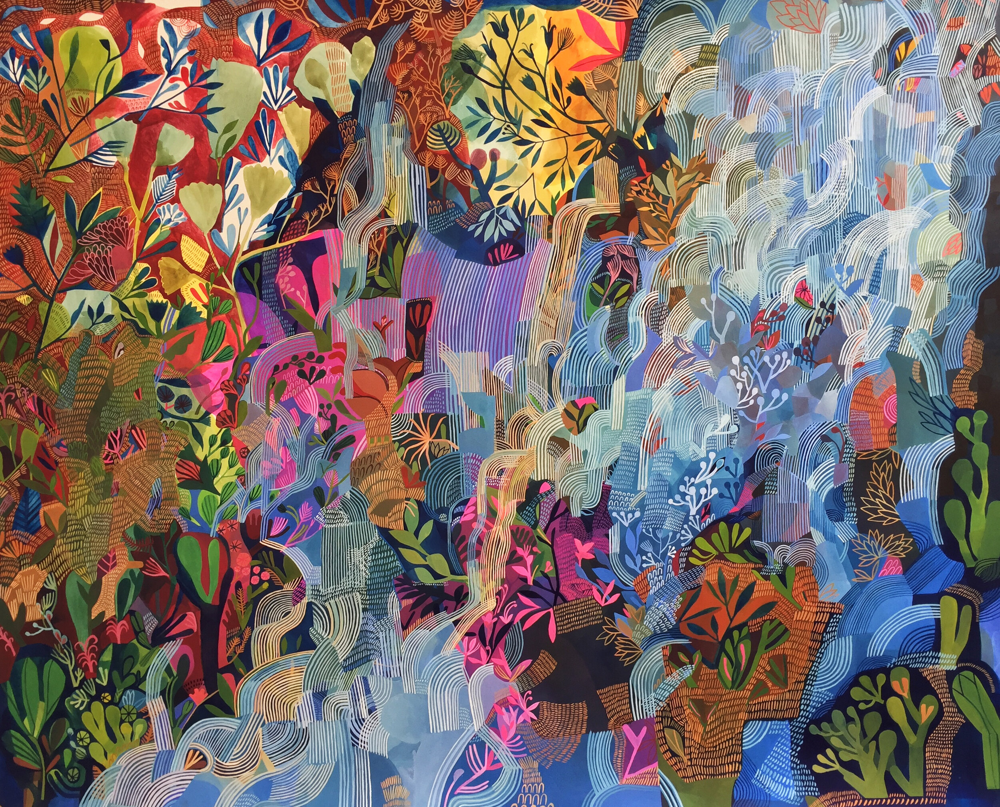

Hi friends –

_I’m [Gus Cuddy](https://guscuddy.com) and this is [The Curtain](https://guscuddy.substack.com/), a weekly newsletter where I unpack what’s happening in culture, arts, media, the internet, and the strange, strange future. New reader? [Subscribe for free](https://guscuddy.substack.com/subscribe)._

I hope you’re having a great week!

---

#### Centering, ahead of the surge

We’ll start with this: the COVID-19 numbers in America do not look good right now. In New York, it looks like we’re on the precipice of dooming ourselves to a similar fate as earlier this year, unless Cuomo and de Blasio act fast.

The winter is approaching. The outdoors, which in the late summer felt like a vibrant, vibrating release valve, full of outdoor diners and beach chair setups along Vanderbilt Ave, has turned grayer and colder. Heating lamps, coats, and visible breath now accompany drinks outside; people are determined to get out of their houses, but will that last when the thermometer crashes through the 30s and 20s? As numbers go up and the temperature goes down, we seem to be settling in for a difficult winter. Many folks are itching to have indoor gatherings—hello, Thanksgiving—[despite the clear evidence that this is an indoor virus](https://english.elpais.com/society/2020-10-28/a-room-a-bar-and-a-class-how-the-coronavirus-is-spread-through-the-air.html). (It’s all about the [airflow](https://www.theatlantic.com/health/archive/2020/09/diy-ventilation-home-pandemic/616150/)!)

We’re in a difficult moment. Yes, cases are rising, reaching record highs in America. But there’s also a stubborn, common attitude that we’re over this, that if we decide it doesn’t exist _then it doesn’t exist_. Yet things will almost certainly get worse in the coming weeks with Thanksgiving and the holidays, aided by a country that continues to navigate a health crisis in obtuse ways. We’re in the middle of things. It will get worse before it gets better.

As we perch on the precipice of winter and higher numbers in a never-ending violent dispersion of a year, I’ve been reflecting more on what it means to be centered. After all, we are, in a way, in the _center_ of this damn thing, at least in the United States. It’s been about 8 months since the world started to fall apart at the seams. For many of us that have our careers dependent on people gathering in collective spaces—like with theatre—it’s possible that it could be another 8 months before things begin to resemble anything like they once were – and even that feels optimistic. 

So I’m taking this moment to center myself, to hone in on the [collective breath](https://guscuddy.substack.com/p/the-curtain-55-a-collective-breath). It’s going to be a rocky road ahead. I’m trying to love those close to me, while staying connected to the pulse of the moment: the quietude, the moments of joy, the confusion, and the parabolic curves of loss, drifting swiftly through the streets.

---

## Notes from the Week

#### Substack, TikTok, and the Emergence of a New Internet

🐀🎼 In the latest wtf-is-happening-on-the-internet-that-I-didn’t-know-about thing, **[TikTok is kind of open source creating a Ratatouille Musical](https://www.buzzfeed.com/sydrobinson1/ratatouille-the-musical-tiktok)**.

I didn’t understand what this was about either, fellow non-Gen-Zers, but after reading [this BuzzFeed explainer-thing](https://www.buzzfeed.com/sydrobinson1/ratatouille-the-musical-tiktok) (!) collecting all the TikToks and charting the ridiculous collaborative and creative effort put into making a Ratatouille musical (yes, it’s exactly what it sounds like), I’m more disturbed (moved? excited?) than ever by the weirdness of the internet, which enables niches to flourish—particularly on the algorithmically-minded TikTok. It’s a kind of open source creativity, collectively creating a corny musical that normally would be the effort of just a small team. (And honestly, given the quality and originality of some Broadway musicals, why not give this thing a shot?)

(To my pleasant surprise, at the very end of that BuzzFeed explainer, I see an incredible Lin-Manuel satire that blew up and…it’s created by an old friend from catering in New York, the brilliant [Rocky Paterra](https://www.tiktok.com/@rockysroad), who has become a TikTok star since I last checked. This is the world of the new internet, where your friends suddenly go viral. It’s kind of incredible. Rocky is at least the third person I’ve known this year to have hundreds of thousands of views on TikTok. Such is the power of the algorithm.)

Theater TikTok, in particular, is a terrifying place of musical theatre madness, something beyond imagination, a warped meme-fest where viral content explodes because it’s so recognizable. TikTok’s relentless zaniness is the perfect match for musical theatre kids; more than that, the raucousness of the platform seems like one big awkward cast party.

---

🖋 Backing up…**how do you even describe TikTok?** That’s what writer Kyle Chayka [set out to do this week in his newsletter](https://kylechayka.substack.com/p/essay-how-do-you-describe-tiktok), as someone who was entirely new to the platform. Writes Chayka:

> More than any other social network since MySpace it feels like a new experience, **the emergence of a different kind of technology and a different mode of consuming media**.

TikTok’s unbelievable algorithm means the moment you start using it, it immerses you in an endless stream of content. It’s an absurd extension of the internet, like an inevitable conclusion of frantic user-created content. TikTok doesn’t prompt you on who to follow, like with Twitter or Instagram: it simply learns from your behavior what you like and you start descending into its dark holes, flooded with media. Chayka continues:

> On TikTok, I never know where something’s coming from or why, only if I like it. **There is no context**. If Twitter is all about provenance — trusted people signing off on each other’s content, retweeting endorsements — TikTok is simply about the end result. Each video is evaluated on its own merits, one at a time.

The nature of TikTok extends itself to an aesthetics of reality:

> TikTok is compelling because it’s so wide, a social network with the userbase of Facebook but fully multimedia, with the kinds of expensive-looking video editing and effects we’re used to on television. The platform presents media (or life itself?) as **a permanent reality TV show**, and you can tune in to any corner of it at any time.

Its philosophical basis is the meme, in the literal definition of the word: endless copying and dueting and dubbing make up the fabric of its content. But intertwined with the meme is appropriation; it’s impossible to fully grasp TikTok without understanding its involvement in the rise of “digital blackface” and minstrelsy, [as Jason Parham brilliantly wrote about earlier this year](https://www.wired.com/story/tiktok-evolution-digital-blackface/).

Is this constant exposure to moving images a problem for our culture? Certainly moving images are one of the most powerful tools in culture today, a new kind of literacy. And they carry with them a lasting power, for good or for bad. The [nostalgically-minded](https://guscuddy.com/nostalgia) might also disparage the ubiquity of images in the name of the original saving grace of images: cinema. (They might have a point, but I chuckled when I came across Susan Sontag’s 1995 New York Times essay entitled [“The Decay of Cinema”](https://archive.nytimes.com/www.nytimes.com/books/00/03/12/specials/sontag-cinema.html) this week; she wrote: “Images now appear in any size and on a variety of surfaces: on a screen in a theater, on disco walls and on megascreens hanging above sports arenas. The sheer ubiquity of moving images has steadily undermined the standards people once had both for cinema as art and for cinema as popular entertainment.” If only she had heard about TikTok…)

---

⌨️ Meanwhile, **[Substack](http://substack.com/)** continues its utter domination in the space of **independent writers online**, as Matthew Yglesias [became the latest writer](https://www.theatlantic.com/ideas/archive/2020/11/substack-and-medias-groupthink-problem/617102/) to jump ship from a traditional organization to publish his own paywalled newsletter on the platform. (Like Glenn Greenwald, he was also a co-founder: Yglesias of _Vox_, Greenwald of _The Intercept_.) Next to TikTok, it’s one of the hottest media companies out there right now—but it operates in ways that seem philosophically antithetical to TikTok.

While TikTok is non-linear, algorithmic, and always seems to give the chance of brief fame, Substack is linear, non-algorithmic, and what you might call ‘star-based’: it rewards those with larger, existing audiences, like Yglesias, Greenwald, Andrew Sullivan, Matt Taibbi, or any of the number of other established journalists that have made their way over to Substack.

[In a great essay profiling the company for Columbia Journalism Review](https://www.cjr.org/special_report/substackerati.php), Clio Chang writes:

> The intention is declarative—you, too, can make it on Substack. But as you peruse the lists, something becomes clear: the most successful people on Substack are those who have already been well-served by existing media power structures. Most are white and male; several are conservative. Matt Taibbi, Andrew Sullivan, and most recently, Glenn Greenwald—who offer similar screeds about the dangers of cancel culture and the left—all land in the top ten.

Moreover, Chang continues, Substack’s intense seduction of writers “has begun to look like it’s reverse engineering a media company.” What exactly are they getting at here? Once again, the issue of [platform versus publisher](https://guscuddy.substack.com/p/investing) arises – a question that appears to haunt many tech companies as they attempt to wrestle the ethics of neutrality against entrenched power structures, sidestepping responsibility whenever possible.

---

This “unbundling” of journalists to independent publications feels similar to the unbundling of cable TV to streaming platforms. Indeed, the same joke applies that we’re going to need someone to bundle up all the streaming platforms (and call it Cable TV). Except with Substack, it’s bundling the writers under an editor and calling it a publication:

https://twitter.com/erikhane/status/1327289796146864129?s=21

---

#### arts and the future

📒 Playwrights Horizons announced a new literary magazine they’re offering called _[Almanac](https://www.playwrightshorizons.org/shows/plays/almanac)_, “Chronicling the Past, Present, and Future of the American Theater.” It features commissions of varying types (essays, reflections, interviews, poems, plays, photos) from a batch of excellent artists. The commissions were supported by funds raised by [the online reading of](https://guscuddy.substack.com/p/onlinetheatre) _[Heroes of the Fourth Turning](https://guscuddy.substack.com/p/onlinetheatre)_.

I love theaters experimenting with form and content, and continuing to both create art and pay artists. There’s a lot of interesting ideas here, and each piece is worth a look.

It’s unclear to me whether _Almanac_ will be offered in an analog version, as there’s no obvious information about it on the Playwrights website. I hope they are able to create a beautifully designed physical magazine, as the online reading experience leaves something to be desired. In an ideal world, I’d also love to see a more imaginative and presentational web design for the online version of something like this; the Playwrights website feels like it swallows up the content, rather than delivering it to us in the most accessible way possible. (I loved David Zinn’s [site visit](https://www.playwrightshorizons.org/shows/trailers/site-visit-416-w42/) of the Playwrights building, for instance, but was frustrated that the website’s presentation of the images remained so confined.)

📊 Elena Burger [writes a terrific piece](https://virtualelena.substack.com/p/is-this-profitable) about Netflix’s numbers and time, bringing in some Roland Barthes to discuss what happens when viewing experiences are consigned to the home.

👎 Alissa Wilkinson wrote [a deeply satisfying pan](https://www.vox.com/culture/21547861/hillbilly-elegy-review-netflix) of the very bad looking adaptation of _Hillbilly Elegy_, available on Netflix.

---

#### Deconstruct the internet

📑 I stumbled across a treasure trove collection of **[Radical Google Docs](https://www.are.na/corey-tegeler/radical-google-docs)** on [are.na](https://www.are.na/corey-tegeler/radical-google-docs) – various Docs from a swarth of activist organizations and individuals. I wrote a tiny bit about the radical repurposing of Google Docs [a few weeks ago](https://guscuddy.substack.com/p/onlinetheatre); I love when folks find ways to reimagine office tools for creative uses. Docs serve as mini websites, almost, but have a different feel, often collecting structured but informal data, while offering mass collaboration features.

🖼️ [Google Photos is shutting down its free storage tier after using all that user data to train Machine Learning algorithms and shut out smaller competitors](https://www.theverge.com/2020/11/11/21560810/google-photos-unlimited-cap-free-uploads-15gb-ending). Cool.

🐦 Twitter just released “Fleets”, their bizarre version of Snapchat Stories. Only five years late on this one.

https://twitter.com/alecstapp/status/1328759059131080706?s=2

---

#### covid watch

🏥 [Moderna’s COVID vaccine is said to be “95% effective”](https://www.cnn.com/2020/11/16/health/moderna-vaccine-results-coronavirus/index.html), which is more actually good news (?!). There’s still many, many obstacles to getting the vaccine distributed, but it’s good to see at least a glimmer of hope that this can end at some point. 

> “These are obviously very exciting results,” said Dr. Anthony Fauci, the nation’s top infectious disease doctor. “It’s just as good as it gets — 94.5% is truly outstanding.”

😷 [CO2 levels in indoor spaces are critical to monitor](https://smartbuildingsmagazine.com/features/carbon-dioxide-monitoring-to-lower-the-coronavirus-threat):

> **1200 ppm** means that almost 2% of the air in the room has already had lung contact at least once. **At this level, every 50th breath that a person takes in this room consists of air that has already been exhaled**.

Let’s repeat: it’s all about ventilation and airflow!!

---

## end note

<figure>
    
    <figcaption>art by <a href="http://www.ashleyamery.com/">ashley amery</a></figcaption>
    </figure>

⫷⫸

_Thanks for reading!_

_If you enjoy The Curtain, consider [becoming a paying subscriber](https://guscuddy.substack.com/subscribe). It really helps me continue putting this newsletter out._

_New reader? The Curtain is a weekly digital letter sent by Gus Cuddy. You can [subscribe for free here](https://guscuddy.substack.com/subscribe) (feel free to click “None” on the payment page if you can’t afford it), or [browse the archives here](https://guscuddy.substack.com/archive)._

Till next time,

\-Gus