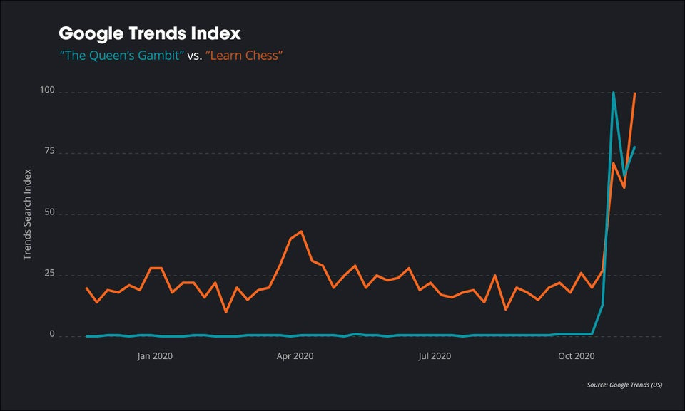
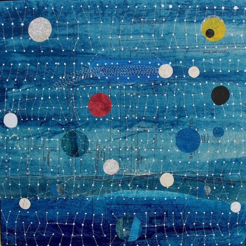

Hi friends,

_This is [The Curtain](https://guscuddy.substack.com/), a newsletter about arts, the internet, and the future. I’m your host through all this weirdness, [Gus Cuddy](https://guscuddy.com)._

[Subscribe now](https://guscuddy.substack.com/subscribe?)

---

I hope you’re having a good week, and are staying safe. It’s a difficult time for everyone now, especially for folks that might not be seeing their families or loved ones. I’ve been finding myself going down internet rabbit (hell)holes even more as of late. Finding moments of joy and kindness in whatever way possible is so important now. (I think that’s why we just applied to adopt two kittens – it’s that kind of time, you know?)

---

#### Substack, Decentralization, and the Future of Arts

The past few weeks have seen a swarth of high-profile writers take their leave from institutions and migrate over to Substack, the popular newsletter-publishing platform (which, as of November 2020, this newsletter uses!). I wrote briefly about Glenn Greenwald and Matt Yglesias joining in the last [few](https://guscuddy.substack.com/p/investing) [weeks](https://guscuddy.substack.com/p/the-curtain-83-what-the-tiktok-is), but since then culture writer [Hunter Harris](https://hunterharris.substack.com/p/welcome) has moved from Vulture to Substack, among others. (Delia Cai has a nice interview with Harris [here](https://deezlinks.substack.com/p/some-more-tiktoks-i-personally-and).)

In a vacuum, the controversy and debate over Substack seems insular and merely media gossip-y. But I’d like to argue that this model—of empowering individuals, for better *and* for worse—is totally essential for understanding the shifts in culture in 2020; it’s a model that’s having ripple effects into the arts and other industries.

On the surface, the shift is obvious: a move from the institution to the individual, as enabled by the internet. Abstracted a layer beyond that, it’s the move from *bundled* organizations to *unbundled* entities. For instance, we see this in journalists leaving their news organizations (which “bundle” writers) to write independently (unbundled). (Or is Substack the bundler? Gah!) We have also seen a very different version of this unbundling, with cable TV turning into a multitude of streaming platforms. (Of note, neither of these options are particularly convenient—the joke being that in each case, we’re going to need someone to bundle up the unbundlers, and repeat the cycle again.) In theatre, we’ve started to see [the rise of the powerful individual playwright](https://guscuddy.com/influencer). In the NBA, there’s the rise of player empowerment. Everything is becoming more decentralized.

Or rather: decentralized in certain ways, through certain avenues, while retaining a different kind of centralization – around large tech companies. Are influencers on Instagram or writers on Substack truly decentralized? Or are they amassing towards a new kind of centralization, just with a different, more tech-bro-y kind of gatekeeper?

It’s important to also remember the limitations of a model like Substack, which relies on people paying directly for news, insight, or insert-topic-here. I’m not confident that it is going to scale. If every writer moved to Substack, we would have an absurd overwhelm of things to read and pay for. Sometimes bundling is *good*. And people are *already* getting Substack fatigue. ([“i’m done paying for substacks and just want to pirate them”](https://twitter.com/tobyshorin/status/1328713574676647938), Toby Shorin says on Twitter.)

In an ideal world, the decentralization of the internet represents a good kind of decentralization. The kind of an earlier, [open internet](https://guscuddy.substack.com/p/the-curtain-59-why-open-podcasting), where blogs and hypertext were the primary mechanism of the medium. But when one company offers to decentralize under their umbrella, it begins to get a bit shakier.

https://twitter.com/noampomsky/status/1331347537618292736

The other downside to the rise of Substack is that it encourages a certain kind of writing: generally the daily to weekly newsletter, which comes in pretty much two varieties (though they often can overlap)—essays and link round-ups. There’s nothing inherently wrong with putting out this content weekly – I do it, and I also read it! But as I can personally attest, it does come with an opportunity cost: it can take away from some of the time you would spend doing longer, more in-depth writing work: longform, books, plays, manifestos. The weird, deeper things that go beyond the hot takes of Substack. “The problem is not merely homogeneity of topic, but homogeneity of substance. If you have to publish a newsletter every week, you don’t have the room or incentive to take risks,” [writes an anonymous blog post on an old-school blog about how Substack became “milquetoast”](https://nintil.com/substack-milquetoast). (Some of this homogeneity comes from the fact that, besides some minor color tweaks, every Substack looks literally exactly the same.)

The model that Patreon, Substack, Onlyfans, and other direct-monetization type services have offered, though, is not to be dismissed. It provides fertile ground for pondering the future of how we consume art and media, given its growing popularity. For one, the power to burrow into a niche in the recesses of the internet is incredibly important; the vastness and immediacy of the internet combine to make audiences form around almost anything, allowing creators to engage in a direct relationship with their followers. Likewise, for art forms that transpose onto the digital landscape well enough (such as movies or music), there are more opportunities to create than ever. But the same is not true for live arts.

Unfortunately for theatre and other live arts, decentralization—in the terms laid out by companies like Substack—can only get them so far. I expect there to be a place for more small collectives, companies, and individuals to emerge organically, supplanting some of the place of larger institutions. But these companies don’t quite have access to the vastness of a direct internet audience in the same way. (At least, none have figured out how to make that work yet!) Given the pandemic’s devastating effect on the performing arts, we *need* some centralization. Funding the [National Endowment for the Arts](https://en.wikipedia.org/wiki/National_Endowment_for_the_Arts) or perhaps resurrecting the [Federal Theatre Project](https://www.americantheatre.org/2020/07/15/artists-of-the-world-unite/) would be a compelling way to start. I’m optimistic that that could happen—but not in the large-scale way that it needs to.

---

## notes from the week

#### oh, the bursting elegance of biology versus the droll ways in which it is taught

🧬 I loved [this piece](https://jsomers.net/i-should-have-loved-biology/) from James Somers on the wonder of biology, which he learned more about [as he wrote about COVID-19 for the New Yorker](https://www.newyorker.com/magazine/2020/11/09/how-the-coronavirus-hacks-the-immune-system).

I recall my biology classes in the same way in which James does: an endless parade of terms to memorize. But biology is overwhelmingly beautiful, with a grounding in the physical. James recommends some of his favorite books that help explain biology’s wonder.

> Someone probably told me that every cell in my body has the same DNA. But no one shook me by the shoulders, saying how crazy that was. I needed Lewis Thomas, who wrote in The Medusa and the Snail:
>
> _For the real amazement, if you wish to be amazed, is this process. You start out as a single cell derived from the coupling of a sperm and an egg; this divides in two, then four, then eight, and so on, and at a certain stage there emerges a single cell which has as all its progeny the human brain. The mere existence of such a cell should be one of the great astonishments of the earth. People ought to be walking around all day, all through their waking hours calling to each other in endless wonderment, talking of nothing except that cell_

---

#### a great list of new york history books

From my favorite NYC history account:

https://twitter.com/DrinkSolaPop/status/1262415006785851393

---

#### the queen’s gambit’s trendy moment

<figure>

<figcaption>well, it certainly is making chess popular…</figcaption>
</figure>

There’s an unlimited amount of things to watch on Netflix, and yet somehow everyone always finds themselves watching the same shows. It seems like everyone in my Twitter feed had an opinion on the new show *The Queen’s Gambit*. I’m also a chess tutor, and the parents of the kids I tutor were also telling me to watch it. And so, we did. It’s comforting to be part of the big collective group that watches the same things, sometimes.

I enjoyed these pieces:

-   [Jane Hu on why it’s a bad period piece](https://www.vulture.com/2020/11/queens-gambit-fake-deep-period-piece.html)

-   [On the show’s major (but predictable) misstep with its treatment of black characters](https://wearyourvoicemag.com/the-queens-gambit-uses-blackness-and-bisexuality-to-serve-white-heterosexuality)

---

#### [history’s cycles: are we really in for it now?](https://www.theatlantic.com/magazine/archive/2020/12/can-history-predict-future/616993/)

The growing-in-popularity Peter Turchin thinks he has a mathematical model to explain human history, and [why we’re in for a very bad next ten years](https://www.theatlantic.com/magazine/archive/2020/12/can-history-predict-future/616993/), as The Atlantic explains. But like Steve Bannon’s obsession with historical cycles, I find it pretty unconvincing.

---

#### [kyle chayka on “emily in paris” + ambient tv](https://www.newyorker.com/culture/cultural-comment/emily-in-paris-and-the-rise-of-ambient-tv)

‘By the end of its second episode, I knew that Netflix’s new series “Emily in Paris” was not a lighthearted romantic travelogue but an artifact of contemporary dystopia,’ [Chayka writes](https://www.newyorker.com/culture/cultural-comment/emily-in-paris-and-the-rise-of-ambient-tv). But what he coins in the article is a recognizable Netflix trend:

> In this and other recent programming, Netflix is pioneering a genre that I’ve come to think of as ambient television. It’s “as ignorable as it is interesting,” as the musician Brian Eno wrote, when he coined the term “ambient music” in the liner notes to his 1978 album “Ambient 1: Music for Airports,” a wash of slow melodic synth compositions.

It’s sort of like the Sweetgreen of television. I didn’t watch any of “Emily in Paris” but enjoyed having it on in the background as pure ridiculous atmosphere.

---

#### assorted theatre shenanigans

-   Perhaps the most important news this past week is that Actor’s Equity and SAG-AFTRA [finally settled their months-long dispute over whose jurisdiction streaming theater falls under](https://www.nytimes.com/2020/11/19/theater/Sag-aftra-equity-settle-dispute.html), with Equity covering most streaming theatre (with some restrictions).

-   [The Public Theater Reveals Lineup for Its Under the Radar Festival](https://www.playbill.com/article/the-public-theater-reveals-lineup-for-its-under-the-radar-festival). Excited for this digital festival.

-   [Helen Shaw on the greatness of Celine Song’s](https://www.vulture.com/2020/11/the-best-online-staging-of-chekhovs-seagull-is-in-the-sims.html) *[The Seagull on The Sims 4](https://www.vulture.com/2020/11/the-best-online-staging-of-chekhovs-seagull-is-in-the-sims.html)*. We agree on this:

> Song’s extended “casting” period was the deepest investment I’ve experienced yet in remote theater. That hour thrummed like a theatrical probability engine: Each proposed haircut or aspiration opened up a multiverse of Seagulls. At first, she showed us a Konstantin with a confident stride, and the play shifted to accommodate it — maybe Kostya’s writing is actually wonderful, I thought. Then swiftly she clicked through to a slumpier walk, and a less competent Konstantin came into focus. Either version gave you a fascinating Seagull; each changing detail unlocked valid readings of the play. Song spoke casually about how she saw various relationships in the story, tossing us whole lectures worth of insight as she clicked and laughed. We were giddy.

---

## end note

<figure>

<figcaption><em>art by <a href="https://www.instagram.com/shane_drinkwater/">shane drinkwater</a></em></figcaption>
</figure>

⫷⫸

_Thanks for reading!_

_If you enjoy The Curtain, consider [becoming a paying subscriber](https://guscuddy.substack.com/subscribe). It really helps me continue putting this newsletter out._

_New reader? The Curtain is a weekly digital letter sent by Gus Cuddy. You can [subscribe for free here](https://guscuddy.substack.com/subscribe) (feel free to click “None” on the payment page if you can’t afford it), or [browse the archives here](https://guscuddy.substack.com/archive)._

Till next time,

\-Gus
