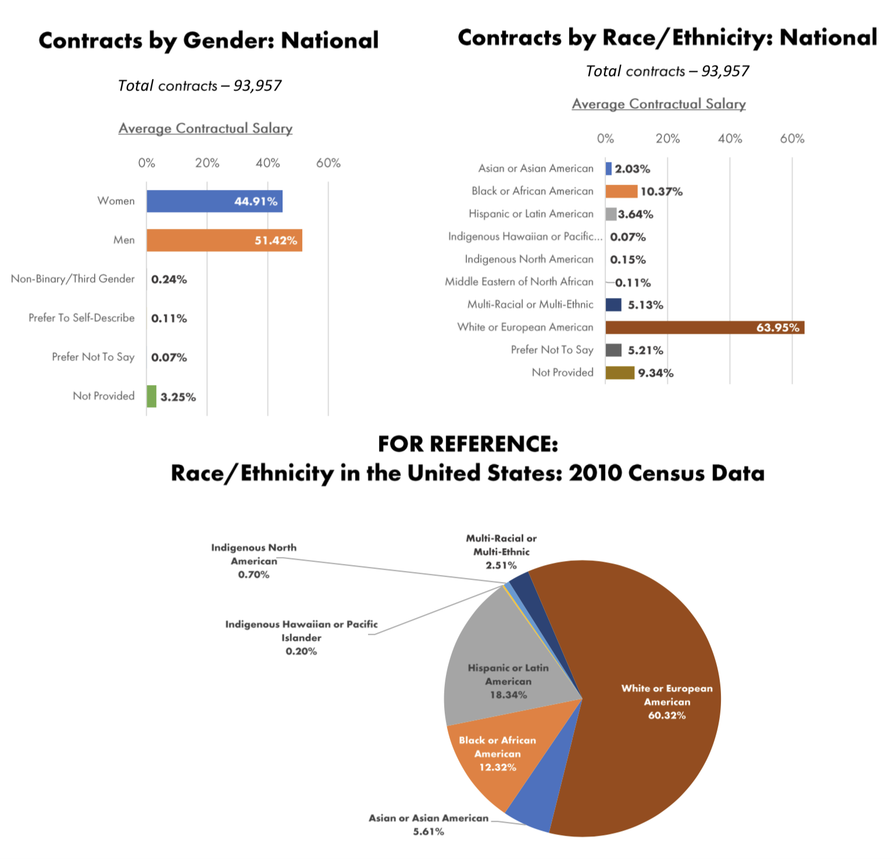
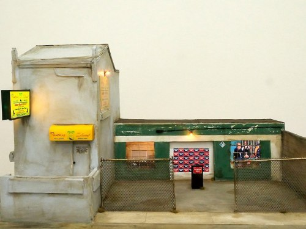

Hi friends,

_I’m [Gus Cuddy](https://guscuddy.com/) and this is [The Curtain](https://guscuddy.substack.com/), a newsletter about the intersections of arts, culture, the internet and the future. New reader? [Subscribe for free](https://guscuddy.substack.com/subscribe)._

⫷⫸

Happy December. The finish line to this year is in sight.

---

#### On the economics and intricacies of funding online theatre and arts

Theatre writer Helen Shaw dropped [a great piece](https://www.vulture.com/2020/11/circle-jerks-recipe-for-a-viral-theater-hit.html) this week detailing a “how to” of replicating the viral success of _Circle Jerk_ (which [I effusively wrote about in October](https://guscuddy.substack.com/p/onlinetheatre)). The article generated some discussion online, particularly around its detail that _Circle Jerk_ had an $87,000 budget. But there’s a few important points I’d like to tease out that are relevant for the future of theatre and arts funding.

The first is Shaw’s semi-tongue-in-cheek-but-also-serious first step to producing a viral theatre hit: “**Start out with a long development process already behind you**”. Shaw is a believer in the power of theatrical institutions to empower work. And she’s dead right about _Circle Jerk_: part of the reason it succeeded is because of its long development process enabled by institutions like Ars Nova. Shaw said on Twitter, in response to an accusation of this point being flippant:

https://twitter.com/helen_e_shaw/status/1333551539735162885?s=12

She’s right that _Circle Jerk_ had a community invest in it. And it’s an interesting point she’s making, almost old-fashioned or traditionalist: even with all the excitement around an online work like _Circle Jerk_, which had big names tweeting about it, we need powerful non-profit institutions to support and enable new work. That hasn’t changed at all. After all, theatre [is still not profitable](https://guscuddy.com/unprofitability): even with Circle Jerk’s success, it didn’t make back its money. (More on this in a moment.)

But that perspective of thinking through traditional institutional routes can be limiting when in comes to a vision of the future of theatre. The best theatre institutions do a lot of good and nurture great new work, sure – but we also complained about their inequities, exclusivity, and whiteness, as well. New play development is always a tricky thing, but I don’t see online theatre as a polished finish point after a road of institutional development. Online theatre is, realistically, an incredibly new form, one that no one has mastered. _Circle Jerk_ is the closest anyone has come to creating a sense of dangerous liveness that mirrors in-person theatre, but not every other successful piece is going to take their path. 

It could be that I’m naive, but I’d like to imagine a version of online theatre where shows can succeed _without_ institutional development and backing. The internet is inherently a democratized, decentralized place — we could say it exists in “streams” as opposed to “containers” — and thinking of the possibilities of viral digital theatre through the lens of centralized institutions (ie containers) feels limiting. Virality in the internet largely comes from thrown together scraps, DIY TikToks or tweets, or messy Instagram Lives. Online theatre doesn’t compete with those – the closer analogy is Netflix – but even with Netflix, the development patterns are quicker and different than traditional models. I’d like to see digital theatre further democratize the _creation_ of new work — not just _access_ to it — and not mirror the same patterns as the physical world.

Besides, there is room for multiple producing models in the future of theatre. Over in the media world, there is a fracturing happening: a simultaneous consolidation of writers going to powerful institutions like _The New York Times_ and fragmentation of writers leaving institutions to start their own [Substack newsletter](https://guscuddy.substack.com/p/substack-decentralization)s. I suspect we’ll see similar consolidation/fragmentation patterns in other industries, too.

But what about that $87,000 budget? Some folks on Twitter were disturbed by the production’s large budget — given that many artists are struggling to make anything right now — but Jeremy O. Harris defended himself, since he _also_ gave money to individuals:

https://twitter.com/jeremyoharris/status/1333541082454515715?s=21

Harris is right: this is what a production of this caliber can cost, especially when you pay everyone right. It shouldn’t be on Jeremy O. Harris to produce every notable piece of theatre right now; there are many rich producers who could do a lot with their money to produce more _Circle Jerk_\-quality work. In a sense, then, Shaw is right: we need community investment to create theatre. I’d love to see more money poured into exploring more theatre/video hybrid productions that expand the form — but also different models of fundraising, given the mass scale of the internet. Perhaps then, with more footholds to latch on to, viral online theatre wouldn’t be handcuffed to traditional theatrical models.

---

## notes from the week

#### list time

1️⃣ Oh, it’s list time. The New York Times and the New Yorker started to drop some of their annual best-of lists. The New York Times’ [best theatre of 2020](https://www.nytimes.com/2020/12/01/theater/best-broadway-theater-show.html) is hilariously bleak (and yes, TikTok showed up there too). But _Dana H._, even without the pandemic, would have likely been the most memorable piece of theatre I saw this year. ([You can read what I wrote about it in March here](https://www.guscuddy.com/tellthetruth).)

🤔 The [25 Greatest Actors of the 21st Century](https://www.nytimes.com/interactive/2020/movies/greatest-actors-actresses.html), according to Manhola Dargis and A.O. Scott… I hate the idea of ranking actors and don’t agree with this list at all (though like a lot of the actors!), but I appreciate some of the blurbs written by the actors’ collagues.

---

#### paris review winter 2020

📍 The Paris Review’s [Winter 2020](https://www.theparisreview.org/back-issues/235) issue is dedicated to theatre (!), and it features a plethora of fabulous content, including [Branden Jacobs-Jenkins doing a long form interview with Suzan-Lori Parks](https://www.theparisreview.org/interviews/7636/the-art-of-theater-no-18-suzan-lori-parks).

---

#### actors’ equity diversity and inclusion report

📊 The Actors’ Equity [diversity and inclusion report](https://actorsequity.org/news/PR/DandIReport2020/diversity-and-inclusion-report-2020) analyzes the demographic information for actor contracts from 2016–2019. Here’s an overview of what they found:

Not surprising. [The whole report is available here](https://actorsequity.org/news/PR/DandIReport2020/diversity-and-inclusion-report-2020).

---

#### dave chapelle’s “unforgiven” and the internet

🎤 The battle between institutions and individuals that has been taking place with the internet is reflected in Dave Chapelle’s latest monologue, “Unforgiven”, [which he posted exclusively on his Instagram](https://www.instagram.com/tv/CH-rR9znT3g/?hl=en). (An interesting point to note: the super large “platforms” like Instagram, Twitter, YouTube, or even Netflix retain a perplexing new role in this internet economy – a category entirely of their own, hosting both individuals and large companies alike.) In it, Chapelle urges us to not watch his own _Chapelle’s Show_, which he was not properly paid for by Comedy Central, and to which he does not even own the rights. Netflix (the good guy here?) removed it from their platform at Chapelle’s request.

---

#### ratatouille and tiktok

🐀 The Ratatouille musical created by TikTok [I mentioned a few weeks ago](https://guscuddy.substack.com/p/the-curtain-83-what-the-tiktok-is) continues to blow up:

https://youtube.com/watch?v=8CYCPVe9NIEhttps://twitter.com/Pixar/status/1330201811932725248

📜 And speaking of TikTok, which everyone seems to be doing these days, there’s been a couple more think pieces on how TikTok shaped this year: from [Bookforum](https://www.bookforum.com/print/2704/notes-on-a-tiktok-quarantine-24264) and [BuzzFeed News](https://www.buzzfeednews.com/article/scaachikoul/tiktok-got-me-through-2020).

---

#### four seasons total landscaping, to scale

from [tracy snelling](https://www.instagram.com/p/CH8-3AVFR_v/):

---

#### assorted links

*   📚🤢 [Penguin Random House is buying Simon & Schuster](https://www.nytimes.com/2020/11/25/books/simon-schuster-penguin-random-house.html)
    
*   Francisa Da Silveira writes about Geva Theatre Center’s audio play series _Recognition Radio_ in American Theatre, holding a conversation with the three other black dramaturgs that were hired for the productions—[Dramaturgy as Abolition: A Dialogue on Blackness, Discernment, and Self-Preservation](https://www.americantheatre.org/2020/11/25/dramaturgy-as-abolition-a-dialogue-on-blackness-discernment-and-self-preservation/)
    
*   Loved this piece (especially as a Pavement fan, lol) on how Spotify’s algorithms make random songs from older artists become popular: [Why Is The Obscure B-Side “Harness Your Hopes” Pavement’s Top Song On Spotify? It’s Complicated.](https://www.stereogum.com/2105993/pavement-harness-your-hopes-spotify/columns/sounding-board/)
    
*   Ah…. [How Do You Know When Society Is About to Fall Apart?](https://www.nytimes.com/2020/11/04/magazine/societal-collapse.html)
    

---

#### recommendation of the week

**Time (2020, dir. Garrett Bradley)**

https://youtube.com/watch?v=kq6Hh07oLvs

Garrett Bradley’s _Time_, available to stream on Amazon Prime (ugh), is a vital and gorgeous documentary about the profound violence of the prison system and its effect on Black Americans, as seen specifically through its subject: Sibil Fox “Fox Rich” Richardson, her husband Robert Richardson, and their family. Bradley mixes home footage from Fox Rich with new footage that Bradley shot herself, covering Fox Rich working tirelessly to free her husband from prison. What I loved was Bradley’s insistence on subtle subversion of the tropes of prison films and the white world’s wallowing in black violence. As suggested by the film’s title, the film has more of a philosophical and metaphysical bent than anything else. As Ismail Muhammad writes in [his profile of Bradley](https://www.nytimes.com/2020/10/06/magazine/time-prison-documentary-garrett-bradley.html) for The New York Times Magazine, there is an exuberant, exalted sense of resistance:

> If, as Fox Rich says in the film, the carceral state wants to impose loneliness — by sundering husband from wife, father from sons, the individual from community — “Time” asserts the power of community as weapon of resistance. We see this in Fox Rich’s recordings, in the poetic cadence of her voice as she addresses her incarcerated husband, in her sons’ defiant exuberance as they leap, dance, swim and smile through the world, secure in their embrace of one another. We see it in the way the film defies many of the clichés of a prison film. There are no scenes shot inside Angola, no images of Rob in a jumpsuit; the only images we see of the prison are shot from on high, giving us a bird’s-eye view and emphasizing how it is occluded from the rest of society.

---

## end note

<figure>
    
    <figcaption>art by&nbsp;<a href="https://www.instagram.com/tinyaviary/">Diana Sudyka</a></figcaption>
    </figure>

⫷⫸

_Thanks for reading!_

_If you enjoy The Curtain, consider [becoming a paying subscriber](https://guscuddy.substack.com/subscribe). It really helps me continue putting this newsletter out._

_New reader? The Curtain is a weekly digital letter sent by Gus Cuddy. You can [subscribe for free here](https://guscuddy.substack.com/subscribe) (feel free to click “None” on the payment page), or [browse the archives here](https://guscuddy.substack.com/archive)._

Till next time,

\-Gus