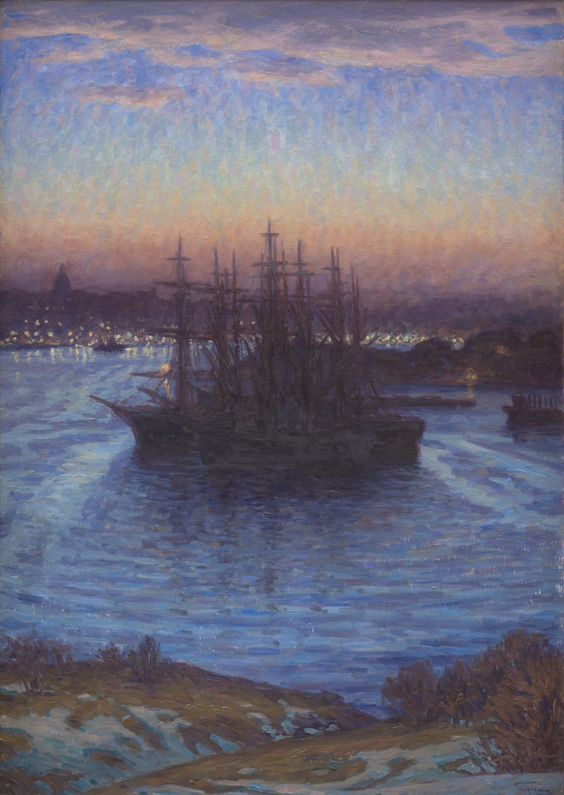
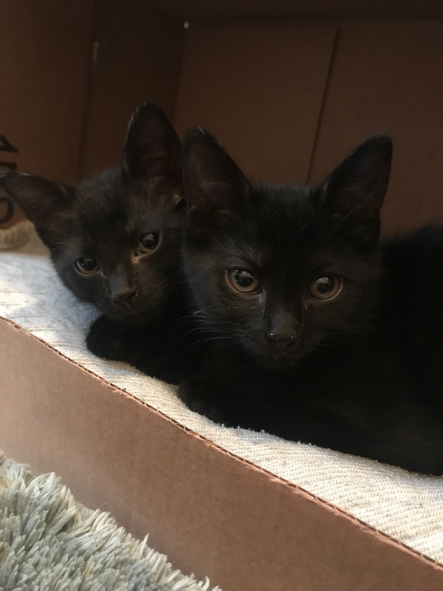

Friends,

I hope you're staying strong as the colder, dreary-eyed months approach; it's like we're in a thick fog out at sea, as we search for land.

<figure>
    
    <figcaption><a href="https://open.smk.dk/en/artwork/image/KMS3401?q=winter&amp;page=0&amp;filters=public_domain%3Atrue%7Chas_image%3Atrue%7Con_display%3Atrue">Ships at Anchor. Winter, 1908. Eugen</a></figcaption>
    </figure>

_`I’m` [`Gus Cuddy`](https://guscuddy.com/) `and this is` [`The Curtain`](https://guscuddy.substack.com/)`, a newsletter about arts, culture, and algorithms. New reader?` [`Subscribe for free`](https://guscuddy.substack.com/subscribe)`.`_

---

In the most important personal update of the entire pandemic: my partner and I adopted two beautiful black kittens. Meet Poppy and Lyra:

Adopting pets checks off another item of quarantine bingo. But during these longer, lingering months of winter, small beings of soft warmth will — we hope — be a smooth balm to the heart.

---

## Notes from the Week

#### Arts and Unpaid Labor: goodbye to The Flea

The Flea, a staple in the downtown theatre scene in New York, has long fed on the exploited, unpaid labor of young artists. Their programs for young artists — the non-union Bats acting program, in particular — are predicated on career advancement and community, but the entire operation runs on their free labor. It’s been a dark underside in the story of New York theatre, a practice that unfortunately has been replicated throughout the country at various insidious institutions — the toxic “unpaid internship for experience” became widespread in the 2000s and 2010s, extending to all of the arts and entertainment industry. Those internships have rightly come under heavy fire in the last couple years, but The Flea insisted that their programs were _different_.

In June this year, with all the institutional upheaval that was happening, the Flea promised to pay its artists, following a public letter from Bryn Carter. The resident artists of The Flea self-organized and struck, coming to the theatre with a list of demands over the summer and fall. And last week, after feet dragging by the Staff and Board, the theatre informed its group of resident artists that they were all being let go.

It’s an act of gross union busting, among many other things, but the response in the community has been brutal. The organizing resident artists wrote a badass [statement refuting The Flea](https://drive.google.com/file/d/1HjU_fVtNFl1CaXZNbMM_aVAa8SNKLN5J/view). A brilliant parody Twitter account of the theatre company popped up, before getting suspended by Twitter. And people called the theatre out on its BS.

I don’t see a path forward for The Flea as it currently exists. They opened their expensive new theater in Tribeca three years ago; demands to hand over the keys are circulating. It’s 2020: it’s time to end exploitative, unpaid labor in the arts. It’s time to listen, and then to act. It’s time for reform to happen from the bottom-up and inside-out, not from the top-down and surface. It’s time to value artists and actors as more than just livestock to be shuttled around, this way and that, till souls are sucked out and submitted to the grinding machinery of no-good power dynamics, leaving nothing in its wake.

⫷⫸

Speaking of paying artists, theatre’s patron saint Jeremy O. Harris partnered with New York Theatre Workshop [to launch a new $50,000 commission for new works](https://www.playbill.com/article/jeremy-o-harris-and-nytw-launch-50k-commissions-for-new-works).

---

#### Warner Bros and the Death of Movie Theaters

Last week, [Warner Bros. made the paradigm-shifting announcement](https://www.nytimes.com/2020/12/03/business/media/warner-brothers-movies-hbo-max.html) that they plan to release all their 2021 releases — 21 films, including their biggest projects — in theaters and directly to the streaming service HBO Max at the same time, on the same day. It means that, when a movie is released, people don’t have to go to the theater. They don’t even have to pay extra for it, like was the case with Disney+’s _Mulan_. They just need to have HBO Max.

HBO Max is an interesting story: it’s one of the most confusing streaming platforms, and it’s vastly underperforming expectations: people aren’t signing up. (Not to mention they still haven’t struck a deal with Roku, so whenever we want to watch anything from there at our apartment I need to awkwardly hook my laptop to the TV with an HDMI cord.) But their catalogue is, well, superb: everything from HBO and Warner Bros., a great collection of older movies, and plenty more. It just seems that AT&T, the bumbling monopoly that owns WarnerMedia, has no idea what they’re doing in regards to the service — [they can’t even get people who get it for free to watch](https://www.theverge.com/2020/10/22/21528234/hbo-max-subscribers-activations-att-directv-warner). So they’re throwing a Hail Mary, and in the process upending movie distribution: with the pandemic not promising an easy return to moviegoing in 2021, they’ve decided to pretty much say “fuck it” to movie theaters altogether. 

You can still go to the theater and see the movies, if you want. But it’s clear that the move here is to push people to watch from their home and pay AT&T $15/month for HBO Max. [AMC Theaters are predictably concerned](https://variety.com/2020/film/news/amc-warner-bros-hbo-max-1234845908/); director Christopher Nolan (ah!) called HBO Max [“the worst streaming service.”](https://www.hollywoodreporter.com/news/christopher-nolan-rips-hbo-max-as-worst-streaming-service-denounces-warner-bros-plan). (Nolan’s movie _Tenet_, from earlier this year, was the movie that was supposed to reinvigorate moviegoing in 2020; it failed.)

All this has enabled a lot of nervousness over the future of movie theaters. Are they dead? Is the future of film distribution going to be focused on skipping theaters and going directly to at-home, as Netflix seems to have indicated? And how harmful is this to the art form, to the filmmaker? 2020 has already been brutal to smaller movie theaters, and that’s where my heart is here. It’s difficult when there’s a pandemic keeping people from going to the cinema anymore; it’s even more difficult when the entire Hollywood-complex is moving their capital in the direction away from theaters and towards tech and online distribution. 

Small movie theaters don’t just offer a place to see movies on a big screen — they offer curation. And hand-picked curation is something that’s becoming more difficult to come by these days, when large corporations homogenize content and culture. On a streaming platform you get algorithmic distribution, where everything holds the same weight: because it exists outside the confines of physical space and linear time, content blends together into amorphous shapes. But at the local cinema, that’s not the case.

⫷⫸

[I enjoyed Peter Labuza’s take on this](https://www.polygon.com/2020/12/4/22151268/hbo-max-2021-warner-bros-releases-movie-theaters-vs-streaming) — well worth a read. He comes down on the side that this is…not smart.

---

#### art and algorithms

One of the biggest problems with the algorithm in services like Spotify is that it overvalues art on a per-play basis. That’s an inherently limited scope for what constitutes good art. I loved this thread from Holly Herndon:

https://twitter.com/hollyherndon/status/1335973628815536130

Great art does not necessarily invite repeat experiences.

Another point: algorithms make culture repetitive because they base the future off the past. It’s another reason that tech companies can have an inverse impact on the state of art.

As Herndon writes: “Culture is a complicated ecosystem. Behind the popular song we listen to on repeat is decades of experimentation that was not very popular. Without support for that we get cul-de-sacs.”

---

#### the places we’ve lost this year

In looking back at 2020, one of the most enduring emotions of 2020 is _grief_. There has been such loss among so many different horizons this year: the individuals we’ve lost, the collective grief we feel, and the organizations, institutions, and communities that have come and gone. Living in New York, there’s a deeply melancholic nostalgia when looking at old photographs of the city, like seeing places vanish before our eyes. That’s why I enjoyed—or perhaps that’s too strong a word?—_[Curbed](https://www.curbed.com/article/nyc-businesses-closed-2020-pandemic.html)_[’s annual “Reasons We Love New York” piece](https://www.curbed.com/article/nyc-businesses-closed-2020-pandemic.html), which this yearly sadly collects 500 places that closed this year in New York, as if watching different corners of the city peel away. It’s the photographs and memories that do the extra work here — memories of your own, yes, but also the memories you realize you’ll never have, nostalgic for something you might never have experienced. And perhaps it’s that certain type of grief — of not knowing — that will hang weightiest over this year, when all is said and done.

---

#### quarantine culture is internet culture

[I enjoyed Vulture’s “Quarries”](https://www.vulture.com/article/best-quarantine-culture-quarries-2020.html?utm_campaign=vulture&utm_medium=s1&utm_source=tw), which attempt to wrap the best, weirdest culture from the year of the quarantine. It’s a nice round-up of everything that happened in the cultural landscape this year, including a shout-out to _Circle Jerk_, _The Seagull on Sims 4_, and other pieces I’ve written about here. 

But what the overview of the year in culture most deeply indicate is how this was the year where the internet truly became a geographical construct in our minds. It’s now _the_ place where culture takes place, connecting us all in what media theorist Marshall McLuhan’s predicted as a “global village”. With the pandemic isolating people to their homes, any sense of locality began to be replaced by the virality of the global internet.

---

## end note

https://twitter.com/saitoukazu/status/1334910809525239810

---

_Thanks for reading!_

_If you enjoy The Curtain, consider [becoming a paying subscriber](https://guscuddy.substack.com/subscribe). It really helps me continue putting this newsletter out._

_New reader? The Curtain is a weekly digital letter sent by Gus Cuddy. You can [subscribe for free here](https://guscuddy.substack.com/subscribe) (feel free to click “None” on the payment page), or [browse the archives here](https://guscuddy.substack.com/archive)._

Till next time,

\-Gus