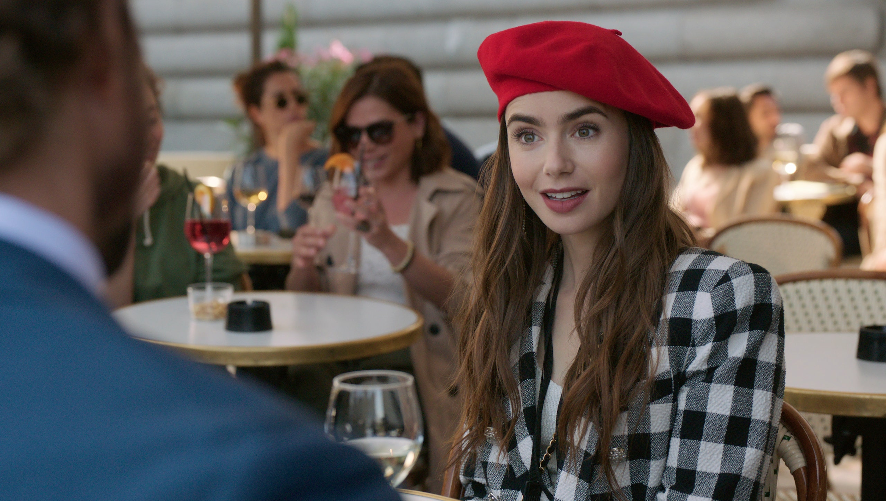
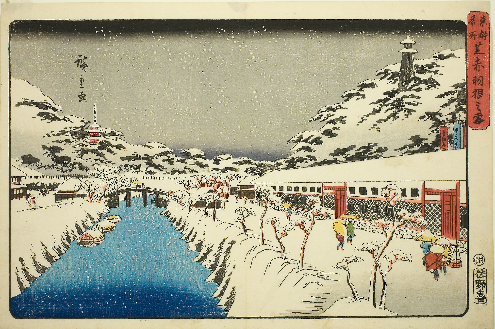

We're fast approaching the end of a year that seems like it came and went in some strange fugue-like dream. I know the main way I seemed to mark time was via these weekly dispatches. So I thank you for reading.

I'm planning to wind these down for the end of the year. Next week will probably be a short piece collecting my favorite things of the year. I'll pick back up full swing in January.

This week: some ideas I've been thinking about when thinking about what defined the Year in Culture in 2020 — a surprisingly slippery task. As always, if you enjoy these newsletters, please consider sharing it with others! It really helps me out.

---

## The Year in Culture

What _was_ 2020, the year that never ended, marked by a global pandemic that killed millions? Many terrible things, some good things, lots of strange things: a year from hell, a year of tremendous loss, a year that signaled the future, a year that revealed our deep inequities, a year that truly shifted us into the internet age, a year of isolation? At the very least: a year where we entered a multiverse of reality, where different groups of people seemed to have different opinions and interpretations of reality, like a bad college philosophy discussion. In arts and culture, we saw a year of incredible loss: of individuals, of organizations, of ritual. We also saw deep cultural shifts take place. I’d like to offer a few different perspectives of what defined this weird-ass year in culture.

### a year of non-fiction, reality, and unreality

2020 was a year defined by _non-fiction_, in several parts.

First was the nightmarish visions that existed primarily in the worlds of history and/or fiction, bubbling up to the surface of present reality: apocalyptic pandemics, fascist regimes, political coups, quarantines, forest fires, and dystopian technology companies watching our every move.

Second: aesthetics and reality merged and swallowed each other up, each eating the other’s tail. Much of the art, content, and media that was created (those three ever mingling together) and became popular this year was defined by elements of non-fiction, playing with reality.

I first noted this trend in theatre at the end of last year, with Tina Satter’s brilliant transcription-play _Is This a Room_. But it was Lucas Hnath’s astonishing _Dana H._ (which somehow came out this year) that solidified this idea: a play that was barely a play, scratching against reality to the extreme, playing the audio of Hnath’s own mother recounting her experience of being abducted by the Aryan Brotherhood, lip-synced by Deidre O’Connell. ([I wrote about them both earlier this year](https://guscuddy.com/tellthetruth/).) It just so happened that that was the last play I saw in a live theater in New York before the apocalypse, and it felt scarily foreboding for the year: a work that held its audience in a vice-like state of breathless, disturbed awe. (It also was a reminder of what going to the theatre was: I ran into multiple old friends and downtown theatre folk at the theater, and was swept out onto the street on a giddy high of what theatre could be. It was one of those nights that make all the bad theatre and all the stress of the business seem worth it, reaching towards some deeper meaning.)

<figure>
    
    <figcaption>How to with John Wilson</figcaption>
    </figure>

Some of the best TV and movies from this year were also documentary: Garrett Bradley’s evocative _Time_, Kirsten Johnson’s reality-bending _Dick Johnson is Dead_, or my favorite show of the year, the uncategorizable _How to With John Wilson_. (The finale episode, marked by the distinct march of time in 2020, was special.) And who can forget that the start of pandemic binge-watching was brought in by the documentary series _Tiger King_, one of those stranger-than-fiction stories in a year that was stranger-than-fiction in and of itself? (Actually, I _can_ forget—that show seems curiously vapid and wispy in retrospect.)

And how can we talk about the year in culture in 2020 without talking about TikTok, its defining medium? Whenever I think about it this year I think about a quote [from an interview](https://www.standard.co.uk/go/london/theatre/play-talk-christopher-shinn-on-why-collaboration-is-crucial-and-how-social-media-will-change-art-a3607931.html) with playwright Christopher Shinn from 2017:

> Social media — the ability to create and publish “art” from one’s life, and consume “art” from one’s circle — is going to further evolve and eventually overtake art as it exists today. My advice to writers starting out is, write as a hobby and choose something else as a career.

Credit to Shinn: this is some cynical advice, but it’s surprisingly potent three years later. TikTok turns life into one giant reality TV show, addicting and [totally immersive](https://kylechayka.substack.com/p/essay-how-do-you-describe-tiktok). It pumps up reality to be memeable, algorithmic, and full of dances. This isn’t non-fiction in the sense of documentary, but it’s in effect documentary-adjacent: people documenting aspects of their lives. Amplified to a million. It became the staging ground for all culture in 2020: a bizarre, hallucinatory venue of reality.

---

### the year of algorithmic ambience

TikTok’s defining feature is its algorithm; it works shockingly quickly and efficiently, unlike the general dumbness of Twitter or Instagram’s. Pausing for a few seconds to watch a funny dog video suddenly whirls you towards consuming animal content, each video rhythmically taking up the entirety of the screen with a swipe. When one suddenly finds themselves in some weird corner of TikTok, unsure how they got there or what’s even happening, the experience—especially for a non-Gen-Z-er—is overwhelming, helplessly stimulating, and inevitably dulling.

This general dulling of the senses is an important trait of 2020, where algorithmic ambience had to be delivered to people’s homes. TikTok carried the brunt of this work, but many other platforms through their hats in the ring as well. Each aimed to quiet our existential malaise with a parade of passive content that goes down syrupy smooth.

Largely unable to go outside, we turned to the Netflix era of [Ambient TV](https://www.newyorker.com/culture/cultural-comment/emily-in-paris-and-the-rise-of-ambient-tv) to comfort us, as seen in shows like _Emily in Paris_, _Love is Blind_, or any of the other ridiculous shows that Netflix trotted out in 2020. Without travel or the outside world, expensive TV shows that looked good but were very bad were exactly the kind of background filler we needed. Kind of like the Sweetgreen of television.

These shows had more in common with social media than traditional television, though. They’re emissions in the endless circle of algorithmic content. Writer Kyle Chayka offered this idea in [his New Yorker essay on the rise of ambient TV](https://www.newyorker.com/culture/cultural-comment/emily-in-paris-and-the-rise-of-ambient-tv):

> TV is social media and social media is TV—an ouroboros. The McGee ambient universe sprawls across platforms, **perpetuating the hallucination of the normal**

Similarly, digital trends in 2020 tended towards algorithmic ambience and general homogeneity. Spotify expanded its quest for the commodification of our eardrums by acquiring several large podcast brands, including The Ringer and Joe Rogan. For Spotify, podcasts might even be better for general ambience than music: there’s no licensing fees, and many folks put voices in their head through their AirPods to feel less alone — podcasts are another kind of comfort food, especially in 2020. Either way the goal is clear: constant streams of content into your ears, delivered algorithmically. ([That’s how you end up having a random Pavement B-Side become their most played song on the platform.](https://www.stereogum.com/2105993/pavement-harness-your-hopes-spotify/columns/sounding-board/)) With quarantines, content needed to be delivered non-stop, and the algorithms merely grew in significance. 

---

### the year of the mask, part 2

In December of last year I declared 2019 “[The year we wore masks to hide our trauma.](https://guscuddy.substack.com/p/the-curtain-36-the-year-we-wore-masks)”. God dammit. Turns out those cultural metaphors became literal reality in 2020, the year where we actually did wear masks.

Now we _all_ hide, in some way or another. Face-to-face communication is fading away. We retreat into our small pods of close family and friends. For some, the retreat inwards was the monastic journey they’d been waiting for. But for most of us, we retreated away from people, away from crowds, and ended up not somewhere reflective or internal — gosh, that would be scary! — but instead diddling around all day on a stupid thing called the internet.

And thus the most significant cultural trend of the year is that 2020 became the year where the internet fully emerged into its own geographical landscape in our collective minds — and, for the most part, usurped the physical world. _All_ culture happened online, and so did most work; locality became less important; Zoom became the new highway. The internetization of everything has accelerated in recent years, but in 2020 it was a lifeline, the only way to communicate, seemingly the only way to know _what the hell was going on_. It was also the catalyst for the uprisings that happened this summer and continue to happen.

When all is said and done and the masks finally come off, the world will be irrevocably changed. Behind those masks is the same thing I wrote about last year: trauma. The trauma of a year of so much loss and grief; the trauma of deep loneliness; the trauma of a country with deeply embedded, systemic wounds, playing out the same script today.

For those that have seen it, I keep thinking about the final lines of David Lynch’s 2017 _Twin Peaks: The Return_, which seem strangely prescient in 2020. I won’t spoil it, but it ends on a question of paralyzed confusion about time, and a recognition of unspeakable trauma. It’s an image that keeps coming back to me: unknowable confusion at the state of the world. After the weight of those masks and all they carry, there’s going to need to be a lot of healing to go around.

---

## notes from the week

*   [Tim Cook decided to cancel Cord Jefferson's Apple TV+ show \*Scraper\* because it was about Gawker](https://www.nytimes.com/2020/12/13/business/media/apple-gawker-tim-cook.html).
    
*   I can't believe I just discovered this, but I highly recommend the podcast [On TAP](http://www.ontappod.com/), about theatre and performance studies, for those interested in theatre and form. I especially enjoyed [their most recent episode](http://www.ontappod.com/home/2020/12/11/044).
    
*   Maybe Nolan has a point...
    
*   Oh no... [the Ratatouille TikTok musical will be produced as a streaming concert to benefit the Actors' Fund](https://www.playbill.com/article/ratatouille-the-tiktok-musical-streaming-concert-to-benefit-the-actors-fund).  I can't tell if this is funny or the worst thing that's ever happened
    
*   Diep Trans on [The Flea Theater Controversy](https://www.backstage.com/magazine/article/the-flea-theater-off-broadway-interviews-72294/)
    
*   [The Wealthy Are Leaving Cities. Good Riddance](https://www.vice.com/en/article/pkdkg9/the-wealthy-are-leaving-cities-because-of-covid-good-riddance-v27n4)
    
*   [Dean Kissick’s Year in Review for Spike Magazine](https://spikeartmagazine.com/articles/downward-spiral-2020)
    

---

## end note

<figure>
    
    <figcaption>Utagawa Hiroshige</figcaption>
    </figure>

a snowstorm is coming.

++

_Thanks for reading!_

_If you enjoy The Curtain, consider [becoming a paying subscriber](https://guscuddy.substack.com/subscribe). It really helps me continue putting this newsletter out._

[Subscribe now](https://guscuddy.substack.com/subscribe?)

_New reader? The Curtain is a weekly digital letter sent by [Gus Cuddy](https://guscuddy.com). You can [subscribe for free here](https://guscuddy.substack.com/subscribe) (feel free to click “None” on the payment page), or [browse the archives here](https://guscuddy.substack.com/archive)._

_[Follow me on Twitter @guscuddy](https://twitter.com/guscuddy)._

Stay well,

\-Gus