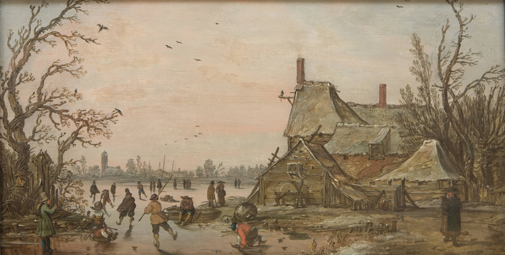

Hello all,

I'm writing this from the Finger Lakes in Western New York, where I'm with family for the first time since pre-pandemic. We all quarantined and got tested, but it feels foreign to be with others. Like we're doing something wrong. Many of us are growing alien-like in our faintly-used person-to-person interaction skills.

This will be the last issue of *The Curtain* this year. I'll be taking a short break from it for the holidays, and will be back in January with a fresh new Season. As always, thanks for reading through the weird and scary year that was 2020.

---

## What I Published This Year

I'm now 88 weeks into publishing this newsletter. It's been a fun time, but I'm still learning. Last year [I did a year-in-review of what I wrote](https://guscuddy.substack.com/p/the-curtain-38-2019-year-in-review), and it felt nice. Honestly, I wanted to write more longform pieces and work steadily on some other writing projects this year. But despite the free time, I found it difficult to get anything done at all! Yet I did manage to send out something here every week. Here are some of my favorites, organized by theme:

### culture

-   **[What Happened in 2020?](https://guscuddy.substack.com/p/the-curtain-87-what-happened-in-2020)** - I published this piece last week, looking at lenses in which to view the year in culture.

-   **[Simple Contracts](https://guscuddy.substack.com/p/the-curtain-77-simple-contracts)** - In 2020, reading physical books *felt good*. (But I didn't do it enough.) Why? Partially because of the simple contract you have with a physical book: there's no surveillance capitalism that's leaking in here.

-   **[The end of cities?](https://guscuddy.substack.com/p/the-curtain-71-the-end-of-cities)** - What does the future of New York hold?

-   **[Types of Intimacy](https://guscuddy.substack.com/p/the-curtain-67-types-of-intimacy)** - Thinking about the loss of collective intimacy this year, but the different types of individual and networked intimacy that have become more prominent in 2020.

-   **[Bottom-Up, not Top-Down](https://guscuddy.substack.com/p/the-curtain-52-bottom-up-not-top)** and **‌[What is emerging?](https://guscuddy.substack.com/p/the-curtain-62-what-is-emerging-)** - Bottom-up, emergent thinking is critical to the future: fractals that replicate from small to all.

-   **‌[On Truth in Art: perception, illusion and un-reality in the work of Lucas Hnath, Tina Satter, and the Safdie Bros.](https://guscuddy.substack.com/p/the-curtain-46-how-to-tell-the-truth)** - One of the last things I wrote pre-pandemic, about the great *Dana H*, and the reality-mixing in art.

#### minimalism series

I wrote a couple critiques of minimalism early this year:

-   **[The Cult of Minimalism, and the Untapped Potential of Maximalism](https://guscuddy.substack.com/p/the-cult-of-minimalism-and-the-untapped)**

-   **[The Hidden Conservatism in Minimalism](https://guscuddy.substack.com/p/the-curtain-45-the-hidden-conservatism)**

### theatre & film

-   **[Checking in on Online Theatre](https://guscuddy.substack.com/p/onlinetheatre)** - A review-type piece looking at *Circle Jerk*, *Heroes of the Fourth Turning*, and *American Dreams*. Fake Friends retweeted it:

https://twitter.com/faaakefriends/status/1321506832440004608

-   **‌[On the economics and intricacies of funding online theatre](https://guscuddy.substack.com/p/the-curtain-85-funding-the-future)** - Here I discuss the old and new paradigms around arts funding, centering around theatre. What's the role of institutions in new play development in a rapidly changing future?

-   **[The Disneyfication of Hamilton](https://guscuddy.substack.com/p/the-curtain-64-the-disneyfication)** - *Hamilton* became popular all over again this year. There was a lot of money involved.

-   **[Could film and theatre converge?](https://guscuddy.substack.com/p/the-curtain-58-could-film-and-theatre)** - Looking at Zia Anger's brilliant *My First Film* and Richard Nelson's Zoom play *What Do We Need To Talk About?* (one of the first successful Zoom plays, which feels like ten years ago).

-   **[Early pandemic musings on the long-term outlook of theatre, and whether art is essential](https://guscuddy.substack.com/p/the-curtain-57-the-long-and-the-short)**

-   **‌[A vision for a sustainable future of theatre](https://guscuddy.substack.com/p/the-curtain-54-how-to-build-the-future)** - Short ideas about what it would take to build a sustainable future for theatre.

-   **‌[The Changing Tides of European and American Theatre](https://guscuddy.substack.com/p/european-theatre-vs-american-theatre)** - Why our attitude about Ivo Van Hove has shifted from positive to lukewarm over the last few years.

-   **‌[The Rise of the Influencer Playwright and Director](https://guscuddy.substack.com/p/the-rise-of-the-influencer-playwright)** - .We're in the age of the influencer playwright and director (though with directors, the main influencer-auteurs given platforms are still white men), where the individual can hold far more sway than an institution.

### internet and media

-   **[The experience of the internet: dancing with oblivion](https://guscuddy.substack.com/p/the-curtain-75-dancing-with-oblivion)** - Why do we doom-scroll online? Perhaps a deep drive for eternal Nothingness. Yeah. But not the good kind of [Jenny Odell "How to Do Nothing"](https://bookshop.org/books/how-to-do-nothing-resisting-the-attention-economy/9781612197494) nothingness.

-   **[Why Open Podcasting Matters](https://guscuddy.substack.com/p/the-curtain-59-why-open-podcasting)**: After Spotify bought Joe Rogan's podcast (and made several other huge podcast acquisitions), I wrote about why Spotify's model is bad, and why we should care about the model of open podcasting.

-   **[Substack, Decentralization, and the Future of Arts](https://guscuddy.substack.com/p/substack-decentralization)** - I wrote a series of short columns wrestling with many writers leaving news institutions and starting their own [Substack](https://substack.com/) newsletters this year. This short piece examines the larger cultural shifts at play.

---

## The Best Things from a Hellish Year

In spirit of the amorphousness of time, content and form this year, and in lieu of typical "best of" lists, here's an amorphous list of my favorite things of the year:

-   _[How To with John Wilson](https://www.imdb.com/title/tt10801534/)_

-   _[Dana H](https://guscuddy.substack.com/p/the-curtain-46-how-to-tell-the-truth)_, Lucas Hnath

-   [Ziwe Instagram Lives](https://www.vulture.com/article/ziwe-fumudoh-instagram-live.html)

-   _[Fetch the Bolt Cutters](https://en.wikipedia.org/wiki/Fetch_the_Bolt_Cutters)_, Fiona Apple

-   _[Circle Jerk](https://guscuddy.substack.com/p/onlinetheatre)_, Michael Breslin and Patrick Foley

-   _[Time](https://www.imdb.com/title/tt11416746/)_, Garrett Bradley

-   _[Punisher](https://phoebebridgers.bandcamp.com/album/punisher)_, Phoebe Bridgers

-   _[Never Rarely Sometimes Always](https://www.imdb.com/title/tt7772582/)_, Eliza Hittman

-   _[Set My Heart On Fire Immediately](https://perfumegenius.bandcamp.com/album/set-my-heart-on-fire-immediately)_, Perfume Genius

-   _[I May Destroy You](https://en.wikipedia.org/wiki/I_May_Destroy_You)_, Michaela Coel

-   _[Healing is a Miracle](https://juliannabarwick.bandcamp.com/album/healing-is-a-miracle)_, Julianna Barwick

-   _[Rough And Rowdy Ways](https://en.wikipedia.org/wiki/Rough_and_Rowdy_Ways)_, Bob Dylan

-   _[Da 5 Bloods](https://www.imdb.com/title/tt9777644/)_, Spike Lee

-   _[Saint Cloud](https://waxahatchee.bandcamp.com/album/saint-cloud-2)_, Waxahatchee

-   [David Lynch "TODAY'S NUMBER IS..." video series](https://www.youtube.com/watch?v=W-3MP27IU-I&list=PLTPQcjlcvvXFtR0R91Gh5j9Xi8cq0oN3Y)

-   [The NBA Bubble](https://www.nytimes.com/2020/09/30/magazine/nba-bubble.html)

---

## Notes from the Week

**WTF is happening with this ratatouille musical**

[It started as a joke](https://guscuddy.substack.com/p/the-curtain-83-what-the-tiktok-is), and here we are: 2020 winner Jeremy O. Harris [is producing a benefit reading of the TikTok Ratatouille musical](https://www.playbill.com/article/original-video-creators-tapped-to-provide-music-for-ratatouille-the-tiktok-musical-lucy-moss-to-direct), which is being adapted by *Circle Jerk* creators Michael Breslin and Patrick Foley, choreographed by Ellenore Scott, directed by Lucy Moss. Original video creators are involved too. I think this is a fitting end to the year in theatre for 2020: pure chaos, plus TikTok.

**Speaking of Jeremy O. Harris...**

...[he also produced a fashion collection with SSENSE](https://www.vogue.com/article/jeremy-o-harris-ssense-works-collection-launch).

---

**[Not Writing](https://www.playwrightshorizons.org/shows/trailers/not-writing/)**

Absolutely loved [this vulnerable piece](https://www.playwrightshorizons.org/shows/trailers/not-writing/) from playwright Clare Barron (_Dance Nation_) on her non-writing process. It's refreshing to see a "successful" writer deep dive into her inability to write right now, and also analyze (with a critical eye) the privilege of her success at a young age.

---

**On TAP**

I just recently discovered "[On TAP: A Theatre & Performance Studies Podcast](http://www.ontappod.com/)", which I recommend to anyone interested in theatre and form. Their recent episodes have been excellent, with a rotating panel discussing performance in 2020.

---

**The New York Times Retracted Caliphate**

After a lengthy review, [The New York Times announced that they're retracting their popular podcast](https://www.npr.org/2020/12/18/944594193/new-york-times-retracts-hit-podcast-series-caliphate-on-isis-executioner) on ISIS called *Caliphate*, from 2018, because of poor information and bad reporting. Oh!

---

**The web is all form**

Liked this quote from writer [Robin Sloan](https://www.robinsloan.com/), on how he thinks about creating writing and media on the internet:

> I learned from using those Macs early on that **form is always malleable**. This became even more apparent when the web came into the picture. Think about it: **there's no way to make a web page or a blog that is not an act of playing with its form at the same time as you're creating its content**. So it just seemed natural: the world was always telling me that you worked on those two things -- the container and its contents -- together.

[via](https://superorganizers.substack.com/p/tasting-notes-with-robin-sloan)

---

## ❄️ end note

<figure>

<figcaption><a href="https://open.smk.dk/en/artwork/image/KMS1537?q=winter&page=0&filters=public_domain%3Atrue%7Chas_image%3Atrue">Winter Scene at a Farm, 1622 - 1626. Goyen and Velde</a></figcaption>
</figure>

Thanks so much for reading this year. I wish you a safe, healthy, and healing end of the year.

⫷⫸

_The number 1 best thing you could do to help me out is to forward this newsletter to a friend you think would like this kind of thing!_

[Share](https://guscuddy.substack.com/p/the-curtain-89-2020-year-in-review?token=eyJ1c2VyX2lkIjoxMzAxMDM5OCwicG9zdF9pZCI6Mjc3MjAyNTAsImlhdCI6MTYyMDE2MjgxNSwiaXNzIjoicHViLTI3NTEiLCJzdWIiOiJwb3N0LXJlYWN0aW9uIn0.CfneTzdH-c3U2YMsw23cWlDYxrzgoAt9V--wMC3aNWE&utm_source=substack&utm_medium=email&utm_content=share&action=share)

_If you enjoyed The Curtain this year, you could also consider [becoming a paying subscriber](https://guscuddy.substack.com/subscribe). It really helps me continue putting this newsletter out. As of now, it's just a way of supporting---there are no additional benefits (I want to focus on putting this free weekly newsletter out). I hope that will change next year and I'll be able to offer more._

[Subscribe now](https://guscuddy.substack.com/subscribe?utm_medium=web&utm_source=subscribe-widget&utm_content=27720250)

_You could also even gift it to someone! What an amazing gift that would be!_

[Give a gift subscription](https://guscuddy.substack.com/subscribe?&gift=true)

_New reader? The Curtain is a weekly digital letter sent by [Gus Cuddy](https://guscuddy.com/). You can [subscribe for free here](https://guscuddy.substack.com/subscribe), or [browse the archives here](https://guscuddy.substack.com/archive). [Follow me on Twitter @guscuddy](https://twitter.com/guscuddy)._

See you in 2021 (holy shit!),

-Gus
