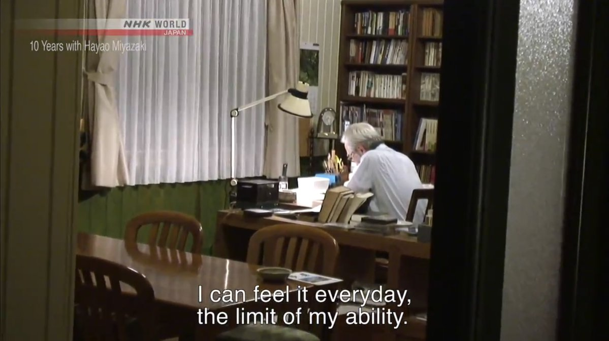

_I’m [Gus Cuddy](https://guscuddy.com/) and this is [The Curtain](https://guscuddy.substack.com/), a newsletter exploring culture through the intersections of arts, performance, and the internet. New reader? [Subscribe for free](https://guscuddy.substack.com/subscribe)._

---

Ah, friends! It feels like a million years have passed since I last wrote in late December. Since then, the world has strangely not burned down, though it has gotten close.

Welcome to what I’m officially calling “Season 2” of _The Curtain_. Season 1 had a long run—88 issues, to be exact—but I’m declaring this a new Season. What does that mean? Not too much – it’s mainly just a cute way for me to break things up.

In my nice three week break from writing, I thought about what I wanted to cover in these weekly digital transmissions. It started off being a newsletter generally about creativity and theatre, but over the years, and with the pandemic, it has morphed somewhat. Covering live theatre right now is difficult and disheartening; despite there being a plethora of great things happening online, I find myself more and more distant from theatre. This will change, I’m sure. But at the same time, I wonder for how many folks in the business it won’t; if this extended break from a challenging industry is the cue that they need to exit the career stage right, gracefully. I certainly wouldn’t blame them.

---

So what _is_ The Curtain? In Season 2, I’m still going to cover some theatre, film, and other arts; but more and more, I’m going to be uncovering what is the greatest performance around right now: the digital world. I’m _fascinated_ with the internet and what it has to say about us as humans and as artists. So _The Curtain_ will explore culture through the strange intersections of art, performance, and the internet.

And boy – what a god damn year it’s been for the internet already! Just a banner year, and we’re a mere three weeks in.

Since we last talked, yes, That Big Thing happened: a group of fascist white supremacists stormed the Capitol Building of the United States on Trump’s behalf. Many of these folks believed in delirious conspiracy theories like QAnon. And most of them were radicalized on websites like Facebook, Twitter, or the cesspools of overt racism-masked-as-free-speech platforms like Parler, Gab, TheDonald, or others. Parler was subsequently taken down from services like Apple, Google, and Amazon. Oh, and the President was banned from using Twitter.

Sheesh.

---

### show biz and web space

Over the last few months, with all my free time, I’ve been delving deeper into exploring a long dormant hobby of mine: web development. It’s exciting to me, and almost the opposite of theatre (my other “job” lol) right now: I have complete control over it, can identify and fix its problems, get quick and immediate feedback, and am rewarded with a sense of progress. As I’ve learned more about the internet, and as we’ve _all_ experienced and thought more about the internet more than ever, I’ve become enchanted by what I’ll call “Web Space.” But I’ll get to that in a minute.

First: conceptualizing the digital world as a _space_ can lead to the wrong direction when trying to understand it in relation to the “analog” world. As L. M. Sacasas writes in his quite brilliant reflection [“The Insurrection Will Be Live Streamed: Notes Toward a Theory of Digitization”](https://theconvivialsociety.substack.com/p/the-insurrection-will-be-live-streamed), there can even be dissociating effects \[emphasis mine\]:

> Speaking of the digital sphere as a place or even a space is part of the problem. **Digital tools do not generate places in the ordinary sense of the word, they mediate relationships, in part precisely by disassociating the self from place**. It seems to me that if you think of “online” as a place, it is easier to imagine that this place is somehow detached from the so-called real world—you leave here and go there. However, if you think instead of digitized relations, then that temptation seems to lose its plausibility. The key is to understand the nature of these relations. 

I think Sacasas offers a deep and intriguing Marshall McLuhan-inspired interpretation of digital culture. His work is worth reading. Indeed, folks that have fallen down the QAnon rabbit hole online and conceptualize the internet as concrete space are suffering from serious dissociation issues. This is part of what the insurrection attempt was all about. For many, it was a desperate attempt to reconcile a constructed “reality” totally dissociated from the real world. Writes Venkatesh Rao in an issue from his “Breaking Smart” newsletter entitled “[Selfies in Vaporworlds](https://breakingsmart.substack.com/p/selfies-in-vaporworlds)”:

> So for the millions for whom something like QAnon is their dominant reality, when they hit the limits of purely memetic capital, they do the only thing they can do — invade and try to temporarily recode more real things with their own signifiers.

Facebook, Twitter, and others could be conceived of as “spaces”. But they are not the kinds of space I want to spend any time in. They are endless _streams_ where identities quickly morph and shift into ever-more dangerous configurations. Interestingly (at least in the context of this newsletter), they lead themselves to **performance**. Writes Sacasas:

> The critical point, however, is that there is no line between political role playing online and the so-called real world. When there is no clear line between the stage and the world, you cannot go on playing a role or acting a part without assuming the risk that you will in fact be transformed by the performance.

The internet illuminates the performative. And this performance marches on between “worlds”. It’s quite the parade, honestly. Sacasas quotes media theorist Marshall McLuhan on his concept of “the global theater”, where McLuhan is responding to a question on technology’s revolutionizing impact:

> \[People\] become alienated from themselves very quickly, and then they seek all sorts of bizarre outlets to establish some sort of identity by put-ons. Show business has become one way of establishing identity by just put-ons, and without the put-on you’re a nobody. And so **people are learning show business as an ordinary daily way of survival**. It’s called role-playing.

McLuhan is always prescient, but here he’s spot on. The analog world collapsing around us in 2020—and bringing things like live theatre down with it—has risen to a rise in people performing on the internet, both literally and more metaphorically. Identity becomes an ever-shifting mirage, a swipe or click away.

---

### “a shifting house next to a river of knowledge”

Back to the matter at hand: _why have I been enchanted by web space_? And what does that even mean?

Despite the internet churning out a lot of very bad things, I remain nostalgic around its original idea when it was conceived: a worldwide place to freely share information. I love the strange specificity and ethical clarity with which some of the original web groups were founded with. But Facebook, Twitter, and modern social media are part of a new kind of internet that has emerged dramatically over the last fifteen years, one that is antithetical to the original goals of the web, and one spurred on by unfettered capitalism. 

See, I _love_ websites: plain, old-school websites. Love them! I love their personality, or lack thereof; I love that they can feel owned and lived-in; I love that they can be many different things: a resume, an ad, a takeout menu, a picture of a sidewalk. I like that they can surprise me with originality, or be refreshingly crystal clear. I like that they can be creative and strange or boring and brutal. I love the idea of creating a personal website that you own yourself in 2021; it’s a near-subversive act when social media accounts for the highest traffic on the internet, and when large companies own all their user’s data. It’s an act of _claiming space_, and of _seeking space_.

When we create a website, we stake out our claim in the vast ocean of the digital web. Websites are owned; you control what’s on them completely, and by default they don’t respond to algorithms, advertising, or analytics (at least when we’re talking about a website at its basic core: simple HTML and CSS). 

We also create space _away_ from the sweaty noise of social media. I tend to my website—my _web space_—like I tend to a garden. It’s a cultivation of my own little plot in the endless digital high seas; it feels nice to look after it, to pull its weeds, to give it a fresh coat of paint. (I’ve been working on a new one for a while now, which will be coming soon.) I love learning about different things the web can do. Different ways I can make my space more accessible, more inclusive, or faster.

Designer Laurel Schwulst wrote about the allure of personal websites for artists in her lovely 2018 piece for _The Creative Independent_ entitled “[My website is a shifting house next to a river of knowledge. What could yours be?](https://thecreativeindependent.com/people/laurel-schwulst-my-website-is-a-shifting-house-next-to-a-river-of-knowledge-what-could-yours-be/)”. She writes:

> Individuals can steer the web back to its original architecture simply by having a website. I think artists, in particular, could be instrumental in this space—showing the world where the web can go.
> 
> Artists excel at creating worlds. They do this first for themselves and then, when they share their work, for others. Of course, world-building means creating everything—not only making things inside the world and also the surrounding world itself—the language, style, rules, and architecture.
> 
> This is why websites are so important. They allow the author to create not only works (the “objects”) but also the world (the rooms, the arrangement of rooms, the architecture!).

<figure>
    
    <figcaption>Louis Rossetto quote: “in the age of information overload, the ultimate luxury is meaning and context.”</figcaption>
    </figure>

She goes on to offer different, imaginative possibilities of what a website could be:

> My favorite aspect of websites is their duality: they’re both subject and object at once. In other words, a website creator becomes both author and architect simultaneously. There are endless possibilities as to what a website could be. What kind of room is a website? Or is a website more like a house? A boat? A cloud? A garden? A puddle? Whatever it is, there’s potential for a self-reflexive feedback loop: when you put energy into a website, in turn the website helps form your own identity.

The internet doesn’t need to be the way it’s become. We lost sight of its original mission—for instance, only half the world is actually connected to the world wide web—and with it lost any normal sense of space. By re-centering the internet away from corporations and over to individuals, there’s a possibility of less constructed realities, less performativity, and a more grounded and interconnected world. 

### a final word on space

What kind of art do I long for in 2021? Art of _space_.

All kinds of space: performance space, art space, sensible digital space, emotional space, mental space. Small, personal containers in a world of streams.

---

## Notes from the week

### What’s Happening on the Internet This Week?

🗞 In line with this week’s essay, I enjoyed this nice scrolling essay on [Newsletters (and RSS feeds!) from Robin Rendle](https://www.robinrendle.com/essays/newsletters). Part of why Substack has become popular, I think, is people seeking out space outside of social media. But its trouble is that it still does it on Substack’s service, not personal websites.

---

💰 [Taylor Lorenz reports that Snapchat is paying users millions of dollars through its TikTok competitor service “Spotlight”](https://www.nytimes.com/2021/01/15/style/snapchat-spotlight.html). Wait…what? [Social media has turned into a literal lottery](https://dirt.substack.com/p/dirt-the-social-media-lottery).

🏴‍☠️ The viral **TikTok** trend of the year so far: **sea shanties**, composed with the app’s ‘Duet’ feature. TikTok just keeps happening, doesn’t it? We’ve never seen something on the internet that encourages emergent trends quite like this before.

https://twitter.com/Beertheist/status/1348759849077714951?ref_src=twsrc%5Etfwhttps://twitter.com/Peter_Fries/status/1347402323950145537

The lyrics of the original are dark, speaking to a longing to escape this dreaded liminality we find ourselves in:

> Before the boat had hit the water
> 
> The whale’s tail came up and caught her
> 
> All hands to the side, harpooned and fought her
> 
> When she dived down below
> 
> Soon may the Wellerman come
> 
> To bring us sugar and tea and rum
> 
> One day, when the tonguin’ is done
> 
> We’ll take our leave and go
> 
> No line was cut, no whale was freed
> 
> The Captain’s mind was not of greed
> 
> But he belonged to the whaleman’s creed
> 
> She took the ship in tow

https://twitter.com/hayleyderoche/status/1349480051067285507

---

₿ **[Bitcoin](https://www.nytimes.com/2021/01/12/technology/bitcoin-passwords-wallets-fortunes.html)** [reached all-time highs over the last month. But there’s hundreds of millions of dollars floating around out there because of lost passwords…](https://www.nytimes.com/2021/01/12/technology/bitcoin-passwords-wallets-fortunes.html)

---

🚫 In the fallout of the Great Trump Twitter ban of 2021 and the subsequent Parler takedowns, [Twitter has also banned over 70,000 QAnon accounts](https://blog.twitter.com/en_us/topics/company/2021/protecting--the-conversation-following-the-riots-in-washington--.html).

🎉 [The great thing about Parler is that it’s run by complete morons who exposed their users location data](https://gizmodo.com/every-deleted-parler-post-many-with-users-location-dat-1846032466).

---

🎂 [Wikipedia is celebrating its 20th birthday](https://webfoundation.org/2021/01/celebrating-20-years-of-wikipedia/).

---

### The Theatre Low Down

👩‍💻 [Jess Barbagallo on The Public Theater’s Under the Radar Festival](https://www.artforum.com/performance/jess-barbagallo-on-the-public-theater-s-under-the-radar-festival-84912), writing in Artforum.

🎟 [Fauci Suggests Theaters Could Re-Open this Fall](https://t.co/lGKCEmF1Vh)

---

### Great Reads from Around the Web

*   [Ta-Nehisi Coates revisits “The First White President”](https://www.theatlantic.com/politics/archive/2021/01/ta-nehisi-coates-revisits-trump-first-white-president/617731/)
    
*   [Screenshots as the vernacular photography of our lives](https://reallifemag.com/screen-memories/)
    
*   Playwrights Horizons continues its wonderful stream of essays with [Will Arbery’s haunting “Coiled Spring”](https://www.playwrightshorizons.org/shows/trailers/coiled-spring-will-arbery/) and [Lizzie Stern’s “Abundance”](https://www.playwrightshorizons.org/shows/trailers/abundance/)
    

–

## end note

https://twitter.com/masoncurrey/status/1348621624191250433<figure>
    
    <figcaption>Hayao Miyazaki: “I can feel it everyday, the limit of my ability”. This is how I feel too.</figcaption>
    </figure>

---

_Thank you for reading!_

_The best thing you could do to help me out is to share this newsletter with a friend you think would like this kind of thing._

[Share](https://guscuddy.substack.com/p/the-curtain-89-2020-year-in-review?token=eyJ1c2VyX2lkIjoxMzAxMDM5OCwicG9zdF9pZCI6Mjc3MjAyNTAsImlhdCI6MTYxMTEzMDE2MSwiaXNzIjoicHViLTI3NTEiLCJzdWIiOiJwb3N0LXJlYWN0aW9uIn0.mhJrv9lXfEzfl1f8FdTaQkMj4DfnQV8ejK6zWTX7C8s&utm_source=substack&utm_medium=email&utm_content=share&action=share)

_If you enjoy The Curtain, you could also consider [becoming a paying subscriber](https://guscuddy.substack.com/subscribe). I currently run on a patronage model: the benefits are the same (right now) for paying and free subscribers. Your support helps make this sustainable._

[Subscribe now](https://guscuddy.substack.com/subscribe?)

_New reader? The Curtain is a weekly digital letter sent by [Gus Cuddy](https://guscuddy.com/). It’s usually sent on Tuesdays or Wednesday mornings. You can [subscribe for free here](https://guscuddy.substack.com/subscribe), or [browse the archives here](https://guscuddy.substack.com/archive). [Follow me on Twitter @guscuddy](https://twitter.com/guscuddy)._

See you next week (when I guess there will be a new president?),

\-Gus