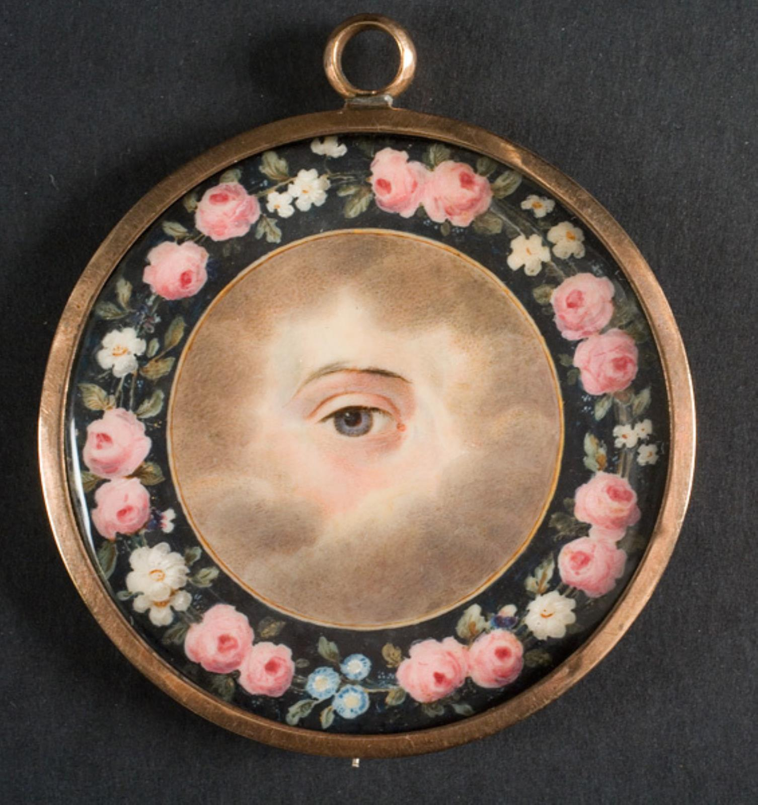
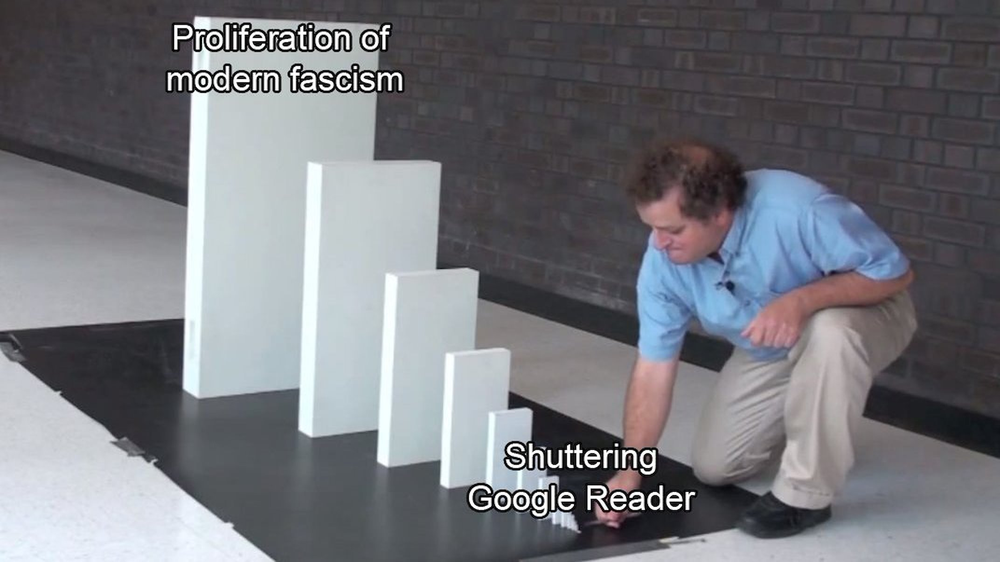

_I’m [Gus Cuddy](https://guscuddy.com/) and this is [The Curtain](https://guscuddy.substack.com/), a newsletter exploring culture through the intersections of arts, performance, and the internet. New reader? [Subscribe for free](https://guscuddy.substack.com/subscribe)._

Hi friends,

It’s been a week. _The Curtain_ has started to come out on Wednesdays these days. At one point it was Tuesday mornings, but I think I have to accept that it’s easier for me to put out Wednesdays. That will be the day for now. Set yr clocks!

A **quick update on [last week’s post](https://guscuddy.substack.com/p/the-curtain-89-cultivating-web-space)**: [I made an Are.na channel called “Web Space”](https://www.are.na/gus-cuddy/web-space-angncoypkeu) that you can look through. Are.na is a sort of weird social bookmarking/curating type site. My “Web Space” channel is a collection of images and sites that embody this idea of claiming calm space on the internet. No dissociation required. I’m going to add to that collection as time goes on, and also collect more research in my various other channels.

OK, on to the show.

---

## 2021: The Year of Texture

<figure>
    
    <figcaption><a href="https://open.smk.dk/en/artwork/image/KMS4709?q=eyes&amp;page=0&quot;">Eye Miniature, 1779 - 1844, Christian Hornemann</a></figcaption>
    </figure>

When we came back to New York after visiting my family for the holidays, we made sure to bring the records. These were all the vinyl records I had collected in my teens – two boxes worth of various gold and trash. Many of them are infused with memory: the Elvis Costello I used to play in my room, the Captain Beefheart record I ordered online to appear impressive, the odd Sesame Street pickup from free-record-day-giveaway, or the worn-down Neil Young records passed down from my dad. Those records from my parents, in particular, wear their history with their scratches, whispers, garbles, and sighs. When I slip a record onto the turntable, gliding the stylus down while blowing away dust, I’m three-dimensionally interacting with an artifact of incredible technology (vinyl – how does it work??) that has _texture_.

It sounds trite or even self-parodying these days to talk about the pleasures of vinyl or the sensuality of [physical books](https://guscuddy.substack.com/p/the-curtain-77-simple-contracts). But 2020 and 2021 have rapidly accelerated the process of total _digitization_ in the world, and digitization carries with it a particular and peculiar quality: **flatness**. At least as compared to the “analog world”, the binary world of 1s and 0s doesn’t have a lot of texture: apps and files are solely what they are – that is, pieces of code written in a programming language that is itself an abstraction on top of the base language of computers, [Assembly code](https://en.wikipedia.org/wiki/Assembly_language). Unlike physical objects, various media in the digital stratosphere don’t bear the textured marks and traces of time – at least, not in the same, recognizable manner.

Things that have texture have a _variance_ to them, a quality that makes them feel human. In the age of digitization, analog objects often contain that wabi-sabi variance — and with that comes a strange mysticism, a clarity of edges, and a reliability of form.

For instance, physical books carry literal bends, markings, and smells that trigger memories; at times, we feel a deep reverence to an old text that’s been with us for a while, as if it’s endowed with an element of mythos. The same doesn’t happen with digital books. (In the case of religious texts, the connection with digital books is even more tenuous.) 

But as I wrote about in “[Simple Contracts](https://guscuddy.substack.com/p/the-curtain-77-simple-contracts)”, there’s simultaneously a clear relationship between the reader and the book: a book is simply pieces of paper with words written on them that you read. Unlike in social media and the digital world, there’s nothing else happening, no hidden advertising or tracking. 

Physical objects also shockingly exist in three dimensions. Unlike the flatness of digital, they contain materials that can be manipulated with our hands. In this way they hold one singular source of truth — what we see and feel with our senses and lived experience — versus the abstractions, illusions, and even fakery that we experience online and in the digital world. I’ve started writing in a couple different physical notebooks again with a nice thick pen (1.0 MM Pilot G2, cowards), and find it much easier to _trust_ in many ways than dumping thoughts into various text boxes on my computer. The notebook is a place to re-reconnect with the bare simplicity of a page, temporarily skirting the flatness of digital.

This flatness has layers: it’s both metaphorical and literal. The literal flatness has other latent dangers. Personally, my eyes have gotten much worse this past year, as I’ve spent the majority of my time staring at a screen. But I’m not alone – [the pandemic is destroying people’s vision](https://nymag.com/intelligencer/2021/01/what-has-the-pandemic-done-to-our-eyes.html). Our eyes falter because we become immersed in [“the digital sensorioum”, as writer Aaron Z Lewis calls it](https://aaronzlewis.com/blog/2021/01/17/inside-the-digital-sensorium/), which exists inside the two-dimensional rectangle of a computer screen. (The hot 20/20/20 rule: every 20 minutes spend 20 seconds looking at something 20 feet away.) This rectangle holds the realm of computer operating systems, which exist based off a three-dimensional metaphor of a physical desktop – hence why windows contain shadows, and tabs, files, folders, and trash bins are the prominent visual language. 

Indeed, deception is a critical part of digitization: texture has become something of a simulation; roughness is merely a hallucination. We touch things and _each other_ less, we venture into the slipstream [not between the viaducts of others’ dreams](https://genius.com/Van-morrison-astral-weeks-lyrics), but the strange valley of digital _content_. 

<figure>
    
    <figcaption><a href="https://open.smk.dk/en/artwork/image/KKS2004-14">Nothing’s Real, 2002 - 2003, Julie Nord</a></figcaption>
    </figure>

---

The slow, lollygagging descent into the basest realms of content-consciousness didn’t quite happen suddenly. The groundwork had been laid for years. But as the pandemic laid bare, there was a large subset of people who accepted the descent. It was time to finally embrace that I had time to keep up with the hivemind’s latest Netflix obsession or TikTok meme; it became part of ritual to consume content. What started as a joke at the beginning of quarantine — wake up, look at small screen, look at medium screen, look at big screen, look at small screen, bed — became a way of life that [the writer Venkatesh Rao has deemed “domestic cozy”](https://www.ribbonfarm.com/2019/03/04/domestic-cozy-1/). 

In [Kyle Chayka’s recent essay for](https://www.nytimes.com/2021/01/19/magazine/negation-culture.html) _[New York Times Mag](https://www.nytimes.com/2021/01/19/magazine/negation-culture.html)_, he identifies a cultural trend towards what he calls “nothingness”, largely embodied by a privileged class that are able to stay home and recede into comfort while relying on essential workers. This tendency towards nothingness also drives why we [doom-scroll on social media for hours](https://guscuddy.substack.com/p/the-curtain-75-dancing-with-oblivion), as I’ve written about before.

But it’s that constant stream of content that has defined internet culture during quarantine. Since the pandemic has shut down live and in-person arts we’ve been subsumed by the endless parade of content from Netflix, HBO Max, TikTok, and others. Writes Chayka:

> As theaters, art galleries, opera houses, symphonies, cinemas, poetry readings, comedy clubs and bookstores all evaporated in the pandemic, the last thing left seemed to be streaming video, broadcast through the largely unregulated, for-profit digital platforms that now have a monopoly on our housebound attention and connection.

Some day (hopefully) soon, we will be able to exit our cocoons. Will the end of COVID mark a new roaring 20s of sensuality, hedonism, and raucous live art, as some predict? Or has too much damage been done already? I do think there’s a certain build-up of physical energy that will be unleashed, but there’s also a lot that could happen between now and then. Or, let’s put it this way: a year ago, people were a lot less familiar with TikTok. Things change; the internet makes strange things emerge.

What does texture look like in the digital world? Can a website decompose over time? Does digital art show its age? Part of the key here is what I wrote about last week — [the majestic personality of personal websites](https://guscuddy.substack.com/p/the-curtain-89-cultivating-web-space) over the violent sameness of social media — but that’s not the entire picture. We should be wary of anthropomorphizing digital space too much, or in the wrong ways. Applying “real world” metaphors to hyperspace may be helpful at certain times, and limiting at others. Perhaps we need to construct new metaphors to harbor the digital world. The feeling I get when a Zoom “room” is suddenly ended is far more sudden and cold than the feeling I get when I leave a real room. Either way, this year I’ll be seeking out more texture.

---

## Notes from the week

### traversing the internet hellscape

📈 The latest breaking and weirdest internet news of the week was the saga of GameStop stock, which was propelled upwards to unprecedented heights by millions of Redditors. (Yes, I got in a couple days ago. Sometimes it pays to spend too much time on the internet.) Proving that money is a fiction and that the stock market is, indeed, a ludicrous invention. [My favorite recap is from the great internet newsletter Garbage Day](https://www.garbageday.email/p/reality-now-is-just-different-dril).

---

🗞 The newsletter wars have begun, as [Twitter has acquired Substack competitor Revue](https://www.axios.com/twitter-newsletter-publishing-revue-8a74f20d-61c9-4095-9b3c-202c3b3fe77c.html). 

But the internet is chasing its own tail. [We had this whole distribution thing figured out years ago with RSS feeds](https://www.robinrendle.com/essays/newsletters)!

<figure>
    
    <figcaption>this is a niche meme</figcaption>
    </figure>

---

### the 20th century seems like a fever dream

From Larry King’s obituary:

https://twitter.com/OsitaNwanevu/status/1352984563350450176

---

### david ehrlich’s 25 best films of 2020

Always a fun video project that Ehrlich puts together each year:

https://youtube.com/watch?v=CfDs7k6I-C0

---

### brand homogeneity

On the topic of flatness I wrote about this week, the evolution of modern brands has been a fascinating exercise in dull nothingness:

https://twitter.com/rajandelman/status/1352982025351913473

---

### the ghost of theatre

*   [Kyle Turner interviews](https://lareviewofbooks.org/article/circle-jerk-in-the-square-an-interview-with-michael-breslin-patrick-foley-and-ariel-sibert/) _[Circle Jerk](https://lareviewofbooks.org/article/circle-jerk-in-the-square-an-interview-with-michael-breslin-patrick-foley-and-ariel-sibert/)_ [creators Michael Breslin, Patrick Foley, and Ariel Sibert](https://lareviewofbooks.org/article/circle-jerk-in-the-square-an-interview-with-michael-breslin-patrick-foley-and-ariel-sibert/) in the LA Review of Books
    
*   [Tim Teeman and Naveen Kumar on the state of theatre after 2020](https://www.thedailybeast.com/theater-died-in-2020-its-rebirth-will-be-suitably-dramatic)
    
*   [Soraya McDonald on our last hope: a return of the Federal Theatre Project](https://theundefeated.com/features/a-covid-19-vaccine-is-here-but-theaters-seek-a-new-deal/)
    
*   [New York Times critic Maya Phillips interviewed in American Theatre](https://www.americantheatre.org/2021/01/20/maya-phillips-i-absolutely-believe-in-criticism/)
    

---

### other things I bookmarked this week

*   [The Case Against Fauci](https://www.thedriftmag.com/the-case-against-fauci/). Now _there’s_ a title.
    
*   [Writer Elena Burger on why the death of retail may be overstated](https://virtualelena.substack.com/p/bit-structures)
    
*   [“The haunting of GeoCities and the politics of access control on the early Web”](https://journals.sagepub.com/doi/full/10.1177/1461444820951609)
    
*   [The internet didn’t kill counterculture—you just won’t find it on Instagram](https://www.documentjournal.com/2021/01/the-internet-didnt-kill-counterculture-you-just-wont-find-it-on-instagram/)
    
*   [Earth at a Cute Angle](https://medium.com/nightingale/earth-at-a-cute-angle-dc2f8c29495a)
    
*   [How the New York Times Crossword Became Too Big to Fail](https://studyhall.xyz/how-the-new-york-times-crossword-became-too-big-to-fail/)
    

---

### parting quote

“So I’m not a fan of social media. I’m not on it. And I won’t be, because I think it’s killing us, actually. I really do.”

–[George Saunders](http://www.theguardian.com/books/2021/jan/02/george-saunders-these-trenches-were-in-are-so-deep)

---

## end note

<figure>
    
    <figcaption><a href="https://en.wikipedia.org/wiki/Cosmic_latte">Cosmic Latte, the average color of the universe</a></figcaption>
    </figure>

---

_Thank you for reading!_

_The best thing you could do to help me out is to share this newsletter with a friend you think would like this kind of thing._

_If you enjoy The Curtain, you could also consider [becoming a paying subscriber](https://guscuddy.substack.com/subscribe). I currently run on a patronage model: the benefits are the same (right now) for paying and free subscribers. Your support helps make this sustainable._

**[Subscribe now](https://guscuddy.substack.com/subscribe?utm_medium=web&utm_source=subscribe-widget&utm_content=31699931)**

_New reader? The Curtain is a weekly digital letter sent by [Gus Cuddy](https://guscuddy.com/). It’s usually sent on Tuesdays or Wednesday mornings. You can [subscribe for free here](https://guscuddy.substack.com/subscribe), or [browse the archives here](https://guscuddy.substack.com/archive). [Follow me on Twitter @guscuddy](https://twitter.com/guscuddy)._

See you next week,

\-Gus