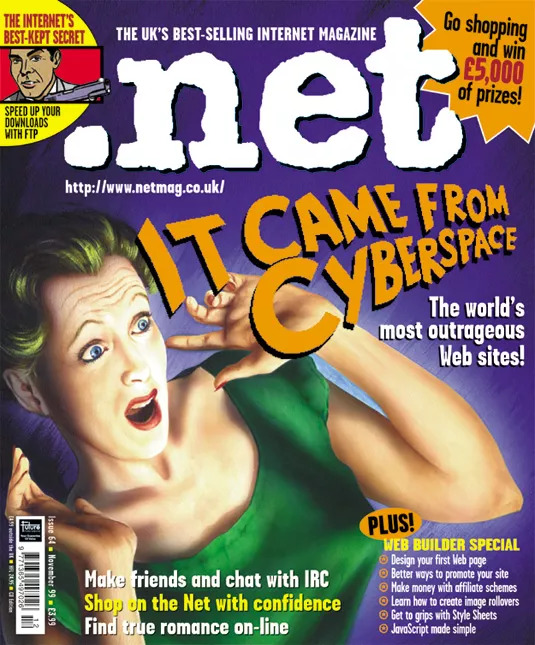

Hi friends,

What a week it’s been in the world of the internet. And yikes – what a year.

https://twitter.com/PatrickOfToday/status/1354539597062053891

I’m not going to hit you with another Gamestop meme explainer. If you’re in need of one, there are many great resources out there, such as [Matt Levine](https://www.bloomberg.com/opinion/articles/2021-01-27/reddit-driven-surge-puts-gamestop-and-ryan-cohen-in-a-weird-spot), [Taylor Lorenz](https://www.nytimes.com/2021/02/02/learning/lesson-of-the-day-dumb-money-is-on-gamestop-and-its-beating-wall-street-at-its-own-game.html), or the work that newsletters [Today in Tabs](https://www.todayintabs.com/)and [Garbage Day](https://garbageday.email) have been doing. 

It was a strange week in the ongoing [digitization of the world](https://guscuddy.substack.com/p/the-curtain-090-the-year-of-texture), suffice to say. And one that intersected with class, the economy, and politics, making Wall Street and Hedge Funds scared. Oh, for a few days, it was glorious! Sure, the price crashed 35% this week, but let’s not let that distract us from the insanity of it. There were several days of ruling-class-type folk coming on CNBC and telling working-class people to not mess with them. And then there were instances like NYU professor Scott Galloway, who lost his damn mind:

https://twitter.com/ndrew_lawrence/status/1356253787011371008

Oh yeah, speaking of Scott Galloway, [he’s all set to consult on the Netflix movie version of the Gamestop Stock saga](https://deadline.com/2021/02/netflix-gamestop-stock-movie-screenwriter-mark-boal-noah-centineo-scott-galloway-makeready-1234684568/). No, that’s not a joke – Netflix is putting together a movie package of an event that literally started a few days ago and is still unfolding, catalyzed by a Reddit forum that refers to itself as “like 4chan found a Bloomberg Terminal”. Hilariously, they’re not the only ones: in a bidding war, [MGM has secured the movie rights to a](https://deadline.com/2021/01/mgm-ben-mezrichs-the-antisocial-network-wall-street-1234684378/) _[book proposal](https://deadline.com/2021/01/mgm-ben-mezrichs-the-antisocial-network-wall-street-1234684378/)_ [about the event](https://deadline.com/2021/01/mgm-ben-mezrichs-the-antisocial-network-wall-street-1234684378/). [As Kyle Chayka argues in his daily newsletter](https://dirt.substack.com/p/dirt-reality-becomes-tv-instantly) _[Dirt](https://dirt.substack.com/p/dirt-reality-becomes-tv-instantly)_, intellectual property — the “portable capital of a narrative” — disturbingly rules everything.

Reality is media is a hallucination!

---

## Notes on Digital Texture

<figure>
    
    <figcaption><a href="https://www.clevelandart.org/art/2013.299">A pair of Brahminy ducks, c. 1595. India, Mughal, 16th century.</a></figcaption>
    </figure>

I wanted to follow up with [what I wrote last week about texture in the world of digitization](https://guscuddy.substack.com/p/the-curtain-090-the-year-of-texture). As I wrote, the digital world doesn’t provide much texture — compared to the “analog world”, things are quite flat. But that doesn’t mean that there’s no variance or texture whatsoever. It just appears in different ways.

As in the different texture of types of architecture ([something I discussed in the very first issue of this newsletter](https://guscuddy.substack.com/p/the-curtain-41619)), websites can have wildly different textural feels. For instance, the site [Brutalist Websites](https://brutalistwebsites.com/) collects different examples of its definition of Brutalism in web design: “ruggedness and lack of concern to look comfortable or easy”. [Websites can be many things](https://thecreativeindependent.com/people/laurel-schwulst-my-website-is-a-shifting-house-next-to-a-river-of-knowledge-what-could-yours-be/), and they can have some quality of texture — even if that’s discomfort.

Again, social media is a great flattener: despite the content of tweets allowing for creativity, they still all take the same form that Twitter dictates. I worry some of the same is true with Substack. Substack’s newly launched Substack-aggregator service (lol) [“Substack Reader”](https://reader.substack.com/) tells me that I subscribe to around 100 different Substack newsletters. Yes, 100. Oh my god, that’s a lot of newsletters! (Thankfully, many of them are inactive or infrequent; only a few I actually pay for.) But when they arrive in my email Inbox, they all look generally… the same. Sure, there’s some new customization features that allow creators to do crazy things like change their font to a few different pre-selected options or change the background color of their publication. But they don’t offer much in the way of personality.

Combine Substack’s general sameness with the flatness of an email inbox, and there’s a disappointing lack of texture. Despite the newsletter revolution being very good in a lot of ways, I think it’s pretty clear: there’s too damn many of them! And an email inbox is _not_ the best place to read lots of content. As I’ve written about, the internet has sort of solved this problem before with [RSS feeds](https://en.wikipedia.org/wiki/RSS), but technology loves to chase its own tail — and I might be one of ten people out there who still uses an RSS reader. (The biggest thing that Substack has solved that RSS did not — and it’s a big thing — is giving writers an easy way to monetize.) Substack basically admits this is a problem by offering a newsletter-aggregator, and hey, we’re back to where we started. 

Old-school blogs, on the other hand, have _texture_. They are unique, personal, and feel like they’ve held their ground even after all these years — and with that comes a sense of trust. Blog posts are also easier to share than email newsletters; instead of the symmetry and sameness of a flood of newsletters into an inbox, blogs still offer an intriguing asymmetry: most posts will merely get skimmed or go unread, with a few being shared and going viral. Still, newsletters do offer _something_ personal, which is why I loved to see that [writer Robin Sloan is trying new scaffolding around his decade-old newsletter](https://society.robinsloan.com/archive/january-2021/), attempting to try new things with weird newsletter-blog-media infrastructure.

Arguably as bad as social media are music streaming services like Spotify and Apple Music, which have replaced variable discovery and audiophilia with a stultifying homogeneity. Gone is the texture of flipping through records in a record store, or even of making mix tapes with downloaded MP3s off Limewire. Hell, I miss how obsessed I used to be about Variable Bit Rates and ripping FLAC files back when I used to be a member of [What.CD](https://en.wikipedia.org/wiki/What.CD). Am I falling for [nostalgia](https://www.guscuddy.com/nostalgia)? Sort of, to be sure. But the way the internet has moved in recent years has been to remove _ownership_ from individuals and give it to large tech companies; the endless hours spent organizing my humongous iTunes library that I owned were made less and less relevant with the rise of Spotify. But on Spotify I don’t own the music (and neither do the artists). And as a result, sadly, I find I listen to less music these days.

Great services like [Bandcamp](https://bandcamp.com) act as a remedy to Spotify’s textureless model. [As Bandcamp CEO Ethan Diamond says](https://www.npr.org/2020/08/19/903547253/a-tale-of-two-ecosystems-on-bandcamp-spotify-and-the-wide-open-future), “I think of **Bandcamp as a music company first, because I think of who we serve as first and foremost the artist**.” That’s greatly different than Spotify, which seeks to commodify time by controlling “audio” listenership, as CEO Daniel Ek refers to it. It’s revealing that he uses the generic “audio” instead of “music” when referring to what the company does; there’s no sense of texture — or art, or spirituality, or healing — in capturing audio listenership.

I’ve also been finally trying out the extremely buzzy new social media app Clubhouse, that aims to create a new paradigm for social audio. (Argh, there’s that “audio” word again!) At first I didn’t understand at all how to use it or why one would be interested in it. But as I started to poke around, I realized that it does capture a certain, special kind of liveness quite well — and in that way has an interesting layer of digital texture.

[Journalist Casey Newton wrote a fascinating piece about Clubhouse](https://www.platformer.news/p/clubhouses-moment-arrives) where he compared its commandeering of audio with the unsuccessful podcasting company [Anchor](https://anchor.fm/). The idea is that Anchor was meant to be an easy place for amateurs to create podcasts. But the podcasting form is actually wrong for that — people want well-produced podcasts, not poorly recorded ones. But the free-form format of Clubhouse makes it a space where folks can start an informal conversation and have people listen. Or where (more likely) someone very internet-famous like Elon Musk shows up and starts interacting with other moderately famous people via live audio. That wouldn’t happen on the structure of a podcast. The ephemeral dynamics of Clubhouse, and the intimate informality of audio—whose power has been demonstrated by the rise of podcasts—invite a sense of textured, live serendipity. But it’s still social media, and I’m skeptical as to how the power dynamics are going to play out: I don’t trust the company to cultivate a nice community there, or to not participate in surveillance capitalism. Individuals still don’t own their content.

But the other thing Clubhouse does well is capitalize off a particular sense of FOMO. When I get a notification from the app telling me that a group of people I follow is having an esoteric conversation and that I can simply tap to join in, I instantly feel a small sense of missing out by not engaging. That’s a different sense of FOMO than other social media networks like Instagram cultivate; there, the sense is that all your friends are more attractive than you and doing cooler things than you — but it’s grounded still in the “real world” of social envy. With Clubhouse, I’m feeling like I’m missing out on a fleeting, ephemeral digital experience. That ephemerality, by the way, does kind of remind me of theatre — which is a welcome feeling — but I’m not sure it goes much beyond that. And Clubhouse still uses the digital metaphors that we’ve become accustomed to, [as I wrote about last week](https://guscuddy.substack.com/p/the-curtain-090-the-year-of-texture): one starts or joins a “room”, just like Zoom. No new ground is being broken in that regard. The annoying exclusivity of the app for 2020 — it slowly let in big-name users over time, giving it a VIP-type feel— will fade away. After that, we’ll see how regularly people want to drop in to conversations, and how well it retains an idea of texture.

---

## notes from the week

### wtf is this hallucinatory world

*   Aerobics while the Myanmar coup happens in the bg:
    

https://twitter.com/VonKoutli/status/1356278671267557382

*   ah, groundhog day:
    

https://twitter.com/MollyJongFast/status/1356595678890360832

*   [scientists have taught spinach how to send us email](https://www.euronews.com/living/2021/02/01/scientists-have-taught-spinach-to-send-emails-and-it-could-warn-us-about-climate-change).
    
*   Ha ha: [Robinhood Raises Another $2.4 Billion From Shareholders](https://email.mg2.substack.com/c/eJwlkE1uxSAMhE_z2CUC8r9g0U2vERHwS2gJpMY0yu1LGsmyDWg0w2c0wRrxUkdMxO4203WACnAmD0SALCfA2VklGi54M43MqtaKsRuZS_MbAXbtvCLMwI68eGc0uRhuxTANPdsULGYCeHdt03VdO-lpGpue95NdQJqpbx9bna2DYEDBL-AVAzCvNqIjvZqPl_wsdZ5nfaav2sS9nDSSMx5SWTEuLmwx2gq1S5AqHSJtgJWs2mpx3pc81RvjXqVNI2zRW8BUCdELKUrGkTOnJJeCl1Y-KVtei5qsdGNAkX7sq-X7KuuUl0TafN8JGKo1p9pka6_yvN4Q_u8Lg7nMPQdH1wxBLx7sg4ceyv_A5hUCYKFvZ03qTiLlMPTFfXh4FH6N5E0vec-KsY1FFdThNb0j7oB_gEqWFg)
    
*   [The similarities between r/WallStreetBets and theDonald?](https://email.mg2.substack.com/c/eJwlkM1uxCAMhJ9muTUCJ83PgUMvfY2IxN4sKoEUnEZ5-zobCc1IBmuYb3ZMS8qn3VJhdcnI50Y20lECMVNWe6E8erSm1kbXQ6_QNmj6z175Mj4z0ep8sJx3Uts-BT879ileG93QteplHbgn9jB0tW5njQ12OEw9YA19Q7oxd6zb0VOcydIf5TNFUsG-mLfyqL8e8C3nOI4qnuxXKtWcVpmABiOmL4FBpPAZSHxx8ojT9nG4EArLJ3kiLh-ZED1XL16D8vZa1yLSCxpdmYoRfB-zKb_4aPS6QFX2qbCbf65Ale2yS_SOeMr1cvV-z6X2KL7u0fM5UnRTILyJ8A32zWhcKFIW4Dg6tqY1ANB1raR3NwJBVoOuW9CtkmBMshXtFhw_U14p_wPv85EU)
    
*   The Great Podcast inequality: [Axios reports that 1% of the podcasts receive 99% of downloads](https://xyz.us10.list-manage.com/track/click?u=29a03302803a2ba25c5891356&id=bd97227500&e=9566fe43cd)
    
*   The Vaccine Rollout has been a disaster. [Part of that is due to the tech behind it](https://www.technologyreview.com/2021/01/30/1017086/cdc-44-million-vaccine-data-vams-problems/)
    
*   Derek Thompson: [Superstar Cities Are in Trouble](https://www.theatlantic.com/ideas/archive/2021/02/remote-work-revolution/617842/)
    
*   And another beautiful piece from LM Sacasas, on Starlink and electrical light pollution: [What Did We Lose When We Lost the Stars?](https://theconvivialsociety.substack.com/p/what-did-we-lose-when-we-lost-the)
    

---

### ✂️ clippings and esoterica 🎊

🛹 [Werner Herzog joins a skateboarding show](https://www.youtube.com/watch?v=EQLInlnfWUc)

✏️ [Daisy Alioto on Fran Lebowitz](https://dirt.substack.com/p/dirt-pretend-its-a-living): “The arts are full of big guys and little guys but Lebowitz is the worst type of guy: the big guy that insists he’s a little one.”

👨‍💻 This would be good for me:

https://twitter.com/aaronzlewis/status/1250332839221923841

🗺️ [Follow along with Shannon Mattern’s graduate anthropology course about Maps](https://mappingthefield.wordsinspace.net/2021/portfolio/week-2-tuesday-january-26-cartographic-epistemologies/)

https://twitter.com/shannonmattern/status/1355891139304435713

🗞 Oh, joy: [Facebook is planning its own newsletter tools to court independent writers](https://www.nytimes.com/live/2021/01/28/business/us-economy-coronavirus#facebook-is-said-to-be-planning-newsletter-tools-to-court-independent-writers)

---

### …and now, in the theatrical wasteland…

🎟 [A Broadway Theater Owner Rethinks Post-Pandemic Ticket Selling](https://broadwaybriefing.us10.list-manage.com/track/click?u=68010bec83d36e2e549278be3&id=91a5518586&e=3a5daf9a37)

📚 Killing the time: [The 50 best plays of the 21st century](https://broadwaybriefing.us10.list-manage.com/track/click?u=68010bec83d36e2e549278be3&id=3257e74654&e=3a5daf9a37)? Sure, why not.

🤦‍♀️ Variety asks: [‘Bridgerton: The Musical’ Blew Up on TikTok. Could Broadway Be Next?](https://variety.com/2021/music/news/bridgerton-the-musical-tiktok-broadway-abigail-barlow-emily-bear-1234893087/) pls god no

Because theatre moves at the pace of molasses compared to Hollywood, there are many Broadway producers who are gonna cringe-drive this musical-TikTok trend into the ground over the next few years. Just you wait – in 2023, when we’ve all moved on from TikTok, Broadway will be there for us!

---

## end note

<figure>
    
    <figcaption><a href="https://thehistoryoftheweb.com/magazines-about-the-web-sitepoint-smashing-magazine-net-magazine-css-tricks/">A .net magazine from the 90s.</a></figcaption>
    </figure>

_Thank you for reading!_

_The best thing you could do to help me out is to share this newsletter with a friend you think would like this kind of thing._

_If you enjoy The Curtain, you could also consider [becoming a paying subscriber](https://guscuddy.substack.com/subscribe). I currently run on a patronage model: the benefits are the same (right now) for paying and free subscribers. Your support helps make this sustainable._

**[Subscribe now](https://guscuddy.substack.com/subscribe?utm_medium=web&utm_source=subscribe-widget&utm_content=31699931).**

_New reader? The Curtain is a weekly digital letter sent by [Gus Cuddy](https://guscuddy.com/). It’s usually sent on Tuesdays or Wednesdays. You can [subscribe for free here](https://guscuddy.substack.com/subscribe), or [browse the archives here](https://guscuddy.substack.com/archive). [Follow me on Twitter @guscuddy](https://twitter.com/guscuddy)._

See you next week,

\-Gus