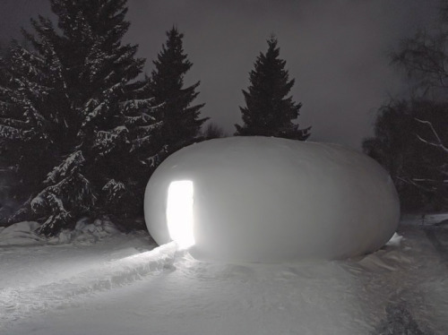

_Welcome to The Curtain, a newsletter about arts and algorithms. It's written by me, [Gus Cuddy](https://guscuddy.com)._

---

It’s been a long week; all this snow seems to draw out time.

I stumbled upon a new way of conceptualizing climate change and its constituents this week: as [hyperobjects](https://www.hcn.org/issues/47.1/introducing-the-idea-of-hyperobjects). Hyperobjects are things that are so big as to be incomprehensible: all the Styrofoam on earth, ever, which will be around for 500 more years; all the plutonium we've ever made, which will be around another 24,000 years. They exist beyond ourselves. Climate change is a hyperobject: we're in the midst of it, but we still struggle to comprehend its entirety and scope --- and its future. Hyperobjects make us experience time in a diffferent way, taking the long view; we'll never experience them but in little pieces at a time. When we do experience those pieces, the immensity of the hyperobject can be overwhelming. I first experienced this last summer when I was in northern California with the forest fires that turned the sky into a foreboding, burnt orange. Looking up at the sky felt like looking into something incomprehensible; something large, influenced by a complex web of other factors, and something that wouldn't stop here. But our future depends on the attempt to comprehend this immensity, and acting with a larger temporal framework than we're used to doing as a society. If we don't, the future will continue to come crashing down.

As I write this the storms in Texas have caused power and water shortages across the state. It’s a dangerous reminder that climate change is lurking around the corner of this pandemic, looming larger than ever.

---

Okay, now, here's an essay about Clubhouse and Liveness:

## Clubhouse and Liveness

[A few weeks ago](https://guscuddy.substack.com/p/the-curtain-091-digitization-begets) I wrote about some of the perceived strengths of the viral social media audio app Clubhouse as an interesting online meeting place, a zone of livenesss that [demonstrated digital texture](https://guscuddy.substack.com/p/the-curtain-090-the-year-of-texture). The idea was that Clubhouse, in its own way, is actually competing with amateur podcasts; it becomes a low-barrier place for folks to come together and have conversations. Sometimes, these talks become immensely popular and go viral, like when the richest man on earth Elon Musk decides to drop in. When this happens, the app gains points in liveness but loses its footing in originality; quickly, the audio is replicated on other platforms. Already I've seen Twitter accounts devoted to making Clubhouse talks into ["Clubhouse Podcasts"](https://mobile.twitter.com/CH_Podcasts). In other words, there's already a downstream market of Clubhouse, waiting to record and package up talks and put them elsewhere. And now, hey, we're just right back to where we started. Wait, why did we do this again in the first place?

Tech loves to repeat itself and claim originality. Clubhouse is no different; it's a service that's essentially a bunch of conference calls happening, with social aspects added. (Wasn't that what Discord was for?) There are interesting bits going on formally that make it function in some unique ways --- it's been called "[the first AirPods social network](https://twitter.com/benthompson/status/1357579216175259652)" --- but at it's heart there's nothing that wild happening here. Sure, you might listen to a Clubhouse talk on your AirPods while making dinner, or jump into a conversation later in the night. But at its heart these are just chat rooms, just like the internet has had...for basically forever? The wild-ness came from the exclusivity and buzziness of the app for the last year; it intentionally wants to make it seem like you're missing out on a conversation. Or even a party. Or even a city:

https://twitter.com/shl/status/1358961396432576513

Sahil here is referring to the (in)famous Marc Andreessen quote that "[Software is eating the world](https://a16z.com/2011/08/20/why-software-is-eating-the-world/)", which has proven to be true in several regards. But this tweet --- is it trolling? --- reeks of a classic Venture Capital attitude: that software will relentlessly eat into the "real" world. Fortunately, this appraisal of Clubhouse (Sahil doubled down with a ludicrous tweet saying that Clubhouse is better than parties, which is something only a venture capitalist would say) is hilariously limited. While I was initially positive on some of the freshness of Clubhouse, I've begun to sour on it. (I've since opened the app...maybe twice?) It's not really my jam to jump into talking online, so maybe it's not for me. But Clubhouse has quickly turned into LinkedIn with audio; the number of rooms dedicated to hustle culture and general business-nothingness is alarming.

When I got on Clubhouse, they asked for my interests. Because I'm a maschoist, I decided to check the box under "theatre". (Never check the box under theatre.) I was naively excited: could this be an interesting place for theatre? Some sort of digital proximate for liveness and spontaniety --- maybe live audio theatre wouldn't entirely work, but perhaps a lobby or forum, a 21st century Sardi's or Joe Allen, where you could run into folks or meet new people and talk? Maybe a better place to have conversations and discourse around theatre that has been sorely lacking?

But to my dismay, when I opened my feed, I was greeted with nothing but strange Casting Call and Boost Your Social Media rooms. I got nervous: it felt like everything was a networking event. But god damn -- who wants another networking event? It's become clear that, at this point in the pandemic, people are ready to be over everything being online; it's going to change the way we work in many regards, but it's clearly not going to replace everything. I've become more convinced that things will go back to a new normal that looks a lot like the old normal, with some important updates; claims of city-eating software turn out to just be kind of spammy.

Despite Clubhouse attempting to create a digital app that inhabits space --- eating into real-world ventures that involve bodies in space like parties or bars --- I remembered that digital space isn't real. As technology writer [LM Sacasas wrote in January](https://theconvivialsociety.substack.com/p/the-insurrection-will-be-live-streamed), "Digital tools do not generate places in the ordinary sense of the word, they mediate relationships, in part precisely by disassociating the self from place." Digital space is an artifice; no matter how live an app is, it can't recreate the subjective experience of being in a three-dimensional space with other three-dimensional beings, living, breathing, talking, sharing air.

So, sure, perhaps Clubhouse will replace some networking events or speaking events. (As many have pointed out, though, the app is shockingly inaccessible: if this is the future, it leaves out a huge swarth of the population, like the deaf community. ) But networking is not the point of cities or of theatre. Some things have more than two dimensions. Liveness can be reconstructed, but hundreds of millions of dollars in venture capital still can't steal it away from the analog world.

---

## Notes from the week

-   [New Yorker culture and theatre critic Vinson Cunningham was on the Longform Podcast this week for an excellent interview](https://longform.org/posts/longform-podcast-429-vinson-cunningham).
-   [Martin Scorsese wrote a long piece in Harpers on Fellini](https://harpers.org/archive/2021/03/il-maestro-federico-fellini-martin-scorsese/), where he spends most of the time defending filmmaking as an art form, not as a commodity: "Flash forward to the present day, as the art of cinema is being systematically devalued, sidelined, demeaned, and reduced to its lowest common denominator, 'content.''" He is, of course, right.
-   [Popular podcast Reply All (one of my favorites) is going through some shit](https://www.vulture.com/2021/02/reply-all-hosts-step-down-test-kitchen.html), as PJ Vogt and Sruthi Pinnamaneni have been accused of cultivating a toxic workplace, as well as organizing against the unionization efforts at Gimlet Media led by young producers of color. Vogt has taken a leave from the show. Yikes! Up next: let's see how (or if) Spotify comments on the issue, which bought Gimlet in 2019.
-   [Jay Caspian Kang wrote a terrific profile on actor Steven Yeun for NYT Mag](https://www.nytimes.com/2021/02/03/magazine/steven-yeun.html), examining his own role as a Korean-American writing a profile about a Korean-American.
-   Lindsay Brandon Hunter's book [_Playing Real_ ](https://nupress.northwestern.edu/content/playing-real)"explores the integration and interaction of mimetic theatricality and representational media in twentieth- and twenty-first-century performance".
-   Finally, [a brief history of Godzilla's thick thighs](https://www.crunchyroll.com/anime-feature/2021/02/12/feature-a-brief-history-of-godzillas-thick-thighs)

---

## End Note

<figure>

<figcaption>photo by <a href="https://www.instagram.com/p/CLbjQOMjfqQ/">Philip Toledano</a></figcaption>
</figure>

---

_Thank you for reading!_

_The best thing you could do to help me out is to share this newsletter with a friend you think would like this kind of thing._

_If you enjoy The Curtain, you could also consider [becoming a paying subscriber](https://guscuddy.substack.com/subscribe). I currently run on a patronage model: the benefits are the same (right now) for paying and free subscribers. Your support helps make this sustainable._

**[Subscribe now](https://guscuddy.substack.com/subscribe?utm_medium=web&utm_source=subscribe-widget&utm_content=31699931).**

_New reader? The Curtain is a weekly digital letter sent by [Gus Cuddy](https://guscuddy.com/). It’s sent on or around Wednesdays. You can [subscribe for free here](https://guscuddy.substack.com/subscribe), or [browse the archives here](https://guscuddy.substack.com/archive). [Follow me on Twitter @guscuddy](https://twitter.com/guscuddy)._

See you next week,
-Gus
