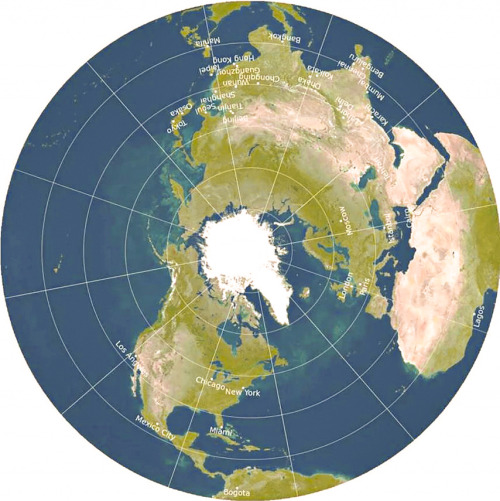
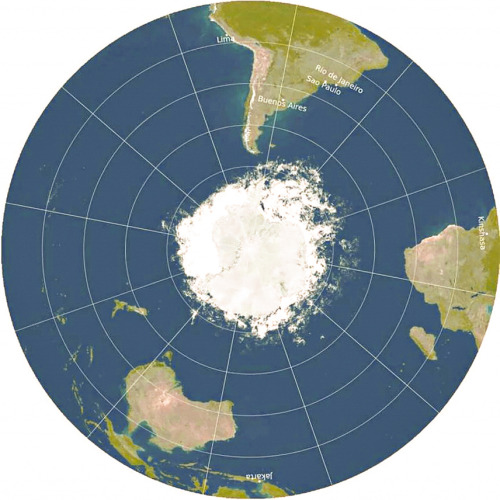

_Welcome to The Curtain, a newsletter about arts and algorithms. It’s written by me, [Gus Cuddy](https://guscuddy.com/)._

---

Hi friends,

Hope you’re having a great week. It’s been sunnier and warmer here in New York. It’s making me really hope for [the possibility of a wonderful summer](https://www.theatlantic.com/health/archive/2021/02/summer-2021-pandemic/618088/).

---

## NFTs, Crypto, and the future of Art?

This week’s hottest internet tech trend has been the swift rise in popularity of what are known as “NFTs”, a subset of cryptocurrency. NFT stands for Non-Fungible Token, which is honestly embarrassingly ugly to say — especially when it comes with the context of promising to revolutionize the future of art. Owning an NFT — which usually translates to a digital object, like a piece of digital art — gives you digital “ownership” over that item, as verified on the blockchain. Don’t worry, don’t try to understand the blockchain, no one does — just go with it: it’s essentially a public, distributed _ledger_ — a record of payments and any other data; it’s immutable, permanent, and decentralized, free of any bank or institution. Bitcoin and other cryptocurrencies are the most prominent use cases of the technology, but there are others: in Xiaowei Wang’s _Blockchain Chicken Farm_, she writes about how blockchain is being used in the food chain in China to verify meat and poultry authenticity.

Anyway, NFTs are still definitively in the “weird internet” space, but they started to break through into the mainstream in the past month when strange, expensive things started happening: [Beeple sold crypto artwork for millions](https://www.esquire.com/entertainment/a35500985/who-is-beeple-mike-winkelmann-nft-interview/), Larva Labs’ [CryptoPunks](https://www.larvalabs.com/cryptopunks/) created a million dollar resell market, and offically-branded [NBA Top Shot](https://www.nbatopshot.com/) exploded. 

At the heart of all this is the idea of “digital scarcity”, which stands in contrast to the usual abundance of media in the digital world. The rise of Napster, Limewire, and BitTorrent in the 2000s led to a mass pirating of music that had a huge impact on the music industry; it was the beginning of considering what scarcity meant in the age of the internet, when a work of portable media could be freely distributed to the whole world in a manner of seconds. (Remember those [“You wouldn’t steal a car” ads](https://www.youtube.com/watch?v=HmZm8vNHBSU)?) Spotify emerged circa 2010, attempting to right the wrongs of the free music craze; they did successfully curb the pirating of music, but artists still aren’t getting paid their fair share. Worse, a single, large company has emerged to become the dominant force over many musicians’ careers. The power has been taken out of the individual artists’ hands. 

But what if scarcity existed on the internet, just like it did in the “real world”? The best and most common analogy I’ve heard for NFTs is the Louvre: the Mona Lisa is one of the most replicated images in the world, but that doesn’t diminish the value or significance of the original in the Louvre — it only increases it. But where does this value come from? Why is it different than a photograph of it, or even a perfectly executed replica? The value comes from the _authenticity_ of the original; we know it’s the original because the Louvre tells us it’s the original. In the same way, Non-Fungible Tokens enforce authentic ownership in the digital world; each token is unique (hence them not being fungible — one NFT doesn’t equal another like 1 dollar equals 1 dollar) and is authenticated with an entry in the distributed ledger that is Blockchain.

Turns out, people primarily are using NFTs to buy and sell art, though that’s not all it could be used for. I’d like to unpack some of what NFT promises for art, and what it means for arts and digitization. It questions the notion of what a digital replica is, and how we derive meaning and value (in both the monetary and soulful sense) over art.

### the downsides of crypto

Let’s get this out of the way first: NFTs are in the “crypto” world, as in the “cryptocurrency” world, as in the Bitcoin world, as in a frightening world. One of crypto’s biggest problems (among several others which I’ll get to) is its awful marketing and aura. It _still_ seems scammy; it _still_ is mind-numbingly complex to wrap your head around. “Crypto” has become a sort of gross internet buzzword that lingers in some Venn diagrams with Alt-Right, QAnon, Wall Street Bets, 4Chan, and other dark internet corners. Many of its top users on Twitter are anonymous accounts with strange memes as their avatars (sometimes difficult to tell if they’re benign or white supremacist symbols), who proudly declaim Blockchain as the modern-day “Wild West” — a metaphor that obviously carries with it a lot of baggage. But that kind of attitude is par for the course when it comes to crypto. 

Speaking of baggage, awful wording in the crypto world — _fungible_, _gas_ (why??) — litter it with a pernicious stink, a persistent, lingering rot. This world is not pretty; it has no poetry and only a vague sense of aesthetics. And that’s not to mention the gross libertarian and anarcho-capitalist politics that are wrapped up in much of the “ethos” of Crypto, or at least it’s most evangelical (and bro-iest) users — many of whom tend to be white men.

It’s also true that, despite being decentralized, the technology behind blockchain and cryptocurrencies are still written by humans, and these humans tend to be men in tech. Despite selling itself as an egalitarian, decentralized future — governed by the people — it’s important to consider who those people _are_. There’s a steep barrier-of-entry to understand what the hell is even going _on_, really; as someone comfortable with diving into technology and code, I barely understand anything in this space; interestingly, there’s a similar hand-wavy blind trust into the mythos of blockchain/cryptocurrency as there is with our current financial system. I don’t _really_ understand where my money is, but I _do_ know how to access it. 

In addition, while many folks view the tech behind crypto and think of it as enormously profound because of its complexity, it’s important to note that the tech _[might not actually be that smart](https://www.wired.com/story/theres-no-good-reason-to-trust-blockchain-technology/)_. At the very least, there are extremely significant inefficiencies. Most notably of all, crypto — in particular Bitcoin, but also Ethereum and other parts of the blockchain — are _[wildly](https://memoakten.medium.com/the-unreasonable-ecological-cost-of-cryptoart-2221d3eb2053)_ [terrible with energy use](https://memoakten.medium.com/the-unreasonable-ecological-cost-of-cryptoart-2221d3eb2053). In order to be taken seriously, this is a reality that needs to be reckoned with. The crypto community remains shadily opaque about the carbon footprint from the oodles of computing power required to confirm transactions into the blockchain ledger; as someone who _does_ hold crypto, this is one of the biggest hesitations and contradictions with the entire thing. 

### the upsides of NFTs and live arts

Despite some of the damage of crypto, NFTs offer an exciting way for artists to empower and own their careers, without the help of institutions or companies. The current model for online creators generally involves relying on a platform like Youtube, TikTok, or even Substack; the paradigm shift that NFTs make — [which I’ve written about before as a general trend](https://guscuddy.substack.com/p/substack-decentralization) — is empowering individuals over everything else. 

The implications of clarifying “ownership” online could be immense; creators could be able to sell their work directly to others, while retaining ownership over the intellectual property. There’s a deep well of possibilities that I’m only beginning to unpack, and I won’t cover all that can be done with digital art here.

I’m especially interested, though, in what effect this idea has on live arts like theatre. Unlike film, music, and digitally-transmittable art, theatre has no way of easily being replicated. At least, not quite — COVID has proven that there is a lot more we can do with creating theatre that retains some online portability. And professionally taped theatre looks even better these days, to the point that it seems crazy it wasn’t done more before. A digital replica of a live event is not the same thing as a piece of theatre, though…right? No, but could NFTs be used for this type of recorded theatre? (Or even for the live events themselves?) There’s a world in which it opens up a new path for making and “distributing” theatre. 

Implicit in a live piece of theatre is its scarcity: it only exists in one place at one time. Streaming theatre, such as [NT Live](https://www.ntlive.com/), complicates this slightly; even then, the significance of the stream is in giving us a window into the scarce liveness — _not_ in turning it into a movie or piece of television. As Lindsay Brandon Hunter writes in her article [“We Are Not Making a Movie”](https://muse.jhu.edu/article/720749/pdf) (emphasis my own):

> Significantly, they \[the producers of NT Live\] have in common a desire to safeguard the name of theatre for the mediatized product; that is, **not to produce an adaptation for the screen but to grant access to a theatrical original**, one that is recognized as such and that does not completely relinquish the ontology of theatre in order to be apprehended as a construction of cinema or television.

How else could NFTs grant “ownership” of the “theatrical original”? Are there new ways for theatre to engage with the internet here? Maybe it’s wishful thinking, but I’m not sure; for instance, [NBA TopShot](https://www.nbatopshot.com/)creates NFTs out of live events. Who’s to say that people wouldn’t want another way to engage with theatre or other live arts, by paying creators directly?

The brain-melting paradigm shift is that you aren’t getting ownership over the _actual_ thing, but a _pointer_to a scarce thing. The value of an NBA TopShot — which is just a video of a cool play from a basketball game — doesn’t lie in the actual _video_, but in having an entry in the ledger that associates _just you_ with the object. In other words, we _create_ the value; it’s manufactured digital scarcity; sure, it seems tenuous and fragile, BUT…isn’t any kind of value manufactured? (Still, I’m not sure I’m going to talk myself into paying thousands of dollars for [a video of Kevin Durant hitting a three-pointer](https://www.nbatopshot.com/listings/p2p/208ae30a-a4fe-42d4-9e51-e6fd1ad2a7a9+6820585b-9448-44b6-a9c9-9c041d2a4648?serialNumber=7).)

Look, NFTs could remain niche (but profitable), and not expand beyond the hyper-specific digital art genres that have dominated so far. They may not be a savior for artists that aren’t interested in the types of digital art that sell online; it may be impossible to translate live arts to an online marketplace. But I’m also hopeful that these new systems will enable new ways of thinking about art that continue to empower individual artists, especially those whose voices would not necessarily be heard in our current system. Above all, that’s what the promise of NFTs could be: making it actually possible to create art and make a living in the age of the internet.

---

## Notes from the Week

### travel without traveling

The end may be in sight for COVID. But I miss traveling more than ever. Here’s a few incredible websites I found that really made me happy, courtesy of the newsletter [High Tea](https://hightea.substack.com/p/-seeking-a-soundtrack-for-the-end?token=eyJ1c2VyX2lkIjoxMzAxMDM5OCwicG9zdF9pZCI6MzI3NzE2MTEsIl8iOiIzRFNnZSIsImlhdCI6MTYxNDMyNDY1NywiZXhwIjoxNjE0MzI4MjU3LCJpc3MiOiJwdWItMTY0MDciLCJzdWIiOiJwb3N0LXJlYWN0aW9uIn0.PNnf-PIIcYo4dRKJxZ08Nj97Oq-eEnSY__BtA7JuHko):

*   [Window Swap](https://www.window-swap.com/) allows you to look out others’ windows around the world
    
*   [Radio Garden](http://radio.garden/) lets you dive into different radio stations around the world in an incredible globe interface. I lost a lot of time on this one. God, I love radio.
    
*   [Drive and Listen](https://driveandlisten.herokuapp.com/) puts you in a car, driving around different cities while listening to the radio.
    

---

### re-openings watch

Two significant happenings for re-openings:

*   [Boris Johnson announced that theatre in the UK could possibly re-open May 17](https://variety.com/2021/politics/global/england-lockdown-easing-march-8-1234912085/)
    
*   [Movie Theaters are opening in New York on…March 5???](https://www.timeout.com/newyork/news/nyc-movie-theaters-can-reopen-in-march-022221)
    

---

### other good bookmarks™

*   [Kenny Schachter from ArtNet writes about making a fortune overnight off NFTs](https://news.artnet.com/opinion/kenny-schachter-tk-1946256?utm_content=buffera2243&utm_medium=social&utm_source=twitter.com&utm_campaign=news)
    
*   [‘Ginny & Georgia’ and When You Can Feel the Netflix Algorithm Working](https://www.theringer.com/tv/2021/2/24/22298290/netflix-algorithm-shows-ginny-and-georgia-gilmore-girls?utm_campaign=theringer&utm_content=chorus&utm_medium=social&utm_source=twitter)…we watched the first episode of this show (instead of continuing a _Gilmore Girls_ watch-through) and it’s…wow.
    
*   Tavi Gevinson: [Britney Spears Was Never in Control](https://www.thecut.com/2021/02/tavi-gevinson-britney-spears-was-never-in-control.html)
    
*   [Are golf carts the future?](https://restofworld.org/2021/tesla-vs-tiny-cars/)
    
*   [The Soothing, Digital Rooms of YouTube](https://www.nytimes.com/2021/02/16/style/ambience-videos-asmr-youtube.html)
    
*   [Flim](https://beta.flim.ai/) is a new service with a scary AI that allows you to search through screenshots from movies. It’s fun to play around with. [Here’s a search for ‘tree’](https://beta.flim.ai/?ft=tree); I like that the third result is from Zack Snyder’s _Justice League_, silly AI
    
*   [Robin Sloan’s plain-text poetry NFT shop](https://twitter.com/robinsloan/status/1364267456039063557)
    

---

## end note

[i like new maps](https://www.nytimes.com/2021/02/24/science/new-world-map.html). charting the physical world — how quaint.

---

---

_Thank you for reading!_

_The best thing you could do to help me out is to share this newsletter with a friend you think would like this kind of thing._

_If you enjoy The Curtain, you could also consider [becoming a paying subscriber](https://guscuddy.substack.com/subscribe). I currently run on a patronage model: the benefits are the same (right now) for paying and free subscribers. Your support helps make this sustainable._

**[Subscribe now](https://guscuddy.substack.com/subscribe?utm_medium=web&utm_source=subscribe-widget&utm_content=31699931).**

_New reader? The Curtain is a weekly digital letter sent by [Gus Cuddy](https://guscuddy.com/). It’s sent on or around Wednesdays. You can [subscribe for free here](https://guscuddy.substack.com/subscribe), or [browse the archives here](https://guscuddy.substack.com/archive). [Follow me on Twitter @guscuddy](https://twitter.com/guscuddy)._

See you next week,

\-Gus