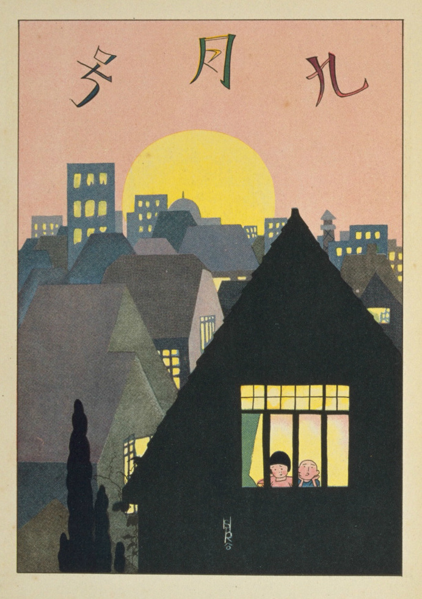
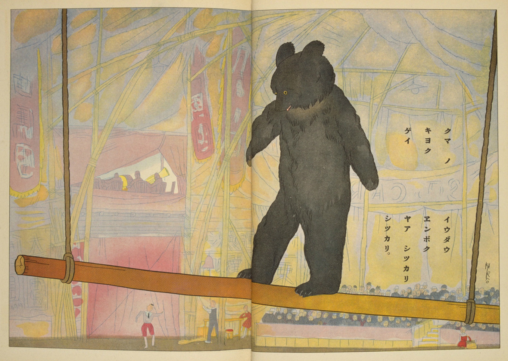

_I’m [Gus Cuddy](https://guscuddy.com/) and this is [The Curtain](https://guscuddy.substack.com/), a newsletter exploring arts, performance, technology, media psyches and cultural consciousness. New reader? [Subscribe for free](https://guscuddy.substack.com/subscribe)._

---

Hi friends,

I hope you're staying strong.

This week it reached up to 65 degrees here in New York. It felt sublime to be able to walk through the sun-drunk streets in a t-shirt, grab an iced latte and cornetti, breathe in some thing resembling optimism.

I've felt the winter blues pretty hard this year; I know others have had it even worse. There's something palpable in the air now, like we're teetering on the edge of a humane explosion of built-up kinetic and somatic energies, touching touching touching, bodies & sweat, heat n' yearning n' breath, swimming through the thick air like delirious platypuses mucking about in the shallow lakes of eastern Australia, water droplets hitting eyelids and cheeks, previously-embroiled eye-to-eye (face-to-face?) trust. I don't know; maybe we're being swindled; maybe the numbers will get worse before they get better. I used to obsess over tracking the data, but now I can't bear to look anymore (and projects like [rt.live](https://rt.live) and [The COVID Tracking Project](https://covidtracking.com/?source=rt) have, in somewhat of a suspicious omen, come to an end.) But gosh, I'm snatching at this skies-parting, heavenly thrust of goodness, the dim thrum of yesteryear that feels like a forgotten palace of the everyday.

It's now exactly a year since the World Health Organization declared COVID-19 a pandemic --- in retrospect, clearly too late --- and the world began to shut down. I flew from New York to California on March 10th, 2020, and in the week I was there the United States seemed to crumble. (I remember the clear sign of the impending crisis with the Utah Jazz’s Rudy Gobert touching every microphone, testing positive for COVID, and the NBA subsequently shutting down.) [The edition of The Curtain I sent out on March 11](https://guscuddy.substack.com/p/the-curtain-47-vulnerability-in-art) only started to cover the "coronavirus" --- remember when [Scott Rudin cut Broadway ticket prices](https://deadline.com/2020/03/scott-rudin-broadway-coronavirus-50-tickets-to-kill-a-mockingbird-west-side-story-1202878245/) to a hilariously-not-that-low $50 on March 10th to "keep theaters full"? --- and [the arts-and-COVID-focused issue](https://guscuddy.substack.com/p/the-curtain-48-arts-in-the-age-of) a week later, while pessimistic, didn't comprehend the sheer scale of what this was going to be: "online theatre" initiatives and ideas would wax, wane, fizzle out; a year from now we'd still be closed down with the ending still frustratingly opaque.

Back then weeks felt like they lasted an eternity; now weeks pass for me in the spans days: amorphously, drearily, swiftly. I hope that will change soon: that things known not since pre-pandemic times will more steadily define our days and weeks, little by little: the first time we hang out with someone unmasked, the first time we see a piece of live theatre, the first time we attend a party. It all feels brand new again.

---

## on art and artificial scarcity in 2021

[The boom](https://guscuddy.substack.com/p/the-curtain-094-nfts-crypto-and-the) of Non-Fungible Tokens (NFTs) ([Beeple just sold an NFT for $69 million](https://www.theverge.com/2021/3/11/22325054/beeple-christies-nft-sale-cost-everydays-69-million)) centers around *artificial scarcity*: imposing constraints onto the usually abundant digital world. Is this a good idea? [Dan Cohen points out](https://buttondown.email/dancohen/archive/humane-ingenuity-35-bounded-and-boundless/) that the idea of artificially creating uniqueness is not new at all: for instance, the Wu-Tang Clan [released an album with one copy](https://en.wikipedia.org/wiki/Once_Upon_a_Time_in_Shaolin) in 2015 (that was bought by Martin Shkreli). What they wrote on their website at the time predates what NFT advocates are writing today:

> The music industry is in crisis. The intrinsic value of music has been reduced to zero. Contemporary art is worth millions by virtue of its exclusivity ... By adopting a 400 year old Renaissance-style approach to music, offering it as a commissioned commodity and allowing it to take a similar trajectory from creation to exhibition to sale ... we hope to inspire and intensify urgent debates about the future of music.

Another example: science fiction writer [William Gibson released a poem stored on a floppy disk which encrypted itself after single use](<https://en.wikipedia.org/wiki/Agrippa_(A_Book_of_the_Dead)>) in 1992. Artificial scarcity is not a new concept.

But some argue that the artificial scarcity that NFTs create (through blockchain technology) is cold and inhumane. That forging authenticity for profit is an impropriety on the spiritual conduit of art. Time is the best judge, after all: it shows us what we want to remember, what we want to hold up, what we want to make unique.

I'm sympathetic to that argument, but I don't fully buy it. In 2021, all scarcity is imposed in some way.

I'm participating in an interesting "immersive theatrical experience" called "[Artistic Stamp](https://artisticstamp.com/)", where the entire "play" takes place over letters by mail. The characters write to me, and I write them back with my thoughts or an answer to a question. It's fun, but I was especially taken when I got my first letter: it was hand-written and addressed to me. It felt special. But just like digital scarcity, the entire thing is an artifice: we're imposing these limitations by conducting a story over mail. We can say that COVID forced us into this, but the choice is still there: it's intentional scarcity --- and it feels good.

This type of deliberate artificial scarcity makes a choice to appeal to a specific type of person. But this is essentially what everything does! Choices are always made when things are created of what and who it might appeal to, whether they're explicitly made or not. [As Drew Austin points out](https://kneelingbus.substack.com/p/153-incunabula), scarcity has become more and more of a conscious design choice. In 2021, we're no longer bound by geographical constraints; the internet connects us all. While in the past you might have had to stand outside of McDonalds and hand out your music tapes to passerby like [Daniel Johnston](https://en.wikipedia.org/wiki/Daniel_Johnston) did in the 1980s, using anything but the internet to release music in 2021 carries with it a conscious decision of self-imposed scarcity and perhaps a dash of irony.

Scarcity can also be centered around form: live theatre and immersive art pieces are by nature scarce, whereas recorded music, digital art, and video have the ability to be portable and abundant. Technology collapses much of the old ideas around physical scarcity. But the choice to create a play rather than, say, a television show or movie, is still a conscious decision in 2021 that accepts scarcity as a part of the artistic project. And that's OK! Much of the pleasure of theatre is derived from being in a room with a limited number of people. Scarcity is a part of the form.

Attempts to de-contextualize theatre from its scarcity are a mixed bag. It's become clear that Zoom theatre, despite some successes, is not an adequate replacement for the real, live thing. I think a lot of the reason for that is that it doesn't feel sufficiently scarce and ephemeral: nothing can top an in-person event that's different each time it's performed. In certain cases, however, recorded or streamed live performances can capture a piece of theatre, grabbing that scarcity and expanding it to a wider audience (look at the success of [_Circle Jerk_](https://guscuddy.substack.com/p/onlinetheatre) or [Disney+'s _Hamilton_](https://guscuddy.substack.com/p/the-curtain-64-the-disneyfication)). But even in recorded live theatre or stand-up specials, we retain some of the artifice of scarcity: performers are still performing for the in-person audience, not the viewers at home. No matter which way we turn, artificial scarcity becomes a decision.

I get a lot of the distaste for NFTs --- the crypto world has many slimy evils, [as I've written about](https://guscuddy.substack.com/p/the-curtain-094-nfts-crypto-and-the) --- but the idea that creating artificial scarcity is some sort of evil ignores the realities of the internet in 2021, and falls into a romantic nostalgia trap. The bigger problem with NFTs is that much of this artificial scarcity is created without consideration because of the gold rush for mad profits. But even still, artists are getting paid directly for their work because of this artificial scarcity, correcting the biggest strength and sin of the internet: its unlimited abundance, which brought the music industry to its knees. Is that anything to complain about?

---

## notes from the week

-   Capitalism is clearly working: [Taylor Lorenz wrotes about a slew of companies](https://www.nytimes.com/2021/03/10/style/creators-selling-selves.html) that aim to make _everything_ sellable for online creators, including their decisions throughout the day: "One comes in the form of NewNew, a start-up in Los Angeles, that describes its product as creating a "human stock market." On the app, fans pay to vote in polls to control some of a creator's day-to-day decisions."
-   Your weekly dose of NFT philosophizing: [I enjoyed this rather in-depth podcast](https://interdependence.fm/episodes/primacism-david-rudnick-on-the-struggle-for-primacy-type-and-poetrys-unique-value-in-an-age-of-digital-and-physical-conflict-and-percy-shelleys-mont-blanc) on Holly Herndon and Mat Dryhurst's podcast with designer [David Rudnick](http://davidrudnick.org/), discussing the power of tyopgraphy and poetry in building the next internet.
-   I loved Helena Fitzgerald's writing on a particular interior design trend of ["the conversation pit"](https://griefbacon.substack.com/p/the-conversation-pit) in _Mad Men_ and the 1970s, its appeal and misery, and the allure of parties and the past. "Nothing looks like the past so much as the things that were supposed to look like the future."
-   [Nick Quah on what went wrong with Gimlet](https://www.vulture.com/article/gimlet-reply-all-controversy-spotify-test-kitchen.html) ([I wrote about this last week](https://guscuddy.substack.com/p/the-curtain-095-the-perils-of-mixing), too)
-   [What did cities sound like during the lockdown?](http://senseable.mit.edu/sonic-cities/) Very impressive visualizations from MIT's Sonic Cities which I enjoyed playing with, didn't completely understand, and slowed my computer down to a crawl.
-   Mozilla's [Internet Health Report 2020](https://2020.internethealthreport.org/) is a wonderful reflection on the condition of the internet in 2020: big tech dominates, misinformation spreads like crazy, almost half the world is still offline, and algorithms still default to racism and sexism.
-   [The New York Times asked 75 artists](https://www.nytimes.com/interactive/2021/03/10/arts/artists-coronavirus-lockdown.html) about their year in lockdown and what they've made, what art they turned to, what bad ideas they had, moments from the year, friendship, what they'd do differently, and what they hope to achieve. I especially appreciated Tracy Letts' depressing (but relatable) answer to what he's made:

> **I’ve made nothing**. On four separate occasions, I arranged my schedule with [my wife] Carrie so I could have six uninterrupted hours a day to write. All four times, I emerged from my office after two or three weeks, rattled, defeated, feeling lousy about myself. My wife finally said, “Here’s what you have to do: read books, watch movies, cook dinner and take care of our boy.” That is what I’ve done. And while my family is my focus and my joy, from a creative standpoint, this year for me has been a dust storm. I’m normally involved in a number of creative endeavors, in different forms, but the theater is my lifeblood and I don’t know who I am without it. The plug getting pulled on “The Minutes” was truly devastating for me. I feel like a heel even saying that since so many people in this country and around the world are suffering as a result of this pandemic in ways I can’t even fathom. But it’s the simple truth. I can’t do the computer theater, it’s too depressing for me, and I’ve turned down a couple of on-camera jobs because I am just as scared of this virus as I was a year ago. Creatively, I’m lost. It’s why I’m doing this interview. I’m guessing there are some other artists who identify.

---

## End Note

<figure>

<figcaption><a href="http://50watts.com/Kawakami-Shiro">Illustrations by Kawakami Shiro for Kodomo no kuni</a></figcaption>
</figure>

---

_That’s all for this week—thanks so much for reading!_

_If you enjoyed this, I would love if you shared it. It really helps me out._

_If you enjoy The Curtain, you could also consider [becoming a paying subscriber](https://guscuddy.substack.com/subscribe). I currently run on a patronage model: the benefits are the same (right now) for paying and free subscribers. Your support helps make this sustainable._

**_[Subscribe now](https://guscuddy.substack.com/subscribe?utm_medium=web&utm_source=subscribe-widget&utm_content=31699931)_**

_New reader? The Curtain is a weekly digital letter sent by [Gus Cuddy](https://guscuddy.com/). You can [subscribe for free here](https://guscuddy.substack.com/subscribe), or [browse the archives here](https://guscuddy.substack.com/archive)._

_You can reply directly to this email and I’ll receive it. So feel free to do that about anything. I love to hear back from people._

_See you next week!_

-Gus
