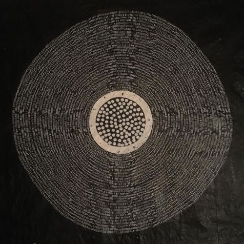

Hello all,

Hope you're having a great week.

Hello to any new subscribers! Thanks to [Brian Herrera](https://brianeugenioherrera.substack.com/) for linking me in his newsletter this week. I encourage you to subscribe to his newsletter as well.

---

## **Substack's Power Law and the Digital Media Ecology**

Like many other writers, I write and send this newsletter out via the [Substack](https://substack.com) platform. Over the last year Substack has become immensely popular, the punchline of many jokes on media Twitter: "watch out, so and so is going to leave their job and start a Substack." It's a bit odd: Substack is just a service that allows you to easily send out newsletters, built specifically around writers. Nothing special. Mailchimp/Tinyletter have been doing this for many years. Writers don't have "substacks", they have newsletters hosted on Substack. Where Substack "innovated" is in how easy they made it for writers to monetize. There's other services out there that do the same thing (I'm looking at [Buttondown](https://buttondown.email/) myself), but there's no question that Substack has remained supreme. So supreme, in fact, that big tech like Facebook and Twitter have decided to start [their](https://www.theverge.com/2021/3/17/22336452/facebook-newsletters-substack-revue-media-groups-pages) [own](https://www.theverge.com/2021/1/26/22250156/twitter-revue-newsletter-acquisition-email-service) newsletter services. But at its core, Substack's quest to empower individuals has led to a media ecology with just as much inequality as before.

I've written about Substack several times, most notably [last year](https://guscuddy.substack.com/p/investing) when huge writers like Glenn Greenwald and Matt Yglesias switched to the service. That signaled a larger trend in digital media, an "unbundling" of institutions to individuals. That unbundling, of course, is fraught with many questions. Notably: what role does Substack have as a publisher versus just a platform? Are they responsible for the writers they attract? It might have been easy for them, at one point, to claim Silicon Valley's classic neutrality stance. But as the high-profile writers making the switch added up --- and what they stood for became more clear --- the mood started to shift. Clio Chang wrote a negative profile last year coining the term "[Substackerati](https://www.cjr.org/special_report/substackerati.php/)" to describe the clique of writers joining the platform: typically, they were outspoken against "cancel culture", some of them displayed [disturbing anti-Trans attitudes](https://twitter.com/sadydoyle/status/1371121857961803779), and they positioned themselves as finally finding "free speech" outside of their respective stifling institutions. Oh, and they were all _already_ hugely successful and popular.

Now it's come to light that Substack has been _paying_ [many of these high-profile writers](https://domstack.substack.com/p/who-are-the-substack-pros) huge advances to leave their jobs and join the Substack platform, under what they're calling ["Substack Pro"](https://blog.substack.com/p/why-we-pay-writers). In her piece, Chang writes that "adherence to neutrality only enforces existing power structures" --- Substack has merely taken the existing power structures and transposed them onto their platform. This "rich get richer" model mirrors the current economy. Worse, [they deny](https://blog.substack.com/p/why-we-pay-writers) that paying writers what amounts to a lucrative, six-figure salary is in any way an editorial or publishing decision, maintaining that they're simply a neutral platform. There's been a lot of takes going on around this; people are understandably upset. [Jude Doyle](https://doyles.substack.com/p/in-queers-we-trust-all-others-pay), [Dan Hon](https://danhon.substack.com/p/s09e07-the-one-where-i-dont-want), [Anne Trubek](https://notesfromasmallpress.substack.com/p/should-i-even-be-writing-this), [Emily VanDerWerff](https://emilyvdw.substack.com/p/on-substack) and others all wrote good pieces.

I'm especially disturbed by the power laws that Substack helps enable. The internet deals in mostly extremities: there isn't much room for nuance. What's popular gets more popular; what's not popular remains unpopular. Despite promises of egalitarian decentralization, much of the modern internet has proven that a middle-ground doesn't exist: you've either made it, or you haven't. Substack determines who gets "Pro" treatment based on how many Twitter followers and how buzzy (for good or bad) a writer is. This widens the gap between successful writers and struggling writers; inequality spills out onto the internet in the ways in which we define power. Perhaps most important is who the "we" is that is defining that power: companies that promise to revolutionize, decentralize, individualize, commoditize are still largely founded and made up of white men. The rules of the game haven't fundamentally changed.

As the future comes barreling forward and different digital media (and art) ecologies emerge, it's going to be more and more important for us to enable the voices that haven't been heard, empower those who haven't been empowered, and have deliberately chosen values. I worry that the web just moves in endless cycles, each spiral gradually unearthing more problems, and each problem solved with a tech-bro solution to the problem that opens up ten more problems. The root cause is never arrived at; we're constantly scrapping for new ways to make a "creator economy" or "monetize writers", companies popping up to offer band-aids to problems that other companies created years prior, all instead of asking why we got like this in the first place.

---

## **notes from the week**

**deformin in the rain**

Film scholar Jason Mittell's new article, "[Deformin' in the Rain: How (and Why) to Break a Classic Film](http://www.digitalhumanities.org/dhq/vol/15/1/000521/000521.html?utm_source=dancohen&utm_medium=email)", is really something. In it he takes _Singin' in the Rain_ and digitally "deforms" it in several ways, chopping it and skewing it into "audiovisual artifacts" to provide new insight into video art. In all, Mittell tries on six different ways of working with deformation: still frames, motion, shots, speed, space, and sound. I enjoyed Mittell's mixture of scholarship with experimental bonanza; he prioritizes GIF loops and even tries on different popular memes, like speeding things up every time someone sings the word "dance" in the "Broadway Melody" dream ballet:

(The originator of this meme gets another mention in this newsletter - "[The Entire Bee Movie but every time it says bee it speeds up by 15%](https://www.youtube.com/watch?v=JMG1Nl7uWko)")

It’s a fascinating way of “getting inside” the nature of video art.

---

**asmr bee movie**

Youtube [ASMR](https://en.wikipedia.org/wiki/Autonomous_sensory_meridian_response) people, a community which I don't really understand but am fascinated by, got together and made a 95 minute "cover" of a canonized classic: _Bee Movie_. [The result is... wild?](https://www.youtube.com/watch?v=WVcx29q3ey4). You're supposed to watch it side-by-side with the original Bee Movie, which is the kind of ambitious, insane artistic project that I'm here for.

But I'm also intrigued by [what Matt Webb wrote](http://interconnected.org/home/2021/03/16/asmr) about the project on his blog, referring to this idea of "neuro-divergent media":

> What if there were neurodivergent-optimised versions of all media?
> 
> Not just ASMR _Bee Movie_ but taciturn and slow-paced superhero movies, for people who are easily overwhelmed, like French New Wave meets the Marvel Cinematic Universe, or for completionists, speedrun Netflix Originals where each episode is only 3 minutes and expunges narrative irrelevant to the overall season arc, with everything fitting together neatly at the end.

---

*   [Dean Kissick has an amazing piece](https://www.spikeartmagazine.com/articles/downward-spiral-popular-things-dean-kissick) in Spike Art Magazine on NFTs and the flattening of culture: "Lately artworks have begun to look more like memes, while memes have begun to look more like artworks. The memes look nicer, and offer more hope."
    
*   The Oscar Nominations came out, and honestly I haven't seen a single film yet. I hope that changes! As always, [I enjoyed Richard Brody's contrarian piece on the nominations](https://www.newyorker.com/culture/the-front-row/the-2021-oscar-nominations-and-what-should-have-made-the-list).
    
*   [Daisy Alioto considers TikTok and what she calls "Suburban Gothic"](https://dirt.substack.com/p/dirt-tiktok-and-suburban-gothic).
    
*   Over in France, [arts workers are occuping theaters and demanding to have them re-opened](https://www.nytimes.com/2021/03/11/theater/france-theater-protests-pandemic-shutdown.html) like other essential businesses. It's a surprising contrast to the United States, where the opposite seems to be largely true, at least as led by the unions: Actor's Equity has strict re-opening guidelines, advocating caution above all else. But the two countries have vastly different relatinships to arts laborers; [Jesse Green](https://www.nytimes.com/2021/03/17/theater/france-protests-arts-workers.html) unpacks some of those differences for the Times.
    
*   [Moviepass --- moviepass!!! --- has relaunched a website with a mysterious countdown](https://moviepass.ventures/).
    
*   Here’s a good title: [New Windowless Taco Bell On Stilts Design is Result of "Auto-Dominated Market Forces"](https://www.core77.com/posts/105836/New-Windowless-Taco-Bell-On-Stilts-Design-is-Result-of-Auto-Dominated-Market-Forces)
    
*   [And here's a 1995 throwback clunker](https://www.newsweek.com/clifford-stoll-why-web-wont-be-nirvana-185306) in Newsweek on the disappointment of the internet. Helpful for keeping future-related tech prognostication in perspective.
    

---

## **End Note**

<figure>
    
    <figcaption>Art by&nbsp;<a href="https://www.instagram.com/shane_drinkwater">Shane Drinkwater</a></figcaption>
    </figure>

---

_That’s all for this week—thanks so much for reading!_

_If you enjoyed this, I would love if you shared it. It really helps me out._

_If you enjoy The Curtain, you could also consider [becoming a paying subscriber](https://guscuddy.substack.com/subscribe). I currently run on a patronage model: the benefits are the same (right now) for paying and free subscribers. Your support helps make this sustainable._

_**[Subscribe now](https://guscuddy.substack.com/subscribe?utm_medium=web&utm_source=subscribe-widget&utm_content=31699931)**_

_New reader? The Curtain is a weekly digital letter sent by [Gus Cuddy](https://guscuddy.com/). You can [subscribe for free here](https://guscuddy.substack.com/subscribe), or [browse the archives here](https://guscuddy.substack.com/archive)._

_You can reply directly to this email and I’ll receive it. So feel free to do that about anything. I love to hear back from people._

_See you next week!_

\-Gus