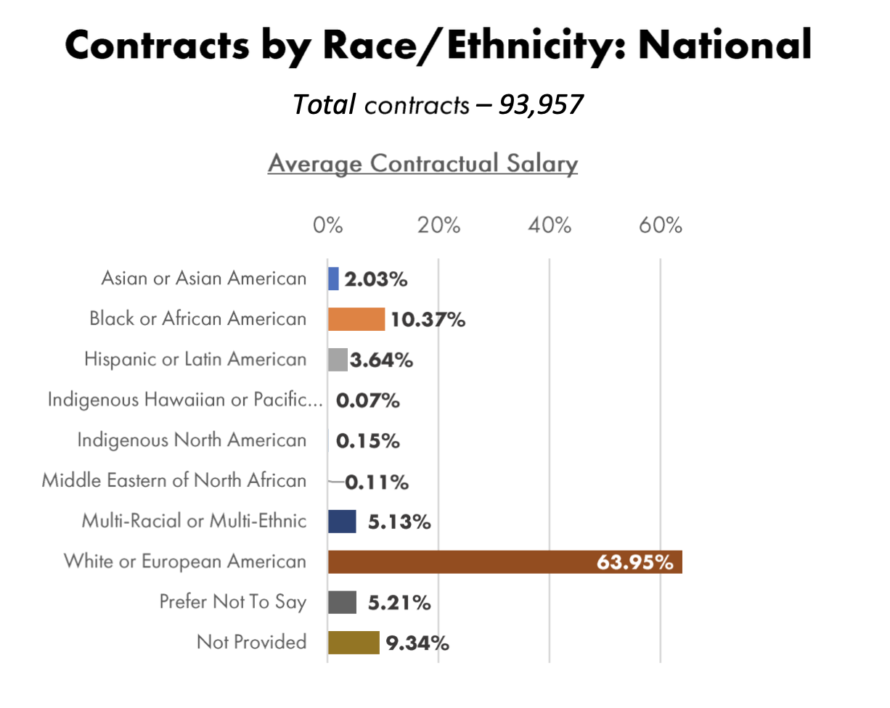
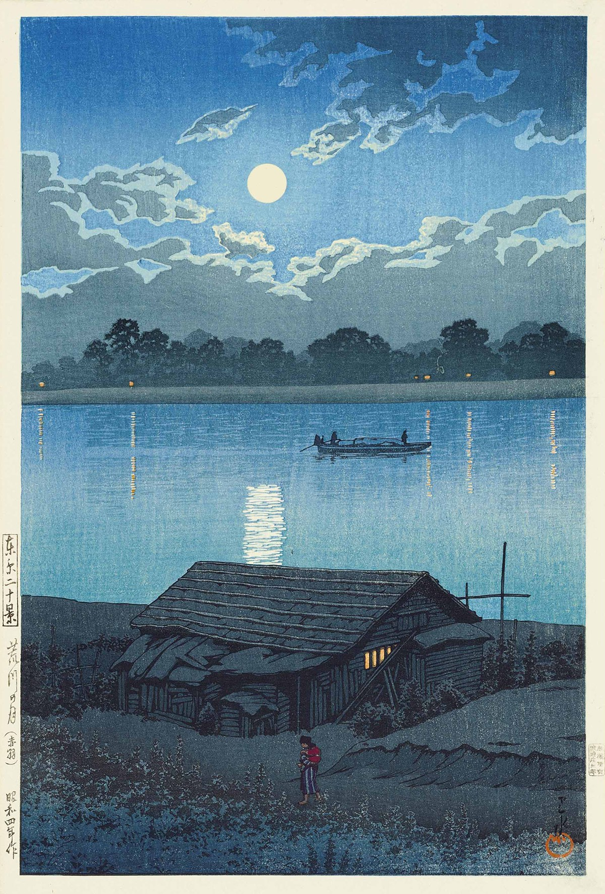

_I’m [Gus Cuddy](https://guscuddy.com/) and this is [The Curtain](https://guscuddy.substack.com/), a newsletter exploring arts, performance, technology, media psyches and cultural consciousness. New reader? [Subscribe for free](https://guscuddy.substack.com/subscribe)._

---

Hope you're staying well!

This week, some thoughts about the state of re-opening theatre amidst the misfires from Actor's Equity, the union for theatre performers and stage managers. Then a smattering more of thoughts and links.

As always: if you enjoy this newsletter, it's a huge help if you share it. Or hit reply and feel free to write me anything — I really appreciate it.

---

### **Re-opening theatre, Actor's Equity, and grasping the demands of COVID**

As the COVID-19 vaccine rollout picks up, and theatre workers become increasingly eligible (particularly in New York City, [where de Blasio has just announced a dedicated site for theatre workers](https://www.nytimes.com/2021/03/25/theater/broadway-vaccinations-coronavirus.html)), the possibility of live theatre (and other arts) re-opening some time in the next year becomes more and more realistic. That feels extraordinary and still ever-fleeting — it seems like this liminal, reckoning space we’ve found ourselves in has both passed slowly and barely started — but here we are. More and more people I know (many of whom are actors) have gotten or are getting the vaccine; it’s hard not to be at least a little bit optimistic about many New York theatre artists getting the vaccine over the next few months.

But what’s it going to take for theatre as we knew it to restart?

The most notable hurdle, at this point, may be Actor’s Equity Association (AEA), the actors’ and stage manager’ union, which has struggled to find its role throughout the whole pandemic.

The truth is this: actors are terrifically underpowered in our business. Ordinarily, pre-COVID, the average struggling actor in New York is treated like cattle. It’s a horrible power dynamics game that I cringe at every time I have to interact with its inner workings: the unpaid free labor, the going to auditions, the not hearing back. It’s unfortunate that there also simply too many actors, as well; at any given time, the majority of actors in the union are going to be unemployed.

Actor’s Equity, by extension, is a union that fights hard for relatively paltry demands. The economics of this business aren’t behind actors; producers are more powerful at every turn of the way — actors are, simply put, pretty much replaceable. This is a union that’s biggest win in the last few years is [negotiating](https://www.nytimes.com/2019/02/08/theater/broadway-profit-sharing.html) _[1%](https://www.nytimes.com/2019/02/08/theater/broadway-profit-sharing.html)_ [of the profits from Broadway shows](https://www.nytimes.com/2019/02/08/theater/broadway-profit-sharing.html) — one single percent! — split between all performers and stage managers who participated in its development. And that’s just on the biggest stage there is — working anywhere but on Broadway in New York still requires you to take survival jobs (like waiting tables) in between work. And as this actor can tell you, “in between” can stretch on a lot longer than you think. (I started this newsletter at the end of my last full regional theatre contract.)

So just as the pandemic devastated the business of theatre, it devastated actors and their union. Actor’s Equity has struggled to adapt to the quick-moving demands of COVID-19. In the Fall of 2020, they were [locked in a battle with the Screen Actor’s Guild](https://deadline.com/2020/11/sag-aftra-actors-equity-deal-live-theater-taping-dispute-1234619239/) to figure out whose jurisdiction streaming theatre was under — AEA claimed it was theirs, while SAG-AFTRA insisted that taped theatre fell under the umbrella of screen acting. Equity did (mostly) get back jurisdiction for covering streaming theatre, but in the process they blocked many struggling actors from working at all. I auditioned for at least one show last year that ended up getting shut down because of Equity regulations.

What, exactly, is Equity protecting its actors from? There is certainly a multitude of ways actors may get exploited; practically, however, Equity’s lack of forward-thinking has cost theaters the space to experiment and innovate in the era of remote theatre, and actors the ability to take work. 

With theaters trying new ways to re-open, Actor’s Equity’s latest obsession is with keeping actors safe. Okay — that seems like a good thing! Theaters shouldn’t exploit actors by making them perform unmasked in large groups indoors. Only — that’s not what theaters are trying to do. Recently, Dallas Theatre Center was set to produce a version of “Tiny Beautiful Things”: they would film and stream the work with no live audience, as many theaters are trying to do. The theater developed a 45-page safety plan. But [Equity effectively shut down the production](https://www.nytimes.com/2021/03/23/theater/actors-equity-health-safety.html) by insisting that there needed to be 80 minute breaks every 80 minutes because of poor air filtration.

It prompted [an angry letter signed by 2500 members of the union](https://www.nytimes.com/2021/03/19/theater/actors-equity-frustration-petition.html), asking about the details of theatre’s return to work. Over in France, [arts workers occupied theaters](https://www.nytimes.com/2021/03/11/theater/france-theater-protests-pandemic-shutdown.html), demanding to know when they could return to work. Meanwhile in the United States, Equity seems to be stuck on weird science from six months ago — once again unable to grasp the quickly-changing realities of the time. 

It’s kind of fascinating, really. Since this is a union — and a somewhat sizable one, at 51,000 members — you’d think that members would have some say in how they might want to return to work. But it’s frequently the case that Equity leadership is at odds with its members. In this case, their plan to keep actors safe has remained frustratingly shady and opaque — as a member, I’m not clear at all on what our guidelines in returning to work are — and seemingly the opposite of what most actors want. What’s worse, health insurance through the union has both weakened and become nearly impossible to become eligible for.

With New York City amping up the vaccines for theatre workers, it’s only a matter of time until it’s feasible that the majority of actors in the city are vaccinated. But what will Equity do then? Will theaters be able to experiment with ways of restarting theatre, this time not over Zoom? Theatre performers have been left out to dry by the pandemic response from the government and union. The lack of proper response — and agile flexibility — has meant a frustrating lack of innovation in what remote theatre could be. My fear is that things in theatre return slowly — excruciatingly slowly — to exactly how they were before, without considering what we’re missing.

---

## **Notes from the Week**

### Anti-Asian Bias in Arts

The horrific Atlanta shooting has made me look carefully at the ways in which arts and culture have historically disenfranchised Asian folks. In theatre, they are still woefully underrepresented. Here's the data from [Equity's Diversity Report](https://actorsequity.org/news/PR/DandIReport2020/diversity-and-inclusion-report-2020) in late 2020, showing that Asian and Asian-American actors make up just 2% of total actor contracts:

But it's not just numbers, of course. Anti-Asian narratives are embedded deeply in many canonized works of narrative art. A couple examples:

It's certainly true all over theatre — in 2017, [Diep Tran wrote a beautiful essay about her relationship to the problematic-doesn't-begin-to-describe-it musical](https://www.americantheatre.org/2017/04/13/i-am-miss-saigon-and-i-hate-it/) _[Miss Saigon](https://www.americantheatre.org/2017/04/13/i-am-miss-saigon-and-i-hate-it/)_.

It's true in comics books, as well: DC Comics' first ever issue started with a horrifically racist caricature of its antagonist. Fascinatingly, as [Robin Sloan wrote about in 2019](https://desert.glass/archive/reckoning-with-detective-comics/#text), cartoonist Gene Luen Yang confronted that image head-on [in his run of comics for DC](https://geneyang.com/the-final-issue-of-new-super-man-comes-out-this-week) in 2016.

---

### **"Vendoring Culture"**

Speaking of that creative act from Yang mentioned above, I'm fascinated by this idea of what Alan Jacobs calls ["vendoring culture"](https://blog.ayjay.org/vendoring-culture/).

In programming, vendoring is the idea of copying someone else's code and essentially pasting it into your own codebase, so that you can rework it to make something new. That's a much less popular way of doing things than by using _dependencies_, which are basically pointers to the original code elsewhere that your codebase depends on.

Jacobs calls what Gene Luen Yang does with his _New Super-Man_ comic an act of "moral repair through vendoring code". Or, in this case, vendoring culture itself --- literally copying that original horrifying image and reworking/reusing it to start to repair its damages.

I've previously written about something similar to this, with _Watchmen_ and what I called ["The Age of the Remix"](https://guscuddy.substack.com/p/the-curtain-32-the-age-of-the-remix).

---

### **🔗 links 🔗**

*   The new print-only theatre magazine _[The Flashpaper](https://www.theflashpaper.com/)_ is accepting submissions for their third issue. The prompt: "What happens on the first day we’re back in a room together?"
    
*   [NPR's Code Switch on the Anti Asian violence that came before the Atlanta shooting](https://www.npr.org/2021/03/23/980437156/screams-and-silence).
    
*   [Kyle Chayka on how Beeple crashed the art world](https://www.newyorker.com/tech/annals-of-technology/how-beeple-crashed-the-art-world)
    
*   Casey Neistat's brother, Van Neistat, [started a YouTube channel](https://www.youtube.com/channel/UC5mPJA4y5G8Z6aNkY6AxgAw) and it's great and weird. I especially liked his video tribute to Garrett Bradley, the Oscar-nominated director of the great documentary _Time_. In it he quotes collaborator and artist Tom Sachs, contextualizing why it's a good thing to be nominated for an Oscar: "the reward for good work...is more work."
    

https://youtube.com/watch?v=rcZrUYEw3HM

*   Two newsletters I've been enjoying recently: [Jennifer Daniel's newsletter about emoji](https://jenniferdaniel.substack.com/) (surprisingly vast, deep, and moving) and [50 Years of Text Games](https://if50.substack.com/) about the history of text-baesd video games (cool!),
    
*   The housing market is drunk, says Derek Thompson: [home prices are going up, rents are going down](https://www.theatlantic.com/ideas/archive/2021/03/why-are-housing-prices-and-rents-down/618212/).
    
*   [A visualization of the internet's networks of networks](https://www.opte.org/the-internet):
    

https://youtube.com/watch?v=DdaElt6oP6w

*   [An interactive canvas you can fill up with emoji](https://emojraw.glitch.me/), which is surprisingly satisfying
    
*   [The New York Times has abandoned its huge Facebook cooking group](https://www.niemanlab.org/2021/03/the-new-york-times-is-so-done-with-its-77000-member-facebook-cooking-group-what-happens-now/)
    
*   [so are the Tonys just never happening?](https://www.vulture.com/article/tony-awards-voting-ceremony-covid.html)
    

---

## end note

<figure>
    
    <figcaption><a href="https://www.brainpickings.org/2021/03/22/hasui-kawase-prints/">Hasui Kawase</a> - <em>Moon over Arakawa River</em>, 1929</figcaption>
    </figure>

---

_That’s all for this week—thanks so much for reading!_

_If you enjoyed this, I would love if you shared it. It really helps me out._

_If you enjoy The Curtain, you could also consider [becoming a paying subscriber](https://guscuddy.substack.com/subscribe). I currently run on a patronage model: the benefits are the same (right now) for paying and free subscribers. Your support helps make this sustainable._

_**[Subscribe now](https://guscuddy.substack.com/subscribe?utm_medium=web&utm_source=subscribe-widget&utm_content=31699931)**_

_New reader? The Curtain is a weekly digital letter sent by [Gus Cuddy](https://guscuddy.com/). You can [subscribe for free here](https://guscuddy.substack.com/subscribe), or [browse the archives here](https://guscuddy.substack.com/archive)._

_You can reply directly to this email and I’ll receive it. So feel free to do that about anything. I love to hear back from people._

_See you next week!_

\-Gus