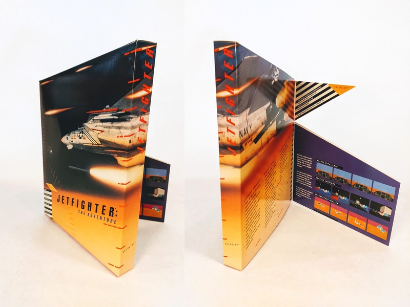
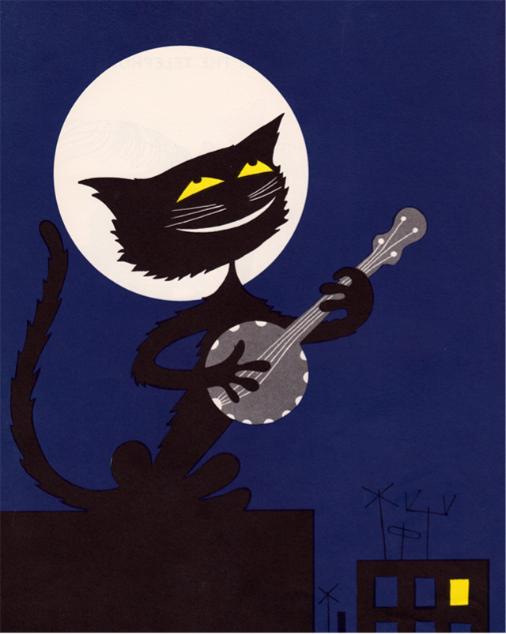

_I’m [Gus Cuddy](https://guscuddy.com/) and this is [The Curtain](https://guscuddy.substack.com/), a newsletter exploring arts, performance, technology, media psyches and cultural consciousness. New reader? [Subscribe for free](https://guscuddy.substack.com/subscribe)._

---

Hi friends,

This week’s Curtain is coming out a bit later than usual. I hit a block this week in planning and writing this issue. I’m not sure you’ve noticed this, but there is a lot going on in the world, and it can often be overwhelming.

If you have any feedback or responses to these emails, I love hearing back from folks. Stay well, and let’s all take care of ourselves.

---

Gosh, this week had a weird mood to it for me, one I couldn’t quite place. But this video of a Japanese cafe owner making pizza toast (!) and coffee, filmed by Craig Mod to accompany his book _Kissa by Kissa_, was a wonderful mood palette cleanser:

https://youtube.com/watch?v=i5SLi-GZ0Z4

As Craig describes it:

> Pizza Toast & Coffee (2021) is a short documentary about kissaten — Showa-era (1926–1989) Japanese cafe — culture. Būgen is a small kissa in a suburb south of Tokyo. It was featured in the book Kissa by Kissa. Proprietor Yamane-san has survived four bouts of cancer and has run his cafe for close to forty-five years. He makes a mean pizza toast with a unique cutting style. Pizza toast is a staple of kissa culinary culture.

His photography/travel/essay book _[Kissa by Kissa](https://shop.specialprojects.jp/products/kissa-by-kissa-2nd-ed)_ covers more about kissaten. And he’s written [a long essay for Eater about pizza toast](https://www.eater.com/2019/12/16/21003452/japan-kissaten-traditional-cafes-pizza-toast-travel), as well.

Good vibes. Anyway:

---

This week we saw Lil Nas X perform a masterclass in celebrity showmanship. After releasing his new single and music video [Montero (Call Me By Your Name)](https://www.youtube.com/watch?v=6swmTBVI83k), where he explores his own queerness through a surreal romp through biblical homophobia, the rapper/gen-z-digital-performance-artist dropped an illegally modified Nike sneaker, in collaboration with Brooklyn-based art collective [MSCHF](https://mschf.xyz/), which contained (allegedly) human blood. Okay, yeah — that riled up some folks!

They came out in droves. Armed with a militia of memes, Lil Nas X [struck down angry Twitter personalities](https://www.nytimes.com/2021/03/30/arts/music/lil-nas-x-twitter-sneakers-outrage.html)— your right-wing trolls, your conservative media — with stunning, balletic finesse. It was head-spinning to keep track of, a performance unto itself.

https://twitter.com/LilNasX/status/1376568409295491081

It’s interesting: ten years ago, the video alone would have been enough to generate all the virality and outrage one needed. But in 2021’s internet, the after-show is part of the performance: the 21-year-old Lil Nas X is making clear that he’s always one step ahead, and that’s part of what we come to watch.

[Jon Caramanica writes](https://www.nytimes.com/2021/03/30/arts/music/lil-nas-x-twitter-sneakers-outrage.html#click=https://t.co/GcE5gkaWqg) in The New York Times: “No famous person is as adept as Lil Nas X at casually but thoroughly smacking down the ream of Twitter churls inevitably awakened by something like this — maybe Cardi B, or Alexandria Ocasio-Cortez.”

Lil Nas X is one example of a new class of performers on the internet. People enjoy the music, sure, but the discourse around that music is the greater story here. There’s a meta layer on top of the art-making here that _becomes_ the art. TikTok has been the great lever of this kind of performance: virality comes swift and easy with its algorithm — and this virality is predicated on the central idea of the _remix_. In other words, there’s almost always a commentary on culture happening at the same time as the culture-making is happening. 

---

Speaking of that class of TikTok performers, [the excruciating video](https://www.youtube.com/watch?v=VPgAfPlsSg0) of Addison Rae on Jimmy Fallon dancing TikTok dances created by Black creators was passed around a lot this week. It shows, in real-time, a few things. First is the fascinating generational disconnect between Gen-Z-TikTok culture and Gen-X-Television culture. Rae has become popular on TikTok for her dances, but that’s viewed through the small rectangular prism of the phone, with the actual music playing, on a short-form content app; on television, the dancing is slow, awkward, and (because of rights issues) doesn’t use the actual music. It reveals a mammoth-sized gap between the media philosophies of the two mediums. But second, and more importantly, is the appropriation of Black creators’ work that happened on the show and continues to happen on TikTok and the wider internet. This is something Rae and Fallon need to be held accountable for. Rebecca Jennings wrote [a great rundown of what went wrong here](https://www.vox.com/the-goods/2021/3/30/22357132/addison-rae-jimmy-fallon-tonight-show-tiktok-dance).

And if you haven’t read Jason Parham’s piece last year on [“digital blackface”](https://www.wired.com/story/tiktok-evolution-digital-blackface/), it’s essential to understanding the difficult terrain of digital mediums which encourage collaboration, remixing, and, ultimately, appropriation. Writes Parham:

> Together, their \[Black creators’\] experiences belie the perception of TikTok as an app of joy and creativity, revealing instead a place **tangled up in an ancient pain**—a site of blurred visions and youthful ignorances, where **flattery quickly turns into mockery, mockery into theft, and theft into something altogether more disturbing**.

---

## Notes from the week

Reed theatre professor [Kate Bredeson](https://www.reed.edu/theatre/faculty/bredeson.html) went on the [On TAP podcast](http://www.ontappod.com/home/2021/3/27/047) to discuss the French theater protests/occupations over the right to return to work for French arts workers, which are still unfolding. Over 100 theaters are occupied around France.

---

The other day I bought my first video game in, I don’t know, five years? I found my old Steam account info, logged into the digital platform/portal, and bought and downloaded the highly lauded [Disco Elysium: The Final Cut](https://en.wikipedia.org/wiki/Disco_Elysium). The game-buying experience left something to be desired, though. Indeed, video game box covers used to be incredible design projects. I mean, look at some of these [designed by Hock Wah Yeo](https://obscuritory.com/essay/incredible-boxes-of-hock-wah-yeo/):

That’s cool! Reminds me of the problems of creating [“emotionally durable designs”](https://www.taylorfrancis.com/books/emotionally-durable-design-jonathan-chapman/10.4324/9781315738802) for the digital world, especially with how we perceive products/objects that used to have a sense of tactility.

---

Oh god: [they’re making a Game of Thrones play and bringing it to Broadway](https://www.hollywoodreporter.com/amp/live-feed/game-of-thrones-play-in-the-works-for-broadway-will-revive-iconic-characters-exclusive?__twitter_impression=true). Duncan MacMillan (!!) is adapting, with Dominic Cooke directing.

It’s hard not to be at least a little bit cynical about this. I’m a fan of MacMillan’s, and am a defender of his and Robert Icke’s version of _1984_, but there’s that lingering doubt…is this what commercial theatre is now?

CC:

https://twitter.com/aeneashemphill/status/1377601710399557635

---

[Emily VanDerWerff carefully considers how to properly handle content warnings](https://www.vox.com/culture/22312274/content-warnings-explained-conversation). She pointed me to the opening that HBO Max has added before _Gone with the Wind_:

https://youtube.com/watch?v=0DF2FKRToiQ

---

[Ted Chiang on how our fears of technology are actually largely fears about capitalism](https://www.nytimes.com/2021/03/30/podcasts/ezra-klein-podcast-ted-chiang-transcript.html):

> I tend to think that most fears about A.I. are best understood as fears about capitalism. And I think that this is actually true of most fears of technology, too. Most of our fears or anxieties about technology are best understood as fears or anxiety about how capitalism will use technology against us. And technology and capitalism have been so closely intertwined that it’s hard to distinguish the two.

---

Sarah Jaquette Ray in Scientific American: despite surveys showing that communities of color are the communities most concerned about climate change, [“Climate Anxiety Is an Overwhelmingly White Phenomenon”](https://www.scientificamerican.com/article/the-unbearable-whiteness-of-climate-anxiety/). She writes: “Climate anxiety can operate like white fragility, sucking up all the oxygen in the room and devoting resources toward appeasing the dominant group”. Instead of just climate anxiety, we need climate _justice_.

---

[Rachel Hawley writes a goodbye](https://eyeondesign.aiga.org/the-internet-is-turning-on-big-techs-colorful-corporate-mascots/) to what Claire L. Evans calls [Corporate Memphis](https://www.are.na/claire-l-evans/corporate-memphis), the “illustration style of choice in our tech dystopia”. You know, those blobby figures that are meant to humanize big tech — they appear everywhere.

https://twitter.com/TheUniverse/status/1372979358936100868

## end note

<figure>
    
    <figcaption>a black cat playing guitar on a rooftop. illustration from A Kiss Is Round by Blossom Budney, 1954.</figcaption>
    </figure>

The current mood.

---

_That’s all for this week—thanks so much for reading!_

_If you enjoyed this, I would love if you shared it. It really helps me out._

_If you enjoy The Curtain, you could also consider [becoming a paying subscriber](https://guscuddy.substack.com/subscribe). I currently run on a patronage model: the benefits are the same (right now) for paying and free subscribers. Your support helps make this sustainable._

_**[Subscribe now](https://guscuddy.substack.com/subscribe?utm_medium=web&utm_source=subscribe-widget&utm_content=31699931)**_

_New reader? The Curtain is a weekly digital letter sent by [Gus Cuddy](https://guscuddy.com/). You can [subscribe for free here](https://guscuddy.substack.com/subscribe), or [browse the archives here](https://guscuddy.substack.com/archive)._

_You can reply directly to this email and I’ll receive it. So feel free to do that about anything. I love to hear back from people._

_See you next week!_

\-Gus