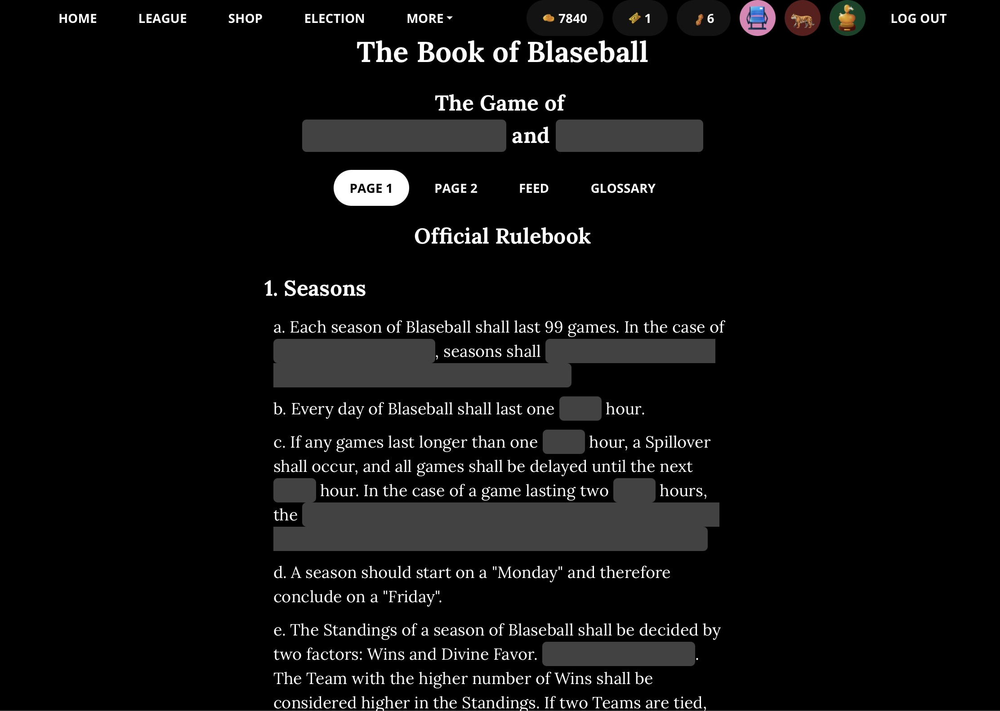

_I’m [Gus Cuddy](https://guscuddy.com/) and this is [The Curtain](https://guscuddy.substack.com/), a newsletter exploring arts, performance, media, and the internet. New reader? [Subscribe for free](https://guscuddy.substack.com/subscribe)._

---

Hi friends,

Somehow, some way, this is the 100th edition of The Curtain. 🎊

If you’ve been a reader for a while, thanks so much. This has been a great source of joy for me over the last two years.

You might have noticed that, despite [my insistence](https://guscuddy.substack.com/p/the-curtain-090-the-year-of-texture) that The Curtain would come out on Wednesdays, it’s started to come out at seemingly random times later in the week. That’s been the result of a bit of burnout and reconfiguring my schedule. Nothing major, but I hope to get it back onto a regular day soon! 

---

## Blaseball and Narrative Potential

This week, against my best interests, I started playing the internet game/cultural event known as [Blaseball](https://www.blaseball.com/). That’s baseball with an errant L, which sounds stupid when you say it out loud, which is the point. Have you not heard about it? That’s great. I encourage you to stop reading and go about your day. Seriously. Stop right here: the weather is beautiful, spring is in the air, sun is warming up the frigid darkness of winter. There’s no reason to spend any more time reading about this black hole of strange internet narrative game/story/simulation wonderland.

I’ll pause here and allow you to skip ahead to the next section. 

…

…

Still reading? Brave soul: Blaseball is not for the faint of heart; it’s for those (or maybe _not_ for those?) who can easily lose afternoons in absurdist, horror-filled alternate-sports simulations filled with deep lore, complex history, and blasphemous peanuts. It’s responsible for me pushing this newsletter out even-later-than-the-late-that-has-become-normal. And… it’s _exquisite_.

What is Blaseball? Good question! I’m still trying to figure that out myself. Wikipedia defines it as “an online browser baseball simulation horror game”, which I guess is an accurate description of it, from a surface level. But Blaseball goes much, much deeper than that. The best way to get to know it is, perhaps, [to go play the damn thing](https://www.blaseball.com/), but even that can be overwhelming. ([This guide from Cat Manning](https://catacalypto.substack.com/p/how-do-i-even-blaseball), a narrative game designer who has been writing about Blaseball and narrative, was essential for me.)

Blaseball is a sports(ish) game, then; an internet _thing_, a community-driven, narrativized, constantly unfolding cultural event. It takes place on the website, [blaseball.com](https://www.blaseball.com/), but also spills out onto other internet sensoriums: Twitter, Discord, forums, text messages with friends. There’s a Blaseball Wiki that tracks things like the game’s bizarre and essential [history of Peanuts](https://www.blaseball.wiki/w/Peanuts); there are Blaseball teams that have [actual fan clubs](https://twitter.com/HadesBlaseball/status/1364008470467518467) for them (go Hades Tigers!); and there are many sites that have spawned off, like [Blaseball-Reference](https://blaseball-reference.com/), itself modeled after Baseball/Basketball/Pro-Football-Reference.

A little frame of reference: sports simulation games are somewhat of a kryptonite for me, ever since I used to be obsessed with tracking sports stats in the local newspaper in elementary school. They’re a type of game that generally allow you to “take control” of a team as the General Manager, making personnel decisions that could make or break your squad’s future. There’s one I’ve played an embarrassingly large amount called [Basketball GM](https://basketball-gm.com/), which I don’t recommend playing if you enjoy Basketball and stats and pretending you want to run a sports team, because it will eat into the hours of your life slowly and then quickly; narratives develop around computer-generated characters that you’ve drafted 200 years into the future as you become attached to their little avatars. Still, it’s a solitary affair: I’m not sharing the lore of my league with others, though people on the Basketball GM sub-reddit _do_ write up epic treatises on the history of their teams. 

Blaseball is a bit different. In Blaseball, you’re not _controlling_ anything — not really. When you create an account you choose a favorite team, based purely on logo and team name. You can “watch” the games, which happen each hour, but you’re just seeing a little play-by-play of the game in a text box. The main conceit of the game, after that, is to bet on games with fake money to earn more fake money so that you can buy snacks and also, I guess, influence elections. Elections, you say? Elections: after each season of Blaseball (lasting a week) the community votes on rules that can affect the league, an individual team, or individual players. That _community_ part is essential: Blaseball, like real sports, exists in continuum with others, who root for their favorite teams and players that exist inside a simulation.

About those rules: the game does use the common rules of baseball, but that’s where the similarities end. Strange things happen in games: the weather is things like “coffee” or “peanuts”; umpires can decide to incinerate players; star players who have become beloved by fans will randomly disappear, either into “Elsewhere” or “Redacted”…things like that. All of this appears in a tiny little text box next to the score of the games, nothing too bombastic, with our imaginations and backstories filling in the rest. The game’s [mischievous developers](https://thegameband.com/) constantly add in wrinkles that make things ever-more chaotic, as exemplified by this video recap:

https://youtube.com/watch?v=3OJlOsKHlnk

The darker turns are where the horror game elements come into play. They’re also part of what makes the community around the game so lively and active: so much of the magic of Blaseball doesn’t happen on the website, but in the discourse and reaction to the website. The game’s developers have done a fascinating job of creating what is essentially a very long-form narrative: there’s history and lore and suspense, and the game’s rules — written in a “Forbidden Book” that is mostly redacted — are slowly revealed to the community, piece by piece. In that way it becomes like a Twin Peaks-style mystery TV show, with players constantly constructing theories to figure out what’s going on.

<figure>
    
    <figcaption>The mysterious forbidden rulebook of Blaseball.</figcaption>
    </figure>

Taking a gander at the [Blaseball Wiki](https://www.blaseball.wiki/w/Main_Page), one realizes that central to the fun around Blaseball is sweet, sweet narrative. The success of the game comes from fans creating elaborate backstories and art for players to the point that they feel familiar, much in the way a character from a favorite TV show feels familiar, or even a favorite athlete. 

That’s the case with legendary Blaseball player Chorby Short, who was a player for the Yellowstone Magic until they were \[REDACTED\] and disappeared from the game. Short was often depicted as a very sweet frog, who way overperformed as a Blaseball player. [Cat Manning wrote a sort of beautiful elegy for Chorby Short](https://catacalypto.substack.com/p/frog-fictions-2?token=eyJ1c2VyX2lkIjoxMzAxMDM5OCwicG9zdF9pZCI6MzQ5MTgzNDEsIl8iOiIzRFNnZSIsImlhdCI6MTYxNzkzOTAwNCwiZXhwIjoxNjE3OTQyNjA0LCJpc3MiOiJwdWItODQwMDAiLCJzdWIiOiJwb3N0LXJlYWN0aW9uIn0.jpBMGevjFv1to3FJ40IHVjfCBo-HOMN_CdBZj0XmLOo) that unfolds the player’s loving backstory. The garages — a band formed from fans of the Seattle Garages Blaseball team which describes itself as “an anarcho-syndicalist blaseball band from the fictional location of seattle” — even wrote a song about Chorby Short, and hell yeah it rules:

https://thegarages.bandcamp.com/track/wont-strike-out

Narrative and lore endow different forms of entertainment with a sense of meaningfulness, whether they be real-life sports, long-running television shows, or the Marvel Cinematic Universe. Blaseball is interesting for the same way that sports can be sometimes interesting: we get attached to something relatively meaningless, in the larger scheme of things, and imbue it with an intense amount of narrative-driven meaning. That meaning is then amplified and reinforced by community.

The game has made me think more about how we can conceive of narrative projects in our current age. The scale of the internet enables mass experiments like this (Blaseball started off as a side project) that can be picked up and swelled by a community looking for something to care about. In the age of internet, reality TV, TikTok, late capitalism, and climate change, a sense of meaninglessness is seemingly at all-time levels; stupid internet projects like Blaseball aren’t necessarily going to solve that, but they can evolve into their own mini worlds. It can be fun to care about stupid, trifling things; in their own way, they can become non-stupid and non-trifling in our lives. Even the simplest scaffolding, given the proper context, can generate narrative and meaning.

---

## Notes from the week

### Art on the Horizon: Panic Encyclopedia

Performance artist/creator Kedian Keohan is [raising funds for what looks like an amazing new project](https://www.gofundme.com/f/artist-fees-for-jack-residency), Panic Encyclopedia, which aims to illuminate/detach from/find antidotes to “ways in which panic is purposely inflicted upon us by the state”. Importantly, they are prioritizing equitable compensation for their collaborators — which should be the standard, but isn’t. Kedian and performer Ian Edlund are friends, and [I encourage you to donate if you can to their GoFundMe](https://www.gofundme.com/f/artist-fees-for-jack-residency) . Creating the new world of theater we want to see is going to come from bottom-up efforts to re-establish new norms.

---

### The Scott Rudin Problem, Revisited

Speaking of establishing new norms, how about we don’t enable any more abusive men in power? [I’ve written about Scott Rudin before](https://guscuddy.substack.com/p/the-curtain-6419-) in the context of his soulless theater producing, very early on in this newsletter’s existence. But I neglected to look at the larger Scott Rudin Problem: that he’s a terrible, abusive man wielding an absurd amount of power in the film and theater industries.

This week **[a major report](https://www.hollywoodreporter.com/features/everyone-just-knows-hes-an-absolute-monster-scott-rudins-ex-staffers-speak-out-on-abusive-behavior)** dropped from the Hollywood Reporter covering the physically, emotionally, and mentally abusive behavior of Rudin towards his staff, particularly his assistants. Unfortunately, similar to other powerful men who we make excuses for, this behavior has largely been known about for many years — [the Wall Street Journal wrote about it in a positive light in 2005](https://www.wsj.com/articles/SB112749746571150033) — but never really mattered much to Rudin’s position of power. With former staffers now speaking out, that seems quite possible to change.

For some reason Rudin hasn’t faced a reckoning yet, despite these similar reports in the past. I expect him to not go down easily.

Here’s our friend, playwright Haleh Roshan, whose tweet blew up:

https://twitter.com/halehroshan/status/1379953831845445634?s=21

Haleh is spot on: the theater industry is corrupted by power. Poorly examined power dynamics pervade almost every aspect of theater and film/TV. A hyper-powerful, singular figure like Rudin is created out of that dynamic.

---

### Tracing the History of the American Theatre

Monty Cole’s piece on the history of American Theatre, entitled **[The American Theatre is Not Built for Us](https://rescripted.org/2021/03/19/not-built-for-us-essay/)**, is a thorough, brilliant investigation into how we got to our current non-profit model in theatre. It deserves more time and space to discuss than I have here in this issue, but I recommend anyone interested in American theatre read it.

---

### Digital Theater Accessibility

There are many downsides to digital theatre, of which I have noted here over the past year. For the most part, I’ve been frustrated by it.

But one of the largest upsides is related to accessibility, as Esmé Weijun Wang notes in **[her Letter of Recommendation](https://www.nytimes.com/2021/04/06/magazine/drama-streaming.html)** for The New York Times. Previously, the able-bodied requirements of sitting inside an often cramped theater prevented Wang from enjoying seeing live theater. Now, post-COVID, she’s been able to enjoy seeing a multitude of digital theater pieces — and engage with them in different ways. For instance, Wang writes, there are the technical aspects of the camera: being able to see different perspectives of the stage, or actors close up. But there is also the awkwardness surrounding digital theater, like when actors speak as themselves over Zoom before or after readings, or adjust their AirPods during performance.

This piece was shared a lot in my theater circles on social media; we can’t abandon digital theater completely once live theater returns, lest we cast away those that were able to enjoyably, affordably access theater for the first time.

---

### 🔗 Links from the Week

*   Nick Quah’s [Best Podcasts of 2021](https://www.vulture.com/article/best-podcasts-of-2021.html)
    
*   Craig Mod with a piece I identify with: [The Healing Power of Javascript](https://www.wired.com/story/healing-power-javascript-code-programming/)
    
*   [Shasha Movies](https://shashamovies.com/movies/) is a new streaming service exclusively for SWANA cinema. Let’s go!!
    
*   Jason Farago has another lovely, interactive [“Close Read” piece on a Munghal miniature of Shah Jahan](https://www.nytimes.com/interactive/2021/04/02/arts/design/shah-jahan-chitarman.html).
    
*   Anil Dash, one of the original creators of NFTs, [wrote a piece in The Atlantic about how they’ve basically been ruined by tech-world opportunism](https://www.theatlantic.com/ideas/archive/2021/04/nfts-werent-supposed-end-like/618488/)
    
*   [Google’s Secret Blocklist that hides YouTube hate videos from advertisers is full of holes](https://themarkup.org/google-the-giant/2021/04/08/google-youtube-hate-videos-ad-keywords-blocklist-failures)
    
*   Deep internet dive: [the neural net poetry process of poet Charlotte Geater](https://alwaysalready.dreamwidth.org/5200.html), who works with AI text generators, like GPT-3
    

---

## End Note

<figure>
    
    <figcaption>Fig. From <a href="https://www.brainpickings.org/2020/01/29/elizabeth-blackwell-curious-herbal/">Elizabeth Blackwell</a>.</figcaption>
    </figure>

🙏 summoning plant energy 🪴

---

_That’s all for this week—thanks so much for reading!_

_If you enjoyed this, I would love if you shared it. It really helps me out._

_If you enjoy The Curtain, you could also consider [becoming a paying subscriber](https://guscuddy.substack.com/subscribe). I currently run on a patronage model: the benefits are the same (right now) for paying and free subscribers. Your support helps make this sustainable._

_**[Subscribe now](https://guscuddy.substack.com/subscribe?utm_medium=web&utm_source=subscribe-widget&utm_content=31699931)**_

_New reader? The Curtain is a weekly digital letter sent by [Gus Cuddy](https://guscuddy.com/). You can [subscribe for free here](https://guscuddy.substack.com/subscribe), or [browse the archives here](https://guscuddy.substack.com/archive)._

_You can reply directly to this email and I’ll receive it. So feel free to do that about anything. I love to hear back from people._

_See you next week!_

\-Gus