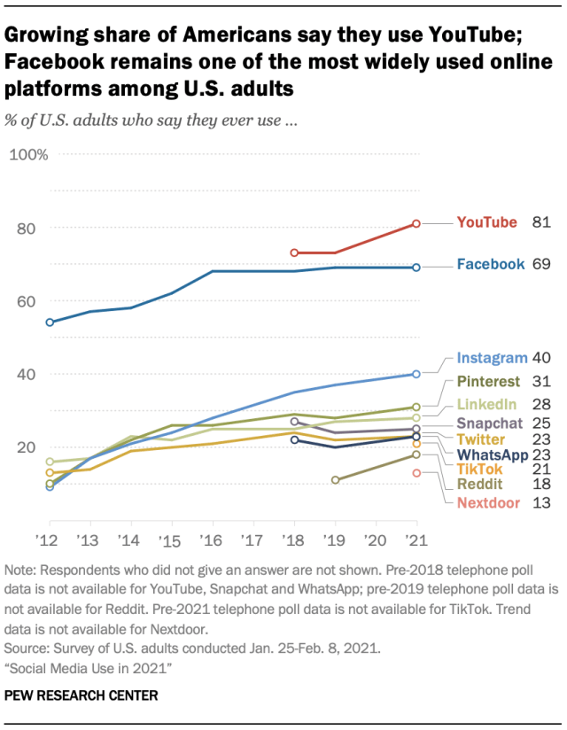

_I’m [Gus Cuddy](https://guscuddy.com/) and this is [The Curtain](https://guscuddy.substack.com/), a newsletter exploring arts, performance, media, and the internet. New reader? [Subscribe for free](https://guscuddy.substack.com/subscribe)._

[The Internet Archive](https://archive.org/) is an outlier in the world of the internet. Their goal: simply to archive the entire internet, to be used by researchers (and everyone) in the future. It's a great way to find websites that might have been taken down, or to look at how, say, [Geocities.com looked on February 22, 1997](https://web.archive.org/web/19970222174751/https://www1.geocities.com/).

Jonah Edwards, who runs the core infrastructure team at Internet Archive, recently [gave a talk on how their infrastructure works](https://archive.org/details/jonah-edwards-presentation). In short: they don't use another service like the immensely prevalent Amazon Web Services, which controls at least 40% of the "cloud" of the internet. They roll their own home-grown servers. This is an anomaly; almost every major website we interact with runs through another major cloud hosting solution, like Amazon or Google.

But Edwards makes one thing clear. There really is no such thing as the cloud — only other people's computers. Or, in the case of Internet Archive, their *own* computers: 750 servers, 30,000 devices. These devices serve up petabytes of information to website users.

Sometimes it's tempting to think about the internet as magic; the term "cloud" lends itself to that sense of ease. But the reality is much starker: everything enabled by the internet is made possible because of forklifts, bulldozers, fiber cables, potholes, sewers, and dump trucks.

Nothing is magic, though modern Apple-influenced design might make it seem so. Writes Kyle Chayka in his great book examining minimalism, The Longing For Less:

> The iPhone’s function depends on an enormous, complex, ugly superstructure of satellites and undersea cables that certainly aren’t designed in pristine whiteness. Minimalist design encourages us to forget everything a product relies on and imagine, in this example, that the internet consists of carefully shaped glass and steel alone.

The physical reality of the abstractions of the internet has strange implications. Everything that connects us, that feels like magic, is burrowed underground. Rippling waves within. Crunch. Whoosh.

As [blogger Jim Nielsen points out](https://blog.jim-nielsen.com/2021/this-is-the-internet-folks/):

> The internet is running beneath our feet or over our heads. There’s data whizzing by us all the time. I wonder how many times I’ve been out in the world and packets for jimnielsen.com go zooming by because somebody on the internet requested my domain? Like an acquittance passing, but I didn’t get to wave and say “Hi”.

The guts of the internet are hidden to us; they rear their head in New York when a Verizon or Optimum truck comes by to do construction. But for the most part, the mess of cables is buried underneath our feet.

2020 was the year we started to rely on the internet for almost everything; the year it became intertwined in our daily lives in not just as a tool, but as a fundamental part of experience. But how aware are we of what it looks like?

The emergence of cryptocurrency and NFTs this year, and the resulting eco-minded backlash, has opened our eyes somewhat: actions on the internet take place on real-world computers, which affect real-world energy. The demands of electricity do not magically disappear.

I've been thinking about these wires and the underground when it comes to the world of online arts, and its slow evolution back into an in-person event.

Recently the first in-person Off-Broadway play returned: Blindness at the Daryl Roth Theatre. All sorts of COVID-protocols are in place, with audience members seated in one or two person pods. Then what the Daryl Roth is calling a "theatrical experience": audience members put on headphones and listen to a recording of Juliet Stevenson performing Simon Stephens' play, while some lights move around.

I haven't seen the play, and I don't want to discount the work of the design team — which is really the entire production. But [as Helen Shaw writes](https://www.vulture.com/2021/04/theater-review-blindness-first-play-after-pandemic.html), "I will not recommend that anyone else go to an indoor space, to sit with dozens of people for 70 minutes (with the slow start, it might have been as much as 85) to hear a recording."

Wait, a recording? Haven't we [been down this road](https://guscuddy.substack.com/p/the-curtain-53-acts-of-creation-) all year long? The difference is that instead of this taking place over fiber cables, it takes place in a same room, with shared breath. Which is a major difference! But it's not enough to replace the unclean, confined feeling that creating theater over fiber cables give.

Vinson Cunningham, in his review of Blindness, longs for big theatre again — enough of this one-person audio-play stuff:

> I miss the bodies and the mannerisms and the real, immediate, echoing voices of performers—those essential entities—but I also hope that the new plays that begin to poke their heads out into the light will find novel and artful ways to make use of the audience. The monologue, with all its informational and expository weight, is the medium of the public-service announcement, the press-conference preamble, the vague and less than helpful missive from the C.D.C. Enough, already, of being told. Let’s have huge casts on the stages and honest encounters in the seats. Let’s talk.

I couldn't agree more. The form of the recording reminds me of *information*: like the constant deluge of information we have been glued to for over a year. Like the information that is delivered at light speeds in the ground and in the air, paved by labor and construction.

The re-emergence of live arts, from the underground myopia of sewers and cables, will be complex. There will be the labor complications and the Union considerations, sure. But live arts, once trapped within glowing rectangles, will need to re-learn the simple, humming vibrations of human touch, of shared space, of breath; a turn inside out; a hand upon a shoulder; a dazzling mystery that takes our breath away.

## Notes from the Week

### Theatre & Arts

#### On Karen Olivo, Scott Rudin, and Power Dynamics in Entertainment

[Karen Olivo announced on Instagram Live that she won't be returning to Broadway’s 'Moulin Rouge'](https://www.nytimes.com/2021/04/14/theater/karen-olivo-moulin-rouge.html), in protest of Scott Rudin. Which, okay — great! The silence from the rest of the industry is brutal, though. Power still rules everything in the Entertainment Business. It's going to take *a lot* to topple that.

More and more, as I've gained perspective and been able to re-examine the industry from a different side of things over the last year, I've realized how truly toxic the Power Dynamics in "Entertainment" are. Just that words begins to rub me the wrong way: Entertainment! That's not what I'm doing at all... is it? I'm an artist. I want to create things with other wonderful, talented artists. But that dream is corrupted by power. Power structures that are imposed on us as artists, sure; but also power that we may consciously or unconsciously seek. I keep coming back to this tweet from Haleh Roshan:

I know the theatre industry well, and so much of it bothers me. But I am complicit in these power structures as well. I'm sure part of me wants to be on the "inside". Where can we draw lines?

Interestingly, because the theater has not been "internet-ified" — that is, the internet has not dramatically transformed how the business side of theater functions, versus how it has with film, music, and even books — I sometimes wonder if these structures become even more entrenched. The internet has not brought any amount of democratization that it might have brought to other industries (although obviously that is complicated, as well).

#### **Artistic Director Shuffle**

New York Theatre Workshop artistic director Jim Nicola, who has led the theater for 34 years, [is stepping down](https://www.nytimes.com/2021/04/16/theater/jim-nicola-retirement-new-york-theater-workshop.html). Nicola and NYTW have been quite the institution. Truly the end of an era.

#### **Ideas for Bridging Digital and Live**

How to bridge the accessibility of digital theatre with the urgency of liveness? The Bengsons have one idea, that is kind of terrible but maybe also interesting:

https://instagram.com/p/CNkIG1TjDZx

Basically a wall of Zoom screens on one side, and then a live audience on the other. This only works in a concert kind of show, of course.

#### **Links**

-   [A Fifth of Museum Workers Won’t Return to the Field After the Pandemic, Survey Says](https://www.artnews.com/art-news/news/museum-workers-pandemic-impact-survey-american-alliance-of-museums-1234589706/). Will the same be true for theater?

-   Perfect Crime, the longest-running show in New York City history (lol), [will be the first Actor's Equity-approved show to return to work](https://www.playbill.com/article/perfect-crime-will-reopen-off-broadway), which really just encapsulates everything about our Union and Industry, doesn't it?

### Social Media Usage

Pew Research [published their survey of Social Media use in America in 2021](https://www.pewresearch.org/internet/2021/04/07/social-media-use-in-2021/). YouTube and Facebook remain, far and away, the most popular. My biggest takeaway: Twitter is not as popular as everyone who is on Twitter thinks that it is.

### **Quote of the Week**

Photographer Daniel Arnold, [in an interview with the style/culture/wtf newsletter Blackbird Skyplane](https://www.blackbirdspyplane.com/p/okwho-sent-me-this), taken completely out of context:

"**remove the context and things become a little more magical**"

## End Note

https://www.youtube.com/embed/8xEONmHK-SE

Phoebe Bridgers x Paul McCartney ??

_That’s all for this week._

_If you enjoy The Curtain, you could consider [becoming a paying subscriber](https://guscuddy.substack.com/subscribe). I currently run on a patronage model: the benefits are the same (right now) for paying and free subscribers. Your support helps make this sustainable._

_**[Subscribe now](https://guscuddy.substack.com/subscribe?utm_medium=web&utm_source=subscribe-widget&utm_content=31699931)**_

_New reader? The Curtain is a weekly digital letter sent by [Gus Cuddy](https://guscuddy.com/). You can [subscribe for free here](https://guscuddy.substack.com/subscribe), or [browse the archives here](https://guscuddy.substack.com/archive)._

_You can reply directly to this email and I’ll receive it. So feel free to do that about anything. I love to hear back from people._

_See you next week!_

\-Gus
