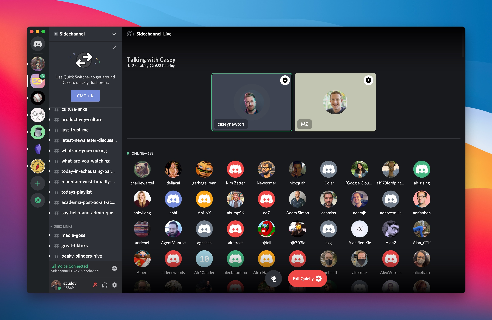
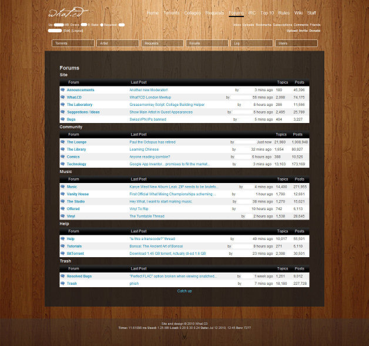
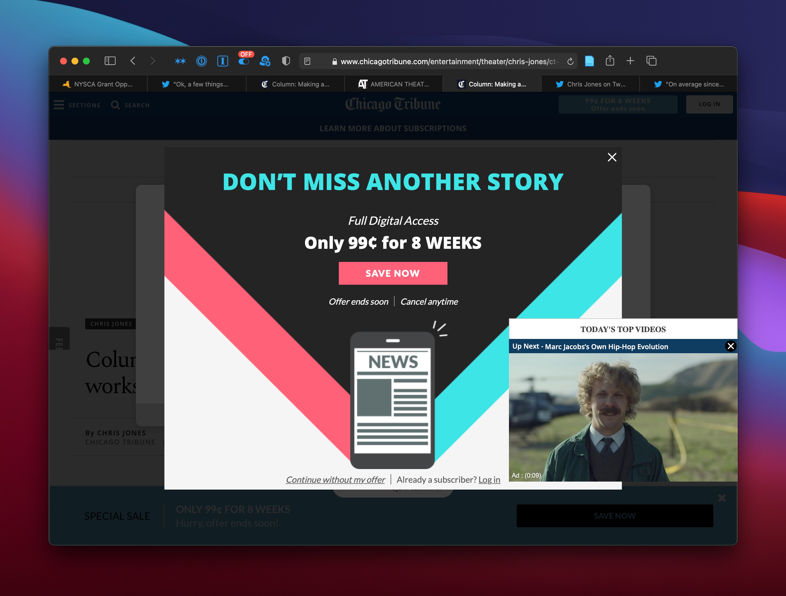
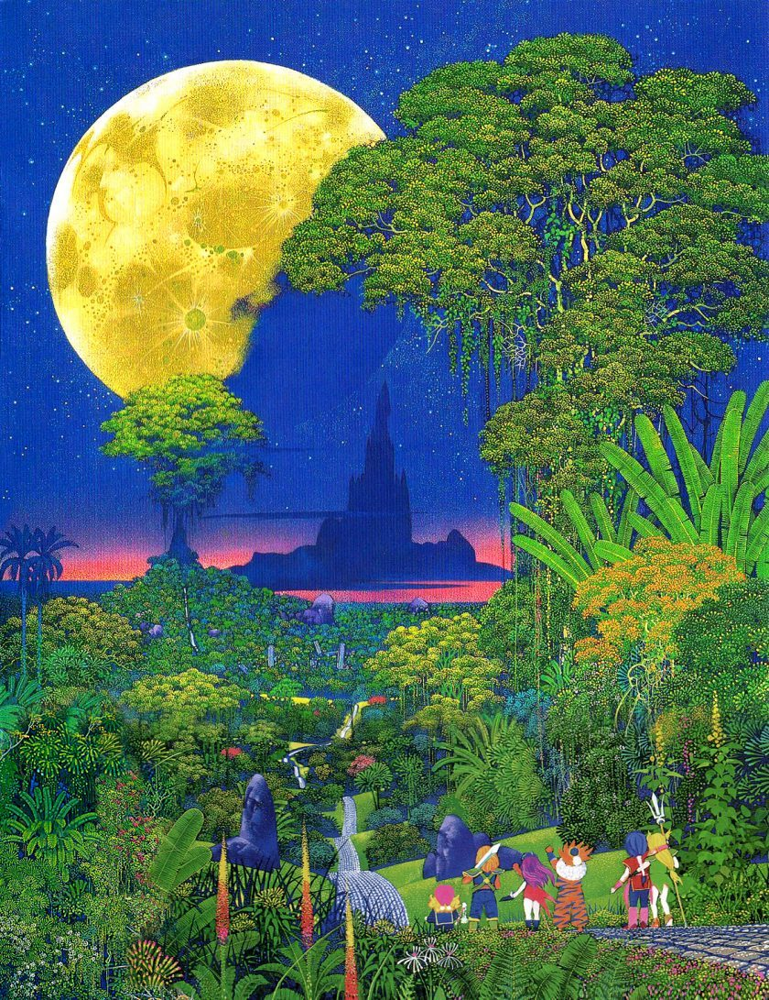

_I’m [Gus Cuddy](https://guscuddy.com/) and this is [The Curtain](https://guscuddy.substack.com/), a newsletter exploring arts, performance, media psyches, cultural consciousness, and the internet. New reader? [Subscribe for free](https://guscuddy.substack.com/subscribe)._

---

Hi all,

Let's put it this way: The Curtain comes out Saturday mornings now. Grab your bowls of cereal, throw on some cartoons, and dive in.

---

## **Discord, Exclusivity, and Internet Spatiality**

All of a sudden, seemingly overnight, I've become the kind of person who has [Discord](app://obsidian.md/Discord) open all the time. I'm not sure what exactly happened; at the beginning of this year I barely knew what Discord was. Now it seems like every online community or membership I look into has its own Discord server, each one bristling with its own personality. For those of you that don't use Discord or have no interest in it, there are some interesting media-psyche and scarcity-liveness elements to it to tease out.

Discord is an internet chat service with messaging and voice capabilities. It's sort of like Slack, but with a very different, non-business approach: Discord bills itself as your place to "hang out". It originated as a place for gaming communities, which is entirely not my world so I had kind of written it off as not being for me. But over the last year, spurred on primarily by the Pandemic and our [incessant digitization](https://guscuddy.substack.com/p/the-curtain-091-digitization-begets) , Discord has quickly expanded to be a place for many online communities to host their own chat room server. It's easy to create a server, and even easier to join new ones (unlike Slack). Which means one can find oneself clicking Discord invites and ending up with a healthy-sized server list.

Okay, so probably I'm weird, but now I'm in several different Discord communities: one for a piece of note-taking software I use (haha), one for [Blaseball](https://guscuddy.substack.com/p/the-curtain-100-blaseball-and-narrative) , and several "premium" severs. The premium servers are where things get interesting. Many online communities with a subscription model, like several Substack newsletters I subscribe to, have added a private Discord server as a benefit. For instance, one of the premium Discords I'm all of a sudden in is called [Sidechannel](https://www.garbageday.email/p/welcome-to-sidechannel), which just launched this week. It's a weird collaboration between the popular newsletters of [Casey Newton](https://www.platformer.news/), [Charlie Warzel](https://warzel.substack.com/p/welcome-to-galaxy-brain), [Anne Helen Peterson](https://annehelen.substack.com/), [Eric Newcomer](https://www.newcomer.co/), [Nick Quah](https://hotpodnews.com/), [Delia Cai](https://deezlinks.substack.com/), [Kim Zetter](https://zetter.substack.com/), and [Ryan Broderick](https://www.garbageday.email/), which are all generally media/journalism focused outlets. I'm a fan of these newsletters, and a premium subscriber to Garbage Day (which also has its own Discord!), so I joined the Discord and then all of a sudden found myself as one of 683 people in the live "stage" room listening to Casey Newton give an unfortunate, disappointingly softball interview to Mark Zuckerberg.

I looked into the react-to-the-stage channel and thankfully saw most people reacting the same way I was reacting: confusion and disgust. But this was just a taste of the Artificial Scarcity and exclusivity that can be created by Discord.

### Discord and Internet Forums

In a funny way, Discords share a bit in common with the internet forums of yesteryear. Internet forums are still a thing, but they're not nearly as popular as they once were. I used to spend many hours crawling through the forums of [What.CD](https://en.wikipedia.org/wiki/What.CD), a long-gone private Torrent Tracker for music. (It was a different time.) There was an aura of exclusivity to those forums, and I learned a lot from them. Thinking back, I have distinct memories of some of the more active users. There were the joke threads, the more serious ones, and the weird ones. Then there was the Power User forum, which was only for users who leveled up to being Power Users on the site (by sharing a certain amount of music), and had a reputation for being the drugs forum, where all the older cool kids discussed the drugs they were doing.

Private Discords and old private forums both have the feeling of being somewhere special on the vast, formless void of the internet; they lend themselves to an exclusive-feeling emotional-spatiality that is often missing online. (Whether this spatiality is good for our brains or a form of dissociation, [as technology writer L.M. Sacasas would put it](https://theconvivialsociety.substack.com/p/the-insurrection-will-be-live-streamed), is another matter.) There are many other parts of the internet that mirror this effect, but they all share in common something peculiar: the feeling that you're in on something, that you have a fun place to simply "hang out", in Discord's terminology. It might make us feel less alone while plugging in to the matrix of the internet.

---

## **Notes from the Week**

### **Theater and Capitalism and yikes**

Chicago Tribune theater critic Chris Jones had [a pretty unfortunate column this week advocating for Broadway's capitalist model](https://www.chicagotribune.com/entertainment/theater/chris-jones/ct-ent-case-for-capitalist-broadway-20210422-fr7tpsvohnavxfdfuedynzwkuu-story.html#rt=chartbeat-flt). Which, hey, that's a take, I guess.

The article gets so much wrong, and its reasoning is so obscure, that it's hard to know where to begin. Maybe it's best to ignore it, but I can't ignore that Chris Jones has one of the more powerful jobs in theater criticism in America. And, you know, he gave us something to talk about as we fight to re-open. Here's Jones with a bizarre line of reasoning:

> If you live and die at the box office, as does Broadway, you are not rewarded for indulgence or self-involvement. More importantly, you often are better able to reach non-elites. Broadway attracts more lower-middle class theatergoers than many pretentious nonprofit institutions; it pulls more young people to shows like “Mean Girls” and “To Kill a Mockingbird,” and it is far more likely to attract the large and diverse audience for shows that intersect with the history of recorded music. In short, the argument for a capitalist Broadway in a capitalist society is that it tends to end up as populist.

Woof. I'll try to be a little generous here --- Jones tries to argue a familiar, tired argument: in effect that because there have been good works that have been on Broadway, that proves that capitalist theater works. Others have used this argument, as well: economist Tyler Cowen tries this in his 2000 book _[In Praise of Commercial Culture](https://www.hup.harvard.edu/catalog.php?isbn=9780674001886)_ --- Beethoven and Michelangelo sold their art for profit, so a profit-driven economy is good for the arts. Hell, even filmmaker Werner Herzog praises the free market in [A Guide for the Perplexed](https://us.macmillan.com/books/9780571259779):

> When it comes to the kind of filmmaking I do, **the free market is a harsher but more vibrant structure to function within**. It’s where the real battle is fought. If you can leave the respirator and submit yourself to the roughness of the market, you should. At the time I appreciated how lucky I was to be given certain opportunities, but felt I had to learn to walk on my own two feet as quickly as possible.

Herzog is speaking to something a bit different context-wise, but it's interesting to note the echoes. Anyway, film and theater are two different environments, and Jones misses the mark with his take here. First is the rather gross implication that, if you're not making theater/art based off monetization decisions, you're being indulgent and self-involved. (Someone send this guy over to the Creator Economy!) I'll pass over the slight at "pretentious" nonprofits and just go to the audacious claims: that Broadway reaches large, diverse, populist, non-elite audiences. Anyone who attends theater in New York and has their eyes open will tell you differently, but it's good to know the data is entirely against Jones as well. Here's theater academic Derek Miller:

https://twitter.com/DerekKMiller/status/1385344952981458947https://twitter.com/DerekKMiller/status/1385348258831093761

Jones peppers his article with other bizarre, neoliberal absurdities (Barack Obama attending opening night of Denzel Washington in _A Raisin in the Sun_ was "a stunning example of the capitalist sector of the American theater heralding racial progress"!) that make this just a joyfully wrongheaded piece. To top it off, this article was put out as a response to Karen Olivo calling out Scott Rudin --- a man who was enabled by a capitalist theater system that invites consolidations of profit and power.

But I can barely even recommend someone click on the article for fun or for a good laugh with a few drinks, because the online reading experience of the Chicago Tribune is so dreadful. Three pop-ups and video obscure the article. Hey --- that's capitalism, baby!

---

### What even is a 'creator'?

The "Creator economy" is upon us. But what does that even mean? The term "creator" in this context is vast and bizarre and empty, but it's meant to cover the ground of pretty much anyone who "creates" things online.

As [Kyle Chayka writes in Artnews](https://www.artnews.com/art-news/news/digital-economy-artists-creators-patreon-1234589596/), "creator has none of the glamour of the artist". It's been demeaned to an ugly word online, startlingly generic in its applicability. Chayka references the psychological term "Parasocial" here: "one-sided emotional relationships" that audiences develop with the often big personalities of creators, whether through YouTube, Netflix, or podcast.

Forming relationships with creators isn't necessarily a bad thing. But let's not confuse the Creator economy for an Artist economy. For one, Creators monetize content --- three words that, when put together, are telling in and of themselves. The surge of individualist mechanisms for Creators to further commodify their presence is ever-rising: Patreon, OnlyFans, and the current NFT craze, for instance. They prioritize content creation and the individual above all else. And artists that don't already have a following aren't necessarily enabled by the creator economy, except in rare circumstances.

---

### **🔗 Links from the Week**

*   Derek Thompson asks: [Are Outdoor Mask Mandates Still Necessary?](https://www.theatlantic.com/ideas/archive/2021/04/are-outdoor-mask-mandates-still-necessary/618626/)
    
*   [Matt Webb riffs on the number of wipe film editing transitions in Star Wars, and its relation to the Brain and Interface Design](https://interconnected.org/home/2021/04/23/star_wars)
    
*   More Scott Rudin stuff, but hopefully this man will be behind us soon: [Rudin is stepping back from not only theater, but film and TV as well](https://www.backstage.com/magazine/article/scott-rudin-broadway-film-stepping-back-73117/). [Vulture dropped a large piece](https://www.vulture.com/2021/04/scott-rudin-as-told-by-his-assistants.html) collecting stories from his assistants. And Tavi Gevinson reflects that ["Art Doesn't Need Tyrants"](https://www.vulture.com/2021/04/scott-rudin-hollywood.html#comments).
    

---

## **End Note**

<figure>
    
    <figcaption>art by Hirō Isono</figcaption>
    </figure>

---

_That’s all for this week._

_If you enjoy The Curtain, please share it with others!_

_You could also consider [becoming a paying subscriber](https://guscuddy.substack.com/subscribe). I currently run on a patronage model: the benefits are the same (right now) for paying and free subscribers. Your support helps make this sustainable._

_**[Subscribe now](https://guscuddy.substack.com/subscribe?utm_medium=web&utm_source=subscribe-widget&utm_content=31699931)**_

_New reader? The Curtain is a weekly digital letter sent by [Gus Cuddy](https://guscuddy.com/). You can [subscribe for free here](https://guscuddy.substack.com/subscribe), or [browse the archives here](https://guscuddy.substack.com/archive)._

_You can reply directly to this email and I’ll receive it. So feel free to do that about anything. I love to hear back from people._

_See you next week!_

Gus