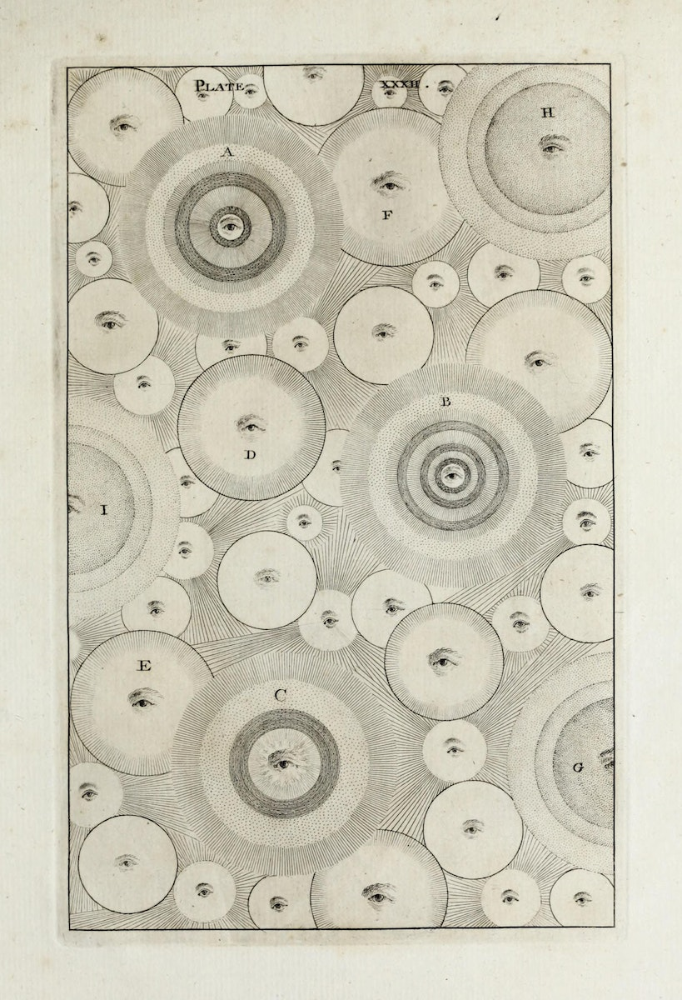

<figure>
    
    <figcaption>From Thomas Wright's An Original Theory or New Hypothesis of the Universe (1750)</figcaption>
    </figure>

Friends —

Over the last several weeks, as I've been diving deep on examining internet culture and its overlap with art and, what to call it — consciousness? — I've been struck by what I consider the key tension in culture today: digital prime spatiality versus physical prime spatiality. I [wrote about Discord and internet spatiality](https://guscuddy.substack.com/p/the-curtain-102-discord-exclusivity) — the sense that there are distinct "places" on the internet — a few weeks ago, but I don't think I did justice to just how important this idea of spatiality is, and how far its cultural reach is.

The digital trends of the pandemic have made this idea of having particular "spaces" to go to on the internet — more and more actually conceptualized as real spaces — increasingly entrenched. We've seen: the rise of Clubhouse, and now other live, drop-in audio "spaces" like Twitter Spaces; the further popularization of gaming, Twitch, and concerts-in-Fortnite; the crystallization of Discord as not just a hub for gaming chat, but for all online communities seeking a "home"; the bizarre ascension of Non-Fungible Tokens and digital art; the near-replacement of movie theaters by streaming services; and of course, the continued fragmentation of the internet into conspiracy theorist communities that pick up more and more violent steam — and bleed over into "physical prime". In accordance with the internet feeling more and more dense and overcrowded, we've embraced [artificial means of imposing digital scarcity](https://guscuddy.substack.com/p/the-curtain-096-one-year-later). In other words — we've taken central consciousness-conceptualizations (some people might call them metaphors, but that's boring) from the physical world and implanted them onto the digital landscape.

The tension between digital and physical prime doesn't just stop at the dissociating attempt to create a sense of place on the internet, though — it goes both ways. Physical spaces, which suffered a huge blow during the pandemic, now are complemented by digital primacy in many ways: restaurants have re-oriented themselves around the needs of Food Delivery startups; QR codes put menus on our phones; Spotify algorithmically streams music and podcasts and _audio_ into both physical spaces and our ears; TikTok and Social Media turn physical spaces into possible pictorial arenas for meme-making.

The internet has become a place to lose one's sense of self. But I've found the writing of technological theorist L.M. Sacasas as a balm for digitization-confusion recently; Sacasas consistently advocates that we think about the internet not as as place but as something that mediates relations — and that doesn't _actually_ displace our bodies. "Digital culture is material culture, but it's easy to imagine otherwise," he writes in [a recent short essay against forgetting the body](https://theconvivialsociety.substack.com/p/forgetting-the-body). This is, of course, _true_ — but it's the elastic tension between the physical and the digital that defines our time.

---

## Notes from the Week

First: ~New York Theater~ has some updates.

First: [Broadway is going to open at "full capacity" on September 14](https://www.playbill.com/article/andrew-cuomo-says-broadway-shows-will-open-at-full-capacity-september-14), says Cuomo. Honestly, the variety of dates that have been thrown around make anything regarding fabled re-openings tough to track. And Broadway is really the least interesting part of the equation for theater's re-entrance into the world. But hey. September does sound sort of realistic, I think, possibly, who knows...

---

In positive news, [Antoinette Nwandu's](https://www.playbill.com/article/antoinette-chinonye-nwandus-pass-over-is-heading-to-broadway) _[Pass Over](https://www.playbill.com/article/antoinette-chinonye-nwandus-pass-over-is-heading-to-broadway)_ [is going to Broadway](https://www.playbill.com/article/antoinette-chinonye-nwandus-pass-over-is-heading-to-broadway), with Nwandu serving as a Producer. Danya Taymor will direct, just as with the Steppenwolf and LCT productions, and much of the creative team will return. The version in Chicago was also filmed and turned into a movie by Spike Lee.

Nwandu is going to serve as a Producer, which is an empowering model for playwrights (Nwandu credits Jeremy O. Harris):

https://twitter.com/anwandu/status/1389947461498806272?s=20

Interestingly, [Nwandu has reworked the ending to the play several times](https://www.nytimes.com/2021/05/04/theater/pass-over-antoinette-chinonye-nwandu-broadway.html) as she considers the process of grieving and communal healing.

---

[Anna Shapiro is stepping down from Steppenwolf](https://www.playbill.com/article/steppenwolf-artistic-director-anna-d-shapiro-will-step-down-this-summer) as the great Artistic Director Transition continues around the country. But it has nothing to do with [recent reports of inequity at Steppenwolf](https://rescripted.org/2021/04/27/dissent-steppenwolf/). No — of course not...

---

Theater (and other media!) directors Whitney White, Taibi Magar, Tyne Rafaeli, and Danya Taymor had [a conversation about their careers in The New York Times](https://www.nytimes.com/2021/05/05/theater/theater-directors-change.html).

---

### **This week in internet**

How the Internet Archive digitizes a book: with an intense, house-made scanner.

https://twitter.com/internetarchive/status/1358090982189719552?s=20

---

[Demand for good-looking bookshelves to sit in front of on Zoom has led to companies that sell curated books wholesale](https://www.politico.com/news/magazine/2020/12/26/books-by-the-foot-washington-dc-covid-books-440347).

---

The parody cryptocurrency dogecoin has been rocketing up in price, presumably accelerated by Elon Musk hosting Saturday Night Live (why). Here's Matt Levine [attempting to explain it](https://www.bloomberg.com/opinion/articles/2021-05-06/dogecoin-is-up-because-it-s-funny):

> Just imagine traveling 10 years back in time and trying to explain this to someone; just imagine what an idiot you’d feel like. “There’s going to be this online currency that people think is a form of digital gold, and then there’s going to be a different online currency that is a parody of the first one based on a meme about a talking Shiba Inu, and that one will have a market capitalization bigger than 80% of the companies in the S&P 500, and its value will fluctuate based on things like who is hosting ‘Saturday Night Live’ and whether people tweet a hashtag about it on the pot-joke holiday, and Bloomberg will write articles and banks will write research notes about those sorts of catalysts, and it will remain a perfectly ridiculous content-free parody even as people properly take it completely seriously because there are billions of dollars at stake.”

---

Recommendation: if you want to go **hardcore** internet culture, there's perhaps no more insane newsletter than [Web Curios](https://webcurios.co.uk/). The author dumps an astonishing, punishing, intimidating amount of links with write-ups that are written with razor-brained intensity. And accompanying, _delightful_ playlists.

---

And [Foster Kamer](https://foster.substack.com/) writes: [Let's Stigmatize The Internet](https://www.nytimes.com/2021/04/29/style/spend-less-time-online.html) — enough already, we've been in this internet shit for too long, let's enjoy our new freedoms for a bit and put our extremely online year behind us. I agree that would be nice, Foster!

---

### **more collisions of the digital & physical**

[Online streaming service MUBI is making a physical movie theatre in Mexico City](https://mubi.com/notebook/posts/mubi-releases-images-of-its-planned-first-physical-movie-theatre), and they just released the first photos of its strange architecture. I'm intrigued by their statement, and yet don't understand it at all.

> The main need is to overcome the dogmatic form of “the box” as a module and the ordering principle of a cinema. Exploding the spaces and designing a bridge-shaped structure, created around a void—an evolution of the idea of a shell—responds to the surrounding architectural context of Mexico City. The structure’s body is reduced to a minimum; the sloping facade that is visible from the street is itself a screen as well as the entrance, as is the rear wall. The side walls are small screens that support the structure, without closing it—becoming additional lenses for the external view of the surrounding buildings.

"The box" — the box!!

---

## end note

https://youtube.com/watch?v=6AP3-k91zfQ

“Emma Goldman Would Have Beat Your Ass” from Evan Greer's EP _Spotify is Surveillance_.

---

_That’s all for this week._

_Season 2 of The Curtain will be wrapping up soon — I plan to write a few more issues and then regroup for Season 3._

_If you enjoy The Curtain, please share it with others!_

_You could also consider [becoming a paying subscriber](https://guscuddy.substack.com/subscribe). I currently run on a patronage model: the benefits are the same (right now) for paying and free subscribers. Your support helps make this sustainable._

_**[Subscribe now](https://guscuddy.substack.com/subscribe?utm_medium=web&utm_source=subscribe-widget&utm_content=31699931)**_

_New reader? The Curtain is a weekly digital letter sent by [Gus Cuddy](https://guscuddy.com/). You can [subscribe for free here](https://guscuddy.substack.com/subscribe), or [browse the archives here](https://guscuddy.substack.com/archive)._

_You can reply directly to this email and I’ll receive it. So feel free to do that about anything. I love to hear back from people._

_See you next week!_

Gus