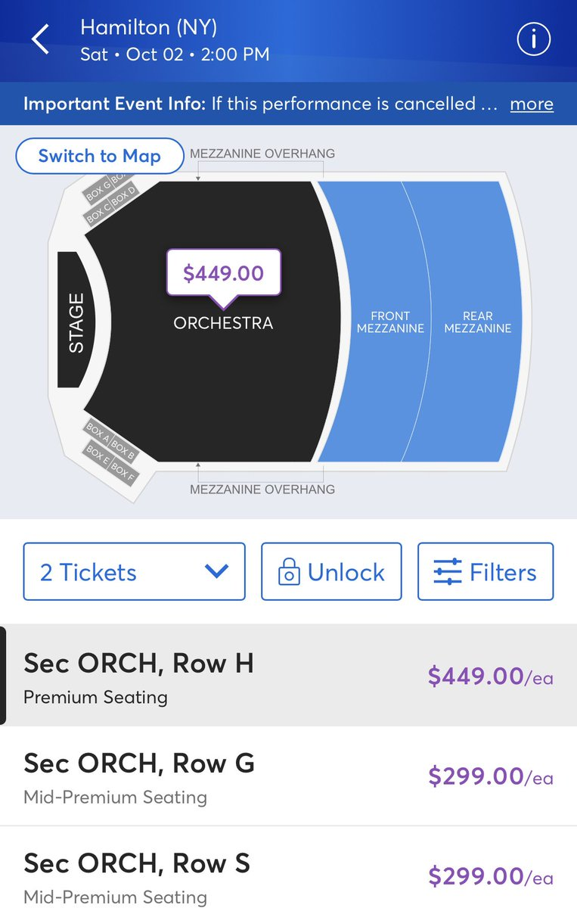
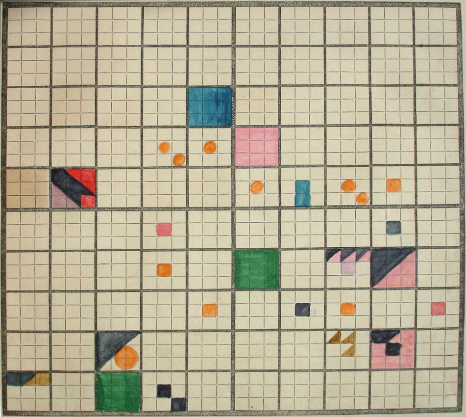

Hi friends,

All of a sudden mask mandates are flying off for vaccinated folks. Nothing really makes sense anymore, and we've found something new to get mad at each other about. ("No more hygiene theater!" the anti-maskers gleefully cry.)

I don't know anymore, the whole thing is exhausting. Attitudes shift at a moment's notice. Lest we forget that old, trusty Actor's Equity was disallowing theaters with 45-page safety plans from doing theater with no audience [just a few months ago](https://www.nytimes.com/2021/03/23/theater/actors-equity-health-safety.html).

As the country continues to off-ramp its COVID protocols, I wonder how the physical infrastructure around us will change or remain the same. Will the structures and stickers and changes that were quickly built over the last year be uninstalled? Or will we forever be living in the physically-manifested shadow of the pandemic? At least in New York, I bet things like those social distancing floor stickers on the Subway are never going away...

Anyway.

---

#### What will change and what won't in American Theater

With the announcement that Broadway is returning to "normal" on September 14th, we've seen the return of Broadway's finest pastime: **overpriced tickets**.

Hamilton tickets still cost $159 for Rear Mezzanine seats, and a whopping $449 for Front Mezzanine and Orchestra:

_[Screenshots courtesy @THTRNightmares](https://twitter.com/THTRNightmares/status/1392111060979752972)_

The question remains: will anything change in theater? In a lot of ways, the answer will probably be no.

I'm not trying to be cynical here. Commercial theater — and the non-profit world that feeds into it — still runs on the same economic model. Nothing has changed in that regard.

There have been a wave of hirings and Artistic Director transitions in New York and across the country, as *some* power attempts to be shifted from the dominant White Male hierarchy. I do think there is, at the very least, a greater awareness of unjust and harmful practices perpetuated by the industry at large. But what that actually amounts to? That still remains to be seen.

---

[Brittani Samuel wrote a well-rounded appraisal of We See You, White American Theater](https://www.weseeyouwat.com/) for Brooklyn Rail. It's worth considering both the demands and intricacies of WSYWAT as theater begins to re-open, as well as what exactly their power and effects have been. There's a lot to unpack there — and I'm not the right person to do it. I think there's a lot to the conversation that they've contributed, but their presence has also been confusing and performative for some — as evidenced by [Tonya Pinkins' piece last year](https://tonyapinkins.medium.com/why-i-am-fed-up-with-performative-activism-from-white-and-black-theater-makers-d46564ec94fe), and the comments on [We See You's Instagram page](https://www.instagram.com/weseeyouwat/).

---

#### Ephemerality in Internet Space

I've been really enjoying Craig Mod's recent ephemeral newsletter, entitled *[Where are all the Nightingales?](https://mailbot2000.craigmod.com/h/r/B752ACDB12240E7B2540EF23F30FEDED)*, a travelogue-type thing which accompanies one of his long walks. His description:

> A daily newsletter by Craig Mod, running from May 11, 2021 to June 8. Once a day, a photograph and short missive from me as I walk 500km along the UNESCO World Heritage Kumano Kodō pilgrimage route in Mie and Wakayama Prefectures, Japan.
>
> Your email address will only be used for this list. This list will be deleted on June 8. You can opt-out at any time.

Part of its appeal is the time-boxed nature: we're "walking" alongside Craig as he walks through Japan and delicately threads through its deep history. This newsletter won't last forever — it's accompanying a particular event and narrative. And there's an element of trust here too: unlike so much of scammy email marketing, there’s no attempt to collect emails and upsell subscribers to expensive info products. At the conclusion of the walk, the email list will simply be deleted.

(On the deletion note: it's worth noting also that Craig is one of many folks I've seen on Twitter who use a program to automatically delete their tweets after a certain time period, introducing an element of ephemerality to Twitter that arguably should be there in the first place.)

There are also wonderful accompanying 4K videos for each day, where "nothing" happens — just several minutes of a camera set up on a tripod, as we witness (really *witness*) a different place together. I love the simplicity of this, when coupled with the ephemeral emails:

https://youtube.com/watch?v=KCO2iZIYTCo

---

Ephemerality — and its close cousin, scarcity — have become a popular model to implant on the internet these days. For instance, [I've written before about how Clubhouse banks on this enforced ephemerality as well](https://guscuddy.substack.com/p/the-curtain-091-digitization-begets):

> But the free-form format of Clubhouse makes it a space where folks can start an informal conversation and have people listen. Or where (more likely) someone very internet-famous like Elon Musk shows up and starts interacting with other moderately famous people via live audio. That wouldn't happen on the structure of a podcast. The ephemeral dynamics of Clubhouse, and the intimate informality of audio — whose power has been demonstrated by the rise of podcasts — invite a sense of textured, live serendipity.

In the age of the internet, information and media are no longer scarce — as with physical books or newspaper — or linearly time-bound — as with the evening news. This free-wheeling abundance started out as the blessing of the internet; with time, it has become the thing we constantly seem to be fighting against.

The constraints of physical reality are not dictated by this abundance-scarcity push/pull. Outside of Quantum Mechanics, things generally exist in one place at one time. Simple. Ah, how nice — how refreshing! — a bird chirps only in this moment, the air is just like this right now; momentary glimpses of singular transcendence, hidden all around us, gurgling blurbling babbling bubbling into consciousness.

---

#### GPS

One of the strangest places to witness [the collision of physical and digital spaces](https://guscuddy.substack.com/p/the-curtain-104-the-tension-of-digital) is in...maps.

Maps! An artifact of humanity for just about as long as we've been around, now heavily — and *essentially* — augmented by technology. I rely on Google Maps multiple times a day in any given day, and can't imagine navigating without it. It's an essential part of survival in any city.

Interestingly, phones / maps apps uses satellite imagery and GeoLocation services (which are a combination of cellular and WiFi signals), as well as GPS...but GPS is not the internet. GPS is actually owned and controlled by the government, a fact I didn't realize until recently. But GPS is a critical service — and it's vulnerable! Unlike other countries, we don't have any backups or alternatives for GPS. If it goes down, that's it. [Kate Murphy writes in The New York Times](https://www.nytimes.com/2021/01/23/opinion/gps-vulnerable-alternatives-navigation-critical-infrastructure.html):

> Coordinated Universal Time, or U.T.C., the global reference for timekeeping, is beamed down to us from extremely precise atomic clocks aboard Global Positioning System (GPS) satellites. The time it takes for GPS signals to reach receivers is also used to calculate location for air, land and sea navigation.
>
> Owned and operated by the U.S. government, GPS is likely the least recognized, and least appreciated, part of our critical infrastructure. Indeed, most of our critical infrastructure would cease to function without it.
>
> ...experts warn that our overreliance on the technology is courting disaster, but they are divided on what to do about it.

I'm not exactly sure how I thought GPS worked, but yeah — not like this! Perhaps we'll all have to rely on [the very scary AirTags in the future](https://www.theverge.com/2021/4/22/22396693/apple-airtag-location-tracker-hands-on-find-my-privacy-safety)...

---

#### [Swartzwelder, Writing and Comedy](https://www.newyorker.com/culture/the-new-yorker-interview/john-swartzwelder-sage-of-the-simpsons)

Gosh, I know everyone is passing around [this instant-classic John Swartzwelder interview with The New Yorker](https://www.newyorker.com/culture/the-new-yorker-interview/john-swartzwelder-sage-of-the-simpsons) — but man is it good. [Swartzwelder](https://en.wikipedia.org/wiki/John_Swartzwelder) is legendary for his writing on golden-era *The Simpsons* and his extreme reclusiveness (this is first interview ever, 18 years after his last *Simpsons* episode).

I'm a pretty devout early Simpsons fan, though I admit I haven't revisited it so much in the last couple years — there are definitely lots of problems with it if viewed today! But that writer's room back then — woof. Sometimes I'll rewatch an episode and am overwhelmed by the jokes-per-minute ratio, and how many of them hit.

Swartzwelder's comedy partially comes out of his bizarre habits — his reclusiveness, his constant smoking, the fact that he installed a diner booth in his home and wrote the episodes from there, his fascination with obscure history, and his weirdly incongruent political views, according to a vague Wikipedia entry. This quote on writing from [the interview](https://www.newyorker.com/culture/the-new-yorker-interview/john-swartzwelder-sage-of-the-simpsons) is not exactly original, but the way Swartzwelder puts it — he's got something about him.

> **How much time and attention did you spend on these scripts? Another “Simpsons” writer once compared your scripts to finely tuned machines—if the wrong person mucked with them, the whole thing could blow up.**
>
> All of my time and all of my attention. It’s the only way I know how to write, darn it. But I do have a trick that makes things easier for me. Since writing is very hard and rewriting is comparatively easy and rather fun, I always write my scripts all the way through as fast as I can, the first day, if possible, putting in crap jokes and pattern dialogue—“Homer, I don’t want you to do that.” “Then I won’t do it.” Then the next day, when I get up, the script’s been written. It’s lousy, but it’s a script. The hard part is done. **It’s like a crappy little elf has snuck into my office and badly done all my work for me, and then left with a tip of his crappy hat. All I have to do from that point on is fix it**. So I’ve taken a very hard job, writing, and turned it into an easy one, rewriting, overnight. I advise all writers to do their scripts and other writing this way. And be sure to send me a small royalty every time you do it.

I love the crappy little elf.

Anyway, Swartzwelder has been self-publishing a series of comedic hard-boiled detective novels for the last 17 years apparently, and I just bought the first one.

The way he opens his first novel, *The Time Machine Did It*, just bristles with a startling comedic immediacy. Take a look at these masterful first two paragraphs:

> Frank Burly is my name. Okay, it's not my name. I lied about that. My name is Edward R. Torgeson Jr. I changed it for the business. You've got to have a tough sounding name if you want people to hire you as a private detective out of a phone book. I chose one that would give prospective clients the idea that I was a burly kind of man, the kind of man who would have the strength and endurance to solve their cases for them, and who would be frank with them at all times. Hence the name.
>
> As my exciting story opens, I am being punched in the stomach. But I guess a lot of stories start that way. Most of mine do anyway. The guy who was punching me was a lot burlier than I was, so it hurt plenty. But I tried to pretend it didn't bother me at all, that I actually liked it. It was hard to do this convincingly, because he had kind of knocked the wind out of me there, so all I could do was smile and wink and give him the thumbs up while I waited to be able to breath again. He thought I was making fun of him and started punching me in the stomach harder. Meanwhile, I'm not any closer to getting my breath back. Some days are like that.

Here's Swartzwelder in that interview again, discussing the openings of his books:

> **Nobody wants to read a book**. You’ve got to catch their eye with something exciting in the first paragraph, while they’re in the process of throwing the book away. If it’s exciting enough, they’ll stop and read it. Then you’ve got to put something even more exciting in the second paragraph, to suck them in further. And so on. It’s exhausting for everybody, but it’s got to be done

Wow! Okay, time to do some reading now. Excuse me.

---

#### End Note

<figure>
    
    <figcaption><a href="https://beinecke.library.yale.edu/article/visualizing-history">A filled in chart from Elizabeth Peabody’s Universal History (1859)</a>. Via&nbsp;<a href="https://publicdomainreview.org/collection/visualizing-history-the-polish-system">The Public Domain Review</a></figcaption>
    </figure>

_Season 2 of The Curtain will be wrapping up at the end of May. I’ll take a few weeks off and then be back for Season 3._

_The Curtain is supported by [paying subscribers](https://guscuddy.substack.com/subscribe). I currently run on a patronage model: the benefits are the same (right now) for paying and free subscribers. Your support helps make this sustainable._

_New reader? The Curtain is a weekly digital letter sent by [Gus Cuddy](https://guscuddy.com/). You can [subscribe for free here](https://guscuddy.substack.com/subscribe), or [browse the archives here](https://guscuddy.substack.com/archive)._

_You can reply directly to this email and I’ll receive it. So feel free to do that about anything. I love to hear back from people._

Gus
