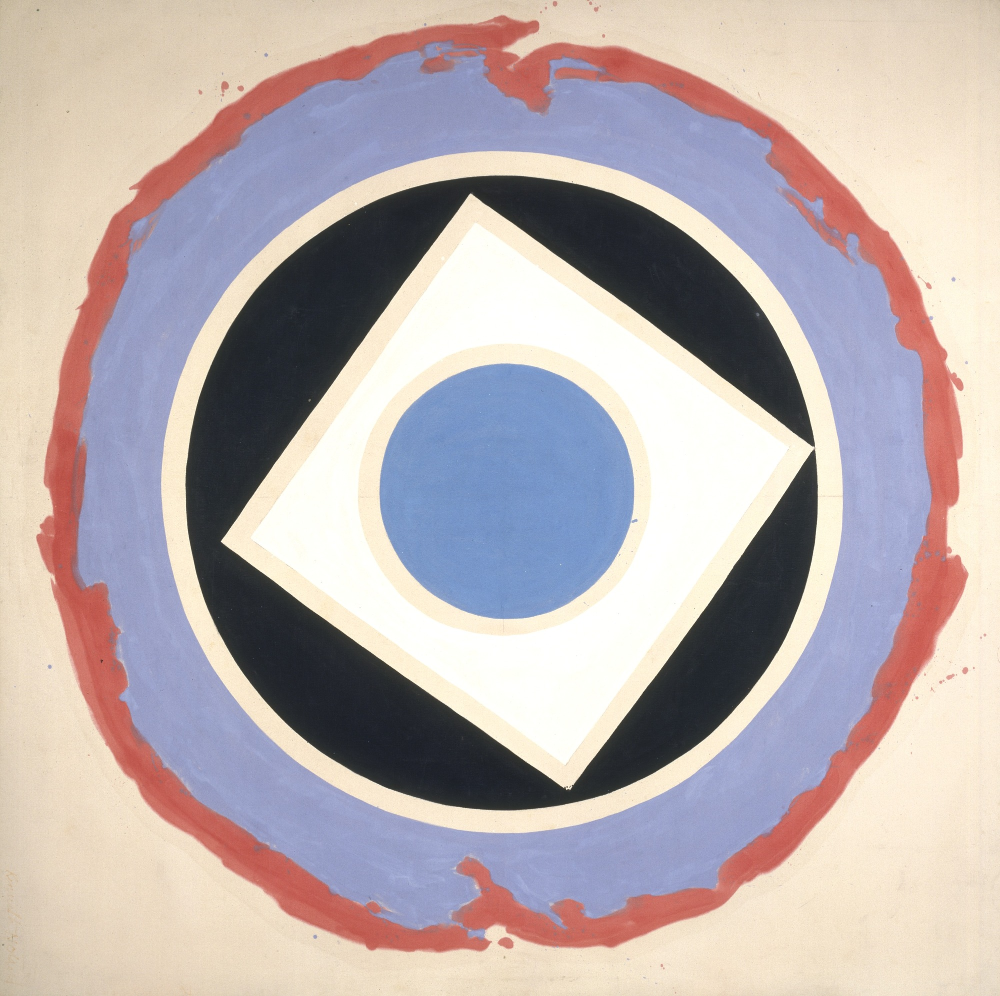

_I’m [Gus Cuddy](https://guscuddy.com/) and this is [The Curtain](https://guscuddy.substack.com/), a newsletter exploring arts, culture, media and the internet. New reader? [Subscribe for free](https://guscuddy.substack.com/subscribe)._

---

Hi friends,

This week the NBA Playoffs started, and for the first time in over a year some of the arenas were full of vaccinated folks. The New York Knicks played their first playoff game since 2013 to a _raucous_ Madison Square Garden — the first time there's been a full crowd there for quite some time. And certainly, with the context of the Knicks, the most energetic that place has been in years. ("ancient chemicals trapped deep inside my skeleton are being released by this game" - [jason concepcion](https://twitter.com/netw3rk/status/1396611480833851392).) The effect was kind of breathtaking to watch from afar: scary and titillating, all at once.

Watching on TV, it was impossible to not feel that the energy in that building was palpable. The crowd was loud and somewhat emotional; down near the floor, Knicks superfan Spike Lee and a rotating cast of other celebrities were shown. (Hawks guard Trae Young hit a game-winner to silence the crowd in game 1, giving a "Shh" afterwards; [the slow zoom in on Lee afterwards is canon](https://youtu.be/AL-8Z0DJyAU?t=29).) What hit me: _it's not in our heads_ — people together in a room is really that much better. A crowded room of folks bringing energy to a singular focus — that's irreplaceable, and never will be.

It's funny: when watching sports, we're watching a video transition of the live event. But what successful live video does is _make you want to be in the room_ — even while enjoying the video as-is. I still think a lot of streaming theater has this effect — when done well, it's like watching a great recording of a sports game or a live concert: you enjoy it for what it is, while also recognizing the live aspect; when done poorly, it's a longing to be in the room because the mechanics of the piece are just off.

Watching Madison Square Garden and Barclays Center filled with people makes me nervous too, of course — but mostly it makes me excited. It's not just the sports, either — it's the feeling that it's more and more going to be OK to do things that six months ago were inconceivable, and wow, yeah, that feels good.

---

Video supplements liveness by making the scarce (a singular live event) abundant. But it's also worked in unexpected ways. One of the most impressive uses of video to supplement something that used to be scarce has been in things like trainings and masterclasses — something that, at least in theater and arts, used to primarily be excluded to in-person. [Playwrights Horizons ran a few last year that I wrote about](https://guscuddy.substack.com/p/the-curtain-55-a-collective-breath), and Robert Icke and Lyndsey Turner's directing Zoom is wrapping up this week.

https://twitter.com/robertwicke/status/1302020393428045824

For the last year (!), British directors Lyndsey Turner and Robert Icke have been running one of the most impressive theater masterclasses I've ever been a part of. Every Monday, for two hours, they held a Directing session; effectively, it was a full-on university course. In the beginning Icke and Turner covered their rehearsal process, and walked through how they would go about working on a play. But as the weeks went on, a rotating slate of guests came in. By the end, it seemed like I would check the email for the week and would see every major director coming in for a couple hours. (The last few weeks had both Rachel Chavkin and Ivo Van Hove, among others. (Lol to being on a Zoom with Ivo with 200 other people.))

To me, this is one of the greatest things to come out of the pandemic for theater. Not necessarily streaming theater — that's a mixed bag for me, though there are obvious accessibility wins and fascinating formal complexities — but the normally inaccessible stuff to complement theater.

While the [accessibility of streaming theater](https://www.nytimes.com/2021/04/06/magazine/drama-streaming.html) has been rightfully well-documented, equally important is the accessibility of great discourse and training. Much of the trouble with theater — and other arts — is the absurdly exclusive and class-driven culture of theater training at universities. Those that can afford to send their kid to acting/art school, for instance, tend to be already of a certain class — driving a vicious cycle in the fossilization of theater. Introducing more free, online, world-class training like this is a huge win for theater. It makes the scarce abundant in a different way.

Of course, these workshops had their own artificial scarcity implemented on them. While anyone could join, from anywhere in the world, they still weren't recorded — even when they could have been on Zoom. This was by design, to be clear — and it's a choice that makes some sense — but it still was enforced scarcity. They also weren't advertised widely, and there was an implicit agreement made to not post about what happened in the sessions on Social Media. There's always trade-offs in the spectrum of scarcity/abundance in anything digital, as we're learning; the positive effect of these constraints is that it helps the sessions feel more important, and gives much more weight to being present. But it also meant that, when I had work at the same time, I couldn't attend. It's a balance worth exploring.

---

## Notes from the Week

### Is Culture Stuck?

Culture is stuck. That's a broad thing to say, but at the very least, in general, culture is...pretty bad right now?

Let's look at the evidence. The most popular cinematic endeavor is the Marvel Cinematic Universe, an infinite content-machine; [the most popular TikTok influencers are incredibly bland dancers](https://www.vox.com/the-goods/2021/5/18/22440937/tiktok-addison-rae-bella-poarch-build-a-bitch-charli-damelio-mediocrity); streaming television is a continual retread of earlier shows (Gossip Girl, Friends) or reality TV; [Amazon just paid $8 billion for MGM, presumably to make more James Bond films](https://www.theverge.com/22458734/amazon-mgm-8-billion-prime-video-streaming); [Timothee Chalamet is going to play Willy Wonka in an origin movie](https://variety.com/2021/film/news/timothee-chalamet-willy-wonka-movie-1234980218/), because why not; Disney is putting non-stop Star Wars content out, and now Phoebe-Waller Bridge is going to be in Indiana Jones 5, because we've run out of ideas.

And now, to add insult to injury, the OG viral piece of content — god damn [Charlie Bit My Finger](https://www.youtube.com/watch?v=_OBlgSz8sSM) — [is being sold as an NFT for $761,000](https://www.theverge.com/2021/5/27/22457035/charlie-bit-me-meme-nft-youtube), in one of the more embarrassing moments of all-time for internet culture.

The internet over the last ten years has impacted all of culture and Hollywood — and it all relies on algorithms, which reliably give you the same thing over and over again. The future is based off what you like right now, which leads to mediocre blandness. Algorithms aren't a breeding ground for anything truly new, experimental, or innovative, because that's not how culture evolves.

Anyway.

---

### The internet used to be a distinct experience; now, it's ubiquitous

The good thing about dial-up was that it made going online a distinct experience:

https://twitter.com/rsnous/status/1379263996587507714

---

### **The internet makes things go from zero to one hundred, fast**

[Adrian's Kickback](https://www.nytimes.com/2021/05/24/style/adrians-kickback.html) is one of the weirder internet stories of the year: a 17 year-old posted about his birthday on TikTok; it went viral; thousands of teenagers showed up; chaos ensued, people tried to make money, a "riot", police showing up — complete pandemonium. TikTok's algorithm is at work here: Adrian didn't have a large following, but in the new internet things gain traction — fast. And then we have [the meeting of physical and digital prime](https://guscuddy.substack.com/p/the-curtain-104-the-tension-of-digital):

https://twitter.com/GizmoJA/status/1396518260720357377

---

### **Links on the web are rotting**

The world wide web is a fragile place.

[Researchers at Harvard studied the accessibility of links from](https://www.cjr.org/analysis/linkrot-content-drift-new-york-times.php) _[The New York Times](https://www.cjr.org/analysis/linkrot-content-drift-new-york-times.php)_:

> ...of the 553,693 articles within the purview of our study—meaning they included URLs on nytimes.com—there were a total of 2,283,445 hyperlinks pointing to content outside of nytimes.com. Seventy-two percent of those were “deep links” with a path to a specific page, such as example.com/article, which is where we focused our analysis (as opposed to simply example.com, which composed the rest of the data set).
>
> Of these deep links, **25 percent of all links were completely inaccessible**. Linkrot became more common over time: 6 percent of links from 2018 had rotted, as compared to 43 percent of links from 2008 and 72 percent of links from 1998. Fifty-three percentof all articles that contained deep links had at least one rotted link.

That's not great!

---

### **Other Bookmarks**

* [Do I Have an Aesthetic?](https://www.vogue.com/article/do-i-have-an-aesthetic) (Vogue)

* [Exploring the Black roots of shoegaze and dream pop](https://mixmag.net/feature/exploring-the-black-roots-of-shoegaze-and-dream-pop)

* [Tobi Haslett looks back on the George Floyd uprisings a year later](https://nplusonemag.com/online-only/online-only/magic-actions/)

* [How Parking Drives Up Housing Prices](https://www.theatlantic.com/ideas/archive/2021/05/parking-drives-housing-prices/618910/)

* [Stone Mountain's Giant Confederate Monument Avoids Removal](https://www.nytimes.com/2021/05/24/us/stone-mountain-confederate-monument-georgia.html?action=click&module=Well&pgtype=Homepage&section=US%20News)

* [The Complete History of How SoundScan Changed Popular Music Forever](https://www.theringer.com/music/2021/5/25/22452539/soundscan-billboard-charts-streaming-numbers)

* RIP illustrator [Eric Carle](https://www.npr.org/2021/05/26/970974320/eric-carle-creator-of-the-very-hungry-caterpillar-has-died) and comedian [Paul Mooney](https://www.nytimes.com/2021/05/19/arts/paul-mooney-dead.html)

---

## End Note

Kenneth Noland, _[Split](https://americanart.si.edu/artwork/split-18773)_

++

_Season 2 of The Curtain will be wrapping up (probably) next week. I’ll take a few weeks off and then be back for Season 3._

_The Curtain is supported by [paying subscribers](https://guscuddy.substack.com/subscribe). I currently run on a patronage model: the benefits are the same (right now) for paying and free subscribers. Your support helps make this sustainable._

_New reader? The Curtain is a weekly digital letter sent by [Gus Cuddy](https://guscuddy.com/). You can [subscribe for free here](https://guscuddy.substack.com/subscribe), or [browse the archives here](https://guscuddy.substack.com/archive)._

_You can reply directly to this email and I’ll receive it. So feel free to do that about anything. I love to hear back from people._

Talk soon,

Gus
