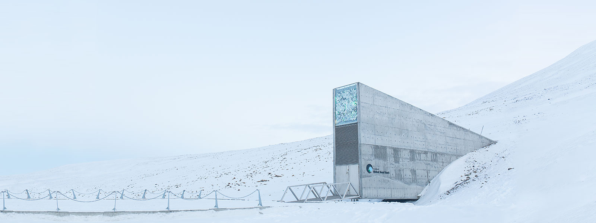
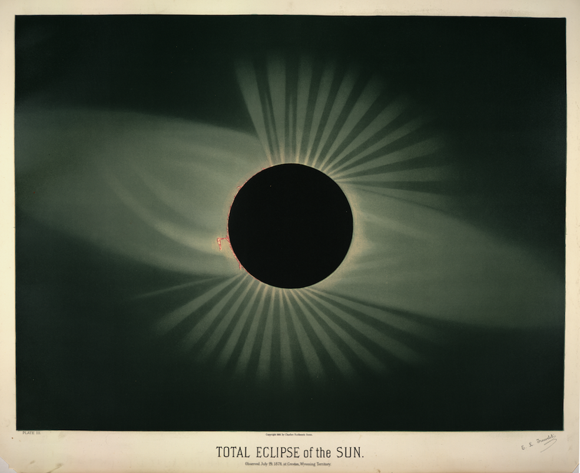

_I’m [Gus Cuddy](https://guscuddy.com/) and this is [The Curtain](https://guscuddy.substack.com/), a newsletter exploring arts, culture, media and the internet. New reader? [Subscribe for free](https://guscuddy.substack.com/subscribe)._

---

Hi friends,

This is the second to last _Curtain_ of Season 2. After next issue I’ll be taking a few weeks off, then returning for Season 3.

My publishing schedule has been erratic these days. I apologize, but I hope you’ll understand — the weather has been warming up and things are starting to _move_ again. That, coupled with various other factors, lead me to publish later than I wish. Hope to return to the old standard of Tuesdays after the break.

Season 2 of The Curtain has mostly looked at the **internet** and arts and culture. It’s been a wild ride. But I’m especially interested in how we’ll treat the internet in the upcoming months, as COVID becomes less and less of an eminent threat. Will our fatigue with everything online-related lead to new in-person pathways? Will we stay with “digital prime”, [as I’ve discussed](https://guscuddy.substack.com/p/the-curtain-104-the-tension-of-digital)? Or will we retread to a similar balance as before, with the scales altered just a little bit?

One thing’s for sure: people take the internet in a more serious manner these days. Sure there’s the rise of Tr\*mp, the alt-right, Q’Anon, yr average insurrection white supremacist — all that internet-politics talk. But there’s also now a common discourse surrounding the anthropology of the internet and “internet culture”, which can mean many different things but generally means weirdness and virality that comes out of the various channels/corners/cesspools/corporations that make up the internet. TikTok has played a huge role in that, honestly — by becoming a distinct and talked-about cultural entity that algorithmically serves up short-form amateur content, it’s become its own microcosm (perhaps becoming a macrocosm, I don’t know) of how the internet can intertwine with/transform culture.

We’re seeing things now like Polygon creating a relatively-speaking serious and impressive list of the “**[greatest achievements in Dumb Internet Video](https://www.polygon.com/22417321/viral-videos-flash-youtube-all-time)**”, which spans all the way back to the the early 2000s and Flash videos like Homestar Runner. It makes sense that these histories-of-the-internet type pieces are popping up more and more readily: the internet has transformed how we relate to the world, art, and others — streaming video online has possibly the greatest leverage on that front — and it’s just undergone a seeming cultural “deepening” through the pandemic, besides being ~30 years old already.

But all this anthropologizing about the internet and digital culture always makes me think: what happens next? Or, maybe more menacingly: what will culture look like when this _ends_?

In a [recent blog post](https://interconnected.org/home/2021/05/27/charlie) about OG viral video [“Charlie Bit My Finger”](https://www.youtube.com/watch?v=_OBlgSz8sSM) being sold as an [NFT](https://guscuddy.substack.com/p/the-curtain-094-nfts-crypto-and-the) (and the possibly of it being removed from the internet, before that decision was later reversed), blogger Matt Webb posed a provocation: “**One day will be the final day that someone watches Charlie Bit My Finger**”. Webb says it’s his way of “thinking about Deep Time, and how we can tell when a culture ‘ends’ (and, maybe, another begins)”. Yeah, I’m fascinated by that too. Marking a cultural shift by the end of a stupid internet video seems kind of silly until you realize how brilliant it is. What happens with all this ephemeral, floating-around internet-culture junk when a hundred years have passed? What about 1,000 years? How does it fade away? What comes next?

There are some examples of real-world answers to this, by the way. GitHub, which is where most of the world’s code (as in computer programmer’s code) is hosted, has an [Arctic Code Vault](https://archiveprogram.github.com/arctic-vault/) — which actually is as ridiculous and cool as it sounds. It’s a 21TB snapshot of data stored deep inside an Arctic mountain, designed to last for 1,000 years. The location where it’s stored, the [Arctic World Archive](https://arcticworldarchive.org/), has an impressive mission: to preserve the world’s memories for centuries to come, able to withstand both natural and human-made disasters. These types of “deep time”-type things feel pretty foreboding and apocalyptic, of course — but I guess it’s cool they exist, right? Anyway, they store stuff like GitHub code and also digitized Ancient Manuscripts from the Vatican, and hopefully too they will store this newsletter, along with Charlie Bit My Finger and the latest TikTok meme and that Baby Shark video, so that future generations/species/aliens can look back at us and be just as confused as we were.

<figure>

<figcaption>The entrance to the&nbsp;<a href="https://www.croptrust.org/our-work/svalbard-global-seed-vault/">Svalbard Global Seed Vault</a>, where a collection of crop diversity is stored. And also I’m pretty sure part of the set for <em>Watchmen</em></figcaption>
</figure>

---

### Theater Re-Opening: the good, the bad, the stupid

New York Theater, commercially at least, is finally, somehow, I guess, a thing. With the way things have opened up in this city it makes sense. But it’s a mixed bag in terms of parsing what’s worthwhile.

Broadway hasn’t really changed at all, and we’re deluding ourselves if we think it has. When it reopens this September, I expect the same problems to be there — only magnified. Don’t worry, people will still fawn over The Lehman Trilogy thinking it’s a great play, an example of real theater, yeah:

https://twitter.com/AmericanTheatre/status/1400805752932024320

Oh boy, Simon Russell Beale…

(On this subject, [there was a great piece in the NYRB from 2019 about](https://www.nybooks.com/daily/2019/06/11/the-lehman-trilogy-and-wall-streets-debt-to-slavery/) _[The Lehman Trilogy](https://www.nybooks.com/daily/2019/06/11/the-lehman-trilogy-and-wall-streets-debt-to-slavery/)_ [and Wall Street’s debt to slavery](https://www.nybooks.com/daily/2019/06/11/the-lehman-trilogy-and-wall-streets-debt-to-slavery/).)

Anyway, [Antoinette Nwandu’s](https://deadline.com/2021/06/pass-over-broadway-august-4-antoinette-chinonye-nwandus-1234767036/) _[Pass Over](https://deadline.com/2021/06/pass-over-broadway-august-4-antoinette-chinonye-nwandus-1234767036/)_ [is coming to Broadway on August 4](https://deadline.com/2021/06/pass-over-broadway-august-4-antoinette-chinonye-nwandus-1234767036/) — leading the whole pack! — which is heartening news. I wish that production and its team all the success. Unfortunately, _Pass Over_ is still the exception to New York theater, and I don’t expect this production to singularly signal a sea change.

I should note, though, that Nwandu signing on as a producer for _Pass Over_ — [modeling after Jeremy O. Harris](https://twitter.com/anwandu/status/1389947461498806272) — is a positive trend. One of the main ways to create better, more inclusive work on Broadway — if the goal really is Broadway, which there can be doubts that it is — is to have more diverse producers. Broadway, even with Scott Rudin gone, is still centralized around uber-powerful hyper-white-male producers.

If I have any prediction for the short-term future of Broadway it’s that I’d suspect we’ll see a swarth of celebrities dip/re-dip their toes into “theater” (Broadway) in fairly standard/conventional/status-quo-reinforcing fare, in a weird nostalgizing/pitying attempt to celebrate in-person liveness (ironically just for those who can afford tix). Nothing like a little celebrity worship to get the power-hungry theater business going.

And part of me dreads the consistent waxing-poetic we’re going to get from commercial producers and prominent institutional artistic directors about the heart/truth/necessity of theater, after being separated for so long. (I can picture one particular artistic director’s speech-on-top-of-a-table now.) Of course I’m being cynical here — I’ve been writing consistently about the importance & difference of liveness for a while in this very newsletter! — but there’s something so…disappointing? contrived? normative? about it.

Like we were gripped by a fever dream of ideas/arguments/promises/hopes for the future of arts, its intersections with race/class/society, its radical role in reshaping the future. But the conversation was left with many forking ellipsis, and here we are, wait, things are back starting again, oh god, what did we say we were going to do again, no time to stop and think anymore, got to get these plans going, the money comes drip-drip-dripping in, a slow trickle of apathy over the months, time is an ocean wave washing away rust and warps and scabs, what did you actually expect anyways, revolutions aren’t made in a day, look we did the anti-racism homework, remember when there was a Hamilton movie, theater is our great melting pot-unconscious dweller-conversation pit, it’s ultimately populist just like our country is populist; god, please, Jake Gyllenhaal will you save our souls.

---

## Notes from the Week

* I’ve been going deep on learning more about China (and their internet) recently. If you’re interested, I highly recommend the newsletter [Chaoyang Trap](https://chaoyang.substack.com/). I greatly enjoyed [the most recent “episode”](https://chaoyang.substack.com/p/ep7-wikipedia-lookbook), about Xiaohongshu lookbooks and the Wikipedia entries for Chinese cities.

* If you know my tastes you might be able to predict that I was all about [this Sam Anderson profile of Kevin Durant and the Brooklyn Nets](https://www.nytimes.com/2021/06/02/magazine/kevin-durant-brooklyn-nets.html). It’s pretty bombastically written, which I love, as Anderson really goes big when trying to encapsulate basketball. Its scope is vastly grand and then specific, which is the perfect way to write about Kevin Durant, one of the most mercurial talents/performers out there.

* Really enjoyed [Jay Caspian Kang talking to Ocean Vuong](https://goodbye.substack.com/p/buddhism-writing-and-mixed-martial) on Jay’s Time To Say Goodbye podcast, a conversation that went in unexpected directions.

* [MSCHF](https://mschf.xyz)’s (they responsible for the Lil Nas X satan shoes) latest drop: a [chair simulator](https://chairsimulator.com) game. Which is exactly what it sounds like. It has 1300+ reviews on Steam. I’m not sure what to make of MSCHF, but I’m fascinated by their “drop” schedule, like a streetwear brand, but for…weird stuff.

* Angelica Jade Bastién: [Cruella Is the Girl-Bossification of the Madwoman](https://www.vulture.com/article/cruella-review.html)

* [Kellog has robotic cereal vending machines](https://gizmodo.com/kelloggs-introduces-robotic-vending-machines-that-mix-a-1846981993) now, so that’s cool

* [A paper on enhancing the realism of synthetic images](https://intel-isl.github.io/PhotorealismEnhancement/)… aka making GTA V look like it’s “real”

* [Bhutan has playable vinyl record stamps](https://thevinylfactory.com/features/the-curious-tale-of-bhutans-playable-record-postage-stamps/)

---

## End Note

<figure>
    
    <figcaption>Étienne Léopold Trouvelot</figcaption>
    </figure>

---

https://sjrecords.bandcamp.com/album/its-ok

I’m in love with this Chinese “leisure pop” album I discovered through the Chaoyang Trap newsletter, which hits all the right notes for me. “It’s ok” is the jam.

++

_Season 2 of The Curtain will be wrapping up (probably, seriously) next week. I’ll take a few weeks off and then be back for Season 3._

_The Curtain is supported by [paying subscribers](https://guscuddy.substack.com/subscribe). I currently run on a patronage model: the benefits are the same (right now) for paying and free subscribers. Your support helps make this sustainable._

_New reader? The Curtain is a weekly digital letter sent by [Gus Cuddy](https://guscuddy.com/). You can [subscribe for free here](https://guscuddy.substack.com/subscribe), or [browse the archives here](https://guscuddy.substack.com/archive)._

_You can reply directly to this email and I’ll receive it. So feel free to do that about anything. I love to hear back from people._

Talk soon,

Gus
