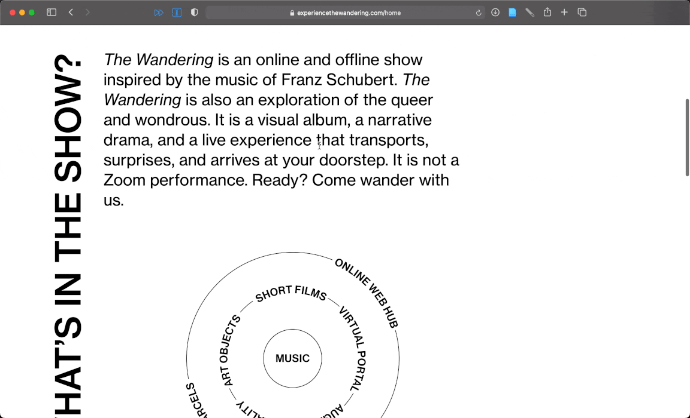

_I’m [Gus Cuddy](https://guscuddy.com/) and this is [The Curtain](https://guscuddy.substack.com/), a newsletter exploring arts, culture, media and the internet. New reader? [Subscribe for free](https://guscuddy.substack.com/subscribe)._

---

Welcome to the final *Curtain* of Season 2! Hope you’re having a great weekend.

I'll be taking the rest of June off from writing this newsletter. Any paid subscribers' subscriptions will be put on pause for that time (no paying for something that isn't happening!).

There's some really interesting stuff to talk about this week that is a nice encapsulation for what Season 2 of The Curtain was all about: looking at intersections of performance and the internet.

As a reminder, we started off Season Two of *The Curtain* by considering [the way we cultivate Space on the Internet](https://guscuddy.substack.com/p/the-curtain-89-cultivating-web-space): when does the internet and its sense of place dissociate us from reality? When is that sense of space — or even sense-space — commodified and owned by corporations? And when is that space independent and free? We then also considered [the notion of "texture" and its deceptive analogies in the digital world](https://guscuddy.substack.com/p/the-curtain-090-the-year-of-texture), and the great flattening of digitization. The way the internet has developed has moved in the direction of homogenizing culture.

---

## Interactivity, Texture, and Performance in Web Space

In an announcement that came as pleasantly surprising for me because I kind of forgot they were being announced at all, [the Pulitzers announced](https://www.pulitzer.org/prize-winners-by-year) that [Fake Friends](https://fakefriends.net)' *Circle Jerk* was a finalist for a Pulitzer Prize in Drama. (Katori Hall's *The Hot Wing King*, which premiered at Signature Theatre in February 2020, won the award.) Besides the hilarity of seeing "Circle Jerk" on the prestige-bestowing website of Pulitzer.org, it's a big moment for the spectrum of consideration of what the possibilities of theater can be. (The other finalist, Zora Howard's *Stew*, also premiered in February 2020 in a traditional theatrical setting. Both Howard and Hall are black women who had their work cut short by COVID; I hope their plays are remounted in New York soon.)

The boundary-busting Circle Jerk is the first digital-only piece of theater to be considered for a Pulitzer, and probably any major award. As I [wrote about last year](https://guscuddy.substack.com/p/onlinetheatre), Circle Jerk was perhaps the most successful digital theater piece of the entire pandemic because of how suited to the digital landscape it was, and how it spontaneously invented its own form. It also is the shining example of how digital theater can open new doors for accessibility and audiences. *Circle Jerk* was workshopped as a live theater piece originally, and pivoted to an impressive video setup with COVID. But there's zero question: if this "only" had a fully-produced show at Ars Nova (not knocking that!), it wouldn't have anywhere close to the cultural reach that it did. The internet enabled a large audience of people — including celebrities and high-profile folks — to view the production, and engage with a live-tweeting audience on social media.

But was it actually *theater*? Purists might recoil, but this new multimedia form still has its roots in theater conventions. Perhaps the most recognizable convention was the virtuosic intensity and energy needed to perform it live; it gleefully asserted its liveness in a way that differentiates it from TV or film. There's a magic trick at play here, which is one of my favorite theatrical conceits: when you wonder how a performance is going to pull something off or sustain a level of energy or do some seemingly impossible set or costume change — and then they do.

Fake Friends continue to push the limit of what digital theater can be with their latest show, *[This American Wife](https://thisamericanwife.live/)*. Unfortunately I wasn't able to catch the show while it was live; they graciously had an on-demand viewing option, but by my own admission I am seeing a somewhat less "charged" version. To creators Michael Breslin and Patrick Foley's credit, seeing the recording made me wish even more that I had seen it live. (That sense of mild FOMO is exactly what a recording of something live should do — even when it's already presented digitally!) *Wife* has, on first glance, a more limited scope than *Jerk*: it's about *The Real Housewives*, which is something I have next to no knowledge about. (For a comprehensive and excellent review, I recommend [Kyle Turner](https://tylekurner38.medium.com/the-exterminating-angels-fake-friends-this-american-wife-deb2ec4d6444) and [Helen Shaw](https://www.vulture.com/2021/05/this-american-wife-gives-reality-the-fake-friends-treatment.html)'s pieces.)

But even without Real Housewives knowledge, *This American Wife* is a fascinating viewing. More nightmarish but equally as brutal and self-indicting as *Circle Jerk*, Breslin, Foley, and performer Jakeem Dante Powell are led to a strange Long Island mansion by a ghostly Housewife who we don't fully glimpse. There, the performance — transmitted live from this house — goes to chaotic extremes, as they act out moments from *Housewives*, break down the Reality TV form with Big Brechtian Energy, maraud through the vague boundaries between reality and performance, fact and fiction, private and public, and then finally switch the gaze onto themselves. It's another impressive performance by the Fake Friends team.

Directory Rory Pelsue and the entire creative team seem to understand that digital video can have texture; it doesn't need to be simply a high-definition (or Zoom-definition) representation of what's happening — video can have many different formal qualities to it, each affecting the performance differently. To be sure, the luxury of playing with video partially comes from what I assume is another relatively significant budget for the show. (Like *Circle Jerk*, Jeremy O. Harris was a producer.) Not every show can or should rent a mansion in Long Island and a video crew to make a piece of digital theater. But the implications of theater finding a way to merge into the digital stratosphere, mingle with Twitter and TikTok in a real — and ridiculous! — way, can't be understated.

---

Another show pushing the boundary of what theater can be is the immersive theatrical experience *[The Wandering](https://experiencethewandering.com/home)*, which I wouldn't have found out about if it weren't for my friend Calista co-creating it. They describe the project as "part visual album, part queer drama, and part communal live experience" inspired by the music of Franz Schubert.

It's one of the most unique theatrical projects I've experienced in the last year, and one of the most painstakingly detailed one. There's a lot going on here: I chose to do the "immersive" experience; I was shipped a beautifully designed package that contained within it four days of material/physical ephemera that arccompanied the online content. I was very impressed with the overall design quality of the entire experience — it feels premium and thoughtfully considered. In the physical folder I was shipped was a username/password for an entire online system that they created. I loved the "secret door" type feel of entering into this Web Space:

The actual experience of interacting with the website — a portal they call "Prism" — is deeply impressive as well. It's a three-dimensional, interactive portal with lots to discover:

Over the course of four days you interact with another piece of the story, each day presented as a short film. The films themselves, directed by Lara Panah-Izadi, have as high production value as any theater-adjacent film I've seen. They are presented beautifully online, and contain lovely music and dance. After each film there are directions to interact with the physical objects you are given that connect you to the rest of the audience through technological means. (Oh yeah, and there's even some Augmented Reality design parts.)

Like the distinctive production values of Fake Friends' work, *The Wandering* is a singular adventure. Both push the edges of what theater even *is*, with *The Wandering* in particular standing out as a multimedia experience. Unlike *Circle Jerk* and *This American Wife*, *The Wandering* doesn't really have a traditional live experience. There are still some of the conventions of theater, however: when you play each day's video, a message comes up saying that once you play the video, it can't be stopped, and once it ends, it disappears forever. It's a nicely designed digital system to enhance the [artificial scarcity](https://guscuddy.substack.com/p/the-curtain-096-one-year-later).

---

## Notes from the Week

### oh broadway, never change

As Broadway's re-opening approaches, it's become clear that the answer to the question "What will change" is somewhere approximately around nothing. That's unfortunate; I feel more confident than ever though that while there may be surface level changes, Broadway will continue to reproduce destructive power & economic models. There's hope that will change — underrepresented playwrights becoming producers of their own plays, for instance — but it certainly won't be an easy ride.

-   🔮 [Last week](https://guscuddy.substack.com/p/the-curtain-108-deep-time-the-restart), in a daring prediction, I wrote that celebrities and conventional theater [nostalgia](https://www.guscuddy.com/nostalgia) would rule the return of commercial and high-profile institutional theater. Already we're seeing that play out in several ways.

-   [Jeff Daniels will return to Broadway to satiate our To Kill a Mockingbird needs](https://www.nytimes.com/2021/06/10/theater/mockingbird-broadway-reopening.html). A new management takes over to replace Scott Rudin.

-   Your mileage may vary, but [Jimmy Fallon and Lin-Manuel Miranda singing a medley about Broadway being back](https://twitter.com/fallontonight/status/1402449457929654274?s=12), complete with other Broadway performers, is peak nightmarish theater-cringe for me.

#### Other theater notes

[Counting Together](https://countingtogether.org/) is a new website to collect data-driven insights on equity and inclusion in the American theater. It's a good step to house all this data under one umbrella, so that the numbers — which are often extremely depressing — are more readily accessible. The site still seems to be a work-in-progress in my clicking around, but it's an interesting start.

New York Theatre Workshop announced [both their 2021/22 and 2022/23 seasons](https://www.nytw.org/posts/announcing-the-2021-22-and-2022-23-seasons/). Lots of interesting work (Whitney White featured *twice* in 21/22), including one of my favorite plays from 2019's Humana Festival, *How To Defend Yourself* by Liliana Padilla.

---

### Link Dump

-   All of a sudden the Right can't stop talking about "Critical Race Theory":

<https://twitter.com/KevinReuning/status/1401166962575749123>

It's the latest bogeyman of right wing media. So much so that [Florida decided to ban it completely](https://slate.com/news-and-politics/2021/06/florida-critical-race-theory-ban-what-it-tells-us-about-anti-anti-racism.html).

-   Credit to Jeremy O. Harris, who funded weird work from friends he believed in and ended up helping them be a Pulitzer finalist:

<https://twitter.com/jeremyoharris/status/1403830051229995009>

-   Wesley Morris won his *second* Pulitzer for criticism. [His biggest piece from last year was about his mustache](https://www.nytimes.com/2020/10/14/magazine/quarantine-mustache.html).

-   [Discriminator](https://www.discriminator.film/) is an interactive documentary about facial recognition databases

-   [Author Elin Hilderbrand is being forced to change a line in her book — but fictional character's statements do not reflect an author's beliefs](https://slate.com/culture/2021/06/elin-hilderbrand-casey-mcquiston-antisemitism-israel-social-media.html).

-   [Where Gen Z goes to discover who's trending](https://mailchimp.com/courier/article/evan-britton-famous-birthdays-founder/)

-   [New York City Is Becoming Itself Again and FOMO Is Back](https://www.thecut.com/2021/06/the-return-of-fomo.html)

-   ByteDance, the company that owns TikTok, is [launching a brand to offer its secret algorithm to businesses](https://www.reuters.com/technology/bytedance-launches-volcano-engine-brand-offer-tiktok-secret-businesses-2021-06-10/).

-   Vice profiles [the City-Data city vs city forum where they've been debating which cities are better for 12 years](https://www.vice.com/en/article/n7bbdb/this-forum-has-been-debating-which-cities-are-better-for-12-years)

---

## end note

Thanks so much for reading. If you've kept up with reading these every week on my erratic schedule, thanks even more. If not, no worries — [you can always read the full archive here](https://guscuddy.substack.com/archive). Either way, feel free to shoot me an email. I love to hear back from people.

I'll be back in July with fresh eyes for the third "Season" of The Curtain.

Wishing you a beautiful start to summer.

Gus
