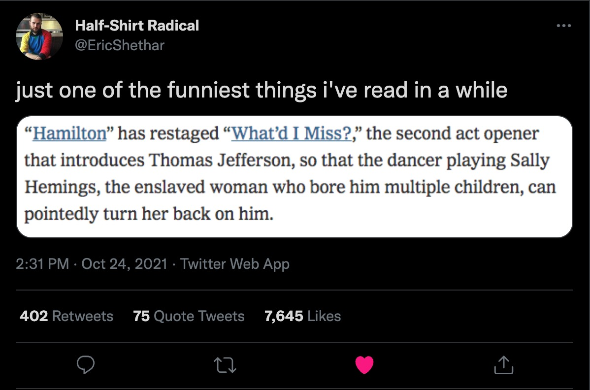
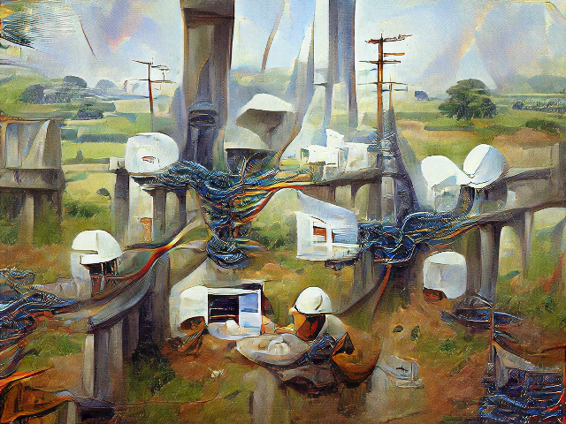
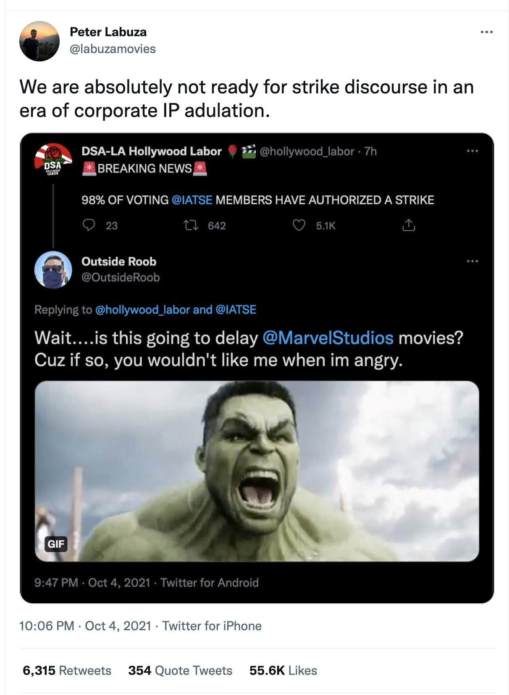
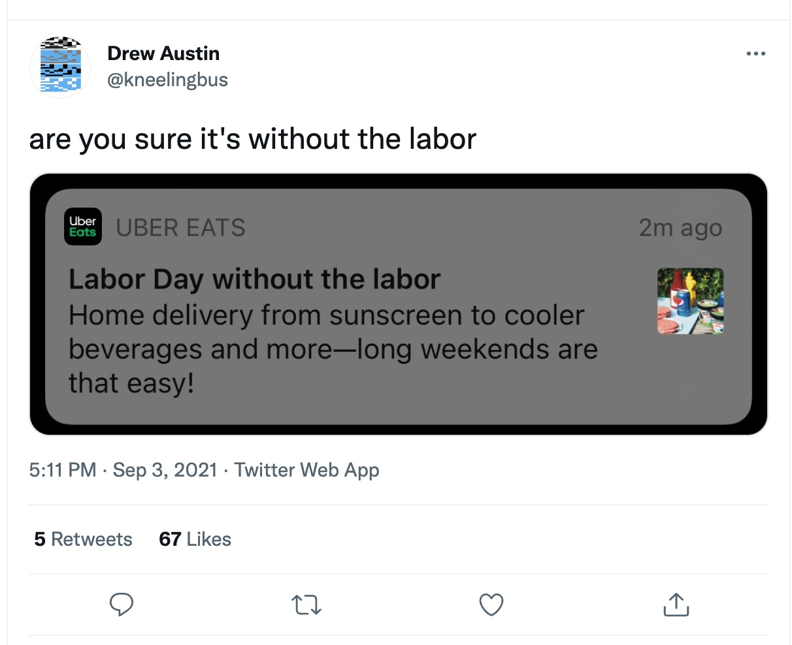

Hello all —

Welcome to **Season 3** of _The Curtain_, which is finally back after a loooong summer hiatus. Wishing you all a pleasant, spooky Fall.

---

For those of you that are new around here, _The Curtain_ is a ~weekly newsletter loosely about arts, culture, and technology. Much of it is framed with my background in theater and as a technologist. The primary thrust of the last year has been the clashing of physical and digital primacy.

Here are some pieces I wrote last season:

*   [on the tension between digital and physical prime](https://www.guscuddy.com/curtain/104/)
    
*   [on artificial scarcity](https://www.guscuddy.com/curtain/096/#on-art-and-artificial-scarcity-in-2021)
    
*   [obligatory piece on NFTs](https://www.guscuddy.com/curtain/094/)
    
*   [on clubhouse and liveness](https://www.guscuddy.com/curtain/093/)
    
*   [on flatness and texture](https://www.guscuddy.com/curtain/090/)
    
*   [on cultivating “web space”](https://www.guscuddy.com/curtain/089/)
    
*   [on digital texture](https://www.guscuddy.com/curtain/091/#notes-on-digital-texture)
    

This season will continue to explore the collision of these different forces, especially as cities and live arts come to life once more.

---

## Summer turned to fall but the vibes are still off

Since I've written you all last, the much-hyped summer puffed its chest and whiffed on by. Personally I wasn't able to get motivated to do much of anything, I just sort of watched it pass by. I did manage to tinker with a lot of different web design and development projects; my most fruitful throwaway project was a website that allows you to click a button and get a random photo from the open access art collection of The Met, with some additional features to save them for later: [you can view that Met Explorer here, if you're interested](https://met-app.netlify.com/). It's nothing special though. Really. I also did a re-design of [my website](https://www.guscuddy.com/), and spent far too long transferring every issue of this newsletter over to [an archive page](https://www.guscuddy.com/curtain/), so that it can live free of Substack. Anyway, we're now well past summer, in the midst of Fall, and the vibes are still screwy.

The summer came and went as the "**[vibes are off](https://www.theatlantic.com/technology/archive/2021/08/welcome-summer-uncertain-vibes/619662/)**" summer. It wasn't the hedonistic joyride some expected, something darker lurked beneath the surface, you know, something cursed and malevolent. Well still, we opened things up, most everyone came out to play, sometimes with trepidation. People sweat and bumped against each other, a new variant threw things off, but folks trudged on. Things (in my world, at least) have seemed to settle into an off-kilter sense of the familiar: we go to vaccinated shows, eat at vaccinated bars and restaurants (preferably outdoors, still), avoid too much indoor time, and go about living our lives with the knowledge — and trauma — of the past year and a half.

As the Summer turned to Fall, in-person arts began to resume. Once seen as the lifeblood of New York City, the arts scene here has taken a severe hit. Theater, in particular, found itself floundering, no real plan in place. Shifts to long-overdue considerations of how to make digital theater proved successful in varying regards, but there was no doubt that things weren't the same, and perhaps wouldn't be for a long time. Efforts to ensure government funding led to limited results. Theaters closed, like [The Lark](https://www.americantheatre.org/2021/10/05/the-lark-is-grounded-new-play-incubator-to-fold-after-25-years/), or decided to take the long break to try to shake off past sins by re-branding completely, like [The Flea](https://theflea.org/a-new-path-forward-for-the-flea/).

Incredibly, since I've written last, one of the very best new theater pieces of the last few years, _Dana H._, made its way to Broadway. But Broadway is still Broadway, great theater still struggles against the trappings of capitalism, [and it's now scheduled to close months early](https://www.nytimes.com/2021/10/25/theater/broadway-closings-is-this-a-room-dana-h.html), alongside the also-excellent _Is This A Room_. [I wrote about both those pieces in conversation with one another last year](https://www.guscuddy.com/tellthetruth/); if you're in New York and can afford to see them before they close, I highly recommend doing so.

But alas: I've now been to several indoors, in-person arts events in the last few months, and unfortunately my experiences at the theater have still felt the most deadened. Indoors concerts haven't really missed a beat, music in [a crowded space](https://www.guscuddy.com/curtain/107/) with others is sort of timeless. But as theater comes back, it fights against the new habits that have set in from the pandemic. Going to the theater is not a frictionless act. It's actually a very friction-filled undertaking, with many hurdles to clear — money, travel, masks, boredom — that feel more momentous "post"-pandemic. People's theater-going habits — which were generally not that widespread anyway, and contained to a certain demographic at that — may have gently slipped away. Who has time to go to the theater anymore?

The fact that most theater is not very good doesn't really help either. Many of the large institutional theaters here seem to be in a bit of a daze over what kind of work they want to be producing; monologue-y, talk-to-the-audience, sort of (even unintentionally) social distance-y theater seems to be in, whilst the urge to produce a show with optimal diversity seems to be on white producers' minds, as they search to look good after a year and a half of call-outs and introspection over theater's vast, rooted, and insidious whiteness. The "we gotta look a little less racist" attitude has proven to have a lot of legs, so [Broadway shows are doing stuff like this](https://www.nytimes.com/2021/10/23/theater/broadway-race-depictions.html):

Unfortunately, very little in theater currently feels actually _alive_ — both alive to its audience, and alive to the present moment. It still feels simultaneously trapped in its own self-importance and unable to take itself altogether seriously; it moralizes while retaining amoral practices and structures; maybe worst of all, it's just corny most of the time!

It's telling that the biggest theater movies over the last few years, _Hamilton_ and _Dear Evan Hansen_, both got way more criticism than they did as just pieces of theater: both were exposed for their corniness. (The former is a vastly superior piece of art than the latter, to be clear — but Lin-Manuel Miranda gets cornier with each year.)

### Let's talk about corniness

To theater's defense, much of culture right now is struggling with a serious Corniness syndrome. We live in a time of strange cultural artifacts that have an inflated sense of importance, but a lack of seriousness.

Look at a small sampling of what's popular right now:

*   NFTs
    
*   Marvel Cinematic Universe
    
*   Star Wars
    
*   Disney
    
*   Ted Lasso
    
*   TikTok and YouTube influencers
    
*   Squid Game, or whatever the latest Netflix show is
    

Most contemporary media is meant to be consumed like children's material; it's moralizing and didactic, or existing to please [nostalgia](https://guscuddy.com/nostalgia) receptors. The [age of "content"](https://www.guscuddy.com/curtain/090/) lacks vitality, mystery and eros — art is expected to tell us what to think, or otherwise be easily digestible as ambiance in our lives.

(Most of it is also completely sexless. Think of the career of Oscar Isaac — a smoldering, bona fide movie star, whose most prominent roles are things like the completely forgettable Poe in the new _Star Wars_ trilogy, or the one-note Duke in the new _Dune_. [We're wasting this guy](https://twitter.com/wykstrad/status/1434259683687104512?s=21)!)

A show like _Ted Lasso_, a perfectly fine show, is hailed as a must-watch piece of media largely because its message is so clear: be kind to people! Kindness is great, to be sure — but a moralizing message isn't a distinctive feature of great art, but of a children's book. As art and media is atomized into smoother and smaller bite-sized commodities, everything seems to need a takeaway. This makes it easier for popular essays to do book report-style pieces on said pieces of culture: this piece of art says X, so it means Y. Inevitably, the conversation around corny shows become corny as well.

In his excellent [round-up of 2019 movies](https://www.newyorker.com/culture/2019-in-review/the-best-movies-of-2019), film critic Richard Brody acutely called out the problem (forgive the long block quote):

> _…the sheer quantity of what’s streaming also overwhelms the cinematic punditocracy with the sheer quantity of previewing, sifting, recapping, summarizing, comparing, and listing. **The need to pay constant attention to the services rather than the works turns critics into connoisseurs of shit, comparing one mediocrity against another in order to be able to assemble a list of what’s barely recommendable with a straight face by contrast with what’s even worse**. In the process, critical taste is **inevitably shifted toward a new aesthetic** (or anti-aesthetic) that leaves the best filmmakers of the time looking like backsliding conservatives clinging to ivory-tower traditions rather than what they are: audacious and forward-looking resisters to corporate production, not defenders but **advancers of individual creation and conscience who overcome the redefinition of art as content**—regardless of how their films may be marketed._

"Connoisseurs of shit" is an all-time great line, but Brody is on to something here. Most media is one of: boring, medicore, corny, annoying, or just merely fine or good. There's nothing wrong with being fine or good! But our society has such a predilection for calling things "masterpieces" that we've lost complete track of what's what anymore. So much mediocre content creates a new aesthetic — one that lacks vitality and distinction, one that treats audience like children, and one that inflates its sense of importance while deflating its seriousness.

---

### Art, Simulation, and Algorithms

#### Algorithms create art

Perhaps art as we know it is changing, in a variety of ways.

One thing I’ve been fascinated with is the rise of strong artificial intelligence engines, like GPT-3 and CLIP+VQGAN, that are being used to create/compose/synthesize “art”.

GPT allows for the creation of eerily strong text-based compositions; a creative "poet" who works with GPT-3 might feed it in a few lines of a T.S. Eliot poem and get back something odd and interesting, a bit uncanny — and yes, a bit soulless, but not as much as you might think. [Here's @tambourine's process](https://alwaysalready.dreamwidth.org/5200.html), what she describes as "neural net poetry". She uses the computer as a sort of writing partner, bouncing ideas and phrases off of it, gently reworking what it spits back. She ends up with some text that she'll cut and rework some more, pruning it of clichés and oddities:

    saying grace after every bowl
    of soup. i have heard
    of weddings now, heard
    sweet souls said goodbye to one
    another in song as the winter
    rot set in and blossoms fell.
    now, almost in full leaf
    the agapanthus bursts through the door,
    sending up their lacy, winged blossoms,
    light as feathers, but everywhere
    an abiding darkness is beating
    and words that make me cry:
    —and now, with aching beauty,
    let us sing:
    sing it out for those left behind
    if they are part of you—

Some really lovely lines in there!

CLIP+VQGAN allows for computer-generated artwork that often leads to incredibly rich results — [especially when given an artist byline](https://www.aiweirdness.com/my-favorite-nonexistent-painter/), as Janelle Shane from AI Weirdness notes. (e.g. Internet Infrastructure by James Gurney, pictured below). The results can be quite astonishing.

<figure>

<figcaption>AI-generated artwork in the style of James Gurney: it was given the prompt “Internet Infrastructure by James Gurney”</figcaption>
</figure>

What's going on here? This isn’t a masterpiece of art, but I find it genuinely interesting to look at; it hurts my brain to think that a computer created it.

Take a gander through [Ryan Moulton's "Tour of the Sacred Library"](https://moultano.wordpress.com/2021/07/20/tour-of-the-sacred-library/), where he invites us for a walk through a library — a series of AI-generated images from the text "~room name~ in the sacred library by James Gurney" — coupled with very inviting writing through the dream/liminal/latent space.

Much of the imagery generated by AI is distinctly vibes-y, evocative in the way vaporwave as a musical genre is evocative:

https://twitter.com/cubosh/status/1449233918897672194

https://twitter.com/netk/status/1449176364263878664

This is a whole new kind of content, and one that will become increasingly prevalent in the coming years — especially as virtual worlds ramp up, with [Facebook pushing its Metaverse agenda](https://www.theverge.com/22588022/mark-zuckerberg-facebook-ceo-metaverse-interview).

---

#### Art created for algorithms

So algorithms can make art to be consumed by humans. But perhaps the larger problem is that we humans are making art to be consumed by algorithms. This drives the same meandering, milquetoast-y, corny aesthetic I described earlier. It also drives a need for a large quantity of content — with little regard to the labor conditions under which that content is produced.

The demands of creating an exorbitant amount of content with cheap labor for streaming companies is part of what’s created a pressure to enforce completely unsafe working conditions in production. That’s what IATSE, the International Alliance of Theatrical Stage Employees, was pushing for as it threatened to strike this month — which would have been a major, major wrench in Film & TV production schedules. Still, as evidenced by the unbelievably tragic shooting on the _Rust_ film set that killed cinematographer Halyna Hutchins, film sets are willing to skirt basic safety in order to keep production on schedule. The [LA Times report](https://www.latimes.com/entertainment-arts/business/story/2021-10-22/alec-baldwin-rust-camera-crew-walked-off-set) of union crew members walking off set for the film because of awful labor practices, just six hours before the shooting, is infuriating. This type of accidental shooting on set is something that hasn’t happened since 1993. Despite laborers having proper safety precautions, producers continue to push for faster and cheaper output at the cost of literal life.

Technology is all-consuming. Its affects on media production and consumption can’t merely be hidden away by algorithms, though. Part of me wishes that IATSE had gone through with the strike so that people might recognize that, despite the seamlessness of technology and the ease of accessing anything, content does not magically appear — it is created by human laborers. ([Peter Labuza’s piece breaking down the IATSE strike](https://www.polygon.com/22728659/how-iatse-strike-2021-affects-movies-tv-industry) is great reading for more context.) In the age of corny content and corny content consumption, that’s more and more removed from discourse. We prefer to love the message of _Ted Lasso_, rather than look behind the scenes at the material conditions of [how the workers who made the show possible were treated](https://www.phonearena.com/news/ted-lasso-success-could-hurt-apple_id135300).

---

## Links

*   [L.M. Sacasas on the metaverse](https://theconvivialsociety.substack.com/p/notes-from-the-metaverse)
    
*   [50 Watts Books](https://50wattsbooks.com/) is "a new online bookstore with a focus on visually-striking and unusual books and ephemera from around the world"; I really like their collection!
    
*   [The very good Jackie Sibblies Drury and Lileana Blain-Cruz are adapting Raven Leilani’s wonderful novel](https://deadline.com/2021/10/luster-raven-leilani-hbo-gaumont-tessa-thompson-kishori-rajan-raven-leilani-debut-bestseller-series-development-1234861751/) _[Luster](https://deadline.com/2021/10/luster-raven-leilani-hbo-gaumont-tessa-thompson-kishori-rajan-raven-leilani-debut-bestseller-series-development-1234861751/)_ [for HBO](https://deadline.com/2021/10/luster-raven-leilani-hbo-gaumont-tessa-thompson-kishori-rajan-raven-leilani-debut-bestseller-series-development-1234861751/)
    

---

Thanks so much for reading. If you want to catch up with past issues, [you can always read the full archive here](https://guscuddy.substack.com/archive).

Feel free to shoot me an email by replying to this email. I love to hear back from people.

See you next week,

\-Gus