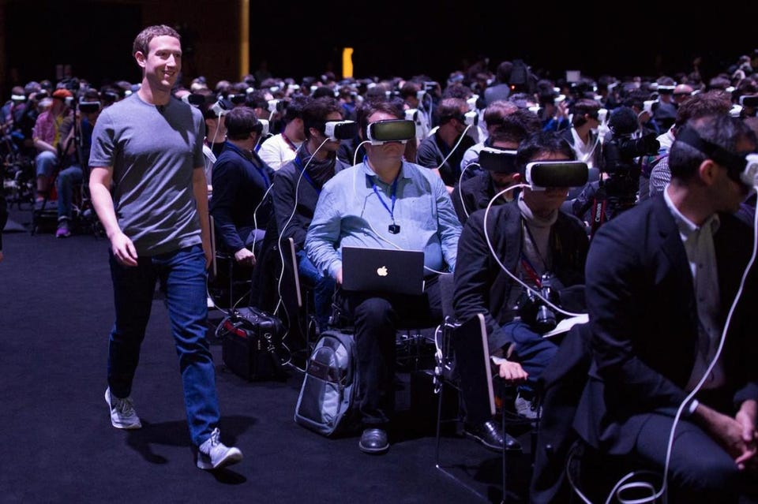
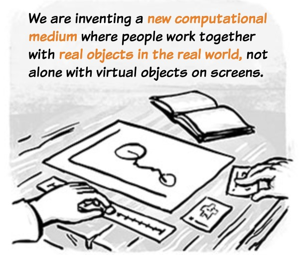
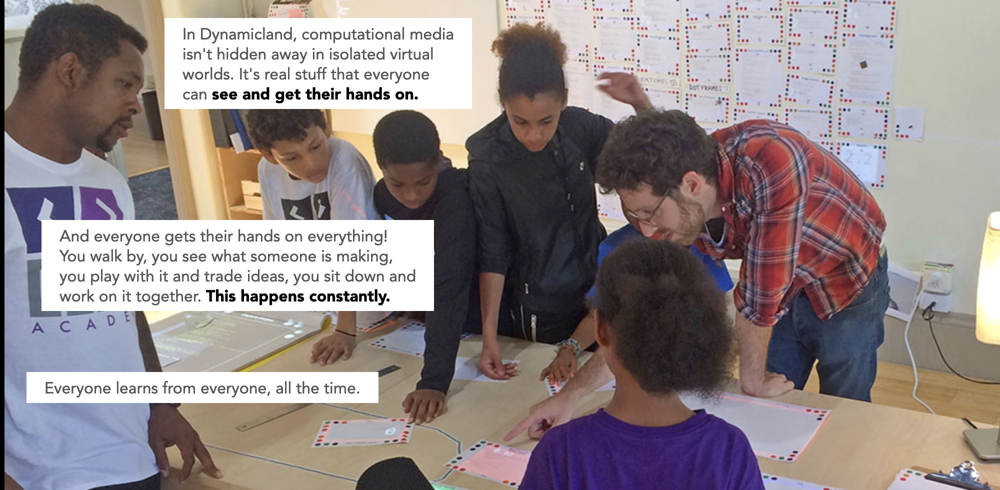

The story that everyone couldn’t get enough of this week seemed to be Mark Zuckerberg announcing that Facebook was renaming itself — or at least the parent company that presides over Facebook, Instagram, WhatsApp —  to Meta, which admittedly is a very funny thing. 

Facebook, after all, is one of the defining companies of the 21st century. So far it’s the only social media company to have had a movie made out of it (and a good one at that), and it’s [the fourth most visited website in the world](https://www.alexa.com/topsites). It’s also perhaps _the_ key driver in the post-2007 downward spiral of culture into a sea of homogenous content propped up by Web 2.0 companies. And it’s had a rough go at it in recent years, been mired in endless controversies, not to mention that it’s become pretty uncool. So a little shakeup seemed like just the ticket, and Mark Zuckerberg knew just what to do: ingest a large portion of designer psychedelics for billionaires and babble on about the metaverse, become so enraptured in your own mythos that you decide to make that the company direction, and change the name to something blithely profound like _Meta_. 

Don’t forget about the logo either:

https://twitter.com/rsa/status/1453789983958048768

Anyways we all had fun clowning on Zuckerberg, who led a truly bizarre keynote presentation with absolutely hilarious demonstrations of what the future could look like:

https://twitter.com/carolecadwalla/status/1453805979443810315

The whole thing is as dorky and cringe as can be to the point that I started to feel embarrassed for everyone involved in the video. In a way it’s the perfect exemplar of [what I deemed last week as a culture of corniness](https://guscuddy.substack.com/p/the-curtain-rises-again). Zuckerberg, and by extension Facebook, are treating this whole “metaverse” idea (more on that later) with a lot of importance, without thinking through its depth at all. All self-importance, no seriousness. Just skimming the glossy, commercial surface of a shallow idea. The future they present is unbearably corny, trying to present deeply uncool interactions as cool, and trying to convince us that this new flatlined reality will be just as real and detailed as our current one. A reality, Zuckerberg says, that will be accessed by putting on a pair of glasses. (I’m sure there will be no accessibility concerns whatsoever.) Of course, Facebook — dammit, _Meta_ — will be our corporate overlords through the entire process.

The full presentation, [which you can watch for free on the newly minted Meta website](https://about.facebook.com/meta), is pretty batshit, and worth watching for a real trip. It’s a truly bonkers vision of a deeply depressing future, a new internet that’s devoid of ethics, eroticism, and communalism, instead replaced by corniness, commercialism, and fake connection. It adds up to a shallow and incomplete view of the world. 

The funniest thing about the presentation is that none of the experiences offered — all of which are merely pre-generated animations, not “actual” metaverse content — are at all appealing. They seem like Facebook now: kind of annoying. One particularly bad segment tries to present a world where we can be “at a concert” in the metaverse, and it will be just like the real thing. We’ll even get to go to an afterparty where we can buy NFTs of band merchandise. In other words, hell.

---

But let’s talk about this metaverse idea for a minute, and what its implications are, because it’s all of a sudden getting a lot of air time. It’s a term first coined by influential sci-fi author Neal Stephenson in his novel _[Snow Crash](https://en.wikipedia.org/wiki/Snow_Crash)_ in 1992, where Stephenson envisioned it as the sort of “next thing” after the Internet: a persistent, three-dimensional, shared, synchronous virtual space. An entire universe in the virtual realm, consisting of not _just_ Virtual Reality headsets (like Facebook’s Oculus Rift, pictured below), but all technologies combined: augmented reality, virtual reality, the internet, and whatever else.

<figure>

<figcaption>Mark Zuckerberg presenting the Oculus Virtual Reality headset</figcaption>
</figure>

Zuckerberg and other Silicon Valley visionaries have seemed to pick up on the elements from Stephenson very literally, at times seeming like they’re trying to directly recreate a speculative fiction novel, without thinking much about it. For starters, _Snow Crash_ is a dystopian novel, and the metaverse presented in it is a form of entertainment and economy in a country governed by corporations. In other words, not some utopian vision. There’s a deep irony to Facebook, one of the most insidious corporations around, pushing forward a metaverse.

What’s really happening, though, is a complete dissociation from reality. Instead of working to fix the material conditions of the world, ravaged by global capitalism and tremendous inequality, billionaires are investing in building a new _virtual_ reality instead. There’s a profanity to it that’s hard to wrap your head around. Here’s Silicon Valley mega-influencer Marc Andreessen (inventor of the web browser), who clearly has the same drug supplier as Zuck: “**Reality has had 5,000 years to get good, and is clearly still woefully lacking for most people; I don’t think we should wait another 5,000 years to see if it eventually closes the gap**. We should build – and we are building – online worlds that make life and work and love wonderful for everyone, no matter what level of reality deprivation they find themselves in.”

Marc!!!

If you ignore the truly nonsensical 5,000 year timeline (seriously what is he talking about?) and squint hard enough, there might be a grain of a cogent argument. But there’s an unbelievable logical jump made that makes no sense: reality isn’t good for most people, so the solution from a hyper-capitalized people is to build a metaverse? Wait — what happened to making this reality better? The truth is that reality isn’t of much concern. In a post-Meta world all that matters is simulating a new reality.

---

The primary sense that Facebook promotes, above all else, is the _visual_. Any other sense is lesser. Zuckerberg starts off describing the development of media on the internet as a move from text, to photo, to video, always sticking to visual terms. When he describes the richness that the new worlds of the metaverse will provide, he’s almost definitely talking entirely about visual detail, as in: _wow, look at how realistic that digital water looks!_

It’s curious, then, that the most significant word used to describe the metaverse is “embodiment”. Zuckerberg uses a variation of the word “embodiment” during his presentation several times. He describes the Metaverse as an “embodied internet”, a place where we’re fully immersed in the reality being presented to us.

But embodiment is a strong word. And nothing Zuckerberg describes about his metaverse truly considers the body or the biological: the bumps and curves and fragility, the erotic and the sensual, the aches and pains and wisdom.

I can’t help but think about the functions of the metaverse in relation to the functions of theater and live performance at their best; instead of a shared, live physical space of collective dreaming and charged energy, we have a shared virtual space of all-encompassing visual “content” lacking in verve or mystery. The metaverse creates a persistent digital reality to sit “on top” of our current one, whereas live performance creates an ephemeral set of conditions for a small community to conjure an alternate reality, horizontal from our current reality, via the generation of energy in three-dimensional space. The metaverse, despite having the appearance of three dimensions, is a two-dimensional approach to human consciousness.

A distaste for the metaverse is not technophobic. The legendary interface designer and technologist [Bret Victor](http://worrydream.com/#), for instance, [has written about the importance of](http://worrydream.com/ABriefRantOnTheFutureOfInteractionDesign/) _[physical interaction and feedback](http://worrydream.com/ABriefRantOnTheFutureOfInteractionDesign/)_ when interfacing with digital mediums; it’s unclear how the metaverse will treat the senses beyond the visual. Victor’s latest project is called [Dynamicland](https://dynamicland.org/), and it stands in stark contrast to Facebook’s metaverse. Dynamicland is a research lab that seeks to develop an entirely new computational medium that is based in the _physical_ world, using community and physical objects. It’s a bit difficult to describe what exactly they mean by a computational medium, but Victor & co look for entirely new ways to think about computing that exists outside the tyranny of rectangular screens. The work they do is still very exploratory, but it’s approaching the “next thing” in the internet from the entirely opposite direction of Facebook’s metaverse. It’s much more compelling.

What are the ways we can privilege the analog — and all its [textured](https://www.guscuddy.com/curtain/090/) richness — while improving the conditions of the world and incorporating technological advancements? How can we incorporate a vital sense of eros into art, culture, society, technology? Part of what makes late capitalism so dehumanizing is it literally disconnects us from human beings; despite Facebook’s original intention of being a place to connect and network, our relationships became far more distant, transactional, or confused. This can lead to the Big Problems of society — like climate change or wealth and racial inequality — becoming more and more abstract for people today, easier to kick the can down the road to future generations. No community, no touch; human beings don’t feel like human beings in a world like that, but pieces of data living in an opaque network of inexplicable systems.

---

## Stray Links

*   [Playwright Adrienne Kennedy is being produced on Broadway](https://www.nytimes.com/2021/11/01/theater/ohio-state-murders-broadway.html) (!) for the first time ever. A real surprise for me, but I’m very happy for her. The play is _Ohio State Murders_, Audra McDonald is in it, Kenny Leon will direct.
    

https://twitter.com/Ryan_Spahn/status/1455233408540479494

*   Writer Robin Sloan’s latest project is [a wonderful musical collaboration with musician Jesse Solomon Clark, and Artificial Intelligence](https://ooo.ghostbows.ooo/). The result is really lovely. [Nice interview in The Verge](https://www.theverge.com/2021/10/28/22750337/shadow-planet-ai-robin-sloan-jesse-solomon-clark). (also great domain: ooo.ghostbows.ooo)
    
*   [Meghan O’Gieblyn has a beautiful essay in n+1 asking if a machine could have an unconscious](https://www.nplusonemag.com/issue-40/essays/babel-4/)
    
*   [Why don’t video games take sex seriously?](https://www.huckmag.com/art-and-culture/why-dont-video-games-take-sex-seriously/) 
    
*   Technologist thinker Gordon Brander on [alphabets of emergence](https://subconscious.substack.com/p/provoking-emergence-with-alphabets)
    
*   [Brandon Taylor on Knausgaard’s new novel](https://www.newyorker.com/books/page-turner/karl-ove-knausgaards-haunting-new-novel)
    
*   Max Read, whose [great piece](https://www.bookforum.com/print/2703/a-psychoanalytic-reading-of-social-media-and-the-death-drive-24171) on the death drive of Twitter [I wrote about last year](https://guscuddy.substack.com/p/the-curtain-75-dancing-with-oblivion), has [a new newsletter](https://maxread.substack.com/) that I recommend, especially his absurd piece [‘“Dune” (the movie), annotated’](https://maxread.substack.com/p/dune-annotated)
    
*   [Microsoft Teams is entering the metaverse race](https://www.theverge.com/2021/11/2/22758974/microsoft-teams-metaverse-mesh-3d-avatars-meetings-features) lol
    
*   [Facebook is shutting down its facial recognition system](https://www.nytimes.com/2021/11/02/technology/facebook-facial-recognition.html) and deleting its database of face data
    

---

Thanks so much for reading. Apologies for the headline, I got at least ten newsletters this week with Meta puns in the title and thought I had to shoot my shot as well.

If you want to catch up with past issues, [you can always read the full archive here](https://guscuddy.substack.com/archive).

This newsletter is READER SUPPORTED. If you enjoy it, you can consider subscribing to support its continued existence:

[Subscribe now](https://guscuddy.substack.com/subscribe?)

Feel free to shoot me an email by replying to this email. I love to hear back from people.

See you next week,

\-Gus