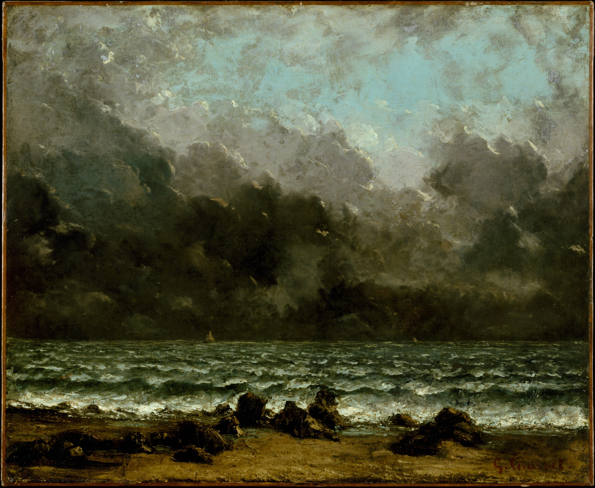

Hello all,

_I’m [Gus Cuddy](https://guscuddy.com) and this is [The Curtain](https://guscuddy.substack.com/)_, _a ~weekly newsletter loosely about arts, culture, and technology._

Hope you’re all staying well. Last week I came down with a nasty cold for the first time in a long time and was unable to get an issue out. It wasn’t COVID, thank goodness. But with cases rising again, when will we be done with this damn thing…

---

Last season on _The Curtain_ [I spent some time unfurling the beginnings of the NFT craze](https://guscuddy.substack.com/p/the-curtain-094-nfts-crypto-and-the). For a reminder, NFT stands for Non-Fungible Token, essentially a tool for digitally owning, buying and selling digital goods; you generally buy them with the Cryptocurrency _Ether_, and they represent a spot on the immutable ledger known as the Blockchain. While NFTs theoretically can be used for anything, they are most commonly used for selling art, or even more commonly, bland computer-generated images. (Projects like [Crypto Punks](https://www.larvalabs.com/cryptopunks) and the obnoxious [Bored Ape Yacht Club](https://boredapeyachtclub.com/#/) are the most popular.) The “significance” of the NFT is that it enforces a kind of [artificial scarcity](https://www.guscuddy.com/curtain/096/#on-art-and-artificial-scarcity-in-2021) in the digital world: a limited supply of these tokens exist, and you own one of them. (A common joke online for the anti-NFT crowd: right click and save the image as a JPEG — you stole an NFT! Of course that’s not quite right, as crypto bros will be quick to point out, but it doesn’t diminish the important level of dissonance between idea and reality.) Again, there are many scammy things about the entire world of NFTs, and a horrible environmental cost that hasn’t yet been reckoned with — [I wrote about that earlier this year](https://www.guscuddy.com/curtain/094/).

https://twitter.com/bestfitmusic/status/1460258796492791811

NFTs and Ethereum are central to the weird world of what’s being called _Web3_. If you’re not super familiar with internet history and development (more power to you), the term Web3 might sound extra strange, implying a trilogy you didn’t know existed. So let’s get clear. Web 1 generally refers to the early, document-based internet of static pages sharing information; Web 2 came around in the early 2000s, and was characterized by participation and social sharing on _dynamic_ websites. Things became a lot more interactive with Web 2, but it was also dominated by Social Media companies. And thus began a slide towards figuring out how to monetize things. The early internet was not particularly monetizable; Web 2 flipped that by allowing large companies to gather _users_ — in a sense, stripping people of personhood — and collecting their data. These companies make money largely based off advertising tailored to this data, or by selling the data to other companies. Web3’s goal is to strip the internet of this centralization and build towards a decentralized web.

The ideas of what’s being called Web3 sound appetizing at first. Decentralization is a good thing; giving people back control of their data is also a good thing. But what’s come to dominate the web 3 landscape is, rather unfortunately, the crypto space.

Inherent to crypto is the idea that humans are not trustworthy. Blockchains, which empower technologies like Bitcoin and Ethereum, work by permanently holding a source of truth that can be used for humans to trust each other. When people talk about Web3 being “trustless”, they’re referring to the ability to work with someone from across the globe, over the internet, and not have to trust them — the trust is enforced by the code. Direct peer-to-peer financial transactions can take place without a centralized middleman, like a bank, anywhere around the globe. (Anywhere with the internet that is — which is only about half the world’s population.) In theory and in some practice, this is a useful tool. But as a new vision for what the internet is? It represents a cynical view of the world, one where human cooperation needs to be written into literal computer code, where care needs formal, technical structures to enforce it.

The textured, idiosyncratic ways in which humans communicate and cooperate is not taken into consideration with crypto, blockchains, and what are known as “smart contracts”. Humans aren’t robots; in fact, we have always organized ourselves in creative and experimental ways (in ways contrary to the conventional view of history, [as David Graeber & David Wengrow explore in Graeber’s posthumous final book,](https://bostonreview.net/science-nature/emily-m-kern-radical-promise-human-history) _[The Dawn of Everything](https://bostonreview.net/science-nature/emily-m-kern-radical-promise-human-history)_), and critical to that is [contextual communication outside of codified law](https://estsjournal.org/index.php/ests/article/view/107). 

Yet everything in Web3 and Crypto relies upon the rigidity and trustworthiness of code. It’s an interesting semantic corollary to the literal codes that codified law in ancient societies, like Hammurabi’s Code. For instance, Web3 enables what are called DAOs (Decentralized Autonomous Organizations), which are self-governing collectives of people bound not by notions of human cooperation that have been around for millennia, but by Ethereum smart contracts. (The code for the smart contracts are transparent to everyone in the very ugly programming language Solidity, which obviously everyone in the world understands.)

DAOs might have seemingly interesting uses cases — they are horizontal organizations! — but I have not seen a single use that doesn’t have to do with money. _Money_ is the core underlying assumption. The critical language of Web3 is the _wallet_ — your wallet is your key into the world of Web3. It holds your tokens, your means to meaningfully interact with this new landscape. If Web 2 turned people into users, Web3 reduces people to wallets. As Robin Sloan writes in his lovely “[Notes on Web 3](https://society.robinsloan.com/archive/notes-on-web3/)”: “They tie themselves into knots trying to arrive at personhood in a universe of wallets”.

<figure>

<figcaption><a href="https://www.metmuseum.org/art/collection/search/436021">The Sea, Gustave Courbet, 1865</a></figcaption>
</figure>

---

Tech in America tends to present itself as a necessity, that it’s solving a problem for us. Ok, sure, these problems are usually problems that tech has created in the first place, but it’s solving the problem nonetheless. Yet these solutions tend to invite more problems — and with that, the cycle repeats. (Important to all this is that the people that offer these solutions tend to make a lot of money.) In the digital communications world, at least, this is often treated as innovation. But this innovation tends to not make people’s lives demonstrably better. In what ways can we say life is much better thanks to apps and startups? Not many, and yet we march on.

Web3 is an umbrella term to define a loose set of ideas, philosophies, and technologies that theoretically make up the “next phase” of the internet. (Yes, [the Metaverse is involved](https://guscuddy.substack.com/p/the-curtain-111-getting-metaphysical).) But it’s not clear at all how it makes our lives better, or if it makes the internet a better place.

Web3, by virtue of its name, seems to be the sequel to Web 2. It implies a logical, linear succession, like panels in a comic strip. It also implies a genuine innovation — we’re iterating a number here! But it’s not that simple.

What problem, exactly, is Web3 trying to solve? On the surface we could say it’s trying to fix the centralization of the internet in a few large data companies, by decentralizing the internet. But wait — decentralization is not new, that’s what the early internet was. Sharing information — and sharing files — has been around forever. So Web3 approaches decentralization with a new set of technologies then! But these technologies are not free of the dinosaurs of Web 2 that this whole thing was supposed to shake — Facebook and Twitter are already heavily invested in the crypto space. Zuckerberg’s metaverse relies on Web3 technologies. So what then?

The most frustrating part about Web3 is the underlying assumptions at play, and the core assumption is the importance of _money_. Money underlies everything in Web3. The problem with art? Artists aren’t getting money, it’s too hard to make money off art! The problem with communities? They don’t have an incentive to make money! The problem with websites? They don’t have a way to make money!

Despite surface-level utopian ideals, everything in Web3 — NFTs, DAOs, privacy — is inseparably intertwined with money. The reason many people are getting involved is simply because of money. There are others who get involved for nobler reasons — but it’s impossible to separate the money from the work.

NFTs were proposed as a boon for artists, especially digital artists — they were able to release their work online, and get paid for it, through the artificial scarcity that the Blockchain creates. But how does this work? By making markets out of everything. Art, in the Web3 world, does not exist for art’s sake. It exists as a collectible, an investment to be bought and sold. In other words, a fundamental misunderstanding of what art needs.

The idea of “owning” digital art or media is appealing to most people only because of financial upside. There’s no spirituality, no sense of a gift. No physicality. Just bits and bytes moving pointlessly, recklessly around.

It also just doesn’t make any sense in many cases. It’s not solving any problem. Katie Haun, who heads up the $350 million cryptocurrency fund for the massively influential venture capital firm A16z, [recently went on Ezra Klein’s show for a baffling conversation](https://www.nytimes.com/2021/10/15/podcasts/transcript-ezra-klein-interviews-katie-haun.html). Haun continually repeats the same Web3 talking point — it cuts out the middleman (but then why does it need a $350 million fund behind it?) — and uses it to point to why crypto is a positive for art. But, [like with Mark Zuckerberg’s metaverse wackiness](https://guscuddy.substack.com/p/the-curtain-111-getting-metaphysical), there’s a grievous logical misstep at play. 

> KATIE HAUN: You could buy these digital songs \[in the past\], but there’s a really important caveat. You don’t actually own that digital song. And we’ve seen this. We’ve seen this; we call it platform risk. Let’s say Apple Music changes their platform. You can’t play it on another platform. Now, if you really owned the digital good — this new example that you just provided being music — if you owned it, you could take it and use it on any platform.

No one is arguing that Spotify or Apple Music are good for artists. And Haun is right about one thing: they present a large amount of platform risk, both for artists and people that collect and listen to music. The ones _truly_ in control of the music are Spotify, and they could at any moment dictate the terms of how the artist is paid, or how a listener gets to listen to the music. But the thing is — this problem already has a solution! Plain MP3 files, like the ones we used to pirate on Limewire and BitTorrent, have zero of the “platform risk” that Haun talks about. You own them, they can be used for whatever, burn them to a CD, anything you want. Now piracy is of course not really a sustainable model to pay artists for their work — but that’s why simple services like [Bandcamp](https://bandcamp.com/) exist. Buy the music, get the files and possibly a physical copy, and you’re done. That’s it.

Ownership of art and media doesn’t need to be codified into a blockchain. You don’t need an NFT to own an MP3 file. But this is how Web 3 works — it presents convoluted solutions as revolutionary, when the solution already existed.

Finally, the core tenet of Blockchain is its immutability — it can’t be changed. This makes sense for a ledger of financial transactions. But are we sure that permanence and immutability are so important? Notions of permanence with the internet are plagued with the threat of electric grids shutting down, Internet Service Providers changing policies, or entire countries splintering off into their own version of the internet. (By the way, [that’s what happened with China, which run essentially their own internet](https://vdata.nikkei.com/en/newsgraphics/splinternet/). And it’s by far the most popular and commonly trafficked network in the whole world. That fact seems important some how…)

Why _not_ ephemerality? As Robin Sloan asks: “What do we lose when we lose deletion?” Things disappear; such is life. This is what all live art has done for the history of time: exist solely in the present, disappearing the moment it’s created. Some things should be permanently stored, yes, but not everything. To lock everything away in the coldness of a technical ledger is to flatten out an element of life and art, and a necessary element of the internet. It can be frustrating when something you’re looking for has been removed — and the wonderful archivists at the [Internet Archive](https://archive.org/) are heroically trying to archive the entire web already — but deletion and removal is still an important part of the internet. The notion that everything has to be here forever treats this whole thing with way too much self-importance.

The original early internet (fine, let’s call it Web 1) made no assumptions about how information should be structured or what its lasting value was. No declarations of permanence or monetization. Websites were independent nodes connected to other nodes by one of the most powerful tools of the last 50 years, the building block of the web: the hyperlink. That was it. Simple, but with a radical promise: to allow the whole world to share information for free. It existed to supplement the real world, not to supplant it.

A move towards Web3 is another move towards a future of [Digital Prime](https://guscuddy.substack.com/p/the-curtain-104-the-tension-of-digital), where rules come from technology — not the other way around. I define digital primacy as the move away from a time where the physical world mediated our relationships with the digital world to a time where the digital world mediates our relationship with the physical world. Despite [my previous writing about nostalgia being a trap](https://guscuddy.com/nostalgia), I have some nostalgia for the early internet and the way technology used to be. There’s a crunchy physicality to the early web. The physical world mediated our relationship with the digital world: its hardware was visible, you pressed real buttons that gave tactile feedback. Computers made strange sounds as they attempted to connect to the internet. Beep. Beep. Bzz. It all felt weird and special, but grounded in reality. Now, hardware is invisible. Everything is hidden away. We’re left with cold glass rectangles, and instant connection with anything we want. [The state of “content” matches these aesthetics](https://guscuddy.substack.com/p/the-curtain-rises-again). There’s little sense of physicality with our technology these days. Everything glows; everything is connected. There’s no more wrapping your finger around the telephone cord while talking to a friend or lover, no more spilling crumbs on the Blockbuster rental case, no more blowing dust out of game cartridges before putting them in the console. No, it’s all a morass of content, a lot of grandeur, endless tokens everywhere, looking for ways to make money, signifying nothing.

---

## stray links & notes

*   I guess here’s an example of a DAO: [ConstitutionDAO is trying to buy the constitution](https://www.constitutiondao.com/)…
    
*   Two of the best pieces of theater in New York, _Dana H._ and _Is This a Room_, [have been extended in additional two weeks](https://deadline.com/2021/11/broadway-is-this-a-room-dana-h-extnded-1234867352/), after announcing they were closing early. I don’t understand Broadway economics at all.
    
*   The [historic Cherry Lane Theater is on the market for $12.95 million](https://www.bloomberg.com/news/articles/2021-11-08/historic-west-village-theater-hits-market-for-12-95-million). Includes 2 theaters, 8 apartments.
    
*   [Virtual theatre is not popular, according to an oddly composed poll featured in American Theatre](https://www.americantheatre.org/2021/11/08/the-jury-is-in-on-virtual-theatre/).
    
*   After the tragic crowd crush at the Travis Scott performance at Astroworld that killed eight people, Scott announced he would pay for the funeral costs [and partner with BetterHelp for a free month of therapy](https://twitter.com/TrueAnonPod/status/1457874460782972929), because even tragedies get branded now.
    
*   [A prototype of the original iPod](https://panic.com/blog/a-prototype-original-ipod/)
    
*   [Adam Tooze on Andreas Malm and ecological Leninism](https://adamtooze.substack.com/p/chartbook-50-andreas-malm-and-ecological)
    
*   [Bari Weiss is founding a university and David Mamet is on the advisory board](https://www.uaustin.org/) …[lol](https://twitter.com/halvorsen/status/1457745969907478536what)
    
*   **Theater to see**: I really enjoyed Kate Cortesi’s play _Is Edward Snowden Single?_ as part of [The Pool](https://www.thepoolplays.org/) Plays — a pop-up theater company, operating at New Ohio Theater. The other plays in the mini festival [look excellent](https://www.vulture.com/2021/11/theater-review-nollywood-dreams-the-pool-plays.html) as well.
    

and finally:

https://twitter.com/MinceCat/status/1458335304822267905

---

Thanks so much for reading. If you want to catch up with past issues, [you can always read the full archive here](https://guscuddy.substack.com/archive).

This newsletter is READER SUPPORTED. If you enjoy it, you can consider subscribing to support its continued existence:

[Subscribe now](https://guscuddy.substack.com/subscribe?)

Feel free to shoot me an email by replying to this email. I love to hear back from people.

See you next week,

\-Gus