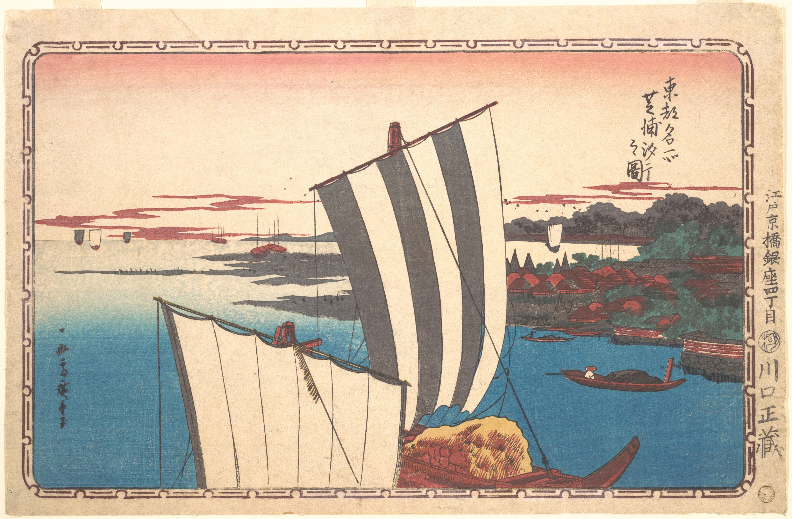

_I’m Gus Cuddy and this is The Curtain, a a newsletter about arts, culture, and the future._

Hope you had a good holiday week, if you’re in America and get time off. We went and saw a movie on Thanksgiving, Jane Campion’s _The Power of the Dog_. It’s a brooding and powerful anti-Western, [Brandon Taylor wrote a nice piece about its gothic qualities in the New Yorker](https://www.newyorker.com/culture/culture-desk/jane-campions-gothic-vision-of-rural-queerness-in-the-power-of-the-dog). Well worth seeing.

---

Another new COVID variant coming out this week that doesn’t look great. The virality looks to be much worse than even Delta was, and early word is that existing vaccines may struggle against Omicron. OK then.

I got my booster shot last week, I encourage everyone to get theirs as well. The messaging on the booster has been bundled yet again and the rates are much lower than they should be. And yet there’s still a huge global inequality with vaccines:

https://twitter.com/adam_tooze/status/1465674478575403010

I don’t know, I’m exhausted from worrying about COVID and how it’s affected day-to-day life, and I can’t even imagine how exhausted others in more precarious situations are.

---

This was a bit of a somber week, what with Stephen Sondheim passing away at the age of 91, and designer Virgil Abloh dying at 41.

There’s no doubt that Sondheim was as important a force in American theater as there has been for the last 100 years, a masterful lyricist and composer. There have been several excellent pieces written about his body of work, and I suspect there will be many, many more in the months to come. [Here’s Isaac Butler with a beautiful piece in Slate](https://slate.com/culture/2021/11/stephen-sondheim-dead-obituary-career-west-side-story.html):

> His achievement is Shakespearean. Like Shakespeare, he inherited an art form and theater scene from a previous generation, then pushed the boundaries of what theater could do again and again. No one, before or since, has done more to marry the supposedly “low” pop cultural form of the American musical with high modernist complexity and depth, and no one in theater has been more successful in making experimental gambits and aesthetic difficulty appealing and accessible.

Anyway, some more collected Sondheim:

Sondheim’s favorite films list is _eclectic_. These are not standard choices at all!

https://twitter.com/J_fassler/status/1464411305041960962

[Mark Harris on the “measureless influence” of Sondheim](https://www.vulture.com/article/stephen-sondheim-influence-tribute-obituary.html).

[Sondheim teaches “Not Getting Married”](https://www.youtube.com/watch?v=aR80qiXgMuQ).

---

Virgil Abloh’s unexpected death from a private battle with cancer hits especially hard. Virgil was one of the most influential voices in fashion over the last decade, a true creative who upturned and upset a lot of the existing molds and traditions of the luxury fashion world. (Abloh’s rise started with Kanye West in the late 2000s; [the viral photo of them from 2009 Paris Fashion week is still legendary](https://www.complex.com/style/2019/01/virgil-abloh-on-paris-fashion-week-2009-photo-kanye-west-tommy-ton).) While it wasn’t necessary to always love his designs, there’s no denying that he changed the landscape of how young people — especially a generation of young men — interact with fashion. [Rachel Tashjian had a great piece in GQ about Abloh](https://www.gq.com/story/virgil-abloh-fashion-dreamer-obituary), writing that he “encouraged a generation of men to treat fashion as a subculture, and to dream.”

https://youtube.com/watch?v=vV_QoQD_nrA

---

## Web3 Followup

Some follow up from [the last issue on “web3”](https://guscuddy.substack.com/p/the-curtain-112-what-web3-gets-wrong) .

In that issue I linked to a hilarious, hyped up DAO (Decentralized Autonomous Organization) called ConstitutionDAO that was planning to buy the U.S. Constitution. It collected millions of dollars through the web3 technology Ethereum — here was a shining example of libertarian collectivism! And then: it failed completely. They lost the bid.

https://twitter.com/ConstitutionDAO/status/1461498841820192771

Turns out this was pretty dumb. Because of the expensive “gas” fees with using Ethereum, [many people were not able to get refunded for the money they put in, and chaos ensued](https://www.vice.com/en/article/qjb8av/constitutiondao-aftermath-everyone-very-mad-confused-losing-lots-of-money-fighting-crying-etc). (Ethereum, the future: essentially the world’s slowest and most expensive computer). The DAO telegraphed their bid by displaying the amount they had raised, and a billionaire simply outbid them. Perfect. If you don’t like that, _then you don’t like web3, baby_.

Unfortunately, this game-changing technology still has no practical use case. People keep trying to make the case that it will revolutionize everything — [here’s journalist Casey Newton arguing that a new crypto startup that aims to disrupt music royalties will be the one](https://www.platformer.news/p/is-the-music-industrys-future-on) — but it keeps just falling flat on its face, a philosophical mis-mash of ideas zooming out of reality.

Historian [Adam Tooze wrote earlier this year](https://adamtooze.substack.com/p/chartbook-newsletter-15) that “crypto is the libertarian spawn of neoliberalism’s ultimately doomed effort to depoliticize money”. And yeah, that seems pretty spot on.

---

Some more web3 digital spelunking, if you dare to care:

*   The great Max Read writes that [web3 has a “dork problem”](https://maxread.substack.com/p/web3-has-a-dork-problem). Along the lines of what I’ve been writing about with [culture and corniness](https://guscuddy.substack.com/p/the-curtain-rises-again) . He writes:
    

> What I am prepared to say is that the culture of web3 on Twitter is truly one of the wackest subcultures I’ve ever encountered in my entire life. These people organized what is basically a $40 million flash mob to buy the U.S. constitution in order to preserve it for future generations?? And got upset when they lost?? Venture capitalists making Nic Cage jokes is “web3 at its best”??

*   Great video: [Crypto Games: Report from hell](https://www.youtube.com/watch?v=YHz0xpU5Tu8)
    
*   There’s [a crypto “land grap” via Domain Squatting](https://nymag.com/intelligencer/2021/11/ens-domain-squatting-a-new-crypto-land-grab.html) - A lot of people are suddenly betting that, in the metaverse, .eth addresses will be the new .com. So what is amazon.eth worth?
    
*   ah, 2021: [NFT beats cheugy to be Collins Dictionary’s word of the year](https://www.theguardian.com/books/2021/nov/24/nft-is-collins-dictionary-word-of-the-year#new_tab)
    

and:

https://twitter.com/levelsio/status/1463182005336563718

---

## Supply Chains and the Immense Interdependency of Literally Everything

<figure>

<figcaption><a href="https://www.metmuseum.org/art/collection/search/45296">Shell Gathering at Shibaura, Utagawa Hiroshige</a></figcaption>
</figure>

Black Friday come and gone, here we are in the lead up to Christmas, the busiest shopping time of the year, and we have a trendy topic: supply chains. It’s going to cancel Christmas! Delays, inefficiencies, back-ups, global breakdowns. Trade. Transport. Something with truckers and dock workers. Look, I don’t know. Because the internet tends to make everyone think they’re an expert on everything, many people who have never thought about supply chains prior to last month are suddenly opining about labor, trucks, transport, ports, barges, farms, roads, factories.

But the truth is that it’s difficult to conceptualize everything that’s going on, because everything that’s going on involves the entire world and the immense, interlocking web of conditions that have led to this moment. Supply chains seem wildly abstract, so many moving parts that it’s impossible to trace. But as folks in America see shortages affect their Christmas shopping, the wildly abstract becomes that much more concrete. The interconnectedness of everything is made manifest. Breakdowns in regions of the world that seem terribly remote and basically ignorable to people suddenly ripple out in very tangible ways. ([There was a great discussion about this recently on the very good](https://goodbye.substack.com/p/nothing-to-lose-but-your-supply-chains) _[Time to Say Goodbye](https://goodbye.substack.com/p/nothing-to-lose-but-your-supply-chains)_ [podcast that I recommend](https://goodbye.substack.com/p/nothing-to-lose-but-your-supply-chains).)

As I’ve written about before, there is a tendency towards both simplification and complexifying in culture today. On the one hand, the aesthetics of culture are interested in simplification: think of industrial design trends, Apple products, and even the reduction of pop culture to Disney/superhero shlock. Tech wants to make our lives simpler, even when it often makes it more complicated. (Feels like I have to jump through three different Roku apps to watch a basketball game; NFTs are trying to disrupts mp3 files; we now have many different digital inboxes and messaging apps.) The modern internet feeds us a drip-drip-drip of content which amounts to ambience to fill in the gaps of nothingness in our lives. Meanwhile, behind the scenes, everything is ever-complexifying, more supposed simplification means more complexification elsewhere; there’s a constant tension here. Food delivery apps make life simpler for the serviced class, but that simplification comes at the cost of a vast network of exploited labor.

Or take the internet at large, for instance. It speaks in simplistic terms: put things in the cloud, quickly get anything you want, interact with anyone. [But as I wrote earlier this year](https://guscuddy.substack.com/p/the-curtain-101-an-underground-wasteland):

> Sometimes it’s tempting to think about the internet as magic; the term “cloud” lends itself to that sense of ease. But the reality is much starker: everything enabled by the internet is made possible because of forklifts, bulldozers, fiber cables, potholes, sewers, and dump trucks.

<figure>

<figcaption>a server farm</figcaption>
</figure>

_(The internet looks like this: something on the death star. The physical world contains the necessary infrastructure to enable the digital world, a fact that’s easy to forget.)_

We’re presented with just the tail end of a spiral. Look closer, and everything quickly becomes complex. Everything is dependent on another thing, which is dependent on another thing. Sometimes I marvel that the world works at all — shouldn’t this all collapse at any moment? It doesn’t quite work like that, of course, but it’s sort of close, which is to say that when there’s an outsized shock to the system — like a global pandemic — shit starts to go awry. Supply chains start to break down. And everything in this very complex world becomes more complex.

Everything we do ripples up into increasingly large, complex, abstract, and opaque systems. Nothing exists in a vacuum, the world is constantly rippling. The supply chain breakdown forces people to start to think about the parts of contemporary society that they’d rather not think about. Suddenly unionized truck workers in Korea going on strike have an impact on a privileged American’s shopping experience. At the surface, culture tries to reduce life to a simplicity that belies what’s brewing underneath. Nothing is as simple as it seems; it’s all a mess of wires and pipes and routes and roads, incredibly efficient yet susceptible to vast inefficiencies at any moment.

---

## Links

*   [The Wirecutter staff went on strike during Black Friday](https://nymag.com/intelligencer/2021/11/wirecutter-strike-new-york-times.html).
    
*   [Drew Austin argues that anonymity on the internet is a good thing — but Facebook’s Metaverse seeks to do away with anonymity](https://www.businessinsider.com/anonymous-accounts-should-we-allow-fake-identities-online-2021-11)
    
*   “[Continental drip is the observation that southward-pointing landforms are more numerous and prominent than northward-pointing landforms](https://en.wikipedia.org/wiki/Continental_drip)”
    
*   Some “best books” lists as chosen by authors: [Bookforum](https://www.bookforum.com/print/2804/writers-on-their-favorite-books-of-2021-24700), [Spectactor I](https://www.spectator.co.uk/article/books-of-the-year-i-chosen-by-our-regular-reviewers) & [II](https://www.spectator.co.uk/article/books-of-the-year-ii-a-further-selection-of-the-books-chosen-by-our-regular-reviewers), [New Statesman](https://www.newstatesman.com/culture/books/2021/11/best-books-year-2021)
    
*   [Lauren Oyler tries to like W.G. Sebald](https://harpers.org/archive/2021/12/desperately-seeking-sebald-lauren-oyler-speak-silence-carole-angier/)
    
*   [The final 16 performances of Lynne Nottage’s](https://www.nytimes.com/2021/11/22/theater/lynn-nottage-clydes-broadway-livestream.html) _[Clyde’s](https://www.nytimes.com/2021/11/22/theater/lynn-nottage-clydes-broadway-livestream.html)_ [will be streamed](https://www.nytimes.com/2021/11/22/theater/lynn-nottage-clydes-broadway-livestream.html) — but tickets cost a whopping $59.
    
*   [Inside the Rise and Fall of Clubhouse, a Poster Child of Pandemic Hype](https://www.businessinsider.com/rise-and-fall-of-clubhouse-poster-child-pandemic-hype-2021-11). Clubhouse, the buzzy live audio app that launched during the pandemic, has crumbled in growth. I wrote about Clubhouse last season [here](https://guscuddy.substack.com/p/the-curtain-093-is-clubhouse-eating). Clubhouse’s whole roll-out was very bizarre, where half of the excitement was its exclusivity. Well now [Clubhouse Is More Exclusive Than Ever: No One’s On It](https://www.gawker.com/media/clubhouse-exclusive-has-no-members).
    
*   [Between the City Streets](http://jonty.co.uk/between): mapping green space in cities
    
*   [Dominique Morisseau pulled her play “Paradise Blue” a week after it opened at the Geffen Playhouse](https://www.nytimes.com/2021/11/27/theater/dominique-morisseau-geffen-playhouse.html?smtyp=cur&smid=tw-nyttheater) because of harm caused to Black women in the show. The theater acknowledged “missteps.”
    
*   [A profile on Miyazaki and his last film](https://www.nytimes.com/2021/11/23/t-magazine/hayao-miyazaki-studio-ghibli.html)
    
*   Netflix and cultural cache:
    

https://twitter.com/labuzamovies/status/1465062094198358020https://twitter.com/labuzamovies/status/1465062097394438148

---

Thanks so much for reading. If you want to catch up with past issues, [you can always read the full archive here](https://guscuddy.substack.com/archive).

This newsletter is READER SUPPORTED. If you enjoy it, you can consider subscribing to support its continued existence:

[Subscribe now](https://guscuddy.substack.com/subscribe?)

Feel free to shoot me an email by replying to this email. I love to hear back from people.

See you next week,

\-Gus