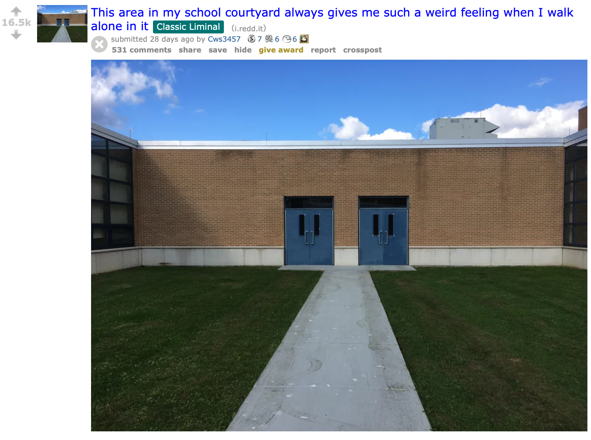
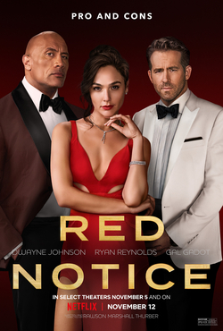
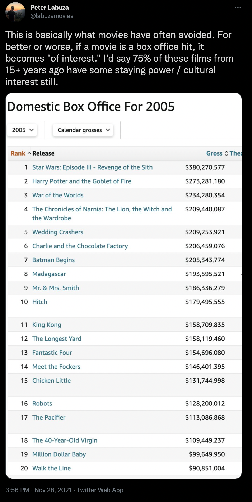

Hi all -

Welcome to a Friday edition of _The Curtain_, a newsletter about arts, culture, and the future.

_A note about publishing: this season The Curtain has slipped into a bi-weekly cadence. That's not exactly intentional. But it will have to do! Sometimes I take a bit longer with essays, like with today's piece._

---

2021 was strange. I don't know about you, but I kind of just watched it go by. Significant things happened — vaccines, cautious re-openings, some apocalyptic-seeming weather events, I guess an olympics? — but it all sort of whizzed by in a confusing blur. More people died from COVID in 2021 than 2020, but there's been a collective shrug at that. Nobody wants to hear about more pandemic-related bad news. Please. To top it off, Omicron is beginning to make December 2021 start to look like March 2020.

Summer got deemed the summer where "the vibes were off", [but those weird vibes bled into the fall](https://guscuddy.substack.com/p/the-curtain-rises-again) — and infected the whole year. I kind of forgot the year was almost over until I saw all these "best of" and "gift guide" type content popping up. Glancing through lists cataloging the best film and theater of the year, it's felt a bit sleepy. There's been some very good work, but a lot of it is delayed from a 2020 release. 2021 was a laggy, transitional year in culture, operating in an in-between space, trying to pick up the pieces from a long, uncomfortable slumber and put them back into newly shaped holes.

In particular, going to movies has felt particularly interesting to me. I've enjoyed it quite a bit more than I expected, even though it was theater and shared live spaces that I was anticipating more. Going to a distinct, live, _physical space_ to watch a movie that is projected onto a big screen feels like the type of physical—digital relationship that is disappearing, a bit of a relic of the 20th century conception of media. Movie theaters are dying ([but they're still there for now](https://www.vox.com/22828403/theatrical-window-streaming-amc-film-industry)), and the developments of the pandemic — and the increasing psychological ease of just turning on something streaming — don't point to a revival.

https://twitter.com/SpaceLiminalBot/status/1339020030193885189

The term "liminality" has become especially prevalent since the pandemic started to describe where we're at as a culture. We're in a liminal space, a time between worlds, suspended. Recall that one of the key memes in January 2021 [was the Sea Shanty](https://twitter.com/Beertheist/status/1348759849077714951?ref_src=twsrc%5Etfw) — calling up a moment of being stuck at sea ("soon may the Wellerman come / to bring us sugar and tea and rum"). On the sub-reddit _[LiminalSpace](https://www.reddit.com/r/LiminalSpace/)_, users share pictures of what they sharply define as "transitional spaces" — and argue over what constitutes a transitional space.

<figure>

<figcaption>from the /r/liminalspace subreddit</figcaption>
</figure>

Many of the pictures are eerily abandoned physical spaces, or feel emotionally representative of transitional pieces of punctuation: an ellipsis, a comma, a semi-colon, a space. Vacuous. Forlorn. They look vague, uncertain; remnants of an industrialized world that took place in physical spaces. Now we share pictures of those empty spaces in virtualized spaces, and think: isn't this strange?

Art, media, culture — all feel stuck in this strange, hazy place as well. Nothing feels very real.

Take, for instance, the fact that the new Dwayne Johnson movie _Red Notice_, is now — somehow — Netflix's most watched movie of all time (at least according to the shady data that Netflix gives us).

<figure>

<figcaption>apparently the most watched movie in the history of Netflix</figcaption>
</figure>

Wait, what?

Maybe I'm out of touch, but I don't know anyone that has seen _Red Notice_. I'm sure loads of people around the world are watching it. But doesn't that feel a little surprising?

For how ubiquitous Netflix is, you'd expect the most successful movie in the platform's history to have some real cultural weight, something that feels like it's made an impact. Some kind of gravitational pull that would at least make a small imprint on pop culture. But no — it's _Red Notice_. Will people ten years from now remember _Red Notice_?

Movies, by and large, don't work like they used to. As data-points in a streaming machine, they are stripped of their cultural agency. Video is more ubiquitous than ever, but movies don't have the same cultural staying power as they did in the 20th century or early 21st century.

Look at the top-grossing movies from 2005:

As Peter Labuza points out, there was once a time that popular movies held cache, were talked about. Not that box office hits used to be great, but I can recall most of these movies from 2005. They seemed to actually _exist_.

It's very important to not nostalgize a bygone era of Hollywood or anything; those eras had more gatekeepers, misogyny, and racism. Netflix _has_ enabled many more artists to actually _make_ something — artists who might not have been given the chance in the earlier model. Playwrights seem to be getting many more opportunities, like Molly Smith Metzler and her show _Maid_. Of course, this switch into non-stop content has its downsides: most of the new works created are TV Shows, or content resembling TV shows. They slowly displace the joys of watching a longer-form movie.

_Red Notice_ is a movie, but it's a distinctly 2021 movie, seemingly created in a laboratory. Its success makes sense when you realize that Netflix is a vague, abstract hole. People don't interact with Netflix in the way we used to interact with going to the movies, but in their own idiosyncratic ways. We put on Netflix as ambiance, as company in our pandemic loneliness, while doing chores, while chilling, while snoozing. Because Netflix doesn't report their data or even how they collect their data, we don't know how they differentiate between someone consciously choosing to watch something or the algorithm taking over. It's a confusing void of infinite content, a candy store of vibes.

That makes Netflix very difficult to compete against or understand. The only way to compete is for large conglomerates to create their own vague streaming platforms. So HBO Max maybe is the thinking person's Netflix, though they've been releasing a steady stream of trashy content, as if to keep up with the demands of our times. Venkatesh Rao explored the concept of how "software is eating the world" in his 2014 collection [Breaking Smart](https://breakingsmart.com/en/season-1/), noting that we're moving from a world of containers to a world of streams. Media rarely exists on its own anymore, but in a vast stream; this is the story of streaming platforms.

Streams do have their positives, but they bring on vagueness in our culture. This vagueness has aesthetic _and_ real-world implications. For one, film crew laborers are underpaid and overworked because of loopholes with how streaming content can be treated, and [the dodginess of streaming companies and their data](https://www.theverge.com/2021/9/25/22692966/apple-plus-tv-movie-streaming-workers-union-fewer-than-20-million-subscribers). Deals are made in the dark. Aesthetically, more and more content seems to be divorced from reality. This clip from the new Marvel movie _Eternals_, for instance, seems to exist in a confused liminal space of its own:

https://twitter.com/geekinformalik/status/1445627718964428809

---

This vagueness in culture that's come to a head in 2021 has developed over many years. I place its origins right around the global financial crisis of 2007-2008. That's around the same time that Facebook started to take off, [web2](https://guscuddy.substack.com/p/the-curtain-112-what-web3-gets-wrong) came into full-swing, the algorithmic "feed" became a thing, Spotify launched in Sweden, Netflix began its transition to becoming a streaming company, and the iPhone was released — sparking a communications revolution that would change everything. In the years post-2008, social media companies co-opted narratives. Vlogs, Snapchat Stories, Instagram Stories, Facebook stories, Vine, TikTok. Sharing bits of your life became the new art, turning life into continual performance for the billions of people participating in social media. Narratives were more ubiquitous than ever, but culture started to grind in place. Those years marked the beginning of the shift that I've been writing about this year: a move from physical to virtual worlds, amidst an imploded economic system. A generation moved to putting primacy on the digital world, leaving ghosts in their wake.

https://twitter.com/gameauras/status/1364966638165127170

---

## field notes

The legendary critic Greg Tate, who wrote about music, art and Black culture, died last week at the age of 64. [His essays for Village Voice](https://www.villagevoice.com/author/gregtate/) were indispensable. His book, _Flyboy in the Buttermilk_, is also heralded by many as a classic.

[Hua Hsu wrote about Tate in 2016](https://www.newyorker.com/culture/cultural-comment/the-critic-who-convinced-me-that-criticism-could-be-art), calling him "the critic who convinced me that criticism could be art".

Other wonderful pieces:

[There Will Never Be Another Greg Tate](https://pitchfork.com/thepitch/greg-tate-obituary/) (Pitchfork)

[The Peerless Imagination of Greg Tate](https://www.nytimes.com/2021/12/08/arts/music/greg-tate-critic.html) (New York Times)

---

*   [A good interview with Paul Thomas Anderson on what makes a movie great](https://www.newyorker.com/culture/the-new-yorker-interview/paul-thomas-anderson-on-what-makes-a-movie-great)
    
*   [George Saunders started a substack to talk about short stories, and honestly it’s pretty cool](https://georgesaunders.substack.com)
    
*   [Kyle Chayka on Digital Nostalgia](https://kylechayka.substack.com/p/essay-digital-nostalgia)
    
*   [America is not ready for Omicron](https://www.theatlantic.com/health/archive/2021/12/america-omicron-variant-surge-booster/621027/) (Ed Yong)
    
*   The most memorable and talked about profile in quite some time was [Michael Schulman's very good profile of Succession star Jeremy Strong](https://www.newyorker.com/magazine/2021/12/13/on-succession-jeremy-strong-doesnt-get-the-joke). The piece prompted a whole discussion on the merits of method acting and actor dedication, of which I don't have anything particularly meaningful to add (other than that [Isaac Butler has an upcoming book about the method](https://www.bloomsbury.com/us/method-9781635574784/) that I'm sure will be good). Well, Strong is terrific on _Succession_, especially these final few episodes.
    
*   [A discussion of "Crypto leftism" on the Time To Say Goodbye podcast](https://goodbye.substack.com/p/crypto-leftism-with-alex-rivera). I thought the discussion was interesting but I walked away unconvinced. Still, it's worth noting that — [despite my writing against web3](https://guscuddy.substack.com/p/the-curtain-112-what-web3-gets-wrong) — there _are_ smart and legitimate people working on interesting issues in this space from a leftist perspective. At the end of the podcast they accidentally stumble onto one of the main issues with anything "decentralized" in the web3 world, as of now: it pretty much all goes through centralized companies, like the extremely prevalent Amazon Web Services.
    
*   [Sondheim the Encourager](https://www.nytimes.com/2021/12/01/theater/stephen-sondheim-mentor-notes.html)
    
*   [The 101 Best Movies Set in NYC](https://www.vulture.com/article/best-nyc-movies.html)
    
*   [The best books of 2021, chosen by our guest authors](https://www.theguardian.com/books/2021/dec/05/the-best-books-of-2021-chosen-by-our-guest-authors) (The Guardian)
    
*   [The 20 Best Art Books of 2021](https://brooklynrail.org/2021/12/art_books/Best-Of-2021) (Brooklyn Rail)
    
*   [Richard Brody's Best Movies of 2021](https://www.newyorker.com/culture/2021-in-review/the-best-movies-of-2021)
    

https://twitter.com/tedgioia/status/1465049482933030913

---

Thanks so much for reading. If you want to catch up with past issues, [you can always read the full archive here](https://guscuddy.substack.com/archive).

This newsletter is READER SUPPORTED. If you enjoy it, you can consider subscribing to support its continued existence:

[Subscribe now](https://guscuddy.substack.com/subscribe?)

Feel free to shoot me an email by replying to this email. I love to hear back from people.

See you next week,

\-Gus

[Share](https://guscuddy.substack.com/p/curtain-114-welcome-to-vaguetown?utm_source=substack&utm_medium=email&utm_content=share&action=share)